# Environment Setup

## Notebook Setup


```python
from IPython.core.display import display, HTML
display(HTML("<style>.container { width:80% !important; margin-left:340px; }</style>"))
#display(HTML("#notebook-container <style>{ margin-left:100px; }</style>"))
```


<style>.container { width:80% !important; margin-left:340px; }</style>


## Most Common Libraries


```python
import numpy as np
import pandas as pd
import datetime as dt

import matplotlib
import matplotlib.pyplot as plt

from plydata import define, query, select, group_by, summarize, arrange, head, rename
from plotnine import *
```

## Magic Functions

- IPython has a set of predefined ‘magic functions’ that you can call with a command line style syntax  
- There are two kinds of magics:  
    - **Line Magic**  
    Prefix with %, and work much like OS command-line calls: they get as an argument the rest of the line, where arguments are passed without parentheses or quotes. Lines magics can return results and can be used in the right hand side of an assignment  
    - **Cell Magic**  
    Prefix with %%, and they are functions that get as an argument not only the rest of the line, but also the lines below it in a separate argument.

### %matplotlib
Output graph inline to frontend (Jupyter Notebook). Therefore is stored in the Notebook document


```python
%matplotlib inline
```

# Python Fundamental

## Variable and Values
- Every varibales in python are object  
- Every variable assginment is reference based, that is, each object value is the reference to memory block of data 


```python
# a,b refer to the same memory location
a = 123
b = a  
print ('Data of a =',a,'\nData of b =',b)
print ('ID of a = ', id(a))
print ('ID of b = ',id(b))
```

    Data of a = 123 
    Data of b = 123
    ID of a =  1867608032
    ID of b =  1867608032
    

Changing data value (using assignment) actually changed the reference value


```python
a = 123
b = a
a = 456  # reassignemnt changed a memory reference
         # b memory reference not changed
print ('Data of a =',a,'\nData of b =',b)
print ('ID of a = ', id(a))
print ('ID of b = ',id(b))
```

    Data of a = 456 
    Data of b = 123
    ID of a =  3036866689104
    ID of b =  1867608032
    

## Assignment

### Multiple Assignment


```python
x = y = 3
print (x,y)
```

    3 3
    

### Augmented Assignment


```python
x = 1
y = x + 1
y += 1
print (y)
```

    3
    

### Unpacking Assingment


```python
x,y = 1,3
print (x,y)
```

    1 3
    

# Built-in Data Types

## Numbers

### Integer


```python
n = 123
type (n)
```


    int


### Float


```python
f = 123.4
type (f)
```


    float


### Number Operators

**Division** always return float


```python
print(4/2)  # return int
type(4/2)
```

    2.0
    


    float


**Integer Division** return truncated int or float


```python
print (8//3)    # return int
print (8//3.2)  # return float
```

    2
    2.0
    

**Remainder** return either float or integer


```python
print (8%3)    # return int
print (8%3.2)  # return float
```

    2
    1.5999999999999996
    

**Power** return int or float


```python
print (2**3)    # return int
print (2.1**3)  # return float
print (2**3.1)  # return float
```

    8
    9.261000000000001
    8.574187700290345
    

## String
String is a **ordered collection of letters**  

### Immutable
- String is **immuatable**. Changing its content will result in **error** 
- Changing the variable completley change the reference


```python
s = 'abcde'
print ('s : ', id(s))
s = 'efgh'
print ('s : ', id(s))
```

    s :  3036933162968
    s :  3036866938504
    


```python
## s[1] = 'z' # error
```

### Slicing
```
string[start:end:step]  # default step:1, start:0, end:last
```
If step is negative, start value must be lower than end value


```python
s = 'abcdefghijk'
print (s[0])      # first later
print (s[:3])     # first 3 letters
print (s[2:8:2])  # stepping
print (s[-1])     # last letter
print (s[-3:])    # last three letters
print (s[::-1])   # reverse everything
print (s[8:2:-1])
```

    a
    abc
    ceg
    k
    ijk
    kjihgfedcba
    ihgfed
    

### Searching
```
string.find() return position of first occurance. -1 if not found
```


```python
s='I love karaoke, I know you love it oo'
print (s.find('lov'))
print (s.find('kemuning'))
```

    2
    -1
    

### Concatenating Strings


```python
'this is ' + 'awesome'
```


    'this is awesome'


```python
animals = 'a1,a2,a3,a4'
animals.split()
```


    ['a1,a2,a3,a4']


### Stripping Off Trailing Empty Spaces


```python
filename = 'myexce l.   xls   '
filename.strip()
```


    'myexce l.   xls'


### Convert to Upper/Lower Case


```python
filename = 'myEXEel.xls'
filename.upper()
```


    'MYEXEEL.XLS'


```python
filename.lower()
```


    'myexeel.xls'


## Boolean


```python
b = False

if (b):
    print ('It is true')
else:
    print ('It is fake')
    
```

    It is fake
    

### What is Considered False ?
Everything below are false, anything else are true


```python
print (bool(0))      # zero
print (bool(None))   # none
print (bool(''))     # empty string
print (bool([]))     # empty list
print (bool(()))     # empty tupple
print (bool(False))  # False
print (bool(2-2))    # expression that return any value above
```

    False
    False
    False
    False
    False
    False
    False
    

### and operator
**and** can return different data types  
If evaluated result is True, the value of right hand side is returned (because python need to evaluate up to the last value)


```python
print (123 and 2)
print (2 and 123)
print ('aaa' and 'bbb')
print ('bbb' and 'aaa')
print (123 and 'aaa')
print ('aaa' and 123)
```

    2
    123
    bbb
    aaa
    aaa
    123
    

### or operator
**or** can return different data type  
If the first value is true, it will be returned (right hand side value need not be evaluated)


```python
print (0 or 2)
print (0 or 'abcde')
print (1 or 'abcde')
print ('aaaaa' or 'bbbbb')
print (True or 'abc')
```

    2
    abcde
    1
    aaaaa
    True
    

## None

# Built-In Data Structure

## Tuple
Tuple is an immutable list. Any attempt to change/update tuple will return erro.

Benefits of tuple against List are:
- Faster than list
- Protects your data against accidental change
- Can be used as key in dictionaries, list can't


```python
t = (1,2,3,'o','apple')
print (t)
type (t)
```

    (1, 2, 3, 'o', 'apple')
    


    tuple


```python
len(t)
```


    5


### Accessing


```python
print (t[1])
print (type(t[1]))
```

    2
    <class 'int'>
    


```python
print (t[1:3])
type ([t[1:3]])
```

    (2, 3)
    


    list


## List
- List is a collection of **ordered** items, where the items **can be any data types**  
- You can pack list of items by placing them into []  
- List is mutable

### Creating List
**Creating Empty List**


```python
empty = []      # literal assignment method
empty = list()  # constructor method
print (empty)
type(empty)
```

    []
    


    list


**Creating List using Literal Assignment Method**  
**Multiple data types** is allowed in a list


```python
mylist = [123,'abc',456]
```


```python
food = ['bread','noodle','rice','biscuit']
```

**Creating List using Constructor Method**  
Note that **list(string)** will split the string into letters


```python
list('hello')
```


    ['h', 'e', 'l', 'l', 'o']


**Creating List using split() method**  
Split base on spaces to create a list item


```python
'a bunch of words'.split()
```


    ['a', 'bunch', 'of', 'words']


Split doesn't break into items base on comma


```python
'a1,a2,a3, a4'.split()
```


    ['a1,a2,a3,', 'a4']


### Accessing Items

**Access specific index**


```python
food = list(['bread', 'noodle', 'rice', 'biscuit','jelly','cake'])
print (food[2])  # 3rd item
print (food[-1]) # last item
```

    rice
    cake
    

**Access range of indexes**


```python
print (food[:4])   # first 3 items
print (food[-3:])  # last 3 items
print (food[1:5])  # item 1 to 4
print (food[5:2:-1]) # item 3 to 5, reverse order
print (food[::-1]) # reverse order
```

    ['bread', 'noodle', 'rice', 'biscuit']
    ['biscuit', 'jelly', 'cake']
    ['noodle', 'rice', 'biscuit', 'jelly']
    ['cake', 'jelly', 'biscuit']
    ['cake', 'jelly', 'biscuit', 'rice', 'noodle', 'bread']
    

### Properties

**Total Number of Items**


```python
len(food)
```


    6


### Remove Item(s)
**Search and remove first occurance** of an item


```python
food = list(['bread', 'noodle', 'rice', 'biscuit','jelly','cake'])
food.remove('noodle')
print (food)
```

    ['bread', 'rice', 'biscuit', 'jelly', 'cake']
    

**Remove last item**


```python
food.pop()
print (food)
```

    ['bread', 'rice', 'biscuit', 'jelly']
    

**Remove item at specific position**


```python
food.pop(1)
print(food)
```

    ['bread', 'biscuit', 'jelly']
    

### Appending Item (s)

**Append One Item**


```python
food.append('jelly')
print (food)
```

    ['bread', 'biscuit', 'jelly', 'jelly']
    

**Append Multiple Items**  
**extend()** will expand the list/tupple argument and append as multiple items


```python
food.extend(['nand','puff'])
print (food)
```

    ['bread', 'biscuit', 'jelly', 'jelly', 'nand', 'puff']
    

### Concateneting Multiple Lists

**Concatenating Lists**
Although you can use '+' operator, however '-' operator is not supported


```python
['dog','cat','horse'] + ['elephant','tiger'] + ['sheep']
```


    ['dog', 'cat', 'horse', 'elephant', 'tiger', 'sheep']


### Other Methods ###

**Reversing the order of the items**


```python
food.reverse()
food
```


    ['puff', 'nand', 'jelly', 'jelly', 'biscuit', 'bread']


**Locating the Index Number of An Item**


```python
food.index('biscuit')
```


    4


**Sorting The Order of Items**


```python
food.sort()
print (food)
```

    ['biscuit', 'bread', 'jelly', 'jelly', 'nand', 'puff']
    

### List is Mutable
The reference list variable won't change after adding/removing its item


```python
food = ['cake','jelly','roti','noodle']
print ('food : ',id(food))
food += ['salad','chicken']
print ('food : ',id(food))
```

    food :  3036932581000
    food :  3036932581000
    


```python
x = [1,2,3]
y = [x,'abc']
print (y)
x[2] = 'k'
print (y)
```

    [[1, 2, 3], 'abc']
    [[1, 2, 'k'], 'abc']
    

Consider a function is an object, its variable (some_list) is immutable and hence its reference won't change, even data changes


```python
def spam (elem, some_list=[]):
    some_list.append(elem)
    return some_list

print (spam(1))
print (spam(2))
print (spam(3))
```

    [1]
    [1, 2]
    [1, 2, 3]
    

## Dictionaries
Dictionary is a list of index-value items.

### Creating dict
**Creating dict with literals**

Simple Dictionary


```python
animal_counts = { 'cats' : 2, 'dogs' : 5, 'horses':4}
print (animal_counts)
```

    {'cats': 2, 'dogs': 5, 'horses': 4}
    

Dictionary with list


```python
animal_names = {'cats':   ['Walter','Ra'],
                'dogs':   ['Jim','Roy','John','Lucky','Row'],
                'horses': ['Sax','Jack','Ann','Jeep']
               }
print (animal_names)
```

    {'cats': ['Walter', 'Ra'], 'dogs': ['Jim', 'Roy', 'John', 'Lucky', 'Row'], 'horses': ['Sax', 'Jack', 'Ann', 'Jeep']}
    

**Creating dict with variables**


```python
#cat_names : ['Walter','Ra','Jim']
#dog_names  : ['Jim','Roy','John','Lucky','Row']
#horse_names: ['Sax','Jack','Ann','Jeep']
#animal_names = {'cats': cat_names,'dogs': dog_names, 'horses': horse_names}
#animal_names
```

### Accessing dict
Find out the list of keys using **keys()**  


```python
print (animal_counts.keys())
print (sorted(animal_counts.keys()))
```

    dict_keys(['cats', 'dogs', 'horses'])
    ['cats', 'dogs', 'horses']
    

Find out the list of values using **values()**


```python
print (animal_counts.values())
print (sorted(animal_counts.values()))
```

    dict_values([2, 5, 4])
    [2, 4, 5]
    

**Refer a dictionary item using index**


```python
animal_counts['dogs']
```


    5


**Accessing non-existance key natively will return Error**


```python
##animal_count['cow']
```

**Accessing non-existance key** with **get()** will return None


```python
print (animal_counts.get('cow'))
```

    None
    

## Sets
Set is unordered collection of unique items


```python
myset = {'a','b','c','d','a','b','e','f','g'}
print (myset) # notice no repetition values
```

    {'e', 'd', 'f', 'b', 'c', 'a', 'g'}
    

### Membership Test


```python
print ('a' in myset)      # is member ?
print ('f' not in myset)  # is not member ?
```

    True
    False
    

### Subset Test
Subset Test : <=  
Proper Subset Test : <


```python
mysubset = {'d','g'}
mysubset <= myset
```


    True


Proper Subset test that the master set **contain at least one element** which is not in the subset


```python
mysubset = {'b','a','d','c','e','f','g'}
print ('Is Subset : ', mysubset <= myset)
print ('Is Proper Subet : ', mysubset < myset)
```

    Is Subset :  True
    Is Proper Subet :  False
    

### Union using '|'


```python
{'a','b','c'} | {'e','f'}
```


    {'a', 'b', 'c', 'e', 'f'}


### Intersection using '&'
Any elments that exist in both left and right set


```python
{'a','b','c','d'} & {'c','d','e','f'}
```


    {'c', 'd'}


### Difference using '-'
Anything in **left** that is **not in right** 


```python
{'a','b','c','d'} - {'c','d','e','f'}
```


    {'a', 'b'}


## range
**range(X)** generates sequence of integer object
```
range (lower_bound, upper_bound, step_size)  
# lower bound is optional, default = 0
# upper bound is not included in result
# step is optional, default = 1
```

**Use list() to convert in order to view actual sequence of data**


```python
r = range(10)     # default lower bound =0, step =1
print (type (r))
print (r)
print (list(r))
```

    <class 'range'>
    range(0, 10)
    [0, 1, 2, 3, 4, 5, 6, 7, 8, 9]
    

**More Examples**


```python
print (list(range(2,8)))    # step not specified, default 1
print ('Odds Number : ' , list(range(1,10,2))) # generate odds number
```

    [2, 3, 4, 5, 6, 7]
    Odds Number :  [1, 3, 5, 7, 9]
    

# Control and Loops

## If Statement


```python
price = 102
if price <100:
    print ('buy')
elif price < 110:
    print ('hold')
elif price < 120:
    print ('think about it')
else:
    print ('sell')
print('end of programming')
```

    hold
    end of programming
    

## For Loops

### For Loops with 'range' object


```python
for i in range (1,10,2):
    print ('Odds Number : ',i) 
```

    Odds Number :  1
    Odds Number :  3
    Odds Number :  5
    Odds Number :  7
    Odds Number :  9
    

### For Loops with 'list' object


```python
letters = ['a','b','c','d']
for e in letters:
    print ('Letter : ',e)
```

    Letter :  a
    Letter :  b
    Letter :  c
    Letter :  d
    

# Library and Functions
Library are group of functions

## Library Installation

### Conda
- Package manager for any language  
- Install binaries

### PIP
- Package manager python only  
- Compile from source  
- Stands for Pip Installs Packages  
- Python's officially-sanctioned package manager, and is most commonly used to install packages published on the **Python Package Index (PyPI)**  
- Both pip and PyPI are governed and supported by the Python Packaging Authority (PyPA).

## Importing Library

There are two methods to import library functions:  
```
- import <libName>                        # access function through: libName.functionName
- import <libName> as <shortLibName>      # access function through: shortLibName.functionName
- from   <libName> import *               # all functions available at global namespace
- from   <libName> import <functionName>  # access function through: functionName    
- from   <libName> import <functions> as <shortFunctionName>  # access function through shortFunctionName
```

### Import Entire Library

#### Import As An Object


```python
import math
math.sqrt(9)
```


    3.0


Use **as** for aliasing library name. This is useful if you have conflicting library name


```python
import math as m
m.sqrt(9)
```


    3.0


#### Import Into Global Name Space
All functions in the library accessible through global namespace
```
from <libName> import *
```

### Import Specific Function


```python
from math import sqrt
print (sqrt(9))
```

    3.0
    

Use **as** for aliasing function name


```python
from math import sqrt as sq
print (sq(9))
```

    3.0
    

## Define Function

### Function Arguments
By default, arguments are assigned to function left to right


```python
def myfun(x,y):
    print ('x:',x)
    print ('y:',y)
    
myfun(5,8)
```

    x: 5
    y: 8
    

However, you can also specify the argument assigment during function call


```python
myfun (y=8,x=5)
```

    x: 5
    y: 8
    

Function can have **default argement value**


```python
def myfun(x=1,y=1):  # default argument value is 1
    print ('x:',x)
    print ('y:',y)
    
myfun(5)  # pass only one argument
```

    x: 5
    y: 1
    

### Return Statement


```python
def bigger(x,y):
    if (x>y):
        return x
    else:
        return y
    
print (bigger(5,8))
```

    8
    

### No Return Statement
if no **return** statement, python return **None**


```python
def dummy():
    print ('This is a dummy function, return no value')

print (dummy())
```

    This is a dummy function, return no value
    None
    

### Return Multiple Value
Multiple value is returned as **tuple**. Use multiple assignment to assign to multiple variable


```python
def minmax(x,y,z):
    return min(x,y,z), max(x,y,z)

a,b = minmax(7,8,9)     # multiple assignment
c   = minmax(7,8,9)     # tuple

print (a,b)
print (c)    
```

    7 9
    (7, 9)
    

### Passing Function as Argument 
You can pass a function name as an argument to a function


```python
def myfun(x,y,f):
    f(x,y)

myfun('hello',54,print)
```

    hello 54
    

# numpy Library
- Best array data manipulation, fast  
- numpy array allows only single data type, unlike list  
- Support matrix operation

## Create numpy array

### Create numpy array from data

**Single Dimensional Array**


```python
x1  = (100,200,300,400,500)
x1n  = np.array(x1)
x1n1 = np.array(x1, 'int')
x1n2 = np.array(x1, 'float')
x1n3 = np.array(x1, 'str')
print ('x1n3:\n ', x1n3, 'data type: ', type(x1n3))
```

    x1n3:
      ['100' '200' '300' '400' '500'] data type:  <class 'numpy.ndarray'>
    

**Multi-Dimensional Array**


```python
x2 = ((1,2,3,4,5), (11,12,13,14,15),(21,22,23,24,25))
x2n = np.array(x2)
x2n1 = np.array(x2,'int')
x2n2 = np.array(x2,'float')
x2n3 = np.array(x2,'str')
print ('x2n3:\n',x2n3)
```

    x2n3:
     [['1' '2' '3' '4' '5']
     ['11' '12' '13' '14' '15']
     ['21' '22' '23' '24' '25']]
    

### Auto generate numpy array

**Using numpy.arange()**, return np.array of **integer**


```python
np.arange(10)
```


    array([0, 1, 2, 3, 4, 5, 6, 7, 8, 9])


**Using range()**, return np.array of **integer**


```python
np.array(range(10))
```


    array([0, 1, 2, 3, 4, 5, 6, 7, 8, 9])


**Using both numpy.arange() and range()**


```python
np.array([range(10),np.arange(10)])
```


    array([[0, 1, 2, 3, 4, 5, 6, 7, 8, 9],
           [0, 1, 2, 3, 4, 5, 6, 7, 8, 9]])


**Using numpy.ones()**, return can specify int, float or str


```python
np.ones(10,'int')
```


    array([1, 1, 1, 1, 1, 1, 1, 1, 1, 1])


**Create Identity Matrix** using np.identiyt(n), n is dimension


```python
np.identity(5)
```


    array([[ 1.,  0.,  0.,  0.,  0.],
           [ 0.,  1.,  0.,  0.,  0.],
           [ 0.,  0.,  1.,  0.,  0.],
           [ 0.,  0.,  0.,  1.,  0.],
           [ 0.,  0.,  0.,  0.,  1.]])


## Accessing

### Single Dimension Array


```python
print ('item 2 : ', x1n[2])
```

    item 2 :  300
    


```python
print ('item 2 to 5 : ', x1n[2:5])
```

    item 2 to 5 :  [300 400 500]
    

### Multi Dimension Array


```python
print ('row 1, col 3 : ', x2n[1,3]) ## row 1, column 3
```

    row 1, col 3 :  14
    


```python
print ('row 1-2, col 1-3\n', x2n3[1:3, 1:4])  
```

    row 1-2, col 1-3
     [['12' '13' '14']
     ['22' '23' '24']]
    

## Dimension and Reshaping

### What is the dimension ?


```python
print ('shape : ', x2n3.shape)
print (x2n3)
```

    shape :  (3, 5)
    [['1' '2' '3' '4' '5']
     ['11' '12' '13' '14' '15']
     ['21' '22' '23' '24' '25']]
    

### Change Dimension


```python
print ('reshape to 5x3 : \n',x2n3.reshape(5,3))
```

    reshape to 5x3 : 
     [['1' '2' '3']
     ['4' '5' '11']
     ['12' '13' '14']
     ['15' '21' '22']
     ['23' '24' '25']]
    

## Matrix Operation

### Matrix Multiplication


```python
ar = np.arange(10)
print (ar)
print (ar*2)
```

    [0 1 2 3 4 5 6 7 8 9]
    [ 0  2  4  6  8 10 12 14 16 18]
    

### Matrix Summation and Substraction


```python
ar = np.arange(10)
print (ar+2)
print (ar-2)
```

    [ 2  3  4  5  6  7  8  9 10 11]
    [-2 -1  0  1  2  3  4  5  6  7]
    

### Trasnposing Matrix


```python
ar = np.array([np.arange(10),np.arange(10)])
print ('ar :\n',ar)
print ('ar transposed :\n',ar.transpose())
```

    ar :
     [[0 1 2 3 4 5 6 7 8 9]
     [0 1 2 3 4 5 6 7 8 9]]
    ar transposed :
     [[0 0]
     [1 1]
     [2 2]
     [3 3]
     [4 4]
     [5 5]
     [6 6]
     [7 7]
     [8 8]
     [9 9]]
    

### Selecting Elements base on criteria
```
np.where(array condition, value if true, value if false)
```


```python
ar = np.array([(1,2,3,4,5),(11,12,13,14,15),(21,22,23,24,25)])
print ('Data : \n', ar)
np.where(ar%2==0,1,0) # select all even elements
```

    Data : 
     [[ 1  2  3  4  5]
     [11 12 13 14 15]
     [21 22 23 24 25]]
    


    array([[0, 1, 0, 1, 0],
           [0, 1, 0, 1, 0],
           [0, 1, 0, 1, 0]])


## Random Numbers

### Uniform Distribution

#### Random Integer
**randint()** Return random integers from **low (inclusive) to high (exclusive)**
```
np.random.randint( low )                  # generate an integer, i, which         i < low
np.random.randint( low, high )            # generate an integer, i, which  low <= i < high
np.random.randint( low, high, size=1)     # generate an ndarray of integer, single dimension
np.random.randint( low, high, size=(r,c)) # generate an ndarray of integer, two dimensions 
```


```python
np.random.randint( 10 )
```


    4


```python
np.random.randint( 10, 20 )
```


    18


```python
np.random.randint( 10, high=20, size=5)   # single dimension
```


    array([19, 14, 17, 14, 10])


```python
np.random.randint( 10, 20, (3,5) )        # two dimensions
```


    array([[16, 12, 11, 16, 14],
           [17, 14, 13, 18, 10],
           [11, 13, 16, 12, 19]])


#### Random Float
**randf()**  Generate float numbers in **between 0.0 and 1.0**
```
np.random.ranf(size=None)
```


```python
np.random.ranf(4)
```


    array([ 0.33704004,  0.09189608,  0.25174427,  0.75178433])


**uniform()** Return random float from **low (inclusive) to high (exclusive)**
```
np.random.uniform( low )                  # generate an float, i, which         f < low
np.random.uniform( low, high )            # generate an float, i, which  low <= f < high
np.random.uniform( low, high, size=1)     # generate an array of float, single dimension
np.random.uniform( low, high, size=(r,c)) # generate an array of float, two dimensions 
```


```python
np.random.uniform( 2 )
```


    1.3915417901060765


```python
np.random.uniform( 2,5, size=(4,4) )
```


    array([[ 4.84258254,  2.49007695,  4.64296637,  3.46953041],
           [ 4.38261131,  2.03138784,  3.34808228,  4.89474556],
           [ 3.78168068,  4.16705326,  2.1949934 ,  4.5061449 ],
           [ 3.38789493,  3.68116316,  3.30409811,  3.44727418]])


### Normal Distribution

```
random.standard_normal( size=None )                #default to mean = 0, stdev = 1
random.normal         ( loc=0, scale=1, size=None) # loc = mean, scale = stdev, size = dimension
```

#### Standard Normal Distribution


```python
np.random.standard_normal((3,3))
```


    array([[ 1.58957408, -0.07234321,  0.98613347],
           [-1.13732018,  0.65923266,  1.71813249],
           [ 0.58190391, -0.75181137,  0.8793038 ]])


#### Normal Distribution


```python
np.random.seed(125)
np.random.normal(size=5)  # standard normal, mean = 0, stdev = 1
```


    array([-0.69883694,  0.01062308, -0.94678644,  0.32872998,  0.31506457])


```python
np.random.normal( loc = 12, scale=1.25, size=(3,3))
```


    array([[ 11.49647195,   8.70837035,  12.25246312],
           [ 11.49084235,  15.35870969,  10.89512663],
           [ 11.49541384,  12.12740461,  13.49497678]])


**Observe:** standard_normal() and normal() are the same when there is no parameters in normal()


```python
np.random.seed(15)
print (np.random.normal ( size = 5 ))
np.random.seed(15)
print (np.random.standard_normal (size=5))
```

    [-0.31232848  0.33928471 -0.15590853 -0.50178967  0.23556889]
    [-0.31232848  0.33928471 -0.15590853 -0.50178967  0.23556889]
    

## Sampling (Integer)
```
random.choice( a, size=None, replace=True, p=None)  # a=integer, return <size> integers < a
random.choice( a, size=None, replace=True, p=None)  # a=array-like, return <size> integers picked from list a
```


```python
np.random.choice (100, size=10)
```


    array([47, 93, 17, 31, 23, 32, 62, 10, 15, 68])


```python
np.random.choice( [1,3,5,7,9,11,13,15,17,19,21,23], size=10, replace=False)
```


    array([13, 17,  3,  5,  1, 21, 23,  9,  7, 11])


# datetime Library

## Data Types
datetime library contain **three data types**:  
- **date** (year,month,day)  
- **time** (hour,minute,second)  
- **datetime** (year,month,day,hour,minute,second)  
- **timedelta**: duration between two datetime or date object

### date object


```python
dt.date(2000,1,1)
```


    datetime.date(2000, 1, 1)


```python
dt.date(year=2000,month=1,day=1)
```


    datetime.date(2000, 1, 1)


### datetime object


```python
dt.datetime(2000,1,1,0,0,0)
```


    datetime.datetime(2000, 1, 1, 0, 0)


```python
dt.datetime(year=2000,month=1,day=1,hour=23,minute=15,second=55)
```


    datetime.datetime(2000, 1, 1, 23, 15, 55)


### time object
There is unfortunately no single function to extract the current time. Use **time()** function of an **datetime** object


```python
dt.time(2)   #default single arugement, hour
```


    datetime.time(2, 0)


```python
dt.time(2,15) #default two arguments, hour, minute
```


    datetime.time(2, 15)


```python
datetime.time(hour=2,minute=15,second=30)
```


    ---------------------------------------------------------------------------

    NameError                                 Traceback (most recent call last)

    <ipython-input-120-48de602ee3f1> in <module>()
    ----> 1 datetime.time(hour=2,minute=15,second=30)
    

    NameError: name 'datetime' is not defined


### timedelta
- **years** argument is **not supported**  
- Apply timedelta on **datetime** object  
- timedelta **cannot** be applied on **time object**  , because timedelta potentially go beyond single day (24H)


```python
dt = dt.timedelta(days=5,minutes=33,seconds=15)
d = dt.datetime.now()

print ('dt+d : ', dt + d)
```


    ---------------------------------------------------------------------------

    AttributeError                            Traceback (most recent call last)

    <ipython-input-121-cf006e35499f> in <module>()
          1 dt = dt.timedelta(days=5,minutes=33,seconds=15)
    ----> 2 d = dt.datetime.now()
          3 
          4 print ('dt+d : ', dt + d)
    

    AttributeError: 'datetime.timedelta' object has no attribute 'datetime'


### Useful Functions

#### .now (datetime)


```python
now = dt.datetime.now()
now
```


    ---------------------------------------------------------------------------

    AttributeError                            Traceback (most recent call last)

    <ipython-input-122-17562cfcf641> in <module>()
    ----> 1 now = dt.datetime.now()
          2 now
    

    AttributeError: 'datetime.timedelta' object has no attribute 'datetime'


#### .today(datetime)


```python
hari_ini = dt.datetime.today()
hari_ini
```


    ---------------------------------------------------------------------------

    AttributeError                            Traceback (most recent call last)

    <ipython-input-123-6c3765edd46f> in <module>()
    ----> 1 hari_ini = dt.datetime.today()
          2 hari_ini
    

    AttributeError: 'datetime.timedelta' object has no attribute 'datetime'


#### date()


```python
hari_ini.date()
```


    ---------------------------------------------------------------------------

    NameError                                 Traceback (most recent call last)

    <ipython-input-124-5aa44c1ffa95> in <module>()
    ----> 1 hari_ini.date()
    

    NameError: name 'hari_ini' is not defined


#### time()


```python
now.time()
```


    ---------------------------------------------------------------------------

    NameError                                 Traceback (most recent call last)

    <ipython-input-125-6c41cf0b3d5c> in <module>()
    ----> 1 now.time()
    

    NameError: name 'now' is not defined


#### Combine Date and Time into DateTime (.combine)


```python
dt.datetime.combine(hari_ini.date(), now.time())
```


    ---------------------------------------------------------------------------

    AttributeError                            Traceback (most recent call last)

    <ipython-input-126-6d53788942fe> in <module>()
    ----> 1 dt.datetime.combine(hari_ini.date(), now.time())
    

    AttributeError: 'datetime.timedelta' object has no attribute 'datetime'


## Datetime Parsing and Formating

### String to DateTime, strptime()
```
%I : 12-hour
%H : 24-hour
%M : Minute
%p : AM/PM
%y : 18
%Y : 2018
%b : Mar
%m : month (1 to 12)
%d : day
```


```python
dt.datetime.strptime('9-01-18','%d-%m-%y')
```


    datetime.datetime(2018, 1, 9, 0, 0)


```python
dt.datetime.strptime('09-Mar-2018','%d-%b-%Y')
```


    ---------------------------------------------------------------------------

    AttributeError                            Traceback (most recent call last)

    <ipython-input-128-09b44ac928e9> in <module>()
    ----> 1 dt.datetime.strptime('09-Mar-2018','%d-%b-%Y')
    

    AttributeError: 'datetime.timedelta' object has no attribute 'datetime'


```python
datetime.datetime.strptime('2/5/2018 4:49 PM', '%m/%d/%Y %I:%M %p')
```


    ---------------------------------------------------------------------------

    NameError                                 Traceback (most recent call last)

    <ipython-input-129-201400445f8d> in <module>()
    ----> 1 datetime.datetime.strptime('2/5/2018 4:49 PM', '%m/%d/%Y %I:%M %p')
    

    NameError: name 'datetime' is not defined


### Date/DateTime To String

#### str(), standard string format


```python
str(dt.datetime.now())
```


    ---------------------------------------------------------------------------

    AttributeError                            Traceback (most recent call last)

    <ipython-input-130-6f15ba84cc1a> in <module>()
    ----> 1 str(dt.datetime.now())
    

    AttributeError: 'datetime.timedelta' object has no attribute 'datetime'


#### strftime(), custom string format


```python
d    = dt.datetime.now()
dt.datetime.strftime(d, '%d-%b-%Y')
```


    ---------------------------------------------------------------------------

    AttributeError                            Traceback (most recent call last)

    <ipython-input-131-830f462914d5> in <module>()
    ----> 1 d    = dt.datetime.now()
          2 dt.datetime.strftime(d, '%d-%b-%Y')
    

    AttributeError: 'datetime.timedelta' object has no attribute 'datetime'


# Getting External Data

 ## Webscraping using request & BeautifulSoup4
Use webscraping technique only if API is not available

### Library


```python
import requests
from bs4 import BeautifulSoup
```


```python
url = "https://www.epicurious.com/search/tofu%20chill"
res = requests.get(url)
if (res.status_code == 200):
    soup = BeautifulSoup(res.content,'lxml')
    print (soup.prettify())
else:
    print('Failure')
```

    <!DOCTYPE html>
    <html>
     <head>
      <meta charset="utf-8"/>
      <meta content="app-id=312101965" name="apple-itunes-app"/>
      <title>
       Search | Epicurious.com
      </title>
      <link href="//assets.adobedtm.com" rel="dns-prefetch"/>
      <link href="https://www.google-analytics.com" rel="dns-prefetch"/>
      <link href="//tpc.googlesyndication.com" rel="dns-prefetch"/>
      <link href="//static.parsely.com" rel="dns-prefetch"/>
      <link href="//condenast.demdex.net" rel="dns-prefetch"/>
      <link href="//capture.condenastdigital.com" rel="dns-prefetch"/>
      <link href="//pixel.condenastdigital.com" rel="dns-prefetch"/>
      <link href="//use.typekit.net" rel="dns-prefetch"/>
      <link href="//fonts.typekit.net" rel="dns-prefetch"/>
      <link href="//p.typekit.net" rel="dns-prefetch"/>
      <link href="//assets.epicurious.com" rel="dns-prefetch"/>
      <link href="//ad.doubleclick.net" rel="dns-prefetch"/>
      <link href="//pagead2.googlesyndication.com" rel="dns-prefetch"/>
      <link href="//z.moatads.com" rel="dns-prefetch"/>
      <meta content="en_US" itemprop="inLanguage" property="og:locale"/>
      <meta content="IE=edge" http-equiv="x-ua-compatible"/>
      <meta content="no-cache" http-equiv="cache-control"/>
      <meta content="no-cache" http-equiv="pragma"/>
      <meta content="Search | Epicurious.com" itemprop="name"/>
      <meta content="https://www.epicurious.com/static/img/misc/epicurious-social-logo.png" itemprop="logo"/>
      <meta content="Easily search and browse more than 37,000 recipes, articles, galleries, menus, and videos from Epicurious.com, Bon Appétit, and other partners." name="description"/>
      <meta content="Epicurious" itemprop="author"/>
      <link href="https://www.epicurious.com/search/tofu%20chill" rel="canonical"/>
      <meta content="Copyright (c) 2018 Conde Nast" name="copyright"/>
      <meta content="9c2002da922784afad64b638161c75f7" name="p:domain_verify"/>
      <meta content="Search | Epicurious.com" property="og:title"/>
      <meta content="website" property="og:type"/>
      <meta content="https://www.epicurious.com/search/tofu%20chill" property="og:url"/>
      <meta content="Easily search and browse more than 37,000 recipes, articles, galleries, menus, and videos from Epicurious.com, Bon Appétit, and other partners." property="og:description"/>
      <meta content="https://www.epicurious.com/static/img/misc/epicurious-social-logo.png" property="og:image"/>
      <meta content="Epicurious" property="og:site_name"/>
      <meta content="1636080783276430" property="fb:app_id"/>
      <meta content="722582662" property="fb:admins"/>
      <meta content="774348857" property="fb:admins"/>
      <meta content="596666898" property="fb:admins"/>
      <meta content="837402" property="fb:admins"/>
      <meta content="685417657" property="fb:admins"/>
      <meta content="22500087" property="fb:admins"/>
      <meta content="1107036618" property="fb:admins"/>
      <meta content="1045857449" property="fb:admins"/>
      <meta content="14601235" property="fb:admins"/>
      <link href="https://plus.google.com/106968200752753566855" rel="publisher"/>
      <link href="/static/img/favicon.png" rel="icon" type="image/png"/>
      <meta content="#f93f23" name="theme-color"/>
      <meta content="width=device-width, initial-scale=1.0" name="viewport"/>
      <!-- metadataTags end -->
      <script>
       var EPI = EPI || {
            barCnsCrtPage: false,
            onCompleteActions: []
        };
    
        document.onreadystatechange = function () {
            if (document.readyState === 'complete') {
                EPI.onCompleteActions.forEach(function (callback) {
                    if (typeof callback === 'function') {
                        callback();
                    }
                });
    
                if (window.location.search.substr(1).indexOf('ui-regression-test=true') >= 0) {
                    console.log('ui-regression-test-ready');
                }
            }
        };
    
        <!-- https://github.com/filamentgroup/loadJS -->
        !function(a){var b=function(b,c){"use strict";var d=a.document.getElementsByTagName("script")[0],e=a.document.createElement("script");return e.src=b,e.async=!0,d.parentNode.insertBefore(e,d),c&&"function"==typeof c&&(e.onload=c),e};"undefined"!=typeof module?module.exports=b:a.loadJS=b}("undefined"!=typeof global?global:this);    // loadCSS
        (function(h){var d=function(d,e,n){function k(a){if(b.body)return a();setTimeout(function(){k(a)})}function f(){a.addEventListener&&a.removeEventListener("load",f);a.media=n||"all"}var b=h.document,a=b.createElement("link"),c;if(e)c=e;else{var l=(b.body||b.getElementsByTagName("head")[0]).childNodes;c=l[l.length-1]}var m=b.styleSheets;a.rel="stylesheet";a.href=d;a.media="only x";k(function(){c.parentNode.insertBefore(a,e?c:c.nextSibling)});var g=function(b){for(var c=a.href,d=m.length;d--;)if(m[d].href===
        c)return b();setTimeout(function(){g(b)})};a.addEventListener&&a.addEventListener("load",f);a.onloadcssdefined=g;g(f);return a};"undefined"!==typeof exports?exports.loadCSS=d:h.loadCSS=d})("undefined"!==typeof global?global:this);
        
        (function(a){if(a.loadCSS){var b=loadCSS.relpreload={};b.support=function(){try{return a.document.createElement("link").relList.supports("preload")}catch(b){return!1}};b.poly=function(){for(var b=a.document.getElementsByTagName("link"),d=0;d<b.length;d++){var c=b[d];"preload"===c.rel&&"style"===c.getAttribute("as")&&(a.loadCSS(c.href,c),c.rel=null)}};if(!b.support()){b.poly();var e=a.setInterval(b.poly,300);a.addEventListener&&a.addEventListener("load",function(){a.clearInterval(e)});a.attachEvent&&
        a.attachEvent("onload",function(){a.clearInterval(e)})}}})(this);
      </script>
      <link as="style" href="https://use.typekit.net/zpl6zji.css" onload="this.rel='stylesheet'" rel="preload" type="text/css"/>
      <style>
       @font-face{font-family:'Gotham SSm 5r';src:url("/static/fonts/GothamSSm5r.woff2") format("woff2"),url("/static/fonts/GothamSSm5r.woff") format("woff");font-weight:normal;font-style:normal}@font-face{font-family:'Gotham SSm 5i';src:url("/static/fonts/GothamSSm5i.woff2") format("woff2"),url("/static/fonts/GothamSSm5i.woff") format("woff");font-weight:normal;font-style:normal}@font-face{font-family:'Gotham SSm 7r';src:url("/static/fonts/GothamSSm7r.woff2") format("woff2"),url("/static/fonts/GothamSSm7r.woff") format("woff");font-weight:normal;font-style:normal}@font-face{font-family:'Gotham SSm 7i';src:url("/static/fonts/GothamSSm7i.woff2") format("woff2"),url("/static/fonts/GothamSSm7i.woff") format("woff");font-weight:normal;font-style:normal}@font-face{font-family:'Gotham Cond SSm 5r';src:url("/static/fonts/GothamCondSSm5r.woff2") format("woff2"),url("/static/fonts/GothamCondSSm5r.woff") format("woff");font-weight:normal;font-style:normal}@font-face{font-family:'Gotham Cond SSm 6r';src:url("/static/fonts/GothamCondSSm6r.woff2") format("woff2"),url("/static/fonts/GothamCondSSm6r.woff") format("woff");font-weight:normal;font-style:normal}header[role="banner"],.search-dialog-form input[type="text"]{font-family:"Gotham SSm 7r", sans-serif;font-weight:normal}[class$="-flash-message"]{font-family:"utopia-std-display", serif;font-style:italic;font-weight:400}.icon-share{background-image:url("data:image/svg+xml;charset=US-ASCII,%3Csvg%20xmlns%3D%22http%3A%2F%2Fwww.w3.org%2F2000%2Fsvg%22%20viewBox%3D%22-64%20741%20128%20102%22%3E%3Cpath%20d%3D%22M37%20813.7v19.5h-88.7v-63.4h19.6l13.6-11.8H-64v87H49.4v-43.2zm-11.7-19.8s-54.7-14.2-69.4%2034.6c0%200-5.3-69.9%2069.4-69.9V741L64%20775.8l-38.7%2036v-17.9z%22%2F%3E%3C%2Fsvg%3E");background-repeat:no-repeat}footer[role="contentinfo"] .corporate-info .conde-nast-brands .nav-title:after{background-repeat:no-repeat;background-size:contain;height:1em;width:.7em}footer[role="contentinfo"] .corporate-info .conde-nast-brands .nav-title:after{content:"";display:inline-block;position:relative;top:1px;vertical-align:baseline}footer[role="contentinfo"] .corporate-info .conde-nast-brands .nav-title:after{background-position:100% 0%;margin-left:.5rem}footer[role="contentinfo"] .corporate-info .conde-nast-brands .nav-title:after{background-image:url("data:image/svg+xml;base64,PHN2ZyB2aWV3Qm94PSIwIDAgNzAgMTAwIiB4bWxucz0iaHR0cDovL3d3dy53My5vcmcvMjAwMC9zdmciPjxwYXRoIGQ9Ik03MCA1MC44NTlMMCAwbDIxLjU4IDUwLjg1OUwwIDEwMHoiIGZpbGw9IiNDQ0MiIGZpbGwtcnVsZT0iZXZlbm9kZCIvPjwvc3ZnPg==")}footer[role="contentinfo"] .corporate-info>.section-title,.homepage-content-channel-link,.lightreg-dialog fieldset legend,header[role="banner"] .epicurious-logo,footer[role="contentinfo"] .epicurious-links .epi-social-links .nav-title,.main-navigation .facebook-social-channel-link,.branding .facebook-social-channel-link,footer[role="contentinfo"] .epicurious-links .epi-social-links .facebook-link,footer[role="contentinfo"] .epicurious-links .epi-social-links .feed-link,footer[role="contentinfo"] .epicurious-links .epi-social-links .googleplus-link,header[role="banner"] .show-main-navigation:hover,header[role="banner"] .show-main-navigation,header[role="banner"] .show-search-button:hover,.search-dialog-form [type="submit"]:hover,header[role="banner"] .show-search-button,.search-dialog-form [type="submit"],.user-status[data-user-type="anonymous"] .recipebox-status:hover,.user-status[data-user-type="anonymous"] .recipebox-status,.user-status[data-user-type="authenticated"] .recipebox-status,.main-navigation .instagram-social-channel-link,.branding .instagram-social-channel-link,footer[role="contentinfo"] .epicurious-links .epi-social-links .instagram-link,footer[role="contentinfo"] .epicurious-links .epi-social-links .pinterest-link,footer[role="contentinfo"] .epicurious-links .epi-social-links .tumblr-link,.main-navigation .twitter-social-channel-link,.branding .twitter-social-channel-link,footer[role="contentinfo"] .epicurious-links .epi-social-links .twitter-link,.search-dialog-form [type="reset"]:hover,[class$="-form"] .close-button,.search-dialog-form [type="reset"],.dismiss-main-navigation:hover,[class$="-comment-form"] .close-button,.dismiss-main-navigation,footer[role="contentinfo"] .epicurious-links .epi-social-links .youtube-link{background-color:transparent;background-position:50% 50%;background-repeat:no-repeat;background-size:contain}footer[role="contentinfo"] .corporate-info>.section-title{background-image:url("data:image/svg+xml;base64,PHN2ZyB2aWV3Qm94PSIwIDAgMjUwIDM2IiB4bWxucz0iaHR0cDovL3d3dy53My5vcmcvMjAwMC9zdmciPjxwYXRoIGQ9Ik0xOC41IDMzLjRjLTEuMyAxLjMtMy4zIDIuMS01LjIgMi4yLTYuMyAwLTcuNy01LjQtNy43LTEyLjdzMS4zLTEyLjcgNy42LTEyLjdjMiAwIDMuOC45IDUuMSAyLjJsMy40IDZoLjJ2LTguM2gtLjJsLTMuMyAxLjdjLTEtLjgtMi44LTIuMS01LjMtMi4xQzcuMSA5LjcgMCAxNC41IDAgMjIuOVM3IDM2IDEzLjMgMzZjMi40IDAgNC41LTEuMyA1LjQtMi4xbDMuNCAxLjdoLjJWMjdoLS4ybC0zLjYgNi40ek0zOC45IDkuN0MzMyA5LjcgMjYgMTQuOSAyNiAyMi45UzMzIDM2IDM4LjkgMzZzMTIuOC01LjEgMTIuOC0xMy4xLTctMTMuMi0xMi44LTEzLjJ6bTAgMjUuOGMtNiAwLTcuMy01LTcuMy0xMi42czEuNC0xMi43IDcuMy0xMi43YzYgMCA3LjMgNS4xIDcuMyAxMi43cy0xLjQgMTIuNi03LjMgMTIuNnpNNzIuMyAxMC42aDMuMnYxNi4xaC0uMUw2NC4yIDEwLjJoLTkuN3YuNGgzLjJ2MjQuNWgtMy4ydi40aDYuOXYtLjRoLTMuMlYxMC42aC4xTDc1LjggMzZoLjJWMTAuNmgzLjJ2LS40aC02Ljl6TTkyLjggMTAuMkg4MnYuNGgzLjF2MjQuNUg4MnYuNGgxMC45YzUuNCAwIDE0LjctMi40IDE0LjctMTIuOHMtOS4zLTEyLjUtMTQuOC0xMi41em0tLjEgMjQuOUg5MFYxMC42aDIuN2M2LjQgMCA5LjMgNC42IDkuMyAxMi4zLjEgNy43LTIuOSAxMi4yLTkuMyAxMi4yek0xMjcuNyAzNS4xaC05LjN2LTEzaDQuN2MxLjUgMS4zIDMuMyA0LjkgMy4zIDQuOWguMlYxNi44aC0uMnMtMS44IDMuNy0zLjMgNC45aC00LjdWMTAuNmg4LjNjMi40IDEuNiA0LjUgNi40IDQuNSA2LjRoLjJ2LTYuOGgtMjEuMXYuNGgzLjF2MjQuNWgtMy4xdi40aDIxLjhWMjdoLS4ycy0yLjEgNS43LTQuMiA4LjF6TTEyNy4zIDQuOGwtLjctMS43LjYtMy0uMi0uMS03LjcgNi42di4yek0xNzcuNCAxMC4yaC03di40aDMuM3YxNi4xaC0uMWwtMTEuMy0xNi41aC05LjZ2LjRoMy4ydjI0LjVoLTMuMnYuNGg2Ljl2LS40aC0zLjJWMTAuNmguMUwxNzQgMzZoLjJWMTAuNmgzLjJ6TTE5MC42IDkuM2gtLjJsLTEwLjYgMjUuOGgtMi45di40aDYuNnYtLjRoLTMuMWw0LTkuN2g4bDQuMiA5LjdoLTMuMnYuNGgxMS41di0uNEgyMDJMMTkwLjYgOS4zem0tNi4xIDE1LjhsMy43LTkuMSAzLjkgOS4xaC03LjZ6TTIxOSAyMC43bC00LjgtMS43Yy0yLjQtLjgtNC40LTIuMS00LjQtNC41IDAtMi44IDIuMS00LjMgNS4zLTQuMyAyIDAgMy4zLjYgNC40IDEuN2wzLjUgNS45aC4ydi04aC0uMmwtMy4zIDEuN2MtLjgtLjctMi4yLTEuNy00LjYtMS43LTQuNyAwLTcuNyAzLjEtNy44IDcuNiAwIDMuNiAyLjQgNS40IDUuMiA2LjVsNC45IDEuOGMyLjYgMSA0LjQgMi4xIDQuNCA0LjggMCAyLjUtMS42IDUuMS01LjkgNS4xLTIgMC00LjMtLjktNS42LTIuMmwtMy43LTYuNWgtLjJsLjIgOC44aC4ybDMuNC0xLjhjMSAuOSAzLjQgMi4yIDUuOCAyLjIgNS4zIDAgOC44LTMuOSA4LjgtOC4yLjEtNC4zLTIuOC02LjItNS44LTcuMnpNMjI3LjMgMTAuMnY3LjloLjJzMi4zLTUgNC40LTcuNWg0LjN2MjQuNWgtMy44di40SDI0NXYtLjRoLTMuOFYxMC42aDQuM2MyLjEgMi40IDQuNCA3LjUgNC40IDcuNWguMnYtNy45aC0yMi44eiIgZmlsbD0iI2ExYTFhMSIvPjwvc3ZnPg==")}.homepage-content-channel-link{background-image:url("data:image/svg+xml;base64,PHN2ZyB2aWV3Qm94PSIwIDAgMjU2IDI1NiIgeG1sbnM9Imh0dHA6Ly93d3cudzMub3JnLzIwMDAvc3ZnIj48ZyBmaWxsPSJub25lIiBmaWxsLXJ1bGU9ImV2ZW5vZGQiPjxjaXJjbGUgZmlsbD0iI0ZGRiIgY3g9IjEyOCIgY3k9IjEyOCIgcj0iMTE5Ii8+PHBhdGggZD0iTTY4LjQgOTVjLTYuNiAwLTExLjQgMTcuOC05IDM0LjJsMTguNi01YzAtMTUuOC0yLjgtMjkuMi05LjYtMjkuMnptNzMuOSA1LjNjLTIuOSAwLTUuMi45LTcuMSAyLjRWMTUzYzEuMiAxLjcgMy4yIDMgNi4yIDMgNy40IDAgMTMuMi03LjkgMTMuMi0yOSAwLTE0LjItMi42LTI2LjctMTIuMy0yNi43ek0xMjggMEM1Ny4zIDAgMCA1Ny4zIDAgMTI4YzAgNzAuNiA1Ny4zIDEyOCAxMjggMTI4czEyOC01Ny4zIDEyOC0xMjhTMTk4LjcgMCAxMjggMHptNzMuNiA1Ny45YzcuMSAwIDEyLjkgNS40IDEyLjkgMTEuOSAwIDYuNy01LjggMTEuOS0xMi45IDExLjktNy4xLjEtMTIuOS01LjItMTIuOS0xMS45czUuOC0xMS45IDEyLjktMTEuOXpNMTAyLjQgMTI0bC00MS43IDExLjhjLjkgNC43IDMuNSA5LjEgNy4xIDEyLjEgMy4xIDIuMSA2LjggMy41IDEwLjcgMy41IDEyLjUgMCAyMC43LTEwLjkgMjAuNy0xMC45bDEuOC42YzAgLjEtLjEuMy0uMS40aC4xYy0xLjEgNS43LTkuNCAyNi4xLTM0LjEgMjYuMS05LjYgMC0xNy4zLTMuMS0yMy4yLTguMi05LTcuMy0xNC0xOC45LTE0LTMxLjQgMC0yMS4xIDE0LjMtMzkuNCAzOC41LTM5LjQgMTguOSAwIDMzLjUgMTQuNiAzNC4yIDM1di40em00Ny40IDQzLjNjLTUuNiAwLTEwLjgtMS44LTE0LjUtNC45djM2LjNoLTI2LjZsLjEtMTA4LjdoMjUuOWwuNiA3YzQuNC01LjIgMTAuNi04LjUgMTcuOS04LjUgMTguNyAwIDI3LjcgMTguMyAyNy43IDM5LjQgMCAyMi44LTEzLjQgMzkuNC0zMS4xIDM5LjR6bTY1LjItMS44aC0yNi43bC4xLTc1LjNIMjE1djc1LjN6IiBmaWxsPSIjRjkzRjIzIiBmaWxsLXJ1bGU9Im5vbnplcm8iLz48L2c+PC9zdmc+")}.lightreg-dialog fieldset legend,header[role="banner"] .epicurious-logo{background-image:url("data:image/svg+xml;base64,PHN2ZyB2aWV3Qm94PSIwIDAgNjEyIDEyOCIgeG1sbnM9Imh0dHA6Ly93d3cudzMub3JnLzIwMDAvc3ZnIj48cGF0aCBkPSJNMTAwLjYgODguOWMtMi44IDAtNC41LTEuMS01LjUtMi44VjQwLjhjMS43LTEuMyAzLjgtMi4yIDYuMy0yLjIgOC43IDAgMTEuMSAxMS4yIDExLjEgMjQuMS0uMSAxOS4xLTUuNCAyNi4yLTExLjkgMjYuMnptMTAuNS02MC43Yy02LjYgMC0xMi4xIDMtMTYuMSA3LjZsLS41LTYuM0g3MS4ybC0uMSA5Ny45aDI0Vjk0LjdjMy4zIDIuOCA4IDQuNCAxMyA0LjQgMTYgMCAyOC0xNSAyOC0zNS41IDAtMTktOC4xLTM1LjQtMjUtMzUuNHptMjY2LjIgMS41aDIzLjl2NjcuOGgtMjMuOVYyOS43ek0zNzEgNDIuM2MwIDcuOS00LjUgMTMuMy0xMS44IDEzLjMtNy4yIDAtMTEtNS4yLTExLTEwLjIgMC0xLjcuNi01IDIuMy03LjUtMy0xLjYtMTEuNCAxLjgtMTQuNCAxMS42djQ4aC0yMy45VjI5LjdoMjMuNUwzMzYgNDFjNC4zLTguMSAxMC44LTEyLjggMTguOS0xMi44IDEwLjUgMCAxNi4xIDYuNiAxNi4xIDE0LjF6bS05Mi4yLTEyLjZoMjMuOXY2Ny44aC0yMy45di0xNWMtMi40IDYuNi04LjIgMTYuNi0yMC41IDE2LjYtMTIuOCAwLTE5LTEwLjEtMTktMjAuOVYzOS41YzAtNS4xLTEuNC03LjYtMy4zLTguNXYtMS4zaDI3LjJ2NDEuNmMwIDEwLjMgNC42IDExIDcuMyAxMSAzLjggMCA2LjYtMy4zIDguMy04VjI5Ljd6TTYxMiA3NS41YzAgMTMuNy0xMi4yIDIzLjQtMjkuNyAyMy40LTkuMiAwLTE4LTQuNi0yMy00LjYtMy42IDAtNC41IDEtNC41IDFsLS44LTE4LjhoMi4xYzkuNiAxMi43IDE2LjIgMTguMyAyNi4xIDE4LjMgNi40IDAgMTEuOC0zLjIgMTEuOC04LjcgMC01LjktNS4zLTcuMy0xMy05LjItMjAuNy01LjMtMjYuNS0xNC4zLTI2LjUtMjYuNCAwLTEzLjQgMTEuNy0yMi41IDI2LjMtMjIuNSA1IDAgOS43IDEgMTMuMyAyLjIgMi4yLjcgOC42IDMuNSAxMi45IDMuMnYxOC4yaC0yQzU5Ni45IDM5LjggNTg5LjkgMzIgNTgxIDMyYy01LjYgMC04LjggMy41LTguOCA4IDAgNS41IDUuMiA3IDE0LjUgOS43IDE2LjggNS4yIDI1LjMgMTEuNyAyNS4zIDI1Ljh6bS04OS4zLTQ1LjhoMjMuOXY2Ny44aC0yMy45di0xNWMtMi40IDYuNi04LjIgMTYuNi0yMC41IDE2LjYtMTIuOCAwLTE5LTEwLjEtMTktMjAuOVYzOS41YzAtNS4xLTEuNC03LjYtMy4zLTguNXYtMS4zaDI3LjJ2NDEuNmMwIDEwLjMgNC42IDExIDcuMyAxMSAzLjggMCA2LjYtMy4zIDguMy04VjI5Ljd6bS04MC43IDY1Yy02LjkgMC05LjQtOS40LTkuNC0zMS4yIDAtMjEuOCAyLjUtMzEuMiA5LjQtMzEuMnM5LjQgOS40IDkuNCAzMS4yYzAgMjEuOC0yLjYgMzEuMi05LjQgMzEuMnptMC02Ni41Yy0yMS42IDAtMzQuMSAxNS44LTM0LjEgMzUuMyAwIDE5LjUgMTIuNSAzNS4zIDM0LjEgMzUuM3MzNC0xNS44IDM0LTM1LjNjMC0xOS41LTEyLjUtMzUuMy0zNC0zNS4zem0tMjk5LjEgMS41aDIzLjl2NjcuOGgtMjMuOVYyOS43em04OSA0NS4zbDEuNS41Yy0xLjcgOS0xMCAyMy41LTI4LjcgMjMuNS0yMS4xIDAtMzEuMi0xNi40LTMxLjItMzUuNCAwLTIwLjQgMTMuNC0zNS41IDMzLjQtMzUuNSAxNC44IDAgMjMuOSA3LjkgMjMuOSAxNi40IDAgNS4yLTMuOSA5LjQtOS43IDkuNC00LjIgMC04LjUtMy45LTguNS04LjcgMC00LjkgMy03LjYgNi41LTguMi0xLjItMi4yLTMuMy0zLjktNy4xLTMuOS02LjUgMC0xMy45IDguMS0xMy45IDI3LjYgMCAxMi44IDYuMiAyNC4xIDE4LjkgMjQuMSAxMC4yIDAgMTQuOS05LjggMTQuOS05Ljh6bTE0NS42LTYzLjdjMC02IDUuMi0xMC44IDExLjctMTAuOCA2LjQgMCAxMS43IDQuOCAxMS43IDEwLjggMCA2LTUuMiAxMC44LTExLjcgMTAuOC02LjUgMC0xMS43LTQuOC0xMS43LTEwLjh6bS0yMzQuNCAwYzAtNiA1LjItMTAuOCAxMS43LTEwLjggNi40IDAgMTEuNyA0LjggMTEuNyAxMC44IDAgNi01LjIgMTAuOC0xMS43IDEwLjgtNi41IDAtMTEuNy00LjgtMTEuNy0xMC44ek0yNi44IDY0LjhDMjQuNyA1MC4xIDI4LjkgMzQgMzQuOSAzNGM2LjEgMCA4LjYgMTIuMSA4LjcgMjYuMmwtMTYuOCA0LjZ6bTcuOC0zNi41QzEyLjkgMjguMyAwIDQ0LjggMCA2My43IDAgNzUgNC41IDg1LjQgMTIuNiA5MmM1LjMgNC42IDEyLjMgNy40IDIwLjkgNy40IDIyLjIgMCAyOS43LTE4LjMgMzAuNy0yMy41aC0uMWMwLS4xIDAtLjIuMS0uM2wtMS41LS41cy03LjQgOS44LTE4LjYgOS44Yy0zLjUgMC02LjgtMS4yLTkuNi0zLjItMy4zLTIuNy01LjYtNi43LTYuNC0xMC45TDY1LjUgNjB2LS4zYy0uOC0xOC4zLTEzLjgtMzEuNC0zMC45LTMxLjR6IiBmaWxsPSIjRUY0MjI5Ii8+PC9zdmc+")}footer[role="contentinfo"] .epicurious-links .epi-social-links .nav-title{background-image:url("data:image/svg+xml;base64,PHN2ZyB2aWV3Qm94PSIwIDAgNjEyIDEyOCIgeG1sbnM9Imh0dHA6Ly93d3cudzMub3JnLzIwMDAvc3ZnIj48cGF0aCBkPSJNMTAwLjYgODguOWMtMi44IDAtNC41LTEuMS01LjUtMi44VjQwLjhjMS43LTEuMyAzLjgtMi4yIDYuMy0yLjIgOC43IDAgMTEuMSAxMS4yIDExLjEgMjQuMS0uMSAxOS4xLTUuNCAyNi4yLTExLjkgMjYuMnptMTAuNS02MC43Yy02LjYgMC0xMi4xIDMtMTYuMSA3LjZsLS41LTYuM0g3MS4ybC0uMSA5Ny45aDI0Vjk0LjdjMy4zIDIuOCA4IDQuNCAxMyA0LjQgMTYgMCAyOC0xNSAyOC0zNS41IDAtMTktOC4xLTM1LjQtMjUtMzUuNHptMjY2LjIgMS41aDIzLjl2NjcuOGgtMjMuOVYyOS43ek0zNzEgNDIuM2MwIDcuOS00LjUgMTMuMy0xMS44IDEzLjMtNy4yIDAtMTEtNS4yLTExLTEwLjIgMC0xLjcuNi01IDIuMy03LjUtMy0xLjYtMTEuNCAxLjgtMTQuNCAxMS42djQ4aC0yMy45VjI5LjdoMjMuNUwzMzYgNDFjNC4zLTguMSAxMC44LTEyLjggMTguOS0xMi44IDEwLjUgMCAxNi4xIDYuNiAxNi4xIDE0LjF6bS05Mi4yLTEyLjZoMjMuOXY2Ny44aC0yMy45di0xNWMtMi40IDYuNi04LjIgMTYuNi0yMC41IDE2LjYtMTIuOCAwLTE5LTEwLjEtMTktMjAuOVYzOS41YzAtNS4xLTEuNC03LjYtMy4zLTguNXYtMS4zaDI3LjJ2NDEuNmMwIDEwLjMgNC42IDExIDcuMyAxMSAzLjggMCA2LjYtMy4zIDguMy04VjI5Ljd6TTYxMiA3NS41YzAgMTMuNy0xMi4yIDIzLjQtMjkuNyAyMy40LTkuMiAwLTE4LTQuNi0yMy00LjYtMy42IDAtNC41IDEtNC41IDFsLS44LTE4LjhoMi4xYzkuNiAxMi43IDE2LjIgMTguMyAyNi4xIDE4LjMgNi40IDAgMTEuOC0zLjIgMTEuOC04LjcgMC01LjktNS4zLTcuMy0xMy05LjItMjAuNy01LjMtMjYuNS0xNC4zLTI2LjUtMjYuNCAwLTEzLjQgMTEuNy0yMi41IDI2LjMtMjIuNSA1IDAgOS43IDEgMTMuMyAyLjIgMi4yLjcgOC42IDMuNSAxMi45IDMuMnYxOC4yaC0yQzU5Ni45IDM5LjggNTg5LjkgMzIgNTgxIDMyYy01LjYgMC04LjggMy41LTguOCA4IDAgNS41IDUuMiA3IDE0LjUgOS43IDE2LjggNS4yIDI1LjMgMTEuNyAyNS4zIDI1Ljh6bS04OS4zLTQ1LjhoMjMuOXY2Ny44aC0yMy45di0xNWMtMi40IDYuNi04LjIgMTYuNi0yMC41IDE2LjYtMTIuOCAwLTE5LTEwLjEtMTktMjAuOVYzOS41YzAtNS4xLTEuNC03LjYtMy4zLTguNXYtMS4zaDI3LjJ2NDEuNmMwIDEwLjMgNC42IDExIDcuMyAxMSAzLjggMCA2LjYtMy4zIDguMy04VjI5Ljd6bS04MC43IDY1Yy02LjkgMC05LjQtOS40LTkuNC0zMS4yIDAtMjEuOCAyLjUtMzEuMiA5LjQtMzEuMnM5LjQgOS40IDkuNCAzMS4yYzAgMjEuOC0yLjYgMzEuMi05LjQgMzEuMnptMC02Ni41Yy0yMS42IDAtMzQuMSAxNS44LTM0LjEgMzUuMyAwIDE5LjUgMTIuNSAzNS4zIDM0LjEgMzUuM3MzNC0xNS44IDM0LTM1LjNjMC0xOS41LTEyLjUtMzUuMy0zNC0zNS4zem0tMjk5LjEgMS41aDIzLjl2NjcuOGgtMjMuOVYyOS43em04OSA0NS4zbDEuNS41Yy0xLjcgOS0xMCAyMy41LTI4LjcgMjMuNS0yMS4xIDAtMzEuMi0xNi40LTMxLjItMzUuNCAwLTIwLjQgMTMuNC0zNS41IDMzLjQtMzUuNSAxNC44IDAgMjMuOSA3LjkgMjMuOSAxNi40IDAgNS4yLTMuOSA5LjQtOS43IDkuNC00LjIgMC04LjUtMy45LTguNS04LjcgMC00LjkgMy03LjYgNi41LTguMi0xLjItMi4yLTMuMy0zLjktNy4xLTMuOS02LjUgMC0xMy45IDguMS0xMy45IDI3LjYgMCAxMi44IDYuMiAyNC4xIDE4LjkgMjQuMSAxMC4yIDAgMTQuOS05LjggMTQuOS05Ljh6bTE0NS42LTYzLjdjMC02IDUuMi0xMC44IDExLjctMTAuOCA2LjQgMCAxMS43IDQuOCAxMS43IDEwLjggMCA2LTUuMiAxMC44LTExLjcgMTAuOC02LjUgMC0xMS43LTQuOC0xMS43LTEwLjh6bS0yMzQuNCAwYzAtNiA1LjItMTAuOCAxMS43LTEwLjggNi40IDAgMTEuNyA0LjggMTEuNyAxMC44IDAgNi01LjIgMTAuOC0xMS43IDEwLjgtNi41IDAtMTEuNy00LjgtMTEuNy0xMC44ek0yNi44IDY0LjhDMjQuNyA1MC4xIDI4LjkgMzQgMzQuOSAzNGM2LjEgMCA4LjYgMTIuMSA4LjcgMjYuMmwtMTYuOCA0LjZ6bTcuOC0zNi41QzEyLjkgMjguMyAwIDQ0LjggMCA2My43IDAgNzUgNC41IDg1LjQgMTIuNiA5MmM1LjMgNC42IDEyLjMgNy40IDIwLjkgNy40IDIyLjIgMCAyOS43LTE4LjMgMzAuNy0yMy41aC0uMWMwLS4xIDAtLjIuMS0uM2wtMS41LS41cy03LjQgOS44LTE4LjYgOS44Yy0zLjUgMC02LjgtMS4yLTkuNi0zLjItMy4zLTIuNy01LjYtNi43LTYuNC0xMC45TDY1LjUgNjB2LS4zYy0uOC0xOC4zLTEzLjgtMzEuNC0zMC45LTMxLjR6IiBmaWxsPSIjRkZGRkZGIi8+PC9zdmc+")}.main-navigation .facebook-social-channel-link{background-image:url("data:image/svg+xml;base64,PHN2ZyB2aWV3Qm94PSIwIDAgMTM4IDI1NiIgeG1sbnM9Imh0dHA6Ly93d3cudzMub3JnLzIwMDAvc3ZnIj48cGF0aCBkPSJNMCAxMzcuMDIyaDM5LjE5M1YyNTZoNDkuMDExVjEzNy4wMjJoNDkuMDEyVjg4LjA5SDg4LjIwNFY2My4yN2MwLTguMjkyIDUuMjU3LTE1LjA1NSA5Ljc5Ni0xNS4wNTVoMzkuMjE2VjBIOThDNjUuNTU3LS4wMTIgMzkuMTkzIDI4LjYwNyAzOS4xOTMgNjMuOTc2Vjg4LjA5SDB2NDguOTMyeiIgZmlsbC1ydWxlPSJub256ZXJvIiBmaWxsPSIjRjkzRjIzIi8+PC9zdmc+")}.branding .facebook-social-channel-link{background-image:url("data:image/svg+xml;base64,PHN2ZyB2aWV3Qm94PSIwIDAgNDIgNDIiIHhtbG5zPSJodHRwOi8vd3d3LnczLm9yZy8yMDAwL3N2ZyI+PGcgZmlsbD0ibm9uZSIgZmlsbC1ydWxlPSJldmVub2RkIj48cGF0aCBkPSJNMCAyMS4wM0MwIDkuNDM3IDkuMzkyIDAgMjEgMGMxMS42MDcgMCAyMSA5LjQzOCAyMSAyMS4wM0M0MiAzMi42MiAzMi42MDcgNDIgMjEgNDIgOS4zOTIgNDIgMCAzMi42MiAwIDIxLjAzeiIgZmlsbC1ydWxlPSJub256ZXJvIiBmaWxsPSIjRjkzRjIzIi8+PHBhdGggZD0iTTE1LjU1NCAyMS43NDdoMy4xMXY5LjQ0aDMuODl2LTkuNDRoMy44OXYtMy44ODRoLTMuODl2LTEuOTdjMC0uNjU3LjQxOC0xLjE5NC43OC0xLjE5NGgzLjExdi0zLjgyNmgtMy4xMWMtMi41NzYgMC00LjY3IDIuMjctNC42NyA1LjA3OHYxLjkxM2gtMy4xMXYzLjg4M3oiIGZpbGw9IiNGRkYiLz48L2c+PC9zdmc+")}footer[role="contentinfo"] .epicurious-links .epi-social-links .facebook-link{background-image:url("data:image/svg+xml;base64,PHN2ZyB4bWxucz0iaHR0cDovL3d3dy53My5vcmcvMjAwMC9zdmciIHZpZXdCb3g9Ii02NCA3MjggMTI4IDEyOCI+PHBhdGggZmlsbD0iI2ZmZmZmZiIgZD0iTS02NCA3OTJjMC0zNS4yIDI4LjUtNjQgNjQtNjRzNjQgMjguOCA2NCA2NC0yOC41IDY0LTY0IDY0LTY0LTI4LjYtNjQtNjR6bTQ3LjMgMi4xaDkuNHYyOC44SDQuNXYtMjguOGgxMS44di0xMS44SDQuNXYtNi4xYzAtMi4xIDEuMi0zLjYgMi40LTMuNmg5LjR2LTExLjVINi45Yy03LjkgMC0xNC4zIDctMTQuMyAxNS41djUuOGgtOS40bC4xIDExLjd6Ij48L3BhdGg+PC9zdmc+")}footer[role="contentinfo"] .epicurious-links .epi-social-links .feed-link{background-image:url("data:image/svg+xml;base64,PHN2ZyB4bWxucz0iaHR0cDovL3d3dy53My5vcmcvMjAwMC9zdmciIHZpZXdCb3g9Ii05NiA2NTMgMTI4IDEyOCI+PHBhdGggZmlsbD0iI2ZmZmZmZiIgZD0iTS0zMiA2NTNjLTM1LjMgMC02NCAyOC43LTY0IDY0czI4LjcgNjQgNjQgNjQgNjQtMjguNyA2NC02NC0yOC43LTY0LTY0LTY0em0tMjQgOTZjLTQuNCAwLTgtMy42LTgtOHMzLjYtOCA4LTggOCAzLjYgOCA4LTMuNiA4LTggOHptMjIgMGMwLTE2LjUtMTMuNS0zMC0zMC0zMHYtMTJjMjMuMiAwIDQyIDE4LjggNDIgNDJoLTEyem0yNCAwYzAtMTQuNC01LjYtMjgtMTUuOC0zOC4yQy0zNiA3MDAuNi00OS42IDY5NS02NCA2OTV2LTEyYzE3LjYgMCAzNC4yIDYuOSA0Ni43IDE5LjNDLTQuOSA3MTQuOCAyIDczMS40IDIgNzQ5aC0xMnoiPjwvcGF0aD48L3N2Zz4=")}footer[role="contentinfo"] .epicurious-links .epi-social-links .googleplus-link{background-image:url("data:image/svg+xml;base64,PHN2ZyB2aWV3Qm94PSIwIDAgMTI4IDEyOCIgeG1sbnM9Imh0dHA6Ly93d3cudzMub3JnLzIwMDAvc3ZnIj48cGF0aCBkPSJNMTI4IDY0LjAwMmMuMyAzNS4yLTI4LjUgNjQtNjQgNjRzLTY0LTI4LjgtNjQtNjRjMC0zNS41IDI4LjUtNjMuNyA2NC02NCAzNC45LS4zIDYzLjcgMjguNSA2NCA2NHptLTY5LjUtMTQuNmMwLTUuOC0uNi04LjgtNC45LTEwLjkgMC0xLjUgNy45LS42IDcuOS0zaC0xN3MtMTcuMy4zLTE3LjMgMTQuOWMwIDE0LjkgMTQuOSAxMyAxNC45IDEzdjMuOWMwIDEuNSAyLjEuOSAyLjQgMy45LTEuMiAwLTIwLjktLjYtMjAuOSAxMi40IDAgMTMuMyAxNy42IDEyLjQgMTcuNiAxMi40czIwLjMgMS4yIDIwLjMtMTUuNWMwLTkuNy0xMS41LTEzLTExLjUtMTdzOC41LTUgOC41LTE0LjF6bS0yNy45IDM0Yy0uMy01LjIgNS4yLTkuNyAxMi4xLTEwLjMgNy0uMyAxMyAzLjMgMTMuNiA4LjUuMyA1LjItNS4yIDkuNy0xMi4xIDEwLTcuMi45LTEzLjMtMy0xMy42LTguMnptOS40LTQ0LjljNC4yLTEuMiA4LjggMi40IDEwLjYgOC41IDEuNSA1LjgtLjYgMTEuNS00LjkgMTIuNC00LjIgMS4yLTguOC0yLjctMTAuNi04LjUtMS40LTUuNy43LTExLjIgNC45LTEyLjR6bTM3LjMgMjIuMnYtMTEuMkg3NHYxMS4ySDYzLjF2My4zSDc0djExLjJoMy4zdi0xMS4yaDEwLjl2LTMuM0g3Ny4zem0yMS45LTkuMXYyNy45aDUuMnYtMzkuMWgtMy45Yy0uNiAzLTEuOCA0LjktMy4zIDUuOC0xLjUuNi0zLjkgMS41LTcuNiAxLjh2My42aDkuNnoiIGZpbGwtcnVsZT0ibm9uemVybyIgZmlsbD0iI0ZGRiIvPjwvc3ZnPg==")}header[role="banner"] .show-main-navigation:hover{background-image:url("data:image/svg+xml;base64,PHN2ZyB2aWV3Qm94PSIwIDAgMjUgMTgiIHhtbG5zPSJodHRwOi8vd3d3LnczLm9yZy8yMDAwL3N2ZyI+PGcgZmlsbD0iIzMzMyIgZmlsbC1ydWxlPSJldmVub2RkIj48cGF0aCBkPSJNMCAwaDI1djJIMHpNMCA4aDI1djJIMHpNMCAxNmgyNXYySDB6Ii8+PC9nPjwvc3ZnPg==")}header[role="banner"] .show-main-navigation{background-image:url("data:image/svg+xml;base64,PHN2ZyB2aWV3Qm94PSIwIDAgMjUgMTgiIHhtbG5zPSJodHRwOi8vd3d3LnczLm9yZy8yMDAwL3N2ZyI+PGcgZmlsbD0iI0ExQTFBMSIgZmlsbC1ydWxlPSJldmVub2RkIj48cGF0aCBkPSJNMCAwaDI1djJIMHpNMCA4aDI1djJIMHpNMCAxNmgyNXYySDB6Ii8+PC9nPjwvc3ZnPg==")}header[role="banner"] .show-search-button:hover,.search-dialog-form [type="submit"]:hover{background-image:url("data:image/svg+xml;base64,PHN2ZyB2aWV3Qm94PSIwIDAgNDIgNDIiIHhtbG5zPSJodHRwOi8vd3d3LnczLm9yZy8yMDAwL3N2ZyI+PHBhdGggZD0iTTQwLjgxIDM1LjMybC05Ljk4Ni05Ljk4NWExNi4yNiAxNi4yNiAwIDAgMCAyLjM3My04LjQ4NUMzMy4xOTcgNy44MjIgMjUuMzc0IDAgMTYuMzQ1IDAgNy4zMiAwIDAgNy4zMiAwIDE2LjM0N2MwIDkuMDI4IDcuODIyIDE2Ljg1IDE2Ljg1IDE2Ljg1IDMgMCA1LjgxMi0uODE0IDguMjMtMi4yMjZsMTAuMDM3IDEwLjA0YTIuNTE0IDIuNTE0IDAgMCAwIDMuNTU3IDBsMi40OS0yLjQ5Yy45ODMtLjk4Mi42MjctMi4yMi0uMzU1LTMuMnpNNS4wMyAxNi4zNDZjMC02LjI1IDUuMDY3LTExLjMxNyAxMS4zMTUtMTEuMzE3IDYuMjUgMCAxMS44MiA1LjU3IDExLjgyIDExLjgyUzIzLjEgMjguMTY3IDE2Ljg1IDI4LjE2N2MtNi4yNSAwLTExLjgyLTUuNTctMTEuODItMTEuODJ6IiBmaWxsPSIjMzMzIi8+PC9zdmc+")}header[role="banner"] .show-search-button,.search-dialog-form [type="submit"]{background-image:url("data:image/svg+xml;base64,PHN2ZyB2aWV3Qm94PSIwIDAgNDIgNDIiIHhtbG5zPSJodHRwOi8vd3d3LnczLm9yZy8yMDAwL3N2ZyI+PHBhdGggZD0iTTQwLjgxIDM1LjMybC05Ljk4Ni05Ljk4NWExNi4yNiAxNi4yNiAwIDAgMCAyLjM3My04LjQ4NUMzMy4xOTcgNy44MjIgMjUuMzc0IDAgMTYuMzQ1IDAgNy4zMiAwIDAgNy4zMiAwIDE2LjM0N2MwIDkuMDI4IDcuODIyIDE2Ljg1IDE2Ljg1IDE2Ljg1IDMgMCA1LjgxMi0uODE0IDguMjMtMi4yMjZsMTAuMDM3IDEwLjA0YTIuNTE0IDIuNTE0IDAgMCAwIDMuNTU3IDBsMi40OS0yLjQ5Yy45ODMtLjk4Mi42MjctMi4yMi0uMzU1LTMuMnpNNS4wMyAxNi4zNDZjMC02LjI1IDUuMDY3LTExLjMxNyAxMS4zMTUtMTEuMzE3IDYuMjUgMCAxMS44MiA1LjU3IDExLjgyIDExLjgyUzIzLjEgMjguMTY3IDE2Ljg1IDI4LjE2N2MtNi4yNSAwLTExLjgyLTUuNTctMTEuODItMTEuODJ6IiBmaWxsPSIjYTFhMWExIi8+PC9zdmc+")}.user-status[data-user-type="anonymous"] .recipebox-status:hover{background-image:url("data:image/svg+xml;base64,PHN2ZyB2aWV3Qm94PSIwIDAgNDIgNDIiIHhtbG5zPSJodHRwOi8vd3d3LnczLm9yZy8yMDAwL3N2ZyIgeG1sbnM6eGxpbms9Imh0dHA6Ly93d3cudzMub3JnLzE5OTkveGxpbmsiPjxkZWZzPjxwYXRoIGQ9Ik0zNS44MjQgMS4xNThDMzAuNDc0LTEuNzM0IDIzLjQ3Ni45ODggMjEgNy4yMjYgMTguNTI0Ljk4NyAxMS41MjYtMS43MzcgNi4xNzYgMS4xNTkuNDc3IDQuMjUtMi4yNDggMTIuMTM4IDIuMjUzIDIxLjQ0MyA1LjQ0OSAyOC4wNjcgMTEuMTE1IDMzLjA1NiAyMSA0Mi4wMDFjOS44ODUtOC45NDUgMTUuNTUxLTEzLjkzOSAxOC43NDctMjAuNTU5IDQuNTAxLTkuMzA0IDEuNzc2LTE3LjE5NC0zLjkyMy0yMC4yODR6IiBpZD0iYSIvPjwvZGVmcz48ZyBmaWxsLXJ1bGU9Im5vbnplcm8iIGZpbGw9Im5vbmUiPjx1c2UgZmlsbD0iIzMzMyIgZmlsbC1ydWxlPSJldmVub2RkIiB4bGluazpocmVmPSIjYSIvPjxwYXRoIHN0cm9rZT0iMzMzIiBkPSJNMjEgNDEuMzI2Yy05LjczMy04LjgxLTEyLjA3OC0xMS4wNzUtMTQuODcxLTE0LjY1OS0xLjQxLTEuODA3LTIuNTI1LTMuNTc1LTMuNDI2LTUuNDQxQy0xLjM5OCAxMi43NDYuNDcyIDQuODIgNi40MTQgMS41OTljNS4xMy0yLjc3NyAxMS43NzUtLjEgMTQuMTIxIDUuODExTDIxIDguNTgxbC40NjUtMS4xN2MyLjM0NS01LjkxIDguOTktOC41ODcgMTQuMTIxLTUuODEzIDUuOTQyIDMuMjIyIDcuODEyIDExLjE0OCAzLjcxIDE5LjYyNi0uODk4IDEuODYxLTIuMDEgMy42MjQtMy40MTMgNS40MjctMi43OTYgMy41OS01LjE2NCA1Ljg3OC0xNC44ODMgMTQuNjc1eiIvPjwvZz48L3N2Zz4=")}.user-status[data-user-type="anonymous"] .recipebox-status{background-image:url("data:image/svg+xml;base64,PHN2ZyB2aWV3Qm94PSIwIDAgNDIgNDIiIHhtbG5zPSJodHRwOi8vd3d3LnczLm9yZy8yMDAwL3N2ZyIgeG1sbnM6eGxpbms9Imh0dHA6Ly93d3cudzMub3JnLzE5OTkveGxpbmsiPjxkZWZzPjxwYXRoIGQ9Ik0zNS44MjQgMS4xNThDMzAuNDc0LTEuNzM0IDIzLjQ3Ni45ODggMjEgNy4yMjYgMTguNTI0Ljk4NyAxMS41MjYtMS43MzcgNi4xNzYgMS4xNTkuNDc3IDQuMjUtMi4yNDggMTIuMTM4IDIuMjUzIDIxLjQ0MyA1LjQ0OSAyOC4wNjcgMTEuMTE1IDMzLjA1NiAyMSA0Mi4wMDFjOS44ODUtOC45NDUgMTUuNTUxLTEzLjkzOSAxOC43NDctMjAuNTU5IDQuNTAxLTkuMzA0IDEuNzc2LTE3LjE5NC0zLjkyMy0yMC4yODR6IiBpZD0iYSIvPjwvZGVmcz48ZyBmaWxsLXJ1bGU9Im5vbnplcm8iIGZpbGw9Im5vbmUiPjx1c2UgZmlsbD0iI2ExYTFhMSIgZmlsbC1ydWxlPSJldmVub2RkIiB4bGluazpocmVmPSIjYSIvPjxwYXRoIHN0cm9rZT0iI2ExYTFhMSIgZD0iTTIxIDQxLjMyNmMtOS43MzMtOC44MS0xMi4wNzgtMTEuMDc1LTE0Ljg3MS0xNC42NTktMS40MS0xLjgwNy0yLjUyNS0zLjU3NS0zLjQyNi01LjQ0MUMtMS4zOTggMTIuNzQ2LjQ3MiA0LjgyIDYuNDE0IDEuNTk5YzUuMTMtMi43NzcgMTEuNzc1LS4xIDE0LjEyMSA1LjgxMUwyMSA4LjU4MWwuNDY1LTEuMTdjMi4zNDUtNS45MSA4Ljk5LTguNTg3IDE0LjEyMS01LjgxMyA1Ljk0MiAzLjIyMiA3LjgxMiAxMS4xNDggMy43MSAxOS42MjYtLjg5OCAxLjg2MS0yLjAxIDMuNjI0LTMuNDEzIDUuNDI3LTIuNzk2IDMuNTktNS4xNjQgNS44NzgtMTQuODgzIDE0LjY3NXoiLz48L2c+PC9zdmc+")}.user-status[data-user-type="authenticated"] .recipebox-status{background-image:url("data:image/svg+xml;base64,PHN2ZyB2aWV3Qm94PSIwIDAgNDIgNDIiIHhtbG5zPSJodHRwOi8vd3d3LnczLm9yZy8yMDAwL3N2ZyIgeG1sbnM6eGxpbms9Imh0dHA6Ly93d3cudzMub3JnLzE5OTkveGxpbmsiPjxkZWZzPjxwYXRoIGQ9Ik0zNS44MjQgMS4xNThDMzAuNDc0LTEuNzM0IDIzLjQ3Ni45ODggMjEgNy4yMjYgMTguNTI0Ljk4NyAxMS41MjYtMS43MzcgNi4xNzYgMS4xNTkuNDc3IDQuMjUtMi4yNDggMTIuMTM4IDIuMjUzIDIxLjQ0MyA1LjQ0OSAyOC4wNjcgMTEuMTE1IDMzLjA1NiAyMSA0Mi4wMDFjOS44ODUtOC45NDUgMTUuNTUxLTEzLjkzOSAxOC43NDctMjAuNTU5IDQuNTAxLTkuMzA0IDEuNzc2LTE3LjE5NC0zLjkyMy0yMC4yODR6IiBpZD0iYSIvPjwvZGVmcz48ZyBmaWxsLXJ1bGU9Im5vbnplcm8iIGZpbGw9Im5vbmUiPjx1c2UgZmlsbD0iI0Y5M0YyMyIgZmlsbC1ydWxlPSJldmVub2RkIiB4bGluazpocmVmPSIjYSIvPjxwYXRoIHN0cm9rZT0iI0Y5M0YyMyIgZD0iTTIxIDQxLjMyNmMtOS43MzMtOC44MS0xMi4wNzgtMTEuMDc1LTE0Ljg3MS0xNC42NTktMS40MS0xLjgwNy0yLjUyNS0zLjU3NS0zLjQyNi01LjQ0MUMtMS4zOTggMTIuNzQ2LjQ3MiA0LjgyIDYuNDE0IDEuNTk5YzUuMTMtMi43NzcgMTEuNzc1LS4xIDE0LjEyMSA1LjgxMUwyMSA4LjU4MWwuNDY1LTEuMTdjMi4zNDUtNS45MSA4Ljk5LTguNTg3IDE0LjEyMS01LjgxMyA1Ljk0MiAzLjIyMiA3LjgxMiAxMS4xNDggMy43MSAxOS42MjYtLjg5OCAxLjg2MS0yLjAxIDMuNjI0LTMuNDEzIDUuNDI3LTIuNzk2IDMuNTktNS4xNjQgNS44NzgtMTQuODgzIDE0LjY3NXoiLz48L2c+PC9zdmc+")}.main-navigation .instagram-social-channel-link{background-image:url("data:image/svg+xml;base64,PHN2ZyB2aWV3Qm94PSIwIDAgMjU2IDI1NiIgeG1sbnM9Imh0dHA6Ly93d3cudzMub3JnLzIwMDAvc3ZnIj48ZyBmaWxsPSIjRjkzRjIzIiBmaWxsLXJ1bGU9ImV2ZW5vZGQiPjxwYXRoIGQ9Ik0xMjguMzQ5Ljg0N2MtMzQuNjMgMC0zOC45NzQuMTQ3LTUyLjU4My43NjgtMTMuNTY2LjYxLTIyLjgzIDIuNzY1LTMwLjkyOSA1LjkyYTYyLjQxNSA2Mi40MTUgMCAwIDAtMjIuNiAxNC43MDIgNjIuNDE1IDYyLjQxNSAwIDAgMC0xNC43MDIgMjIuNjFjLTMuMTU1IDguMDg4LTUuMzEgMTcuMzUzLTUuOTEgMzAuOTJDLjk4NCA4OS4zNzQuODQ3IDkzLjcxNy44NDcgMTI4LjM0OGMwIDM0LjYzLjE0NyAzOC45NzQuNzY4IDUyLjU4Mi42MSAxMy41NjcgMi43NjUgMjIuODMyIDUuOTIgMzAuOTMgMy4yNiA4LjM5MSA3LjYxNCAxNS41MTEgMTQuNzAyIDIyLjZhNjIuNDE1IDYyLjQxNSAwIDAgMCAyMi42IDE0LjcwMWM4LjA5OCAzLjE1NSAxNy4zNzQgNS4zMTEgMzAuOTQgNS45MjEgMTMuNTk4LjYzMSAxNy45NDEuNzY4IDUyLjU3Mi43NjggMzQuNjMgMCAzOC45NzQtLjE0NyA1Mi41ODItLjc2OCAxMy41NjctLjYxIDIyLjgzMi0yLjc2NiAzMC45My01LjkyYTYyLjQxNSA2Mi40MTUgMCAwIDAgMjIuNi0xNC43MDMgNjIuNDE1IDYyLjQxNSAwIDAgMCAxNC43MDEtMjIuNmMzLjE1NS04LjA5NyA1LjMxMS0xNy4zNzMgNS45MjEtMzAuOTQuNjMxLTEzLjU5Ny43NjgtMTcuOTQuNzY4LTUyLjU3MSAwLTM0LjYzLS4xNDctMzguOTc0LS43NjgtNTIuNTgzLS42MS0xMy41NjYtMi43NjYtMjIuODMtNS45Mi0zMC45MjlhNjIuNDE1IDYyLjQxNSAwIDAgMC0xNC43MDMtMjIuNiA2Mi40MTUgNjIuNDE1IDAgMCAwLTIyLjYtMTQuNzAyYy04LjA5Ny0zLjE1NS0xNy4zNjItNS4zMS0zMC45MjktNS45MUMxNjcuMzIzLjk4NCAxNjIuOTguODQ3IDEyOC4zNS44NDdtMCAyMi45NjhjMzQuMDQyIDAgMzguMDcuMTI2IDUxLjUzLjc0NyAxMi40Mi41NjggMTkuMTcyIDIuNjUgMjMuNjYzIDQuMzk2IDUuOTUyIDIuMzEzIDEwLjIgNS4wNjggMTQuNjcgOS41MjcgNC40NiA0LjQ3IDcuMjE1IDguNzE5IDkuNTI4IDE0LjY2IDEuNzQ2IDQuNTAyIDMuODI4IDExLjI1MyA0LjM5NiAyMy42NzMuNjIgMTMuNDYxLjczNiAxNy40NzguNzM2IDUxLjUzIDAgMzQuMDQzLS4xMTUgMzguMDctLjczNiA1MS41MzItLjU2OCAxMi40Mi0yLjY1IDE5LjE3MS00LjM5NiAyMy42NjItMi4zMTMgNS45NTItNS4wNjkgMTAuMi05LjUyOCAxNC42N2EzOS40NjggMzkuNDY4IDAgMCAxLTE0LjY2IDkuNTI4Yy00LjUgMS43NDYtMTEuMjUyIDMuODI4LTIzLjY3MiA0LjM5Ni0xMy40NS42Mi0xNy40NzkuNzM2LTUxLjUzMS43MzYtMzQuMDUzIDAtMzguMDgtLjExNS01MS41My0uNzM2LTEyLjQyLS41NjgtMTkuMTcyLTIuNjUtMjMuNjYzLTQuMzk2YTM5LjQ2OCAzOS40NjggMCAwIDEtMTQuNjctOS41MjggMzkuNDY4IDM5LjQ2OCAwIDAgMS05LjUyOC0xNC42NmMtMS43NDYtNC41LTMuODI4LTExLjI1Mi00LjM5Ni0yMy42NzItLjYyLTEzLjQ2MS0uNzM3LTE3LjQ5LS43MzctNTEuNTMxIDAtMzQuMDUzLjExNi0zOC4wNy43MzctNTEuNTMuNTY4LTEyLjQyIDIuNjUtMTkuMTcyIDQuMzk2LTIzLjY2MyAyLjMxMy01Ljk1MiA1LjA2OC0xMC4yMDEgOS41MjctMTQuNjdhMzkuNDY4IDM5LjQ2OCAwIDAgMSAxNC42NzEtOS41MThjNC41MDEtMS43NDYgMTEuMjUzLTMuODI4IDIzLjY3My00LjM5NiAxMy40Ni0uNjIgMTcuNDg5LS43MzYgNTEuNTMtLjczNiIvPjxwYXRoIGQ9Ik0xMjQuNTE0IDE2NS43MzJhNDEuMjI5IDQxLjIyOSAwIDEgMSAwLTgyLjQ0N2MyMi41MTQuMzU0IDQwLjU4IDE4LjcwNiA0MC41OCA0MS4yMjQgMCAyMi41MTctMTguMDY2IDQwLjg3LTQwLjU4IDQxLjIyM20wLTEwNC43MjVhNjMuNTE2IDYzLjUxNiAwIDEgMCAwIDEyNy4wMjNjMzQuNzYyLS40NCA2Mi43MTEtMjguNzQ2IDYyLjcxMS02My41MTFzLTI3Ljk0OS02My4wNzEtNjIuNzExLTYzLjUxMiIvPjwvZz48L3N2Zz4=")}.branding .instagram-social-channel-link{background-image:url("data:image/svg+xml;base64,PHN2ZyB2aWV3Qm94PSIwIDAgMjUgMjUiIHhtbG5zPSJodHRwOi8vd3d3LnczLm9yZy8yMDAwL3N2ZyI+PGcgZmlsbC1ydWxlPSJub256ZXJvIiBmaWxsPSJub25lIj48cGF0aCBkPSJNMjUgMTIuNUMyNSAxOS40MDQgMTkuNDA0IDI1IDEyLjUgMjUgNS41OTcgMjUgMCAxOS40MDQgMCAxMi41UzUuNTk2IDAgMTIuNSAwQzE5LjQwMyAwIDI1IDUuNTk2IDI1IDEyLjUiIGZpbGw9IiNGOTNGMjMiLz48ZyBmaWxsPSIjRkZGIj48cGF0aCBkPSJNMTIuNTk2IDUuNzY0Yy0xLjc2IDAtMS45OC4wMDgtMi42NzEuMDQtLjY5LjAzNC0xLjE2MS4xNDctMS41NzMuMzE0LS40MzUuMTctLjgyOC40MzYtMS4xNDguNzc3YTMuMzIgMy4zMiAwIDAgMC0uNzQ3IDEuMTkzYy0uMTYuNDI4LS4yNy45MTgtLjMwMSAxLjYzNS0uMDMyLjcxOC0uMDQuOTQ4LS4wNCAyLjc3NyAwIDEuODMuMDA4IDIuMDU5LjA0IDIuNzc3LjAzMS43MTcuMTQgMS4yMDcuMzAxIDEuNjM1LjE2Ni40NDMuMzg3LjgxOS43NDcgMS4xOTMuMzYuMzc1LjcyMi42MDUgMS4xNDguNzc3LjQxMi4xNjcuODgzLjI4IDEuNTczLjMxMy42OS4wMzMuOTEyLjA0IDIuNjcxLjA0IDEuNzYgMCAxLjk4LS4wMDcgMi42NzItLjA0LjY5LS4wMzIgMS4xNi0uMTQ2IDEuNTcyLS4zMTMuNDM1LS4xNy44MjgtLjQzNiAxLjE0OC0uNzc3LjM2LS4zNzQuNTgyLS43NS43NDctMS4xOTMuMTYtLjQyOC4yNy0uOTE4LjMwMi0xLjYzNS4wMzEtLjcxOC4wMzgtLjk0OC4wMzgtMi43NzcgMC0xLjgzLS4wMDctMi4wNTktLjAzOC0yLjc3Ny0uMDMyLS43MTctLjE0MS0xLjIwNy0uMzAyLTEuNjM1YTMuMzEzIDMuMzEzIDAgMCAwLS43NDctMS4xOTMgMy4xNjIgMy4xNjIgMCAwIDAtMS4xNDgtLjc3N2MtLjQxMi0uMTY3LS44ODMtLjI4LTEuNTcyLS4zMTMtLjY5MS0uMDMzLS45MTItLjA0LTIuNjcyLS4wNG0wIDEuMjEzYzEuNzMgMCAxLjkzNS4wMDcgMi42MTkuMDQuNjMxLjAyOS45NzQuMTQgMS4yMDMuMjMxYTIgMiAwIDAgMSAuNzQ0LjUwNGMuMjI3LjIzNi4zNjcuNDYuNDg1Ljc3NC4wODkuMjM4LjE5NS41OTQuMjIzIDEuMjUxLjAzMi43MS4wMzguOTIzLjAzOCAyLjcyMiAwIDEuNzk4LS4wMDYgMi4wMTEtLjAzOCAyLjcyMi0uMDI4LjY1Ny0uMTM0IDEuMDEzLS4yMjMgMS4yNS0uMTAzLjI5LS4yNjguNTU2LS40ODUuNzc1YTIgMiAwIDAgMS0uNzQ0LjUwNGMtLjIyOS4wOTItLjU3Mi4yMDItMS4yMDMuMjMyLS42ODQuMDMyLS44ODguMDM5LTIuNjE5LjAzOS0xLjczIDAtMS45MzUtLjAwNy0yLjYxOC0uMDQtLjYzMi0uMDI5LS45NzUtLjE0LTEuMjAzLS4yMzFhMiAyIDAgMCAxLS43NDUtLjUwNCAyLjA5NSAyLjA5NSAwIDAgMS0uNDg0LS43NzRjLS4wOS0uMjM4LS4xOTUtLjU5NC0uMjI0LTEuMjUxLS4wMzEtLjcxLS4wMzgtLjkyNC0uMDM4LTIuNzIyIDAtMS43OTkuMDA3LTIuMDExLjAzOC0yLjcyMi4wMjktLjY1Ny4xMzUtMS4wMTMuMjI0LTEuMjUuMTE3LS4zMTUuMjU3LS41NC40ODQtLjc3NWEyIDIgMCAwIDEgLjc0NS0uNTA0Yy4yMjgtLjA5Mi41NzEtLjIwMiAxLjIwMy0uMjMyLjY4My0uMDMyLjg4OC0uMDM5IDIuNjE4LS4wMzkiLz48cGF0aCBkPSJNMTIuNTk2IDE0Ljc0NWMtMS4xOTIgMC0yLjE2LTEuMDA1LTIuMTYtMi4yNDUgMC0xLjI0Ljk2OC0yLjI0NSAyLjE2LTIuMjQ1IDEuMTkzIDAgMi4xNiAxLjAwNSAyLjE2IDIuMjQ1IDAgMS4yNC0uOTY3IDIuMjQ1LTIuMTYgMi4yNDVtMC01LjcwNGMtMS44MzcgMC0zLjMyNyAxLjU0OS0zLjMyNyAzLjQ1OSAwIDEuOTEgMS40OSAzLjQ1OSAzLjMyNyAzLjQ1OSAxLjgzOCAwIDMuMzI3LTEuNTQ5IDMuMzI3LTMuNDU5IDAtMS45MS0xLjQ5LTMuNDU5LTMuMzI3LTMuNDU5bTQuMjM2LS4xMzdjMCAuNDQ3LS4zNDguODA5LS43NzcuODA5LS40MyAwLS43NzgtLjM2Mi0uNzc4LS44MDkgMC0uNDQ2LjM0OC0uODA4Ljc3OC0uODA4LjQzIDAgLjc3Ny4zNjIuNzc3LjgwOCIvPjwvZz48L2c+PC9zdmc+")}footer[role="contentinfo"] .epicurious-links .epi-social-links .instagram-link{background-image:url("data:image/svg+xml;base64,PHN2ZyB4bWxucz0iaHR0cDovL3d3dy53My5vcmcvMjAwMC9zdmciIHZpZXdCb3g9Ii02NCA3MjggMTI4IDEyOCI+PHBhdGggZmlsbD0iI2ZmZmZmZiIgZD0iTTExLjIgNzc4LjR2LTYuOGMwLTEuMyAxLTIuMyAyLjMtMi4zaDYuOGMxLjMgMCAyLjMgMS4xIDIuMyAyLjN2Ni44YzAgMS4zLTEgMi4zLTIuMyAyLjNoLTYuOGMtMS4zIDAtMi4zLTEuMS0yLjMtMi4zek02NCA3OTJjMCAzNS4zLTI4LjcgNjQtNjQgNjRzLTY0LTI4LjctNjQtNjQgMjguNy02NCA2NC02NCA2NCAyOC43IDY0IDY0em0tMzQuNi0yMi43YzAtMy44LTMtNi44LTYuOC02LjhoLTQ1LjNjLTMuOCAwLTYuOCAzLTYuOCA2Ljh2NDUuM2MwIDMuOCAzIDYuOCA2LjggNi44aDQ1LjNjMy43IDAgNi44LTMuMSA2LjgtNi44di00NS4zek0tLjEgODAzLjJjNi4yIDAgMTEuMy01LjEgMTEuMy0xMS4zLjEtNi4yLTUtMTEuMy0xMS4zLTExLjNzLTExLjMgNS4xLTExLjMgMTEuM2MwIDYuMyA1LjEgMTEuMyAxMS4zIDExLjN6bTE3LjYtMTUuOGMuNCAxLjQuNiAzIC42IDQuNSAwIDEwLTguMSAxOC4xLTE4LjEgMTguMXMtMTguMS04LjEtMTguMS0xOC4xYzAtMS42LjItMy4xLjYtNC41aC01LjF2MjQuOWMwIDEuMiAxIDIuMyAyLjMgMi4zaDQwLjhjMS4zIDAgMi4zLTEgMi4zLTIuM3YtMjQuOWgtNS4zeiI+PC9wYXRoPjwvc3ZnPg==")}footer[role="contentinfo"] .epicurious-links .epi-social-links .pinterest-link{background-image:url("data:image/svg+xml;base64,PHN2ZyB4bWxucz0iaHR0cDovL3d3dy53My5vcmcvMjAwMC9zdmciIHZpZXdCb3g9Ii02NCA3MjggMTI4IDEyOCI+PHBhdGggZmlsbD0iI2ZmZmZmZiIgZD0iTTY0IDc5MmMwIDM1LjUtMjguNSA2NC02NCA2NHMtNjQtMjguNS02NC02NCAyOC41LTY0IDY0LTY0YzM1LjIgMCA2NCAyOC41IDY0IDY0em0tMzcuMy0xM2MtMS4yLTEwLTEwLjMtMTguOC0yMS4yLTIwLTE3LTIuMS0zMi4yIDguNS0zMi41IDI0LjkgMCA3LjkgMi40IDEyLjcgOS40IDE1LjUgNC45LTQuOS0uOS03LjYtMS41LTEzLTEuNS0xNCAxNC45LTI3LjMgMjkuNC0xOC41IDEwLjMgNi4xIDguNSAzMS44LTMuOSAzNC4zLTIuNC4zLTUuOC0uMy02LjctMS41LTYuMS01LjggNC45LTE1LjIgMS4yLTIzLjQtMy03LTExLjUtMS41LTEyLjQgNC45LS42IDMuMyAxLjIgNi40IDEuMiA5LjQgMCA2LjctNC4yIDE2LjEtNS4yIDIyLjctLjYgMi43LS45IDguMi0uMyAxMC45aC0uMyA0LjVjMy01LjIgNS4yLTEzLjMgNi43LTIwLjMgMS4yLS42IDEuNSAxLjIgMi4xIDEuOCA1LjggNC4yIDE2LjEgMS44IDIwLjYtMi4xIDcuMS01LjMgOS44LTE2LjggOC45LTI1LjZ6Ij48L3BhdGg+PC9zdmc+")}footer[role="contentinfo"] .epicurious-links .epi-social-links .tumblr-link{background-image:url("data:image/svg+xml;base64,PHN2ZyB4bWxucz0iaHR0cDovL3d3dy53My5vcmcvMjAwMC9zdmciIHZpZXdCb3g9Ii02NCA3MjggMTI4IDEyOCI+PHBhdGggZmlsbD0iI2ZmZmZmZiIgZD0iTS42IDcyOGM4LjggMCAxNyAxLjggMjQuNiA1LjIgNy42IDMuNCAxNC4zIDcuOSAyMCAxMy43IDUuOCA1LjggMTAuMyAxMi41IDEzLjYgMjAuNCAzLjMgNy42IDUuMiAxNS44IDUuMiAyNC43IDAgOC44LTEuOCAxNy40LTUuMiAyNS0zLjMgNy45LTcuOSAxNC42LTEzLjYgMjAuNC01LjggNS44LTEyLjcgMTAuNC0yMC4zIDEzLjdDMTcgODU0LjUgOC44IDg1NiAwIDg1NnMtMTcuMy0xLjUtMjQuOS00LjljLTcuOS0zLTE0LjktNy42LTIwLjYtMTMuNHMtMTAuMy0xMi44LTEzLjYtMjAuNGMtMy4zLTcuOS00LjktMTYuMi00LjktMjVzMS41LTE3LjEgNC45LTI0LjdjMy4zLTcuNiA3LjktMTQuNiAxMy42LTIwLjRzMTIuNC0xMC40IDIwLjMtMTMuN2M3LjYtMy43IDE1LjgtNS41IDI0LjYtNS41SC42em0tMTYuNyA1OS43aDd2MThjMCAyLjQuMyA0LjMuNiA1LjIuMyAxLjIgMS4yIDIuMSAyLjQgMy40IDEuNSAxLjIgMyAyLjEgNC41IDIuNC45LjMgMS44LjMgMi40LjYuNi4zIDEuOC4zIDMgLjMgMi4xIDAgMy45LS4zIDUuOC0uNiAxLjgtLjYgMy45LTEuMiA1LjgtMi4xVjgwN2MtMi40IDEuNS00LjkgMi40LTcuNiAyLjQtMS44IDAtMy0uMy0zLjktLjktLjktLjYtMS41LTEuMi0yLjEtMi4xLS4zLS42LS4zLTIuNC0uMy01LjV2LTEzLjFoMTEuOHYtOS4xSDEuNVY3NjdoLTdjLS4zIDIuNy0uOSA0LjktMS44IDYuNC0uOSAxLjgtMi4xIDMuNC0zLjMgNC4zLS42LjYtMS41IDEuMi0yLjcgMS41LS45LjYtMi4xLjktMyAxLjJsLjIgNy4zeiI+PC9wYXRoPjwvc3ZnPg==")}.main-navigation .twitter-social-channel-link{background-image:url("data:image/svg+xml;base64,PHN2ZyB2aWV3Qm94PSIwIDAgMzE0IDI1NiIgeG1sbnM9Imh0dHA6Ly93d3cudzMub3JnLzIwMDAvc3ZnIj48cGF0aCBkPSJNMzE0IDMwLjc5M2ExNDMuMzc3IDE0My4zNzcgMCAwIDEtMTguMTAyIDUuODgxYy02LjA1MyAxLjUwNi0xMi4zODcgMi44NTctMTkuMDAzIDQuMDY3IDYuNjE2LTQuMjIxIDEyLjM1OS05LjM0MyAxNy4yMDEtMTUuMzggNC44MjgtNi4wMzYgOC43NDEtMTIuNjY0IDExLjc2OC0xOS44OTZhMTg2OS4zNyAxODY5LjM3IDAgMCAxLTIwLjM2OSA5LjA0NyA4OS45MzEgODkuOTMxIDAgMCAxLTIyLjE1NiA2LjMzMiA1NS4zNiA1NS4zNiAwIDAgMC0xOS45MTgtMTUuMzhBNjEuOTEzIDYxLjkxMyAwIDAgMCAyMTcuMTgzLjAwNmMtMTcuNDk3IDAtMzIuNTg2IDYuMzMyLTQ1LjI1NSAxOS4wMS0xMi42NjkgMTIuNjUtMTkuMDAzIDI4LjA0NC0xOS4wMDMgNDYuMTExIDAgMy42My41OTEgOC40NyAxLjgxNiAxNC40OTMtMjcuMTQtMS4yMS01Mi4wNC03LjgyMy03NC42Ni0xOS44OTZhMTkwLjc5IDE5MC43OSAwIDAgMS01OC4zNjEtNDcuOTQgNjguNjE4IDY4LjYxOCAwIDAgMC04LjE1IDMyLjU0NmMwIDI0LjEzMiA5LjM2IDQxLjkzMiAyOC4wNTQgNTMuMzcyLTEwLjg1MyAwLTIwLjUxLTIuMzkyLTI4Ljk1NS03LjI0N3YuOTE1YzAgMTUuNjg5IDQuODI4IDI5LjQwOCAxNC40ODQgNDEuMTcyIDkuNjI4IDExLjczNSAyMS43MDYgMTkuMTM2IDM2LjE5IDIyLjE2MWE1NS45MDIgNTUuOTAyIDAgMCAxLTcuNjg1IDEuMzM3Yy0zLjE1Ni4zMzYtNi4zMjguNDktOS41MDIuNDY1LTIuNDIgMC02LjAzOS0uNTc3LTEwLjg2Ny0xLjgwMiAzLjYxOCAxMi42NSAxMC44NjcgMjMuMjE4IDIxLjcyIDMxLjY2IDEwLjg1MyA4LjQ0MyAyMy41MjIgMTIuOTYgMzguMDA2IDEzLjU2NS0yMi45MyAxOC4wOTUtNDkuNDY0IDI3LjE0My03OS42MyAyNy4xNDNIMGExNzkuODI4IDE3OS44MjggMCAwIDAgNDYuMTU2IDIxLjI0N0M2My4wMiAyNTMuNDUzIDgwLjUzMSAyNTYgOTguNjMzIDI1NmMyOS41NiAwIDU1Ljc5OC01LjU3MiA3OC43MjgtMTYuNzE2IDIyLjkzLTExLjE1OSA0Mi4wODktMjUuNDY5IDU3LjQ2LTQyLjk4N2ExODIuMDY1IDE4Mi4wNjUgMCAwIDAgMzQuODUzLTU4Ljc5YzcuODEyLTIxLjY5NyAxMS43NTMtNDMuNDIzIDExLjc1My02NS4xMlY2NC4yNGExMjkuOTEgMTI5LjkxIDAgMCAwIDE4LjEwMy0xNS44M2M1LjQxOS01LjcyNyAxMC4yNDctMTEuNjA5IDE0LjQ3LTE3LjYzMSIgZmlsbD0iI0Y5M0YyMyIgZmlsbC1ydWxlPSJldmVub2RkIi8+PC9zdmc+")}.branding .twitter-social-channel-link{background-image:url("data:image/svg+xml;base64,PHN2ZyB2aWV3Qm94PSIwIDAgMTI4IDEyOCIgeG1sbnM9Imh0dHA6Ly93d3cudzMub3JnLzIwMDAvc3ZnIj48ZyBmaWxsPSJub25lIiBmaWxsLXJ1bGU9ImV2ZW5vZGQiPjxwYXRoIGQ9Ik0xMjggNjRjMCAzNS41LTI4LjUgNjQtNjQgNjQtMzUuMiAwLTY0LTI4LjgtNjQtNjRDMCAyOC41IDI4LjggMCA2NCAwYzM1LjUgMCA2NCAyOC41IDY0IDY0eiIgZmlsbC1ydWxlPSJub256ZXJvIiBmaWxsPSIjRjkzRjIzIi8+PHBhdGggZD0iTTkxLjMgNDcuNmMyLjctMS41IDQuNS00LjIgNS44LTctMi40IDEuMi01LjUgMi40LTguNSAzLTIuMS0yLjQtNS41LTQuMi05LjQtNC4yLTcgMC0xMyA1LjgtMTMgMTMgMCAuOS4zIDIuMS4zIDMtMTAuOS0uNi0yMC4zLTUuOC0yNi43LTEzLjYtMS4yIDIuMS0xLjUgNC4yLTEuNSA2LjcgMCA0LjUgMi4xIDguNSA1LjggMTAuNi0yLjEgMC00LjItLjYtNS44LTEuNXYuM2MwIDYuMSA0LjIgMTEuNSAxMC4zIDEyLjctLjkuMy0yLjEuMy0zLjMuMy0uNiAwLTEuNS0uMy0yLjEtLjMgMS41IDUuMiA2LjEgOC44IDEyLjEgOS4xLTQuMiAzLjMtMTAgNS41LTE2LjEgNS41aC0zQzQyIDg4LjggNDguNiA5MSA1NS45IDkxYzI0IDAgMzYuNy0xOS43IDM2LjctMzd2LTEuNWMyLjQtMS44IDQuOS00LjIgNi43LTYuNy0zLjEuNi01LjMgMS41LTggMS44eiIgZmlsbD0iI0ZGRiIvPjwvZz48L3N2Zz4=")}footer[role="contentinfo"] .epicurious-links .epi-social-links .twitter-link{background-image:url("data:image/svg+xml;base64,PHN2ZyB2aWV3Qm94PSIwIDAgMTI4IDEyOCIgeG1sbnM9Imh0dHA6Ly93d3cudzMub3JnLzIwMDAvc3ZnIj48cGF0aCBkPSJNMTI4IDY0YzAgMzUuNS0yOC41IDY0LTY0IDY0LTM1LjIgMC02NC0yOC44LTY0LTY0QzAgMjguNSAyOC44IDAgNjQgMGMzNS41IDAgNjQgMjguNSA2NCA2NHpNOTEuMyA0Ny42YzIuNy0xLjUgNC41LTQuMiA1LjgtNy0yLjQgMS4yLTUuNSAyLjQtOC41IDMtMi4xLTIuNC01LjUtNC4yLTkuNC00LjItNyAwLTEzIDUuOC0xMyAxMyAwIC45LjMgMi4xLjMgMy0xMC45LS42LTIwLjMtNS44LTI2LjctMTMuNi0xLjIgMi4xLTEuNSA0LjItMS41IDYuNyAwIDQuNSAyLjEgOC41IDUuOCAxMC42LTIuMSAwLTQuMi0uNi01LjgtMS41di4zYzAgNi4xIDQuMiAxMS41IDEwLjMgMTIuNy0uOS4zLTIuMS4zLTMuMy4zLS42IDAtMS41LS4zLTIuMS0uMyAxLjUgNS4yIDYuMSA4LjggMTIuMSA5LjEtNC4yIDMuMy0xMCA1LjUtMTYuMSA1LjVoLTNDNDIgODguOCA0OC42IDkxIDU1LjkgOTFjMjQgMCAzNi43LTE5LjcgMzYuNy0zN3YtMS41YzIuNC0xLjggNC45LTQuMiA2LjctNi43LTMuMS42LTUuMyAxLjUtOCAxLjh6IiBmaWxsLXJ1bGU9Im5vbnplcm8iIGZpbGw9IiNGRkYiLz48L3N2Zz4=")}.search-dialog-form [type="reset"]:hover{background-image:url("data:image/svg+xml;base64,PHN2ZyB2aWV3Qm94PSIwIDAgMjUgMjUiIHhtbG5zPSJodHRwOi8vd3d3LnczLm9yZy8yMDAwL3N2ZyI+PGcgZmlsbD0iIzMzMyI+PHBhdGggZD0iTTIyLjI0NCAwTDI1IDIuNzU2IDIuNzU2IDI1IDAgMjIuMjQ0IDIyLjI0NCAweiIvPjxwYXRoIGQ9Ik0yLjc1NSAwTDI1IDIyLjI0NSAyMi4yNDMgMjUgMCAyLjc1NSAyLjc1NSAweiIvPjwvZz48L3N2Zz4=")}[class$="-form"] .close-button,.search-dialog-form [type="reset"],.dismiss-main-navigation:hover,[class$="-comment-form"] .close-button{background-image:url("data:image/svg+xml;base64,PHN2ZyB2aWV3Qm94PSIwIDAgMjUgMjUiIHhtbG5zPSJodHRwOi8vd3d3LnczLm9yZy8yMDAwL3N2ZyI+PGcgZmlsbD0iI0ExQTFBMSI+PHBhdGggZD0iTTIyLjI0NCAwTDI1IDIuNzU2IDIuNzU2IDI1IDAgMjIuMjQ0IDIyLjI0NCAweiIvPjxwYXRoIGQ9Ik0yLjc1NSAwTDI1IDIyLjI0NSAyMi4yNDMgMjUgMCAyLjc1NSAyLjc1NSAweiIvPjwvZz48L3N2Zz4=")}.dismiss-main-navigation{background-image:url("data:image/svg+xml;base64,PHN2ZyB2aWV3Qm94PSIwIDAgMjUgMjUiIHhtbG5zPSJodHRwOi8vd3d3LnczLm9yZy8yMDAwL3N2ZyI+PGcgZmlsbD0iI0NDQyI+PHBhdGggZD0iTTIyLjI0NCAwTDI1IDIuNzU2IDIuNzU2IDI1IDAgMjIuMjQ0IDIyLjI0NCAweiIvPjxwYXRoIGQ9Ik0yLjc1NSAwTDI1IDIyLjI0NSAyMi4yNDMgMjUgMCAyLjc1NSAyLjc1NSAweiIvPjwvZz48L3N2Zz4=")}footer[role="contentinfo"] .epicurious-links .epi-social-links .youtube-link{background-image:url("data:image/svg+xml;base64,PHN2ZyB2aWV3Qm94PSIwIDAgMTI4IDEyOCIgeG1sbnM9Imh0dHA6Ly93d3cudzMub3JnLzIwMDAvc3ZnIj48cGF0aCBkPSJNNjQuMDkzIDEyOGMtOC44NjUgMC0xNy4xOC0xLjY2OS0yNC45NDktNS4wMDctNy43NjgtMy4zMzgtMTQuNTY2LTcuODktMjAuMzkzLTEzLjY1NUMxMi45MjUgMTAzLjU3NSA4LjM0IDk2LjgwNSA1LjAwNCA4OS4wNCAxLjY2NiA4MS4yNjUgMCA3Mi45NSAwIDY0LjA5YzAtOC44NjEgMS42NjYtMTcuMTc2IDUuMDA0LTI0Ljk0NCAzLjMzOC03Ljc2OSA3LjkyLTE0LjU2NiAxMy43NDctMjAuMzkzIDUuODI3LTUuODI2IDEyLjYyNS0xMC40MDggMjAuMzkzLTEzLjc0NkM0Ni45MTQgMS42NjkgNTUuMjI4IDAgNjQuMDkzIDBjOC44NTggMCAxNy4xNzMgMS42NjkgMjQuOTQ1IDUuMDA3IDcuNzY4IDMuMzQxIDE0LjUzMyA3LjkyIDIwLjI5OSAxMy43NDYgNS43NjMgNS44MjcgMTAuMzE1IDEyLjYyNCAxMy42NTYgMjAuMzkzQzEyNi4zMyA0Ni45MTQgMTI4IDU1LjIyOSAxMjggNjQuMDljMCA4Ljg2LTEuNjcyIDE3LjE3NS01LjAwNyAyNC45NDYtMy4zNDEgNy43NjktNy44OTMgMTQuNTM2LTEzLjY1NiAyMC4yOTktNS43NjYgNS43NjUtMTIuNTM0IDEwLjMxNy0yMC4zIDEzLjY1NS03Ljc3MSAzLjM0MS0xNi4wODYgNS4wMS0yNC45NDQgNS4wMXpNMzcuNTA2IDcxLjM3NWg0LjU1MnYyMi4yMTNoNC4xODhWNzEuMzc1aDQuNTUydi0zLjY0NEgzNy41MDZ2My42NDR6bTQuMTg4LTM3LjUxbDUuNjQ0IDE3LjI5N3YxMS4yODloNC45MTZWNTAuNjE5bDUuNjQ4LTE2Ljc1NGgtNC45MTZsLTMuMDk5IDExLjQ3MWgtLjE3OWwtMy4yNzctMTEuNDdoLTQuNzM3em0yMS42NyA0MC42MDNoLTMuODIzdjE0LjU2OGMtLjQ5LjQ4Ni0uODUuNzktMS4wOTMuOTA4LS4zNjQuMjQ2LS43MjguMzY3LTEuMDkyLjM2Ny0uNDg2IDAtLjc5Mi0uMDYtLjkxLS4xODUgMC0uMTE4LS4wMzEtLjI3My0uMDkyLS40NTVhMS45MTkgMS45MTkgMCAwIDEtLjA4OC0uNjM1Vjc0LjQ2OEg1Mi40NFY5MC40OWMwIDEuMDkyLjI0MyAxLjk0Mi43MjkgMi41NDkuMzY0LjQ4NiAxLjAzMS43MjggMi4wMDMuNzI4LjcyOCAwIDEuNDU2LS4xODIgMi4xODUtLjU0OS44NDYtLjM2MSAxLjU3OC0uOTY4IDIuMTg4LTEuODJ2Mi4xODdoMy44MjNWNzQuNDY4aC0uMDAzem0tNS4xMDEtMTcuMjk0YzAgMS43MDIuNTUgMy4wOTUgMS42MzkgNC4xODRDNjAuOTk0IDYyLjQ1MSA2Mi41MTIgNjMgNjQuNDU0IDYzYzEuOTQyIDAgMy40NjItLjU1IDQuNTUyLTEuNjQyIDEuMDkyLS44NDYgMS42MzgtMi4yNDIgMS42MzgtNC4xODRWNDYuMjQ2YzAtMS41NzgtLjU0Ni0yLjg0OS0xLjYzOC0zLjgyNi0xLjA5LTEuMDktMi41NS0xLjYzNi00LjM2Ny0xLjYzNi0xLjgyNCAwLTMuMzk5LjQ4Ni00LjczNyAxLjQ1Ny0xLjA5IDEuMDktMS42NCAyLjQyNy0xLjY0IDQuMDAydjEwLjkzem0xNS4yOTUgMTcuMTA5Yy0uODUgMC0xLjQ1NC4xMjQtMS44MjEuMzY3LS43MjguNDg1LTEuMjc1LjkxLTEuNjM5IDEuMjc0di04LjE5M2gtMy44MjR2MjUuODU3aDMuODI0di0xLjQ1NmMuMzY0LjM2LjkxLjc4OSAxLjYzOSAxLjI3NC43MjguMjQzIDEuMzkzLjM2NCAyLjAwMy4zNjQgMS4wOTIgMCAxLjk0Mi0uMzY0IDIuNTQ5LTEuMDkyLjYwNy0uODQ3LjkxLTEuODc4LjkxLTMuMDk1di0xMC41NmMwLTEuNDU3LS4zMDMtMi42NjgtLjkxLTMuNjM5LS43MjgtLjczMS0xLjYzOS0xLjEwMS0yLjczMS0xLjEwMXptLjU0OS0xNS4yOTJjMCAxLjA5LjI0IDIuMDAzLjcyOCAyLjczMi40ODMuNzI1IDEuMjc1IDEuMDg5IDIuMzY0IDEuMDg5LjYwNyAwIDEuMzk2LS4yNDMgMi4zNjctLjcyOC40ODMtLjI0My45NDEtLjUxNiAxLjM2Ni0uODIuNDI1LS4zMDMuODItLjY5OCAxLjE4NC0xLjE4NnYyLjM2N2g0LjM3di0yMS4xMmgtNC4zN3YxNi4wMjJhMy42NCAzLjY0IDAgMCAxLTEuMjc1IDEuMDkyYy0uNjA3LjM2MS0xLjAzMi41NDYtMS4yNzUuNTQ2LS4zNjQgMC0uNjctLjExOC0uOTEtLjM2NC0uMTI0LS4xMjEtLjE4NS0uNDgyLS4xODUtMS4wOTJWNDEuMzI0aC00LjM2N3YxNy42NjdoLjAwM3ptMTYuMzg0IDIwLjU3NWMwLTEuNTc4LS40ODUtMi45NzEtMS40NTMtNC4xODUtLjk3MS0uOTcxLTIuMzEtMS40NTctNC4wMDYtMS40NTctMS43MDMgMC0zLjA5NS41NDctNC4xODggMS42NC0xLjA5MiAxLjA5Mi0xLjYzOSAyLjQyNy0xLjYzOSA0LjAwMnY4LjU1N2MwIDEuNzAyLjQ4MyAzLjE1OSAxLjQ1NyA0LjM2NyAxLjA5IDEuMDk1IDIuNDI1IDEuNjQxIDQuMDAzIDEuNjQxIDEuOTQyIDAgMy4zOTktLjQ4NSA0LjM3LTEuNDU2Ljk2OC0xLjIxIDEuNDUzLTIuNzMxIDEuNDUzLTQuNTUydi0uOTFoLTQuMDAydi45MWMwIDEuMjE0LS4xMjUgMS45NDUtLjM2NSAyLjE4OC0uMjQ1LjI0My0uNjcuMzYxLTEuMjc0LjM2MS0uNzI5IDAtMS4xNTYtLjE4Mi0xLjI3NS0uNTQ2LS4yNDYtLjI0My0uMzY0LS45MS0uMzY0LTIuMDAzdi0zLjYzOGg3LjI4di00LjkyaC4wMDN6bS0yNi4wMzctMjAuMjFjLS42MDcgMC0xLjA5LS4xODItMS40NTQtLjU0Ny0uMjQ2LS40ODItLjM2NC0uOTEtLjM2NC0xLjI3NFY0Ni4wNjdjMC0uNDg1LjE4Mi0uODQ2LjU0Ni0xLjA5Mi4xMjItLjM2NC41NS0uNTUgMS4yNzUtLjU1LjQ4NSAwIC45MTMuMTg2IDEuMjc3LjU1LjM2MS4yNDYuNTQ3LjYwNy41NDcgMS4wOTJ2MTEuNDY4YzAgLjQ4NS0uMTg2LjkxMy0uNTQ3IDEuMjc0LS4zNjcuMzY1LS43OTUuNTQ3LTEuMjguNTQ3em01LjY0NCAxOC41NzRjLjExOS0uMTIxLjI0My0uMjEyLjM2NC0uMjczYTEuNTggMS41OCAwIDAgMCAuMzY1LS4yNzZjLjI0IDAgLjM5MS0uMDI3LjQ1Mi0uMDkxLjA2My0uMDYuMjEtLjA4OC40NTUtLjA4OC40ODIgMCAuODQ3LjE4MiAxLjA5Mi41NDYuMjQuMjQzLjM2NS43MjguMzY1IDEuNDU3djkuODMxYzAgLjcyNi0uMDY0IDEuMTU0LS4xODYgMS4yNzUtLjM2NC4zNjEtLjcyOC41NDYtMS4wOTIuNTQ2LS4yNDMgMC0uMzk1LS4wMy0uNDUyLS4wOS0uMDY0LS4wNjItLjIxMy0uMDkyLS40NTUtLjA5Mi0uMjQzLS4xMTgtLjU0Ny0uMzYxLS45MS0uNzI4Vjc3LjkzaC4wMDJ6bTEzLjQ3Ny0uMTg1Yy4yNC0uMjQzLjY2NS0uMzY0IDEuMjc1LS4zNjQuNjA0IDAgMS4wMjkuMTIxIDEuMjc0LjM2NC4yNC40ODUuMzY1IDEuMDkuMzY1IDEuODJ2MS44MjRIODMuMjF2LTEuODIzYzAtLjk3MS4xMTgtMS41NzguMzY0LTEuODIxeiIgZmlsbD0iI0ZGRiIgZmlsbC1ydWxlPSJldmVub2RkIi8+PC9zdmc+")}footer[role="contentinfo"] .corporate-info>.section-title,.lightreg-dialog fieldset legend,header[role="banner"] .epicurious-logo,footer[role="contentinfo"] .epicurious-links .epi-social-links .nav-title,.main-navigation .facebook-social-channel-link,.branding .facebook-social-channel-link,footer[role="contentinfo"] .epicurious-links .epi-social-links .facebook-link,footer[role="contentinfo"] .epicurious-links .epi-social-links .feed-link,footer[role="contentinfo"] .epicurious-links .epi-social-links .googleplus-link,header[role="banner"] .show-main-navigation,header[role="banner"] .show-search-button,.search-dialog-form [type="submit"],.user-status[data-user-type="anonymous"] .recipebox-status:hover,.user-status[data-user-type="anonymous"] .recipebox-status,.user-status[data-user-type="authenticated"] .recipebox-status,.main-navigation .instagram-social-channel-link,.branding .instagram-social-channel-link,footer[role="contentinfo"] .epicurious-links .epi-social-links .instagram-link,footer[role="contentinfo"] .epicurious-links .epi-social-links .pinterest-link,footer[role="contentinfo"] .epicurious-links .epi-social-links .tumblr-link,.main-navigation .twitter-social-channel-link,.branding .twitter-social-channel-link,footer[role="contentinfo"] .epicurious-links .epi-social-links .twitter-link,[class$="-form"] .close-button,.search-dialog-form [type="reset"],.dismiss-main-navigation:hover,[class$="-comment-form"] .close-button,.dismiss-main-navigation,footer[role="contentinfo"] .epicurious-links .epi-social-links .youtube-link{border:none;direction:ltr;display:inline-block;overflow:hidden;padding:0;text-align:left;text-indent:-9999px}footer[role="contentinfo"] .corporate-info>.section-title>a,.lightreg-dialog fieldset legend>a,header[role="banner"] .epicurious-logo>a,footer[role="contentinfo"] .epicurious-links .epi-social-links .nav-title>a,.main-navigation .facebook-social-channel-link>a,.branding .facebook-social-channel-link>a,footer[role="contentinfo"] .epicurious-links .epi-social-links .facebook-link>a,footer[role="contentinfo"] .epicurious-links .epi-social-links .feed-link>a,footer[role="contentinfo"] .epicurious-links .epi-social-links .googleplus-link>a,header[role="banner"] .show-main-navigation>a,header[role="banner"] .show-search-button>a,.search-dialog-form [type="submit"]>a,.user-status[data-user-type="anonymous"] .recipebox-status:hover>a,.user-status[data-user-type="anonymous"] .recipebox-status>a,.user-status[data-user-type="authenticated"] .recipebox-status>a,.main-navigation .instagram-social-channel-link>a,.branding .instagram-social-channel-link>a,footer[role="contentinfo"] .epicurious-links .epi-social-links .instagram-link>a,footer[role="contentinfo"] .epicurious-links .epi-social-links .pinterest-link>a,footer[role="contentinfo"] .epicurious-links .epi-social-links .tumblr-link>a,.main-navigation .twitter-social-channel-link>a,.branding .twitter-social-channel-link>a,footer[role="contentinfo"] .epicurious-links .epi-social-links .twitter-link>a,[class$="-form"] .close-button>a,.search-dialog-form [type="reset"]>a,.dismiss-main-navigation:hover>a,[class$="-comment-form"] .close-button>a,.dismiss-main-navigation>a,footer[role="contentinfo"] .epicurious-links .epi-social-links .youtube-link>a{display:block;height:100%;width:100%}html,body,div,span,applet,object,iframe,h1,h2,h3,h4,h5,h6,p,blockquote,pre,a,abbr,acronym,address,big,cite,code,del,dfn,em,img,ins,kbd,q,s,samp,small,strike,strong,sub,sup,tt,var,b,u,i,center,dl,dt,dd,ol,ul,li,fieldset,form,label,legend,table,caption,tbody,tfoot,thead,tr,th,td,article,aside,canvas,details,embed,figure,figcaption,footer,header,hgroup,menu,nav,output,ruby,section,summary,time,mark,audio,video{margin:0;padding:0;border:0;font:inherit;font-size:100%;vertical-align:baseline}html{line-height:1}ol,ul{list-style:none}table{border-collapse:collapse;border-spacing:0}caption,th,td{text-align:left;font-weight:normal;vertical-align:middle}q,blockquote{quotes:none}q:before,q:after,blockquote:before,blockquote:after{content:"";content:none}a img{border:none}article,aside,details,figcaption,figure,footer,header,hgroup,main,menu,nav,section,summary{display:block}html{box-sizing:border-box;font-size:16px;line-height:1.625em}*,*:before,*:after{box-sizing:inherit}* html{font-size:100%}body{background:#fff;font-family:utopia-std, serif;font-weight:400;position:relative;color:#333;-webkit-font-smoothing:antialiased;-moz-osx-font-smoothing:grayscale}@media only screen and (max-width: 640px){body{-webkit-text-size-adjust:none;-ms-text-size-adjust:none;width:100%;min-width:0}}html,body{height:100%}h1,h2,h3,h4,h5,h6{line-height:1.15538em;padding:0.273em 0;text-rendering:optimizeLegibility}p{font-family:"utopia-std",serif;font-weight:400;font-size:1rem;margin-bottom:6px;line-height:.75em}[class$="-flash-message"]{border:1px solid #eee;font-size:1rem;line-height:1.25;margin:1rem 0;padding:1rem}.confirm-flash-message{border-color:#83b838;color:#83b838}.error-flash-message{border-color:#f93f23;color:#f93f23}ol{list-style:decimal}img{max-width:100%;height:auto}.apply-social{line-height:0}.social-img picture,.apply-social picture{display:inline-block;line-height:0;position:relative}strong{font-weight:700;line-height:inherit}em{font-style:italic;line-height:inherit}hr{border:1px solid #ccc;clear:both;margin:1rem 0 1.125rem;height:0}.btn,.skiplink{display:inline-block;width:auto;-webkit-appearance:none;text-align:center}.btn>a,.btn input,.btn button,.skiplink>a,.skiplink input,.skiplink button{display:block;height:100%}.btn input,.btn button,.skiplink input,.skiplink button{background:none;border:none;width:100%;font-size:100%;cursor:pointer;-webkit-appearance:none;-moz-appearance:none;appearance:none}html{-webkit-overflow-scrolling:touch}a{color:#333;line-height:normal;text-decoration:none}a:hover,a:active{text-decoration:underline}button{border:none}button:focus{outline:0}button:hover{cursor:pointer}fieldset{border:none;margin:0;padding:0}.field .input{position:relative;padding:0 .625rem;background:#fff;border:1px solid #d8d8d8}img.photo,.photo-wrap img{max-width:none}img{-webkit-transition:opacity .7s;-moz-transition:opacity .7s;-o-transition:opacity .7s;transition:opacity .7s}img.pending{opacity:0}img.loaded{opacity:1}.component-lazy img{opacity:0}.component-lazy.img-loaded img,.component-lazy.img-error img{opacity:1}input{border-radius:0;-webkit-appearance:none}input:focus{outline:0}ul,li{margin:0;padding:0}.flag-inappropriate-content-button{font-family:"Gotham SSm 7r",sans-serif;font-weight:normal;color:#a1a1a1;font-size:.75rem;line-height:0rem;background-color:#fff;border:1px solid #a1a1a1;display:block;margin:0 auto;padding:1.4375rem 0 1.375rem;text-transform:uppercase;width:15rem}.flag-inappropriate-content-button:hover{border-color:#333;color:#333}.flagged.flag-inappropriate-content-button,.flagged.flag-inappropriate-content-button:hover{border-color:#f93f23;color:#f93f23;cursor:default}[class$="-form"]{background-color:#fff;display:block;margin:0 auto;padding:2rem 0;width:100%;z-index:1}[class$="-form"] ::selection{background-color:transparent}[class$="-form"] a{color:inherit}[class$="-form"] fieldset,[class$="-form"] label,[class$="-form"] p{font-family:"Gotham SSm 5r",sans-serif;font-weight:normal;color:#333;font-size:.875rem;line-height:1.25rem}[class$="-form"] fieldset,[class$="-form"] p{border:none;margin:0;padding:.5rem 2rem}[class$="-form"] p{padding:0}[class$="-form"] legend{font-family:"Gotham Cond SSm 5r",sans-serif;font-weight:normal;color:#333;font-size:1.875rem;line-height:1.875rem;margin:0 auto;padding:.5rem 0 .75rem}[class$="-form"] label{cursor:default;display:none}[class$="-form"] .description,[class$="-form"] .warning{margin:1rem 0}[class$="-form"] .warning{color:#f93f23}[class$="-form"] input[type="checkbox"],[class$="-form"] input[type="checkbox"]:focus{border:1px solid #ccc;border-radius:0;height:.75rem;width:.75rem}[class$="-form"] input[type="checkbox"]:checked,[class$="-form"] input[type="checkbox"]:focus:checked{background-color:#f93f23}[class$="-form"] input[type="checkbox"]:hover,[class$="-form"] input[type="checkbox"]:focus:hover{border-color:#333}[class$="-form"] input[type="email"],[class$="-form"] input[type="password"],[class$="-form"] input[type="text"],[class$="-form"] textarea{font-family:"Gotham SSm 5r",sans-serif;font-weight:normal;color:#333;font-size:.875rem;line-height:.875rem;border:1px solid #ccc;display:block;margin:1rem 0;padding:1rem .5rem;width:100%}[class$="-form"] input[type="email"].error,[class$="-form"] input[type="email"]:invalid,[class$="-form"] input[type="password"].error,[class$="-form"] input[type="password"]:invalid,[class$="-form"] input[type="text"].error,[class$="-form"] input[type="text"]:invalid,[class$="-form"] textarea.error,[class$="-form"] textarea:invalid{border-color:#f93f23}[class$="-form"] input[type="email"]:focus,[class$="-form"] input[type="password"]:focus,[class$="-form"] input[type="text"]:focus,[class$="-form"] textarea:focus{border-color:#999;outline:none}[class$="-form"] input[type="email"]::selection,[class$="-form"] input[type="password"]::selection,[class$="-form"] input[type="text"]::selection,[class$="-form"] textarea::selection{background-color:#ccc}[class$="-form"] textarea{overflow-y:auto;resize:none}[class$="-form"] .close-button{background-color:transparent;background-repeat:no-repeat;background-position:50% 50%;background-size:.9375rem,.9375rem;border:none;direction:ltr;display:inline-block;height:.9375rem;overflow:hidden;padding:0;text-indent:-9999px;width:.9375rem;position:absolute;right:13px;top:11px}[class$="-form"] .close-button>a{display:block;height:100%;width:100%}[class$="-form"] .cancel-button,[class$="-form"] .save-button,[class$="-form"] .submit-button{font-family:"Gotham SSm 7r",sans-serif;font-weight:normal;color:#fff;font-size:.875rem;line-height:0rem;background-color:#333;border:1px solid #333;display:inline-block;margin:36px auto;padding:22px 0 21px;text-transform:uppercase;width:100%}[class$="-form"] .cancel-button:focus,[class$="-form"] .cancel-button:hover,[class$="-form"] .save-button:focus,[class$="-form"] .save-button:hover,[class$="-form"] .submit-button:focus,[class$="-form"] .submit-button:hover{background-color:#292929}[class$="-form"] .cancel-button{background-color:#fff;border-color:#f93f23;color:#f93f23}[class$="-form"] .cancel-button:focus,[class$="-form"] .cancel-button:hover{background-color:#f93f23;color:#fff}[class$="-modal-dialog"] [class$="-form"]{background-color:#fff;display:block;margin:0 auto;padding:25px 0 0;width:90%}@media only screen and (min-width: 768px){[class$="-form"] .close-button{right:15px;top:15px}[class$="-form"] .submit-button{width:158px}}.contact-us-comment-form,.flag-inappropriate-content-comment-form{border:1px solid #ccc}[class$="-login-form"],[class$="-registration-form"],[class$="-reset-password-form"],[class$="-update-password-form"]{text-align:center}[class$="-login-form"] .fine-print,[class$="-registration-form"] .fine-print,[class$="-reset-password-form"] .fine-print,[class$="-update-password-form"] .fine-print{color:#9B9B9B;font-size:.625rem;text-align:center}[class$="-login-form"] .fine-print a,[class$="-registration-form"] .fine-print a,[class$="-reset-password-form"] .fine-print a,[class$="-update-password-form"] .fine-print a{text-decoration:underline}[class$="-login-form"] .goto-counterpart a,[class$="-registration-form"] .goto-counterpart a,[class$="-reset-password-form"] .goto-counterpart a,[class$="-update-password-form"] .goto-counterpart a{text-decoration:underline}[class$="-login-form"] .forgot-password-link{display:block;margin:1rem 0;text-align:right;text-decoration:underline;text-transform:capitalize}.piano-ad-blocker-registration-form .close-button{display:none}.piano-engaged-user-registration-form .close-button{font-family:"Gotham SSm 7r",sans-serif;font-weight:normal;color:#ccc;font-size:.625rem;line-height:0rem;background:none;background-color:#e5e5e5;bottom:1rem;height:auto;margin-right:-50px;padding:15px 0 14px;right:50%;text-indent:0;top:initial;width:100px}.piano-engaged-user-registration-form .close-button:hover{color:#333}.piano-ad-blocker-modal-dialog,.piano-login-modal-dialog,.piano-reset-password-modal-dialog{font-family:"Gotham SSm 5r",sans-serif;font-weight:normal;color:#333;font-size:.875rem;line-height:1.25rem;padding:2rem 0 0;text-align:center}.piano-ad-blocker-modal-dialog .dialog-title,.piano-login-modal-dialog .dialog-title,.piano-reset-password-modal-dialog .dialog-title{font-family:"Gotham Cond SSm 5r",sans-serif;font-weight:normal;color:#f93f23;font-size:1.875rem;line-height:1.875rem;margin:0 auto;padding:8px 0 12px;width:40%}.piano-ad-blocker-modal-dialog .description,.piano-ad-blocker-modal-dialog .your-ad-blocker,.piano-login-modal-dialog .description,.piano-login-modal-dialog .your-ad-blocker,.piano-reset-password-modal-dialog .description,.piano-reset-password-modal-dialog .your-ad-blocker{font-family:"Gotham SSm 5r",sans-serif;font-weight:normal;color:#333;font-size:.875rem;line-height:1.25rem;display:block;margin:0 auto;padding:0 2rem}.piano-ad-blocker-modal-dialog .your-ad-blocker .what,.piano-login-modal-dialog .your-ad-blocker .what,.piano-reset-password-modal-dialog .your-ad-blocker .what{background-color:#ccc;display:block;margin:1rem 0;padding:1rem}.piano-ad-blocker-modal-dialog .your-ad-blocker .how,.piano-login-modal-dialog .your-ad-blocker .how,.piano-reset-password-modal-dialog .your-ad-blocker .how{display:block;text-decoration:underline}@media only screen and (min-width: 768px){.piano-ad-blocker-modal-dialog,.piano-login-modal-dialog,.piano-reset-password-modal-dialog{height:96%;top:2%}.piano-ad-blocker-modal-dialog .description,.piano-ad-blocker-modal-dialog .your-ad-blocker,.piano-login-modal-dialog .description,.piano-login-modal-dialog .your-ad-blocker,.piano-reset-password-modal-dialog .description,.piano-reset-password-modal-dialog .your-ad-blocker{padding:0 6rem}}.ReactModalPortal>div{opacity:0;transition:opacity 0.25s}.ReactModalPortal>div.ReactModal__Overlay--after-open{opacity:1}body[data-overlay="modal"],body.ReactModal__Body--open{height:100%;overflow:hidden;padding-right:15px}body[data-overlay="modal"] .content-wrapper,body[data-overlay="modal"] .page-wrap,body.ReactModal__Body--open .content-wrapper,body.ReactModal__Body--open .page-wrap{display:block;filter:blur(5px);-moz-filter:blur(5px);-ms-filter:blur(5px);-o-filter:blur(5px);-webkit-filter:blur(5px)}[class$="-modal-dialog-wrapper"],[class$="-modal-confirmation-wrapper"]{background:rgba(0,0,0,0.7);display:block;height:100%;left:0;position:fixed;top:0;width:100%;z-index:9999999}[class$="-modal-confirmation-wrapper"]{background:none}[class$="-modal-confirmation-wrapper"] .recipbox-modal-confirmation{display:flex;justify-content:center;align-items:center}[class$="-modal-confirmation-wrapper"] .recipbox-modal-confirmation p{font-family:"Gotham SSm 5r",sans-serif;font-weight:normal;color:#f93f23;font-size:.875rem;line-height:1.125rem;margin:0}[class$="-modal-dialog"],[class$="-modal-confirmation"]{background-color:#ffffff;display:block;height:90%;left:50%;margin-left:-45%;outline:none;position:fixed;top:5%;width:90%;z-index:999999}[class$="-modal-confirmation"]{height:auto;margin-left:-30%;padding:1.1875rem;text-align:center;top:30%;width:14.5rem}@media only screen and (min-width: 768px){[class$="-modal-dialog"],[class$="-modal-confirmation"]{border:1px solid #ccc;height:80%;left:50%;margin-left:-300px;top:10%;width:600px}[class$="-modal-confirmation-wrapper"] .recipbox-modal-confirmation p{font-family:"Gotham SSm 5r",sans-serif;font-weight:normal;color:#f93f23;font-size:1.0625rem;line-height:1.375rem}[class$="-modal-confirmation"]{height:auto;left:50%;margin-left:-10%;padding:1.875rem;top:50%;width:24.875rem}.error-modal-dialog{height:auto}}.content-wrapper{margin:0 auto}.content-wrapper .main-content{-webkit-transition:-webkit-transform .3s linear;-moz-transition:-moz-transform .3s linear;-o-transition:-o-transform .3s linear;transition:transform .3s linear}.content-and-rail{*zoom:1}.content-and-rail:before,.content-and-rail:after{content:"";display:table}.content-and-rail:after{clear:both}.fullwidth{width:100%}.hide{display:none}.show{display:block}.locked{position:fixed}.modal.show{visibility:visible;opacity:1}.ad-container{line-height:0}.embed-video{*zoom:1;clear:both;position:relative}.embed-video:before,.embed-video:after{content:"";display:table}.embed-video:after{clear:both}.embed-video .video-container{position:relative;padding-bottom:56.25%;padding-top:30px;height:0;overflow:hidden}.embed-video .video-container iframe,.embed-video .video-container object,.embed-video .video-container embed{position:absolute;top:0;left:0;width:100%;height:100%}.embed-social{*zoom:1;clear:both;position:relative}.embed-social:before,.embed-social:after{content:"";display:table}.embed-social:after{clear:both}.embed-social .embed-facebook{margin-bottom:20px;position:relative;padding-top:0;padding-bottom:0}.embed-social .embed-facebook iframe,.embed-social .embed-facebook object,.embed-social .embed-facebook embed{position:absolute;top:0;left:0;width:100%;height:100%}.embed-social .embed-instagram{margin-bottom:20px;position:relative;padding-top:30px;padding-bottom:113%}.embed-social .embed-instagram blockquote{margin-left:0;margin-right:0;width:100%}.embed-social .embed-instagram blockquote:before{content:""}@media only screen and (max-width: 640px){.embed-social .embed-instagram{padding-bottom:122%}}.embed-social .embed-instagram iframe,.embed-social .embed-instagram object,.embed-social .embed-instagram embed{position:absolute;top:0;left:0;width:100%;height:100%}.embed-social .embed-twitter{position:relative;padding-top:0px;padding-bottom:0px;text-align:-webkit-center}.embed-social .embed-twitter iframe,.embed-social .embed-twitter object,.embed-social .embed-twitter embed{position:absolute;top:0;left:0;width:100%;height:100%}.cnid-loader{position:fixed;top:45%;left:50%;margin-left:-8px;margin-top:-8px;background-color:#000;width:50px;height:50px;border-radius:10px;opacity:.8;z-index:1101}.cnid-loader img{position:absolute;top:16%;left:16%}.cnid-ios-scroll{-webkit-overflow-scrolling:touch;overflow-y:auto}div.social-img{display:inline-block;position:relative;line-height:0}.social-buttons{position:absolute;z-index:10;bottom:.625rem;right:.625rem;*zoom:1}.social-buttons:before,.social-buttons:after{content:"";display:table}.social-buttons:after{clear:both}.social-buttons div{float:left}.social-buttons div.facebook{margin-right:.375rem}.social-buttons div.social{display:block;line-height:0;height:1.75rem;width:1.75rem}.browsehappy{text-align:center;font-weight:normal;font-size:16px;font-family:"Gotham SSm 5r";background-color:#f1f2f2;position:fixed;height:26px;bottom:-14px;z-index:99999;width:100%}[class^="icon-"]{background-position:50% 50%;background-repeat:no-repeat;background-size:100% 100%;cursor:pointer;display:block;direction:ltr;overflow:hidden;padding:0;text-indent:-9999px}[class^="icon-"] a{display:block;height:100%;width:100%}.icon-epicurious{height:63px;margin:0 auto;overflow:initial;position:relative;width:304px}.print-controls{display:none}.content-container{width:100%;max-width:1024px;min-width:320px;margin:0 auto;padding-left:10px;padding-right:10px;*zoom:1}.content-container:before,.content-container:after{content:"";display:table}.content-container:after{clear:both}.content-container>*:first-child{margin-left:0}@media only screen and (max-width: 640px){.content-container{width:auto;min-width:0;margin-left:0;margin-right:0}}.rail-promo img{width:300px;min-height:300px}.main.has-rail{margin-left:1.953125%;float:left;min-height:1px;position:relative;-webkit-box-sizing:border-box;-moz-box-sizing:border-box;box-sizing:border-box;width:68.1396484375%;margin-left:0}@media only screen and (max-width: 640px){.main.has-rail{float:left;margin-left:0;width:100%}}.main.no-rail{padding:0;margin:0}.main.no-rail:before,.main.no-rail:after{content:"";display:table}.main.no-rail:after{clear:both}@media only screen and (min-width: 1024px){.mobile{display:none}body>.content-wrapper>div.main{margin-top:1.25rem}}.rail{margin-left:1.953125%;float:left;min-height:1px;position:relative;-webkit-box-sizing:border-box;-moz-box-sizing:border-box;box-sizing:border-box;width:29.9072265625%;position:static}@media only screen and (max-width: 640px){.rail{float:left;margin-left:0;width:100%}}.rail div.video{margin:0;padding:0}.video-container,#cne-interlude-player-container{width:100%}.video-container.sticky,#cne-interlude-player-container.sticky{position:fixed;width:18.75rem;z-index:15}.weather{width:300px;height:400px;background-color:#ccc}.rail div{margin-bottom:20px}.epi-sticky.stuck{position:fixed;margin-left:0;transform:translateZ(0);-webkit-transform:translateZ(0);z-index:9}.byline,.byline-divider,.pub-date{font:normal .6326875rem "Gotham SSm 7r";color:#f93f23;text-transform:uppercase;letter-spacing:normal}.byline.sponsored,.byline-divider.sponsored,.pub-date.sponsored{color:#f93f23;display:inline-block;border:1px solid #f93f23;padding:.375rem .75rem}.byline.mobile,.byline-divider.mobile,.pub-date.mobile{display:none}.pub-date,.byline-divider{color:#a4a4a4}.sponsor-logo{display:block;margin-bottom:.5rem}h3.tag,.sponsor-logo{text-transform:uppercase;margin:0 0 1.375rem 0;padding:0}h3.tag a,.sponsor-logo a{color:#a1a1a1;font:normal 20.169px "Gotham Cond SSm 5r"}.sponsor-logo{margin:0;padding:0 0 0.5rem}.fullwidth .section-header{max-width:62.75rem !important}.section-header{width:100%;max-width:1024px;min-width:320px;margin:0 auto;padding-left:10px;padding-right:10px;*zoom:1;text-align:center;overflow:hidden;max-width:62.75rem !important;margin:0 auto;padding:0}.section-header:before,.section-header:after{content:"";display:table}.section-header:after{clear:both}.section-header>*:first-child{margin-left:0}@media only screen and (max-width: 640px){.section-header{width:auto;min-width:0;margin-left:0;margin-right:0}}.section-header h2{display:inline-block;position:relative;letter-spacing:.04em}.section-header h2:before{content:"";position:absolute;border-top:2px solid #ccc;width:25rem;height:2px;display:block;left:-25.375rem;top:52%}.section-header h2:after{content:"";position:absolute;border-top:2px solid #ccc;width:25rem;height:2px;display:block;right:-25.375rem;top:52%}.top5 h2{color:#333;font:normal 50px "Gotham Cond SSm 5r";line-height:3.125rem;text-transform:uppercase}@media only screen and (min-width: 641px) and (max-width: 1023px){.mobile{display:none}.nav.mobile{display:block}.content-container{padding:0 1.625rem}.rail{float:none;margin:0;padding:0;text-align:center;width:100%}.content-block{padding:0}.tablet-ads1{*zoom:1;margin:0 0 1.75rem;text-align:center}.tablet-ads1:before,.tablet-ads1:after{content:"";display:table}.tablet-ads1:after{clear:both}.tablet-ads1 .ad,.tablet-ads1 .weather,.tablet-ads1 .cook-it{max-width:18.75rem}.tablet-ads1 .ad{margin-left:auto;margin-right:auto}.tablet-ads2{text-align:center}.section-header{overflow:hidden}.section-header h2:before{width:104%;left:-106%}.section-header h2:after{width:104%;right:-106%}.fullwidth .section-header{margin:0 3.25%;width:93.5%}}@media only screen and (max-width: 640px){body{overflow-x:hidden}body.modal-open{overflow:hidden}.content-container{padding:0}.rail{float:none;margin:0;padding:0 .625rem}.rail div{margin-left:auto;margin-right:auto;text-align:center}.rail div.zergnet{max-width:20rem;overflow:hidden}#zergnet-maincontainer{margin:0 auto !important}.content-block{padding:0 1rem}h3.tag a{font:normal 18.369px "Gotham Cond SSm 5r"}.section-header h2:before,.section-header h2:after{display:none}.top5 h2{font:normal 40px "Gotham Cond SSm 5r";line-height:2.5rem}.progression{*zoom:1}.progression:before,.progression:after{content:"";display:table}.progression:after{clear:both}.progression.mobile{display:inline-block}.progression li{text-indent:-9999px;float:left;margin:0 .75rem 0 0;background:url("/static/img/mobile-sprite.png") 0 0 no-repeat;height:7px;width:7px}.progression li:last-child{margin-right:0}.progression li.on{background:url("/static/img/mobile-sprite.png") 0 -7px no-repeat}.byline.sponsored{padding:.375rem .75rem;width:85%;text-align:center;margin-bottom:.25rem}.ad.ad-footer{display:block;position:fixed;bottom:0;margin-bottom:0;width:100%;background-color:#f1f2f2;text-align:center;padding:.375rem 0;z-index:9999}body.parallax-loaded .ad.ad-footer{position:relative}}.lightreg-overlay{background-color:rgba(0,0,0,0.8);bottom:0;top:0;left:0;position:fixed;right:0;z-index:9999999}.lightreg-dialog{background-color:#ffffff;background-clip:padding-box;font:normal .75rem "Gotham SSm 5r",sans-serif;height:80%;left:0;margin-left:0;outline:none;position:fixed;top:10%;width:100%}.lightreg-dialog a{color:#333;font-size:.75rem;text-decoration:none}.lightreg-dialog form{padding-top:2.25rem}.lightreg-dialog fieldset{margin:0 auto;padding:0;width:18.4375rem}.lightreg-dialog fieldset legend{display:block;height:3.625rem;margin:0 auto .5rem;width:17.5rem}.lightreg-dialog input:focus,.lightreg-dialog button:focus{outline:0}.lightreg-dialog input::-webkit-input-placeholder{color:#ccc;font-weight:normal;text-transform:uppercase}.lightreg-dialog input:-moz-placeholder{color:#ccc;font-weight:normal;text-transform:uppercase}.lightreg-dialog input::-moz-placeholder{color:#ccc;font-weight:normal;text-transform:uppercase}.lightreg-dialog input:-ms-input-placeholder{color:#ccc;font-weight:normal;text-transform:uppercase}.lightreg-dialog input[type=text],.lightreg-dialog input[type=email],.lightreg-dialog input[type=password]{border:1px solid #ccc;border-radius:0;color:#ccc;display:block;font:normal 1rem/1.125rem "Gotham SSm 5r",sans-serif;height:2.8125rem;margin:0 0 .9375rem;padding:0 0 0 .75rem;width:100%;-webkit-appearance:none}.lightreg-dialog input[type=password]{margin-bottom:.875rem}.lightreg-dialog input[type=text].error,.lightreg-dialog input[type=email].error,.lightreg-dialog input[type=password].error,.lightreg-dialog input:focus:invalid:focus,.lightreg-dialog textarea:focus:invalid:focus,.lightreg-dialog select:focus:invalid:focus{color:#f93f23;border:2px solid #f93f23}.lightreg-dialog textarea:focus,.lightreg-dialog input[type="text"]:focus,.lightreg-dialog input[type="password"]:focus,.lightreg-dialog input[type="datetime"]:focus,.lightreg-dialog input[type="datetime-local"]:focus,.lightreg-dialog input[type="date"]:focus,.lightreg-dialog input[type="month"]:focus,.lightreg-dialog input[type="time"]:focus,.lightreg-dialog input[type="week"]:focus,.lightreg-dialog input[type="number"]:focus,.lightreg-dialog input[type="email"]:focus,.lightreg-dialog input[type="url"]:focus,.lightreg-dialog input[type="search"]:focus,.lightreg-dialog input[type="tel"]:focus,.lightreg-dialog input[type="color"]:focus,.lightreg-dialog .uneditable-input:focus{border-color:#ccc}.lightreg-dialog .error-message{color:#f93f23;text-align:left;position:relative;top:-.75rem}.lightreg-dialog button.submit-button{font:normal 400 12.274px "Gotham SSm 5r";background:#333;border:0;border-radius:.25rem;color:#fff;cursor:pointer;display:block;font-size:.75rem;height:2.8125rem;margin:1.875rem 0 .8125rem;padding:.375rem .75rem;touch-action:manipulation;user-select:none;width:100%}.lightreg-dialog button.submit-button:hover,.lightreg-dialog button.submit-button:focus,.lightreg-dialog button.submit-button:active,.lightreg-dialog button.submit-button.active,.lightreg-dialog button.submit-button.disabled,.lightreg-dialog button.submit-button[disabled]{background-color:#333;color:#fff}.lightreg-dialog .description{font-family:"Gotham SSm 5r", sans-serif;font-size:.75rem;line-height:1rem;margin:0 0 1.25rem}.lightreg-dialog .forgot-password-link{margin:.8125rem 0 0}.lightreg-dialog .goto-counterpart{font-size:.75rem;text-align:center}.lightreg-dialog .fine-print{margin-top:.5625rem}.lightreg-dialog .fine-print,.lightreg-dialog .fine-print a{color:#9B9B9B;font-size:.6875rem;line-height:normal;padding:0;text-align:center}.lightreg-dialog .loading-message{margin:1.5rem 0 0}.lightreg-dialog p.success-message,.lightreg-dialog p.description,.lightreg-dialog p.fine-print{font-family:"Gotham SSm 5r", sans-serif}.lightreg-dialog .base-registration-form .fine-print{margin-top:1.5625rem}.lightreg-dialog .base-reset-password-form .success-message,.lightreg-dialog .base-update-password-form .success-message{font-size:1rem;margin-bottom:1.875rem}@media only screen and (min-width: 1024px){.lightreg-dialog{border:1px solid rgba(0,0,0,0.3);left:50%;margin-left:-18.75rem;width:37.5rem}}.loading-message-wrapper{background-color:rgba(255,255,255,0.7);height:100%;left:0;position:absolute;top:0;width:100%;z-index:1}.loading-message-wrapper:hover{cursor:wait}body[data-overlay="modal"] .loading-message-wrapper{background-color:rgba(0,0,0,0.7);position:fixed;z-index:9999}@keyframes loading-spin{100%{transform:rotate(360deg);-webkit-transform:rotate(360deg);-moz-transform:rotate(360deg);-ms-transform:rotate(360deg);-o-transform:rotate(360deg)}}@-webkit-keyframes loading-spin{100%{-webkit-transform:rotate(360deg)}}@-moz-keyframes loading-spin{100%{-moz-transform:rotate(360deg)}}@-ms-keyframes loading-spin{100%{-ms-transform:rotate(360deg)}}@-o-keyframes loading-spin{100%{-o-transform:rotate(360deg)}}.loading-message{animation:loading-spin 0.7s infinite linear;border-bottom:7px solid rgba(161,161,161,0.2);border-left:7px solid rgba(161,161,161,0.2);border-radius:100%;border-right:7px solid rgba(161,161,161,0.2);border-top:7px solid #f93f23;direction:ltr;display:block;height:3rem;left:50%;margin:-1.5rem 0 0 -1.5rem;overflow:hidden;position:absolute;text-indent:-9999px;top:50%;width:3rem;-webkit-animation:loading-spin 0.7s infinite linear;-moz-animation:loading-spin 0.7s infinite linear;-ms-animation:loading-spin 0.7s infinite linear;-o-animation:loading-spin 0.7s infinite linear}.loading-message:hover{cursor:wait}.site-header-wrap{display:block;height:3.75rem}header[role="banner"]{background-color:#fff;box-shadow:0 1px 3px 0 rgba(0,0,0,0.1);font-size:1rem;height:3.75rem;left:0;top:0;transition:top .5s;width:100%;z-index:20}header[role="banner"] ::selection{background-color:transparent}header[role="banner"] a{color:inherit}header[role="banner"] fieldset,header[role="banner"] form,header[role="banner"] legend{margin:0;padding:0}header[role="banner"] .nav-title,header[role="banner"] .section-title{display:none}header[role="banner"] .show-main-navigation{height:1.125rem;left:1.125rem;position:absolute;top:1.375rem;width:1.5625rem}header[role="banner"] .epicurious-logo{height:1.8125rem;left:3.75rem;position:absolute;top:1rem;width:8.625rem}header[role="banner"] .epicurious-logo a{display:block}header[role="banner"] .show-search-button{height:1.625rem;outline:none;position:absolute;right:1.125rem;top:1.0625rem;width:1.625rem}body[data-bannerad-type="leaderboard"][data-bannerad-flow="fixed"][data-siteheader-flow="fixed"][data-bannerad-display="hidden"] header[role="banner"]{top:0}body[data-bannerad-type="leaderboard"][data-bannerad-flow="fixed"][data-siteheader-flow="fixed"][data-bannerad-display="visible"] header[role="banner"]{top:7.125rem}body[data-overlay="modal"] header[role="banner"],body.ReactModal__Body--open header[role="banner"]{left:-8px}body[data-siteheader-flow="fixed"] header[role="banner"]{position:fixed}body[data-siteheader-flow="scroll"] header[role="banner"]{position:relative}@media only screen and (min-width: 768px){header[role="banner"] .show-main-navigation{left:1.5rem}header[role="banner"] .epicurious-logo{left:50%;transform:translateX(-50%)}header[role="banner"] .epicurious-logo:hover{height:1.9375rem;top:.9375rem;width:8.75rem}header[role="banner"] .show-search-button{right:1.25rem;top:1rem}}@media only screen and (min-width: 1024px){header[role="banner"] .show-main-navigation{left:1.3125rem}header[role="banner"] .show-search-button{background-position:100% 50%;background-size:1.3125rem;color:#a1a1a1;font-size:.8125rem;height:0;line-height:0;padding:.6875rem 1.625rem .625rem 0;right:1.4375rem;text-indent:0;top:1.3125rem;width:auto}header[role="banner"] .show-search-button:hover{background-position:100% 50%;color:#333;text-decoration:none}}input:-webkit-autofill,select:-webkit-autofill,textarea:-webkit-autofill{background-color:inherit;background-image:inherit;color:inherit}.global-search-modal-dialog-wrapper{background:rgba(255,255,255,0.9)}.global-search-modal-dialog{background-color:transparent;border:none;height:100%;margin-left:-50%;top:0;width:100%}.global-search-modal-dialog .search-dialog-form{background-color:transparent;margin:0 .9375rem;padding:0;width:calc(100% - 30px)}.search-dialog-form{border-bottom:1px solid #ccc;position:relative}.search-dialog-form fieldset{padding:0}.search-dialog-form input[type="text"]{background-color:transparent;border:0;font-size:1rem;line-height:1;margin:2.25rem 0 .8125rem 1.3125rem;padding:0;width:calc(100% - 20px)}.search-dialog-form input[type="text"]:focus{color:#333}.search-dialog-form input[type="text"]::placeholder{color:#ccc}.search-dialog-form input[type="text"].error{color:#f30}.search-dialog-form [type="submit"]{height:1rem;left:0;position:absolute;top:2.25rem;width:1rem}.search-dialog-form [type="submit"]:hover{cursor:pointer}.search-dialog-form [type="reset"]{background-size:.9375rem .9375rem;height:1.4375rem;position:absolute;right:0;top:.9375rem;width:1.4375rem}.search-dialog-form [type="reset"]:hover{background-size:.9375rem .9375rem}@media only screen and (min-width: 768px){.global-search-modal-dialog .search-dialog-form{margin:0 auto;width:40rem}.search-dialog-form input[type="text"]{font-size:2.6875rem;margin:11.5rem 0 2.125rem 2.875rem;width:calc(100% - 46px)}.search-dialog-form [type="submit"]{height:2rem;left:0;top:12.125rem;width:2rem}.search-dialog-form [type="reset"]{height:1.625rem;top:5.875rem;width:1.625rem}}@media only screen and (min-width: 1024px){.global-search-modal-dialog .search-dialog-form{width:51.875rem}.search-dialog-form [type="reset"]{height:2rem;top:5.875rem;width:2rem}}.site-pushdown-ad-wrap{display:none}body[data-bannerad-type="crown"] .site-header-ad-wrap{display:none}body[data-bannerad-type="crown"] .site-header-ad-wrap.loaded{display:block}body[data-bannerad-type="mobile-banner"],body[data-bannerad-type="mobile-leaderboard"]{padding-bottom:4.625rem}body[data-bannerad-type="mobile-banner"] .site-header-ad-wrap>div,body[data-bannerad-type="mobile-banner"].homepage .site-pushdown-ad-wrap>div,body[data-bannerad-type="mobile-leaderboard"] .site-header-ad-wrap>div,body[data-bannerad-type="mobile-leaderboard"].homepage .site-pushdown-ad-wrap>div{background-color:#f1f2f2;bottom:0;height:3.875rem;overflow:hidden;position:fixed;padding:.375rem 0;text-align:center;width:100%;z-index:20}body[data-bannerad-type="leaderboard"] .site-header-ad-wrap,body[data-bannerad-type="leaderboard"].homepage .site-pushdown-ad-wrap{padding:0}body[data-bannerad-type="leaderboard"] .site-header-ad-wrap>div,body[data-bannerad-type="leaderboard"].homepage .site-pushdown-ad-wrap>div{height:7.125rem;overflow:hidden;padding:.75rem 0;transition:top .5s;width:100%;z-index:20}body[data-bannerad-type="leaderboard"][data-bannerad-flow="fixed"] .site-header-ad-wrap,body[data-bannerad-type="leaderboard"][data-bannerad-flow="fixed"].homepage .site-pushdown-ad-wrap{height:7.125rem}body[data-bannerad-type="leaderboard"][data-bannerad-flow="fixed"] .site-header-ad-wrap>div,body[data-bannerad-type="leaderboard"][data-bannerad-flow="fixed"].homepage .site-pushdown-ad-wrap>div{background-color:#f1f2f2;position:fixed}body[data-bannerad-type="leaderboard"][data-bannerad-display="hidden"] .site-header-ad-wrap>div,body[data-bannerad-type="leaderboard"][data-bannerad-display="hidden"].homepage .site-pushdown-ad-wrap>div{top:-7.125rem}body[data-bannerad-type="leaderboard"][data-bannerad-display="visible"] .site-header-ad-wrap>div,body[data-bannerad-type="leaderboard"][data-bannerad-display="visible"].homepage .site-pushdown-ad-wrap>div{top:0}@media only screen and (min-width: 768px){.site-header-ad-wrap{background-color:#f1f2f2;text-align:center;width:100%}.site-header-ad-wrap>div{display:block;left:0;margin:0 auto;top:0}body[data-bannerad-type="pushdown"] .site-pushdown-ad-wrap{margin-top:1.875rem;margin-bottom:1.875rem}body[data-bannerad-type="other"][data-bannerad-display="visible"] .site-header-ad-wrap{margin-top:4.8125rem}body[data-bannerad-type="other"][data-bannerad-display="visible"] [id^='adUnitContainer']{margin-top:4.8125rem !important}}@media screen, print{.printable .site-header-ad-wrap{display:none}}.main-navigation{font-family:"Gotham SSm 7r",sans-serif;font-weight:normal;color:#333;font-size:.875rem;line-height:1em;background-color:#333;color:#fff;height:100%;left:-16.6875rem;letter-spacing:0.1px;line-height:3.125rem;padding-top:1.625rem;position:fixed;top:0;text-align:center;transition:transform 0.3s linear;width:16.6875rem;z-index:22}.main-navigation .logout-user-action{border:1px solid #f93f23;color:#f93f23;padding:.5rem 2rem}.main-navigation[aria-expanded="true"]{-webkit-transform:translateX(16.6875rem);-moz-transform:translateX(16.6875rem);-ms-transform:translateX(16.6875rem);-o-transform:translateX(16.6875rem);transform:translateX(16.6875rem);overflow-y:auto}.dismiss-main-navigation{height:1.0625rem;left:1.625rem;position:absolute;top:1.375rem;width:1.0625rem}@media only screen and (min-width: 768px){.main-navigation{left:-20.125rem;padding-top:2.8125rem;width:20.125rem}.main-navigation[aria-expanded="true"]{-webkit-transform:translateX(20.125rem);-moz-transform:translateX(20.125rem);-ms-transform:translateX(20.125rem);-o-transform:translateX(20.125rem);transform:translateX(20.125rem)}}@media screen, print{.printable .main-navigation{display:none}}.content-channel-links{text-transform:uppercase}[class$="-content-channel-link"]{color:#fff;display:block;margin:1.875rem 0}[class$="-content-channel-link"] a{display:block}[class$="-content-channel-link"] a:hover{color:#f93f23;text-decoration:none}.homepage-content-channel-link{background-color:transparent;background-repeat:no-repeat;background-position:50% 50%;background-size:cover;border:none;direction:ltr;display:inline-block;height:3.4375rem;overflow:hidden;padding:0;text-indent:-9999px;width:3.4375rem;border:1px solid #f93f23;border-radius:100%;display:block;margin:0 auto 2.1875rem}.homepage-content-channel-link>a{display:block;height:100%;width:100%}.curated-content-channel-link{color:#83b838}body.recipes-menus .recipes-menus-content-channel-link,body.expert-advice .expert-advice-content-channel-link,body.ingredients .ingredients-content-channel-link,body.holidays-events .holidays-events-content-channel-link,body.community .community-content-channel-link,body.video .video-content-channel-link{color:#f93f23}@media only screen and (min-width: 768px){.homepage-content-channel-link{height:5.625rem;width:5.625rem}}.main-navigation .social-channel-links .section-title{display:block;font-size:.8125rem;padding:1.25rem 0 .5rem}.main-navigation .facebook-social-channel-link{width:.8125rem}.main-navigation .twitter-social-channel-link{width:1.875rem}.main-navigation .instagram-social-channel-link{width:1.5625rem}.main-navigation [class$="-social-channel-link"]{height:1.5625rem;margin:0 .75rem}.branding .social-channel-links{display:none}@media only screen and (min-width: 1024px){.branding .social-channel-links{display:block;position:absolute;right:7.5rem;top:1rem}.branding .social-channel-links .section-title{color:#a1a1a1;display:inline-block;font-size:.8125rem;height:1em;line-height:1;overflow:hidden;padding:0;vertical-align:middle;width:50px}.branding .social-channel-links ul{display:inline-block;line-height:0;vertical-align:middle}.branding [class$="-social-channel-link"]{height:1.5625rem;margin:0 .375rem;width:1.5625rem}}header[role="banner"] .user-actions{background-color:inherit;font-size:12px;height:auto;padding:0}header[role="banner"] .user-actions [class$="-user-action"]{color:#333}header[role="banner"] .user-actions[data-user-type="anonymous"] [class$="-user-action"]{display:none;position:absolute}header[role="banner"] .user-actions[data-user-type="authenticated"]{left:6.25rem;line-height:1em;position:absolute;top:2.1875rem;white-space:nowrap}header[role="banner"] .user-actions[data-user-type="authenticated"] .user-action-list{border-bottom:1px solid #e5e5e5;display:none;padding-top:16px}header[role="banner"] .user-actions[data-user-type="authenticated"] .user-action-list [class$="-user-action"]{background-color:#fff;border:1px solid #e5e5e5;border-bottom:none;transition:background-color .5s}header[role="banner"] .user-actions[data-user-type="authenticated"] .user-action-list [class$="-user-action"]:hover{background-color:#f93f23;color:#fff}header[role="banner"] .user-actions[data-user-type="authenticated"] .user-action-list [class$="-user-action"] a{display:block;padding:15px}header[role="banner"] .user-actions[data-user-type="authenticated"][data-show-user-actions="true"] .user-action-list{display:block}.user-status{display:block;position:absolute;right:3.8125rem}.user-status .loading-message-wrapper{height:2rem;left:10px;opacity:.25;top:6px;width:2rem}.user-status .loading-message-wrapper .loading-message{height:2rem;width:2rem}.user-status .recipebox-status{display:block;outline:none}.user-status[data-user-type="anonymous"]{top:1.25rem}.user-status[data-user-type="anonymous"] .recipebox-status{height:1.3125rem;width:1.3125rem}.user-status[data-user-type="anonymous"] .login-register-actions{color:#a1a1a1;display:none;font-size:.8125rem;letter-spacing:0.1px;line-height:1;vertical-align:top}.user-status[data-user-type="anonymous"] .login-register-actions a:hover{color:#333;text-decoration:none}.user-status[data-user-type="anonymous"] .login-register-actions [title="Log-in"]:after{color:#a1a1a1;content:"/"}.user-status[data-user-type="authenticated"]{outline:none;top:.9375rem}.user-status[data-user-type="authenticated"] .recipebox-status{height:1.75rem;width:1.75rem}.user-status[data-user-type="authenticated"] .recipebox-size{font-family:"Gotham SSm 7r",sans-serif;font-weight:normal;color:#f93f23;font-size:.625rem;line-height:.625rem;background-color:#fff;border:solid 1px #a1a1a1;border-radius:100%;bottom:.5rem;display:block;height:1.25rem;overflow:hidden;padding:.25rem 0;position:absolute;right:-.625rem;text-align:center;width:1.25rem}.user-status[data-user-type="authenticated"] .user-greeting{color:#f93f23;display:none}.user-status[data-user-type="authenticated"]:hover .recipebox-size,.user-status[data-user-type="authenticated"]:hover .user-greeting{text-decoration:underline}.main-navigation .user-status[data-user-type="anonymous"]{margin-top:1.125rem;position:static}.main-navigation .user-status[data-user-type="anonymous"] .recipebox-status{display:none}.main-navigation .user-status[data-user-type="anonymous"] .login-register-actions{border:solid 1px #979797;color:#979797;display:inline-block;margin:0 auto;padding:.5rem 2rem}.main-navigation .user-status[data-user-type="anonymous"] .login-register-actions a:hover{color:#f93f23}.main-navigation .user-status[data-user-type="authenticated"]{display:none}@media only screen and (min-width: 768px){.user-status[data-user-type="anonymous"]{top:1.0625rem}.user-status[data-user-type="anonymous"] .recipebox-status{height:1.5rem;width:1.5rem}.user-status[data-user-type="authenticated"]{right:4.3125rem}}@media only screen and (min-width: 1024px){.user-status{left:4.1875rem;right:initial;z-index:21}.user-status[data-user-type="anonymous"]{top:1.3125rem}.user-status[data-user-type="anonymous"] .recipebox-status{height:1.3125rem;width:1.3125rem}.user-status[data-user-type="anonymous"] .login-register-actions{display:inline-block;margin:4px 0 0 12px}.user-status[data-user-type="authenticated"]{right:initial}.user-status[data-user-type="authenticated"] .user-greeting{display:inline-block;font-size:.8125rem;font-weight:normal;left:2.8125rem;letter-spacing:0.1px;position:absolute;top:.375rem;white-space:nowrap}}@media screen, print{.printable header[role="banner"]{width:auto}.printable header[role="banner"] .show-main-nvaigation,.printable header[role="banner"] .user-status,.printable header[role="banner"] .search-dialog{display:none}}[class$="-comment-form"]{left:50%;margin-left:-45%;padding:25px 0 0;position:absolute;top:0}[class$="-comment-form"] .title{font-family:"Gotham Cond SSm 5r",sans-serif;font-weight:normal;color:#333;font-size:1.875rem;line-height:1.875rem;padding:0 16px}[class$="-comment-form"] .description,[class$="-comment-form"] .warning{font-family:"Gotham SSm 5r",sans-serif;font-weight:normal;color:#333;font-size:.875rem;line-height:1.25rem;margin:12px 0;padding:0 16px}[class$="-comment-form"] .warning{color:#f93f23}[class$="-comment-form"] .actions,[class$="-comment-form"] .fields{border:none;margin:0;padding:0 16px}[class$="-comment-form"] .comment,[class$="-comment-form"] .email,[class$="-comment-form"] .name{font-family:"Gotham SSm 5r",sans-serif;font-weight:normal;color:#333;font-size:.875rem;line-height:.875rem;display:block;width:100%;border:1px solid #ccc;margin:.5rem 0;padding:.5rem}[class$="-comment-form"] .comment.error,[class$="-comment-form"] .comment:invalid,[class$="-comment-form"] .email.error,[class$="-comment-form"] .email:invalid,[class$="-comment-form"] .name.error,[class$="-comment-form"] .name:invalid{border-color:#f93f23}[class$="-comment-form"] .comment:focus,[class$="-comment-form"] .email:focus,[class$="-comment-form"] .name:focus{border-color:#999;outline:none}[class$="-comment-form"] .comment{overflow-y:auto;resize:none}[class$="-comment-form"] .close-button{background-color:transparent;background-repeat:no-repeat;background-position:50% 50%;background-size:.9375rem,.9375rem;border:none;direction:ltr;display:inline-block;height:.9375rem;overflow:hidden;padding:0;text-indent:-9999px;width:.9375rem;position:absolute;right:13px;top:11px}[class$="-comment-form"] .close-button>a{display:block;height:100%;width:100%}[class$="-comment-form"] .submit-button{font-family:"Gotham SSm 7r",sans-serif;font-weight:normal;color:#fff;font-size:.875rem;line-height:0rem;background-color:#333;display:block;margin:36px auto;padding:23px 0 22px;width:100%}@media only screen and (min-width: 768px){[class$="-comment-form"]{margin-left:-189px;padding:30px 0 0;width:378px}[class$="-comment-form"] .title,[class$="-comment-form"] .description,[class$="-comment-form"] .warning{padding:0 30px}[class$="-comment-form"] .fields,[class$="-comment-form"] .actions{padding:0 30px}[class$="-comment-form"] .name,[class$="-comment-form"] .email,[class$="-comment-form"] .comment{margin:8px 0}[class$="-comment-form"] .close-button{right:15px;top:15px}[class$="-comment-form"] .submit-button{width:158px}}footer[role="contentinfo"]{-webkit-transition:-webkit-transform .3s linear;-moz-transition:-moz-transform .3s linear;-o-transition:-o-transform .3s linear;transition:transform .3s linear;background-color:#f93f23}footer[role="contentinfo"] ::selection{background-color:transparent}footer[role="contentinfo"] ul,footer[role="contentinfo"] li{display:inline;margin:0;padding:0}footer[role="contentinfo"] .epicurious-links,footer[role="contentinfo"] .corporate-info{display:block;margin:0 auto;padding:52px 16px;width:100%}footer[role="contentinfo"] .epicurious-links [class$="-link"]{font-family:"Gotham SSm 5r",sans-serif;font-weight:normal;color:#fff;font-size:.625rem;line-height:1.5rem}footer[role="contentinfo"] .epicurious-links>.section-title{display:none}footer[role="contentinfo"] .epicurious-links .epi-social-links .nav-title{background-position:0 0;height:1.875rem;margin-bottom:1.25rem;vertical-align:top;width:100%}footer[role="contentinfo"] .epicurious-links .epi-social-links .nav-title:hover{cursor:pointer}footer[role="contentinfo"] .epicurious-links .epi-social-links .links-list [class$="-link"]{display:inline-block;height:1.75rem;margin-right:.5rem;width:1.75rem}footer[role="contentinfo"] .epicurious-links .channel-links,footer[role="contentinfo"] .epicurious-links .helpful-links,footer[role="contentinfo"] .epicurious-links .fig-links{display:none}footer[role="contentinfo"] .epicurious-links .channel-links .nav-title,footer[role="contentinfo"] .epicurious-links .channel-links .nav-title a,footer[role="contentinfo"] .epicurious-links .helpful-links .nav-title,footer[role="contentinfo"] .epicurious-links .helpful-links .nav-title a,footer[role="contentinfo"] .epicurious-links .fig-links .nav-title,footer[role="contentinfo"] .epicurious-links .fig-links .nav-title a{font-family:"Gotham SSm 7r",sans-serif;font-weight:normal;color:#fff;font-size:.875rem;line-height:1.125rem;margin-bottom:18px;text-transform:uppercase}footer[role="contentinfo"] .corporate-info-wrap{background-color:#292929;padding-bottom:62px}footer[role="contentinfo"] .corporate-info{font-family:"Gotham SSm 5r",sans-serif;font-weight:normal;color:#868686;font-size:.8125rem;line-height:.8125rem}footer[role="contentinfo"] .corporate-info a:link,footer[role="contentinfo"] .corporate-info a:visited{color:#868686}footer[role="contentinfo"] .corporate-info>.section-title{display:block;height:23px;margin:0 0 17px;width:160px}footer[role="contentinfo"] .corporate-info .conde-nast-brands{display:inline-block;position:relative}footer[role="contentinfo"] .corporate-info .conde-nast-brands .nav-title{font-family:"Gotham SSm 5r",sans-serif;font-weight:normal;color:#868686;font-size:.875rem;line-height:.875rem;border:1px solid #5f5d5c;display:inline-block;height:0;line-height:0;padding:19px 13px 19px 0;text-align:center;vertical-align:middle;width:183px}footer[role="contentinfo"] .corporate-info .conde-nast-brands .nav-title:after{height:8px;margin-left:5px;margin-top:-5px;position:absolute;top:50%;transform:rotate(90deg)}footer[role="contentinfo"] .corporate-info .conde-nast-brands .nav-title:hover{cursor:pointer}footer[role="contentinfo"] .corporate-info .conde-nast-brands .conde-nast-brands-list{background-color:#292929;border:1px solid #5f5d5c;bottom:41px;display:none;line-height:21px;padding:10px 0;position:absolute;width:183px}footer[role="contentinfo"] .corporate-info .conde-nast-brands .conde-nast-brands-list .conde-nast-brand{display:block;margin:0 0 0 16px}footer[role="contentinfo"] .corporate-info .conde-nast-brands[aria-hidden="false"] .nav-title:after{margin-top:-1px;transform:rotate(-90deg)}footer[role="contentinfo"] .corporate-info .conde-nast-brands[aria-hidden="false"] .conde-nast-brands-list{display:block}footer[role="contentinfo"] .corporate-info .conde-nast-services,footer[role="contentinfo"] .corporate-info .legal-notice{margin-top:27px}footer[role="contentinfo"] .corporate-info .conde-nast-services{display:none}footer[role="contentinfo"] .corporate-info .conde-nast-services .conde-nast-service{font-family:"Gotham SSm 7r",sans-serif;font-weight:normal;color:#868686;font-size:.6875rem;line-height:.6875rem}footer[role="contentinfo"] .corporate-info .legal-notice .title{display:none}footer[role="contentinfo"] .corporate-info .legal-notice p{font-family:"Gotham SSm 5r",sans-serif;font-weight:normal;color:#868686;font-size:.75rem;line-height:.875rem;display:inline;margin-right:.375rem}@media only screen and (min-width: 768px){footer[role="contentinfo"] .epicurious-links,footer[role="contentinfo"] .corporate-info{padding:52px 0;width:44.75rem}footer[role="contentinfo"] .epicurious-links .epi-social-links{border-bottom:1px solid #fff;margin-bottom:1.25rem;padding-bottom:1.25rem}footer[role="contentinfo"] .epicurious-links .epi-social-links .nav-title{margin:0;width:50%}footer[role="contentinfo"] .epicurious-links .epi-social-links .links-list{display:inline-block;text-align:right;width:50%}footer[role="contentinfo"] .epicurious-links .epi-social-links .links-list [class$="-link"]{height:1.75rem;margin-left:.5rem;margin-right:0;width:1.75rem}footer[role="contentinfo"] .epicurious-links .channel-links,footer[role="contentinfo"] .epicurious-links .helpful-links,footer[role="contentinfo"] .epicurious-links .fig-links{display:inline-block;width:34%;vertical-align:top}footer[role="contentinfo"] .epicurious-links .channel-links [class$="-link"],footer[role="contentinfo"] .epicurious-links .helpful-links [class$="-link"],footer[role="contentinfo"] .epicurious-links .fig-links [class$="-link"]{display:block}footer[role="contentinfo"] .epicurious-links .fig-links{float:right;width:auto}footer[role="contentinfo"] .corporate-info-wrap{padding-bottom:0}footer[role="contentinfo"] .corporate-info>.section-title{display:inline-block;margin:0 17px 0 0;position:relative;top:5px}footer[role="contentinfo"] .corporate-info .conde-nast-services{display:block}footer[role="contentinfo"] .corporate-info .conde-nast-services .nav-title{display:none}footer[role="contentinfo"] .corporate-info .conde-nast-services .conde-nast-service{display:inline-block;margin:0 16px 0 0;text-transform:uppercase}}@media only screen and (min-width: 1024px){footer[role="contentinfo"] .epicurious-links,footer[role="contentinfo"] .corporate-info{width:62.75rem}footer[role="contentinfo"] .epicurious-links .epi-social-links{border-bottom:none;display:inline-block;width:40%}footer[role="contentinfo"] .epicurious-links .epi-social-links .nav-title{margin-bottom:1.25rem;width:50%}footer[role="contentinfo"] .epicurious-links .epi-social-links .links-list{display:block;text-align:left;width:100%}footer[role="contentinfo"] .epicurious-links .epi-social-links .links-list [class$="-link"]{font-size:11px;height:1.75rem;margin-left:0;margin-right:.5rem}footer[role="contentinfo"] .epicurious-links .channel-links,footer[role="contentinfo"] .epicurious-links .helpful-links{width:19%}footer[role="contentinfo"] .epicurious-links .fig-links{width:auto}footer[role="contentinfo"] .epicurious-links .helpful-links{margin-left:0}footer[role="contentinfo"] .corporate-info .conde-nast-services{float:right;margin-top:13px}footer[role="contentinfo"] .corporate-info .conde-nast-services .conde-nast-service{margin:0 0 0 16px}}@media screen, print{.printable footer[role="contentinfo"]{display:none}}
      </style>
      <link href="/static/css/search__3.11.1.css" rel="stylesheet"/>
      <script type="text/javascript">
       var digitalData = {
              "display" : "Search Results","pageType" : "search","section" : "search","canonical" : "https://www.epicurious.com/search/tofu%20chill","pageValue" : "all",
            };
      </script>
      <script defer="" src="https://assets.adobedtm.com/6372cf21ef88ee60bc2977a4898dcb5c7945a212/satelliteLib-b8937e0c536ed51fe92efb5ca25fc6f76fdeef0e.js">
      </script>
      <script type="text/javascript">
       !function (e){"use strict";var t=e||{};window.cns=window.cns||{async:function(e,t){this.queue[e]||(this.queue[e]=[]),"function"==typeof t&&this.queue[e].push(t)},queue:{},embed:{backup:t.overwrite}};var n=document.createElement("script");t.isAsync?n.async=!0:n.defer=!0,n.src=function(){if(t.overwrite)return t.overwrite;var e=location.hostname,n=""!==location.port?":"+location.port:"",o=location.search.match(/CNS_SB=([^&\s]+)[&\s]?/)||[],s=o.length?"-sandbox/"+o[1]:"",c=!t.bucketer||s?"":t.bucketer(),i="";if(!1!==t.bustCache){var r=new Date;r.setMinutes(Math.floor(r.getMinutes()/15),0,0),i+="?"+r.getTime()}return"//"+(e+n)+"/cns"+s+c+"/services.min.js"+i}(),document.head.appendChild(n)}({});
      </script>
     </head>
     <body class="search-page">
      <!--[if lte IE 9]>
          <p class="browsehappy">You are using an <strong>outdated</strong> browser. Please <a target="_new" href="https://browsehappy.com/">upgrade your browser</a> to improve your experience.</p>
        <![endif]-->
      <span class="page-wrap" id="react-app">
       <span class="page" data-react-checksum="-838012599" data-reactid="1" data-reactroot="">
        <div class="header-wrapper" data-reactid="2">
         <div class="header" data-reactid="3" role="banner">
          <h2 data-reactid="4" itemtype="https://schema.org/Organization">
           <a data-reactid="5" href="/" itemprop="url" title="Epicurious">
            Epicurious
           </a>
          </h2>
          <div class="search-form-container" data-reactid="6">
           <form action="/search/" autocomplete="off" data-reactid="7" method="get" role="search">
            <fieldset data-reactid="8">
             <button class="submit" data-reactid="9" type="submit">
              search
             </button>
             <input autocomplete="off" data-reactid="10" maxlength="120" name="terms" placeholder="Find a Recipe" type="text" value="tofu chill"/>
             <button class="filter mobile" data-reactid="11">
              filters
             </button>
             <button class="filter tablet" data-reactid="12">
              filter results
             </button>
            </fieldset>
           </form>
           <div class="ingredient-filters" data-reactid="13">
            <h3 data-reactid="14">
             Include/Exclude Ingredients
            </h3>
            <form class="include-ingredients" data-reactid="15">
             <fieldset data-reactid="16">
              <input aria-label="Include ingredients" data-reactid="17" placeholder="Include ingredients:" type="text"/>
              <button data-reactid="18">
               include
              </button>
             </fieldset>
            </form>
            <form class="exclude-ingredients" data-reactid="19">
             <fieldset data-reactid="20">
              <input aria-label="Exclude ingredients" data-reactid="21" placeholder="Exclude ingredients:" type="text"/>
              <button data-reactid="22">
               exclude
              </button>
             </fieldset>
            </form>
           </div>
           <button class="filter ingredient-filter" data-reactid="23">
            include/exclude ingredients
           </button>
           <div class="search-tags" data-reactid="24">
            <button class="clear-all" data-reactid="25">
             Clear all
            </button>
           </div>
          </div>
         </div>
         <div class="filters" data-reactid="26">
          <div data-reactid="27">
           <!-- react-empty: 28 -->
           <div class="filter-action-panel" data-reactid="29">
            <p data-reactid="30">
             <!-- react-text: 31 -->
             21
             <!-- /react-text -->
             <!-- react-text: 32 -->
             matching results
             <!-- /react-text -->
            </p>
            <button data-reactid="33">
             Apply
            </button>
            <button data-reactid="34">
             Cancel
            </button>
           </div>
          </div>
         </div>
        </div>
        <div class="search-results-status" data-reactid="35">
         <div class="search-tags" data-reactid="36">
          <button class="clear-all" data-reactid="37">
           Clear all
          </button>
         </div>
         <p class="results-message" data-reactid="38">
          <span class="matching-count" data-reactid="39">
           21
          </span>
          <!-- react-text: 40 -->
          matching results for
          <!-- /react-text -->
          <em class="terms" data-reactid="41">
           tofu chill
          </em>
         </p>
         <div class="search-sort-container" data-reactid="42">
          <div class="content-type-filter-options-menu" data-reactid="43">
           <label aria-expanded="false" data-reactid="44" for="content-type-filter-options-menu" role="button">
            <span class="options-menu-title" data-reactid="45">
             Show
            </span>
            <span class="selected-option-text" data-reactid="46">
             All Content
            </span>
           </label>
           <select data-reactid="47" id="content-type-filter-options-menu" name="content-type-filter">
            <option data-reactid="48" selected="" value="all">
             All Content
            </option>
            <option data-reactid="49" value="recipe">
             Recipes
            </option>
            <option data-reactid="50" value="article">
             Articles
            </option>
            <option data-reactid="51" value="package">
             Guides
            </option>
            <option data-reactid="52" value="menu">
             Menus
            </option>
            <option data-reactid="53" value="gallery">
             Galleries
            </option>
            <option data-reactid="54" value="cnevideo">
             Videos
            </option>
           </select>
          </div>
          <div class="sort-filter-options-menu" data-reactid="55">
           <label aria-expanded="false" data-reactid="56" for="sort-filter-options-menu" role="button">
            <span class="options-menu-title" data-reactid="57">
             Sort by
            </span>
            <span class="selected-option-text" data-reactid="58">
             Relevance
            </span>
           </label>
           <select data-reactid="59" id="sort-filter-options-menu" name="sort-filter">
            <option data-reactid="60" selected="" value="relevance">
             Relevance
            </option>
            <option data-reactid="61" value="newest">
             Newest
            </option>
            <option data-reactid="62" value="highestRated">
             Highest Rated
            </option>
            <option data-reactid="63" value="mostReviewed">
             Most Reviewed
            </option>
            <option data-reactid="64" value="makeItAgain">
             Make Again %
            </option>
           </select>
          </div>
         </div>
        </div>
        <section data-query="tofu chill" data-reactid="65" role="main">
         <h3 class="section-title" data-reactid="66">
          Search Results
         </h3>
         <div class="results-group" data-group-number="1" data-reactid="67">
          <article class="recipe-content-card" data-has-quickview="false" data-index="0" data-reactid="68" itemscope="" itemtype="https://schema.org/Recipe">
           <header class="summary" data-reactid="69">
            <strong class="tag" data-reactid="70">
             recipe
            </strong>
            <h4 class="hed" data-reactid="71" data-truncate="3" itemprop="name">
             <a data-reactid="72" href="/recipes/food/views/chilled-soba-with-tofu-and-sugar-snap-peas-242834">
              Chilled Soba with Tofu and Sugar Snap Peas
             </a>
            </h4>
            <p class="dek" data-reactid="73" data-truncate="1">
             A bowl of these refreshing noodles—a riff on a Japanese classic that gets topped with silky tofu—is clean and light, yet still hearty enough to make a satisfying meal.
            </p>
            <dl class="recipes-ratings-summary" data-reactid="74" data-reviews-count="8" data-reviews-rating="3.53" itemprop="aggregateRating" itemscope="" itemtype="https://schema.org/AggregateRating">
             <dt class="rating-label" data-reactid="75">
              Average user rating
             </dt>
             <span class="reviews-count-container" data-reactid="76">
              <dd class="rating" data-rating="3.5" data-reactid="77">
               <span data-reactid="78" itemprop="ratingValue">
                3.5
               </span>
               <!-- react-text: 79 -->
               /
               <!-- /react-text -->
               <span data-reactid="80" itemprop="bestRating">
                4
               </span>
               <meta content="0" data-reactid="81" itemprop="worstRating"/>
              </dd>
              <dt class="reviews-count-label" data-reactid="82">
               Reviews
              </dt>
              <dd class="reviews-count" data-reactid="83" itemprop="reviewCount">
               8
              </dd>
             </span>
             <span class="make-again-container" data-reactid="84">
              <dt class="make-again-percentage-label" data-reactid="85">
               Percentage of reviewers who will make this recipe again
              </dt>
              <dd class="make-again-percentage" data-reactid="86">
               <!-- react-text: 87 -->
               75
               <!-- /react-text -->
               <!-- react-text: 88 -->
               %
               <!-- /react-text -->
              </dd>
             </span>
            </dl>
           </header>
           <a class="photo-link" data-reactid="89" href="/recipes/food/views/chilled-soba-with-tofu-and-sugar-snap-peas-242834">
            <div class="photo-wrap" data-reactid="90">
             <div class="component-lazy pending" data-component="Lazy" data-reactid="91">
             </div>
            </div>
           </a>
           <a class="view-complete-item" data-reactid="92" href="/recipes/food/views/chilled-soba-with-tofu-and-sugar-snap-peas-242834" itemprop="url" title="Chilled Soba with Tofu and Sugar Snap Peas">
            <!-- react-text: 93 -->
            View “
            <!-- /react-text -->
            <!-- react-text: 94 -->
            Chilled Soba with Tofu and Sugar Snap Peas
            <!-- /react-text -->
            <!-- react-text: 95 -->
            ”
            <!-- /react-text -->
           </a>
           <div class="recipe-panel " data-reactid="96">
            <a class="view-complete-item" data-reactid="97" href="/recipes/food/views/chilled-soba-with-tofu-and-sugar-snap-peas-242834">
             View Recipe
            </a>
            <div class="controls" data-reactid="98">
             <a class="show-quick-view" data-reactid="99" href="/recipes/food/views/chilled-soba-with-tofu-and-sugar-snap-peas-242834" title="Chilled Soba with Tofu and Sugar Snap Peas">
              Quick view
             </a>
             <a class="toggle-compare-state" data-reactid="100">
              Compare Recipe
             </a>
            </div>
           </div>
          </article>
          <article class="recipe-content-card" data-has-quickview="false" data-index="1" data-reactid="101" itemscope="" itemtype="https://schema.org/Recipe">
           <header class="summary" data-reactid="102">
            <strong class="tag" data-reactid="103">
             recipe
            </strong>
            <h4 class="hed" data-reactid="104" data-truncate="3" itemprop="name">
             <a data-reactid="105" href="/recipes/food/views/new-wave-new-fave-baked-tofu-or-tempeh-394509">
              New Wave-New Fave Baked Tofu or Tempeh
             </a>
            </h4>
            <p class="dek" data-reactid="106" data-truncate="1">
             I've been doing the previous marinades forever. This new one is first cousin to a good barbecued tofu: piquant, sweet-hot-rich, and scintillatingly tasty. The tofu is baked in the marinade/sauce, which cooks down and coats it, caramelizing them. You'll probably have to soak the baking dish overnight before washing it, but it's worth it. Vary this using fruit juice concentrate instead of honey or sugar, and adding extra ginger, orange zest, or both. For an incendiary smokiness, add chipotle in adobo.
            </p>
            <dl class="recipes-ratings-summary" data-reactid="107" data-reviews-count="1" data-reviews-rating="3" itemprop="aggregateRating" itemscope="" itemtype="https://schema.org/AggregateRating">
             <dt class="rating-label" data-reactid="108">
              Average user rating
             </dt>
             <span class="reviews-count-container" data-reactid="109">
              <dd class="rating" data-rating="3" data-reactid="110">
               <span data-reactid="111" itemprop="ratingValue">
                3
               </span>
               <!-- react-text: 112 -->
               /
               <!-- /react-text -->
               <span data-reactid="113" itemprop="bestRating">
                4
               </span>
               <meta content="0" data-reactid="114" itemprop="worstRating"/>
              </dd>
              <dt class="reviews-count-label" data-reactid="115">
               Reviews
              </dt>
              <dd class="reviews-count" data-reactid="116" itemprop="reviewCount">
               1
              </dd>
             </span>
             <span class="make-again-container" data-reactid="117">
              <dt class="make-again-percentage-label" data-reactid="118">
               Percentage of reviewers who will make this recipe again
              </dt>
              <dd class="make-again-percentage" data-reactid="119">
               <!-- react-text: 120 -->
               100
               <!-- /react-text -->
               <!-- react-text: 121 -->
               %
               <!-- /react-text -->
              </dd>
             </span>
            </dl>
           </header>
           <a class="photo-link" data-reactid="122" href="/recipes/food/views/new-wave-new-fave-baked-tofu-or-tempeh-394509">
            <div class="photo-wrap" data-reactid="123">
             <div class="component-lazy pending" data-component="Lazy" data-reactid="124">
             </div>
            </div>
           </a>
           <a class="view-complete-item" data-reactid="125" href="/recipes/food/views/new-wave-new-fave-baked-tofu-or-tempeh-394509" itemprop="url" title="New Wave-New Fave Baked Tofu or Tempeh">
            <!-- react-text: 126 -->
            View “
            <!-- /react-text -->
            <!-- react-text: 127 -->
            New Wave-New Fave Baked Tofu or Tempeh
            <!-- /react-text -->
            <!-- react-text: 128 -->
            ”
            <!-- /react-text -->
           </a>
           <div class="recipe-panel " data-reactid="129">
            <a class="view-complete-item" data-reactid="130" href="/recipes/food/views/new-wave-new-fave-baked-tofu-or-tempeh-394509">
             View Recipe
            </a>
            <div class="controls" data-reactid="131">
             <a class="show-quick-view" data-reactid="132" href="/recipes/food/views/new-wave-new-fave-baked-tofu-or-tempeh-394509" title="New Wave-New Fave Baked Tofu or Tempeh">
              Quick view
             </a>
             <a class="toggle-compare-state" data-reactid="133">
              Compare Recipe
             </a>
            </div>
           </div>
          </article>
          <article class="article-content-card" data-has-quickview="false" data-index="2" data-reactid="134" itemscope="" itemtype="https://schema.org/ItemPage">
           <header class="summary" data-reactid="135">
            <strong class="tag" data-reactid="136">
             article
            </strong>
            <h4 class="hed" data-reactid="137" data-truncate="3" itemprop="name">
             <a data-reactid="138" href="/expert-advice/emily-gould-cooking-diary-article">
              What the Writer-Publisher-Mom Emily Gould Cooks in a Week
             </a>
            </h4>
            <p class="dek" data-reactid="139" data-truncate="1">
             The novelist and independent book publisher relies on intuition, leftovers, and some very good cookbooks to make dinner happen.
            </p>
           </header>
           <a class="photo-link" data-reactid="140" href="/expert-advice/emily-gould-cooking-diary-article">
            <div class="photo-wrap" data-reactid="141">
             <div class="component-lazy pending" data-component="Lazy" data-reactid="142">
             </div>
            </div>
           </a>
           <a class="view-complete-item" data-reactid="143" href="/expert-advice/emily-gould-cooking-diary-article" itemprop="url" title="What the Writer-Publisher-Mom Emily Gould Cooks in a Week  ">
            <!-- react-text: 144 -->
            View “
            <!-- /react-text -->
            <!-- react-text: 145 -->
            What the Writer-Publisher-Mom Emily Gould Cooks in a Week
            <!-- /react-text -->
            <!-- react-text: 146 -->
            ”
            <!-- /react-text -->
           </a>
          </article>
          <article class="article-content-card" data-has-quickview="false" data-index="3" data-reactid="147" itemscope="" itemtype="https://schema.org/ItemPage">
           <header class="summary" data-reactid="148">
            <strong class="tag" data-reactid="149">
             article
            </strong>
            <h4 class="hed" data-reactid="150" data-truncate="3" itemprop="name">
             <a data-reactid="151" href="/recipes-menus/summer-dinner-ideas-peaches-tomatoes-article">
              This Week, It's All Peaches and Tomatoes
             </a>
            </h4>
            <p class="dek" data-reactid="152" data-truncate="1">
             Stone fruits and tomatoes are both at their peak, why not get your fill of both in one flavor-packed summer week?
            </p>
           </header>
           <a class="photo-link" data-reactid="153" href="/recipes-menus/summer-dinner-ideas-peaches-tomatoes-article">
            <div class="photo-wrap" data-reactid="154">
             <div class="component-lazy pending" data-component="Lazy" data-reactid="155">
             </div>
            </div>
           </a>
           <a class="view-complete-item" data-reactid="156" href="/recipes-menus/summer-dinner-ideas-peaches-tomatoes-article" itemprop="url" title="This Week, It's All Peaches and Tomatoes">
            <!-- react-text: 157 -->
            View “
            <!-- /react-text -->
            <!-- react-text: 158 -->
            This Week, It's All Peaches and Tomatoes
            <!-- /react-text -->
            <!-- react-text: 159 -->
            ”
            <!-- /react-text -->
           </a>
          </article>
          <article class="article-content-card" data-has-quickview="false" data-index="4" data-reactid="160" itemscope="" itemtype="https://schema.org/ItemPage">
           <header class="summary" data-reactid="161">
            <strong class="tag" data-reactid="162">
             article
            </strong>
            <h4 class="hed" data-reactid="163" data-truncate="3" itemprop="name">
             <a data-reactid="164" href="/ingredients/frozen-ethnic-international-thai-chinese-indian-ingredients-article">
              The International Ingredients You Need in Your Freezer Right Now
             </a>
            </h4>
            <p class="dek" data-reactid="165" data-truncate="1">
             With these ingredients always on hand, there's no Thai (or Indian) (or Chinese) recipe you can't try.
            </p>
           </header>
           <a class="photo-link" data-reactid="166" href="/ingredients/frozen-ethnic-international-thai-chinese-indian-ingredients-article">
            <div class="photo-wrap" data-reactid="167">
             <div class="component-lazy pending" data-component="Lazy" data-reactid="168">
             </div>
            </div>
           </a>
           <a class="view-complete-item" data-reactid="169" href="/ingredients/frozen-ethnic-international-thai-chinese-indian-ingredients-article" itemprop="url" title="The International Ingredients You Need in Your Freezer Right Now">
            <!-- react-text: 170 -->
            View “
            <!-- /react-text -->
            <!-- react-text: 171 -->
            The International Ingredients You Need in Your Freezer Right Now
            <!-- /react-text -->
            <!-- react-text: 172 -->
            ”
            <!-- /react-text -->
           </a>
          </article>
          <article class="article-content-card" data-has-quickview="false" data-index="5" data-reactid="173" itemscope="" itemtype="https://schema.org/ItemPage">
           <header class="summary" data-reactid="174">
            <strong class="tag" data-reactid="175">
             article
            </strong>
            <h4 class="hed" data-reactid="176" data-truncate="3" itemprop="name">
             <a data-reactid="177" href="/expert-advice/dirty-secrets-of-a-home-cook-article">
              Dirty Secrets of a Home Cook
             </a>
            </h4>
            <p class="dek" data-reactid="178" data-truncate="1">
             A food writer gives us a peek into what really happens behind the scenes in her kitchen. And some of it isn't pretty.
            </p>
           </header>
           <a class="photo-link" data-reactid="179" href="/expert-advice/dirty-secrets-of-a-home-cook-article">
            <div class="photo-wrap" data-reactid="180">
             <div class="component-lazy pending" data-component="Lazy" data-reactid="181">
             </div>
            </div>
           </a>
           <a class="view-complete-item" data-reactid="182" href="/expert-advice/dirty-secrets-of-a-home-cook-article" itemprop="url" title="Dirty Secrets of a Home Cook">
            <!-- react-text: 183 -->
            View “
            <!-- /react-text -->
            <!-- react-text: 184 -->
            Dirty Secrets of a Home Cook
            <!-- /react-text -->
            <!-- react-text: 185 -->
            ”
            <!-- /react-text -->
           </a>
          </article>
          <article class="article-content-card" data-has-quickview="false" data-index="6" data-reactid="186" itemscope="" itemtype="https://schema.org/ItemPage">
           <header class="summary" data-reactid="187">
            <strong class="tag" data-reactid="188">
             article
            </strong>
            <h4 class="hed" data-reactid="189" data-truncate="3" itemprop="name">
             <a data-reactid="190" href="/expert-advice/why-the-freezer-aisle-is-a-woks-best-friend-article">
              Frozen Vegetables Are a Wok's Best Friend
             </a>
            </h4>
            <p class="dek" data-reactid="191" data-truncate="1">
             All of the flavor, none of the prep work.
            </p>
           </header>
           <a class="photo-link" data-reactid="192" href="/expert-advice/why-the-freezer-aisle-is-a-woks-best-friend-article">
            <div class="photo-wrap" data-reactid="193">
             <div class="component-lazy pending" data-component="Lazy" data-reactid="194">
             </div>
            </div>
           </a>
           <a class="view-complete-item" data-reactid="195" href="/expert-advice/why-the-freezer-aisle-is-a-woks-best-friend-article" itemprop="url" title="Frozen Vegetables Are a Wok's Best Friend">
            <!-- react-text: 196 -->
            View “
            <!-- /react-text -->
            <!-- react-text: 197 -->
            Frozen Vegetables Are a Wok's Best Friend
            <!-- /react-text -->
            <!-- react-text: 198 -->
            ”
            <!-- /react-text -->
           </a>
          </article>
          <article class="article-content-card" data-has-quickview="false" data-index="7" data-reactid="199" itemscope="" itemtype="https://schema.org/ItemPage">
           <header class="summary" data-reactid="200">
            <strong class="tag" data-reactid="201">
             article
            </strong>
            <h4 class="hed" data-reactid="202" data-truncate="3" itemprop="name">
             <a data-reactid="203" href="/recipes-menus/five-spaghetti-workday-lunches-recipes-article">
              How to Turn 1 Box of Spaghetti Into  5 Workday Lunches
             </a>
            </h4>
            <p class="dek" data-reactid="204" data-truncate="1">
             Love spaghetti? Here are five ways to turn a box of the quick-cooking pasta into lunch.
            </p>
           </header>
           <a class="photo-link" data-reactid="205" href="/recipes-menus/five-spaghetti-workday-lunches-recipes-article">
            <div class="photo-wrap" data-reactid="206">
             <div class="component-lazy pending" data-component="Lazy" data-reactid="207">
             </div>
            </div>
           </a>
           <a class="view-complete-item" data-reactid="208" href="/recipes-menus/five-spaghetti-workday-lunches-recipes-article" itemprop="url" title="How to Turn 1 Box of Spaghetti Into  5 Workday Lunches">
            <!-- react-text: 209 -->
            View “
            <!-- /react-text -->
            <!-- react-text: 210 -->
            How to Turn 1 Box of Spaghetti Into  5 Workday Lunches
            <!-- /react-text -->
            <!-- react-text: 211 -->
            ”
            <!-- /react-text -->
           </a>
          </article>
          <article class="article-content-card" data-has-quickview="false" data-index="8" data-reactid="212" itemscope="" itemtype="https://schema.org/ItemPage">
           <header class="summary" data-reactid="213">
            <strong class="tag" data-reactid="214">
             article
            </strong>
            <h4 class="hed" data-reactid="215" data-truncate="3" itemprop="name">
             <a data-reactid="216" href="/ingredients/the-expert-shoppers-guide-to-japanese-noodles-article">
              The Expert Shopper's Guide to Japanese Noodles
             </a>
            </h4>
            <p class="dek" data-reactid="217" data-truncate="1">
             What to look for when buying—and cooking—udon, soba, somen, and more.
            </p>
           </header>
           <a class="photo-link" data-reactid="218" href="/ingredients/the-expert-shoppers-guide-to-japanese-noodles-article">
            <div class="photo-wrap" data-reactid="219">
             <div class="component-lazy pending" data-component="Lazy" data-reactid="220">
             </div>
            </div>
           </a>
           <a class="view-complete-item" data-reactid="221" href="/ingredients/the-expert-shoppers-guide-to-japanese-noodles-article" itemprop="url" title="The Expert Shopper's Guide to Japanese Noodles">
            <!-- react-text: 222 -->
            View “
            <!-- /react-text -->
            <!-- react-text: 223 -->
            The Expert Shopper's Guide to Japanese Noodles
            <!-- /react-text -->
            <!-- react-text: 224 -->
            ”
            <!-- /react-text -->
           </a>
          </article>
          <article class="article-content-card" data-has-quickview="false" data-index="9" data-reactid="225" itemscope="" itemtype="https://schema.org/ItemPage">
           <header class="summary" data-reactid="226">
            <strong class="tag" data-reactid="227">
             article
            </strong>
            <h4 class="hed" data-reactid="228" data-truncate="3" itemprop="name">
             <a data-reactid="229" href="/recipes-menus/7-delicious-ways-to-upgrade-your-smoothies-anytime-article">
              7 Delicious Ways to Upgrade Your Smoothies Anytime
             </a>
            </h4>
            <p class="dek" data-reactid="230" data-truncate="1">
             Need to shake up your smoothie routine? These game-changing recipes and easy upgrades will turn your blend from blah to blissful in a matter of seconds.
            </p>
           </header>
           <a class="photo-link" data-reactid="231" href="/recipes-menus/7-delicious-ways-to-upgrade-your-smoothies-anytime-article">
            <div class="photo-wrap" data-reactid="232">
             <div class="component-lazy pending" data-component="Lazy" data-reactid="233">
             </div>
            </div>
           </a>
           <a class="view-complete-item" data-reactid="234" href="/recipes-menus/7-delicious-ways-to-upgrade-your-smoothies-anytime-article" itemprop="url" title="7 Delicious Ways to Upgrade Your Smoothies Anytime">
            <!-- react-text: 235 -->
            View “
            <!-- /react-text -->
            <!-- react-text: 236 -->
            7 Delicious Ways to Upgrade Your Smoothies Anytime
            <!-- /react-text -->
            <!-- react-text: 237 -->
            ”
            <!-- /react-text -->
           </a>
          </article>
          <article class="recipe-content-card" data-has-quickview="false" data-index="10" data-reactid="238" itemscope="" itemtype="https://schema.org/Recipe">
           <header class="summary" data-reactid="239">
            <strong class="tag" data-reactid="240">
             recipe
            </strong>
            <h4 class="hed" data-reactid="241" data-truncate="3" itemprop="name">
             <a data-reactid="242" href="/recipes/food/views/chinese-egg-noodles-with-smoked-duck-and-snow-peas-354302">
              Chinese Egg Noodles with Smoked Duck and Snow Peas
             </a>
            </h4>
            <p class="dek" data-reactid="243" data-truncate="1">
             If you live near a Chinese market, pick up barbecued or smoked duck there. Otherwise, smoked chicken or turkey from the supermarket (or leftover roast chicken) would be terrific tossed with the noodles. To make it a meal, add a platter of chilled silken tofu. Drizzle the tofu with soy sauce and chili sauce, then top with chopped green onions. Coconut ice cream with fresh berries and lychees would make a nice dessert.
            </p>
            <dl class="recipes-ratings-summary" data-reactid="244" data-reviews-count="4" data-reviews-rating="2.25" itemprop="aggregateRating" itemscope="" itemtype="https://schema.org/AggregateRating">
             <dt class="rating-label" data-reactid="245">
              Average user rating
             </dt>
             <span class="reviews-count-container" data-reactid="246">
              <dd class="rating" data-rating="2.5" data-reactid="247">
               <span data-reactid="248" itemprop="ratingValue">
                2.5
               </span>
               <!-- react-text: 249 -->
               /
               <!-- /react-text -->
               <span data-reactid="250" itemprop="bestRating">
                4
               </span>
               <meta content="0" data-reactid="251" itemprop="worstRating"/>
              </dd>
              <dt class="reviews-count-label" data-reactid="252">
               Reviews
              </dt>
              <dd class="reviews-count" data-reactid="253" itemprop="reviewCount">
               4
              </dd>
             </span>
             <span class="make-again-container" data-reactid="254">
              <dt class="make-again-percentage-label" data-reactid="255">
               Percentage of reviewers who will make this recipe again
              </dt>
              <dd class="make-again-percentage" data-reactid="256">
               <!-- react-text: 257 -->
               50
               <!-- /react-text -->
               <!-- react-text: 258 -->
               %
               <!-- /react-text -->
              </dd>
             </span>
            </dl>
           </header>
           <a class="photo-link" data-reactid="259" href="/recipes/food/views/chinese-egg-noodles-with-smoked-duck-and-snow-peas-354302">
            <div class="photo-wrap" data-reactid="260">
             <div class="component-lazy pending" data-component="Lazy" data-reactid="261">
             </div>
            </div>
           </a>
           <a class="view-complete-item" data-reactid="262" href="/recipes/food/views/chinese-egg-noodles-with-smoked-duck-and-snow-peas-354302" itemprop="url" title="Chinese Egg Noodles with Smoked Duck and Snow Peas">
            <!-- react-text: 263 -->
            View “
            <!-- /react-text -->
            <!-- react-text: 264 -->
            Chinese Egg Noodles with Smoked Duck and Snow Peas
            <!-- /react-text -->
            <!-- react-text: 265 -->
            ”
            <!-- /react-text -->
           </a>
           <div class="recipe-panel " data-reactid="266">
            <a class="view-complete-item" data-reactid="267" href="/recipes/food/views/chinese-egg-noodles-with-smoked-duck-and-snow-peas-354302">
             View Recipe
            </a>
            <div class="controls" data-reactid="268">
             <a class="show-quick-view" data-reactid="269" href="/recipes/food/views/chinese-egg-noodles-with-smoked-duck-and-snow-peas-354302" title="Chinese Egg Noodles with Smoked Duck and Snow Peas">
              Quick view
             </a>
             <a class="toggle-compare-state" data-reactid="270">
              Compare Recipe
             </a>
            </div>
           </div>
          </article>
          <article class="recipe-content-card" data-has-quickview="false" data-index="11" data-reactid="271" itemscope="" itemtype="https://schema.org/Recipe">
           <header class="summary" data-reactid="272">
            <strong class="tag" data-reactid="273">
             recipe
            </strong>
            <h4 class="hed" data-reactid="274" data-truncate="3" itemprop="name">
             <a data-reactid="275" href="/recipes/food/views/steamed-chicken-with-xiao-fans-special-sauce-242313">
              Steamed Chicken with Xiao Fan's Special Sauce
             </a>
            </h4>
            <p class="dek" data-reactid="276" data-truncate="1">
             Xiao Fan's spicy sauce will transform not only this steamed chicken but also plain rice, noodles, tofu, even grilled steak. The sauce can be doubled and leftovers chilled for a week. To reheat, add a bit of broth or water and simmer for about a minute.
            </p>
            <dl class="recipes-ratings-summary" data-reactid="277" data-reviews-count="5" data-reviews-rating="3.33" itemprop="aggregateRating" itemscope="" itemtype="https://schema.org/AggregateRating">
             <dt class="rating-label" data-reactid="278">
              Average user rating
             </dt>
             <span class="reviews-count-container" data-reactid="279">
              <dd class="rating" data-rating="3.5" data-reactid="280">
               <span data-reactid="281" itemprop="ratingValue">
                3.5
               </span>
               <!-- react-text: 282 -->
               /
               <!-- /react-text -->
               <span data-reactid="283" itemprop="bestRating">
                4
               </span>
               <meta content="0" data-reactid="284" itemprop="worstRating"/>
              </dd>
              <dt class="reviews-count-label" data-reactid="285">
               Reviews
              </dt>
              <dd class="reviews-count" data-reactid="286" itemprop="reviewCount">
               5
              </dd>
             </span>
             <span class="make-again-container" data-reactid="287">
              <dt class="make-again-percentage-label" data-reactid="288">
               Percentage of reviewers who will make this recipe again
              </dt>
              <dd class="make-again-percentage" data-reactid="289">
               <!-- react-text: 290 -->
               60
               <!-- /react-text -->
               <!-- react-text: 291 -->
               %
               <!-- /react-text -->
              </dd>
             </span>
            </dl>
           </header>
           <a class="photo-link" data-reactid="292" href="/recipes/food/views/steamed-chicken-with-xiao-fans-special-sauce-242313">
            <div class="photo-wrap" data-reactid="293">
             <div class="component-lazy pending" data-component="Lazy" data-reactid="294">
             </div>
            </div>
           </a>
           <a class="view-complete-item" data-reactid="295" href="/recipes/food/views/steamed-chicken-with-xiao-fans-special-sauce-242313" itemprop="url" title="Steamed Chicken with Xiao Fan's Special Sauce">
            <!-- react-text: 296 -->
            View “
            <!-- /react-text -->
            <!-- react-text: 297 -->
            Steamed Chicken with Xiao Fan's Special Sauce
            <!-- /react-text -->
            <!-- react-text: 298 -->
            ”
            <!-- /react-text -->
           </a>
           <div class="recipe-panel " data-reactid="299">
            <a class="view-complete-item" data-reactid="300" href="/recipes/food/views/steamed-chicken-with-xiao-fans-special-sauce-242313">
             View Recipe
            </a>
            <div class="controls" data-reactid="301">
             <a class="show-quick-view" data-reactid="302" href="/recipes/food/views/steamed-chicken-with-xiao-fans-special-sauce-242313" title="Steamed Chicken with Xiao Fan's Special Sauce">
              Quick view
             </a>
             <a class="toggle-compare-state" data-reactid="303">
              Compare Recipe
             </a>
            </div>
           </div>
          </article>
          <article class="article-content-card" data-has-quickview="false" data-index="12" data-reactid="304" itemscope="" itemtype="https://schema.org/ItemPage">
           <header class="summary" data-reactid="305">
            <strong class="tag" data-reactid="306">
             article
            </strong>
            <h4 class="hed" data-reactid="307" data-truncate="3" itemprop="name">
             <a data-reactid="308" href="/expert-advice/how-to-throw-a-vegan-dinner-party-article">
              How to (Dinner) Party with a Vegan
             </a>
            </h4>
            <p class="dek" data-reactid="309" data-truncate="1">
             Great news—your vegan friend is coming over for dinner! And...so is your carnivore pal. Here, vegan bloggers tip you off on how to satisfy both.
            </p>
           </header>
           <a class="photo-link" data-reactid="310" href="/expert-advice/how-to-throw-a-vegan-dinner-party-article">
            <div class="photo-wrap" data-reactid="311">
             <div class="component-lazy pending" data-component="Lazy" data-reactid="312">
             </div>
            </div>
           </a>
           <a class="view-complete-item" data-reactid="313" href="/expert-advice/how-to-throw-a-vegan-dinner-party-article" itemprop="url" title="How to (Dinner) Party with a Vegan">
            <!-- react-text: 314 -->
            View “
            <!-- /react-text -->
            <!-- react-text: 315 -->
            How to (Dinner) Party with a Vegan
            <!-- /react-text -->
            <!-- react-text: 316 -->
            ”
            <!-- /react-text -->
           </a>
          </article>
          <article class="recipe-content-card" data-has-quickview="false" data-index="13" data-reactid="317" itemscope="" itemtype="https://schema.org/Recipe">
           <header class="summary" data-reactid="318">
            <strong class="tag" data-reactid="319">
             recipe
            </strong>
            <h4 class="hed" data-reactid="320" data-truncate="3" itemprop="name">
             <a data-reactid="321" href="/recipes/food/views/scallop-and-corn-pot-stickers-11846">
              Scallop and Corn Pot Stickers
             </a>
            </h4>
            <dl class="recipes-ratings-summary" data-reactid="322" data-reviews-count="9" data-reviews-rating="3.5" itemprop="aggregateRating" itemscope="" itemtype="https://schema.org/AggregateRating">
             <dt class="rating-label" data-reactid="323">
              Average user rating
             </dt>
             <span class="reviews-count-container" data-reactid="324">
              <dd class="rating" data-rating="3.5" data-reactid="325">
               <span data-reactid="326" itemprop="ratingValue">
                3.5
               </span>
               <!-- react-text: 327 -->
               /
               <!-- /react-text -->
               <span data-reactid="328" itemprop="bestRating">
                4
               </span>
               <meta content="0" data-reactid="329" itemprop="worstRating"/>
              </dd>
              <dt class="reviews-count-label" data-reactid="330">
               Reviews
              </dt>
              <dd class="reviews-count" data-reactid="331" itemprop="reviewCount">
               9
              </dd>
             </span>
             <span class="make-again-container" data-reactid="332">
              <dt class="make-again-percentage-label" data-reactid="333">
               Percentage of reviewers who will make this recipe again
              </dt>
              <dd class="make-again-percentage" data-reactid="334">
               <!-- react-text: 335 -->
               100
               <!-- /react-text -->
               <!-- react-text: 336 -->
               %
               <!-- /react-text -->
              </dd>
             </span>
            </dl>
           </header>
           <a class="photo-link" data-reactid="337" href="/recipes/food/views/scallop-and-corn-pot-stickers-11846">
            <div class="photo-wrap" data-reactid="338">
             <div class="component-lazy pending" data-component="Lazy" data-reactid="339">
             </div>
            </div>
           </a>
           <a class="view-complete-item" data-reactid="340" href="/recipes/food/views/scallop-and-corn-pot-stickers-11846" itemprop="url" title="Scallop and Corn Pot Stickers">
            <!-- react-text: 341 -->
            View “
            <!-- /react-text -->
            <!-- react-text: 342 -->
            Scallop and Corn Pot Stickers
            <!-- /react-text -->
            <!-- react-text: 343 -->
            ”
            <!-- /react-text -->
           </a>
           <div class="recipe-panel " data-reactid="344">
            <a class="view-complete-item" data-reactid="345" href="/recipes/food/views/scallop-and-corn-pot-stickers-11846">
             View Recipe
            </a>
            <div class="controls" data-reactid="346">
             <a class="show-quick-view" data-reactid="347" href="/recipes/food/views/scallop-and-corn-pot-stickers-11846" title="Scallop and Corn Pot Stickers">
              Quick view
             </a>
             <a class="toggle-compare-state" data-reactid="348">
              Compare Recipe
             </a>
            </div>
           </div>
          </article>
          <article class="recipe-content-card" data-has-quickview="false" data-index="14" data-reactid="349" itemscope="" itemtype="https://schema.org/Recipe">
           <header class="summary" data-reactid="350">
            <strong class="tag" data-reactid="351">
             recipe
            </strong>
            <h4 class="hed" data-reactid="352" data-truncate="3" itemprop="name">
             <a data-reactid="353" href="/recipes/food/views/vegan-chocolate-cheesecake-355990">
              Vegan Chocolate Cheesecake
             </a>
            </h4>
            <p class="dek" data-reactid="354" data-truncate="1">
             Combining bittersweet chocolate and cocoa powder intensifies the chocolaty essence of this cheesecake to the nth degree. Silken tofu brings a delicate creaminess to the filling while also taking the place of eggs by acting as a binding agent.
            </p>
            <dl class="recipes-ratings-summary" data-reactid="355" data-reviews-count="14" data-reviews-rating="2.88" itemprop="aggregateRating" itemscope="" itemtype="https://schema.org/AggregateRating">
             <dt class="rating-label" data-reactid="356">
              Average user rating
             </dt>
             <span class="reviews-count-container" data-reactid="357">
              <dd class="rating" data-rating="3" data-reactid="358">
               <span data-reactid="359" itemprop="ratingValue">
                3
               </span>
               <!-- react-text: 360 -->
               /
               <!-- /react-text -->
               <span data-reactid="361" itemprop="bestRating">
                4
               </span>
               <meta content="0" data-reactid="362" itemprop="worstRating"/>
              </dd>
              <dt class="reviews-count-label" data-reactid="363">
               Reviews
              </dt>
              <dd class="reviews-count" data-reactid="364" itemprop="reviewCount">
               14
              </dd>
             </span>
             <span class="make-again-container" data-reactid="365">
              <dt class="make-again-percentage-label" data-reactid="366">
               Percentage of reviewers who will make this recipe again
              </dt>
              <dd class="make-again-percentage" data-reactid="367">
               <!-- react-text: 368 -->
               64
               <!-- /react-text -->
               <!-- react-text: 369 -->
               %
               <!-- /react-text -->
              </dd>
             </span>
            </dl>
           </header>
           <a class="photo-link" data-reactid="370" href="/recipes/food/views/vegan-chocolate-cheesecake-355990">
            <div class="photo-wrap" data-reactid="371">
             <div class="component-lazy pending" data-component="Lazy" data-reactid="372">
             </div>
            </div>
           </a>
           <a class="view-complete-item" data-reactid="373" href="/recipes/food/views/vegan-chocolate-cheesecake-355990" itemprop="url" title="Vegan Chocolate Cheesecake">
            <!-- react-text: 374 -->
            View “
            <!-- /react-text -->
            <!-- react-text: 375 -->
            Vegan Chocolate Cheesecake
            <!-- /react-text -->
            <!-- react-text: 376 -->
            ”
            <!-- /react-text -->
           </a>
           <div class="recipe-panel " data-reactid="377">
            <a class="view-complete-item" data-reactid="378" href="/recipes/food/views/vegan-chocolate-cheesecake-355990">
             View Recipe
            </a>
            <div class="controls" data-reactid="379">
             <a class="show-quick-view" data-reactid="380" href="/recipes/food/views/vegan-chocolate-cheesecake-355990" title="Vegan Chocolate Cheesecake">
              Quick view
             </a>
             <a class="toggle-compare-state" data-reactid="381">
              Compare Recipe
             </a>
            </div>
           </div>
          </article>
          <article class="recipe-content-card" data-has-quickview="false" data-index="15" data-reactid="382" itemscope="" itemtype="https://schema.org/Recipe">
           <header class="summary" data-reactid="383">
            <strong class="tag" data-reactid="384">
             recipe
            </strong>
            <h4 class="hed" data-reactid="385" data-truncate="3" itemprop="name">
             <a data-reactid="386" href="/recipes/food/views/meyer-lemon-cream-pies-239225">
              Meyer Lemon Cream Pies
             </a>
            </h4>
            <p class="dek" data-reactid="387" data-truncate="1">
             A Meyer lemon is a cross between a lemon and a mandarin orange. If you can't find any, substitute regular lemons. This pie's decadent cream filling is made from protein-rich tofu.
            </p>
            <dl class="recipes-ratings-summary" data-reactid="388" data-reviews-count="8" data-reviews-rating="2.5" itemprop="aggregateRating" itemscope="" itemtype="https://schema.org/AggregateRating">
             <dt class="rating-label" data-reactid="389">
              Average user rating
             </dt>
             <span class="reviews-count-container" data-reactid="390">
              <dd class="rating" data-rating="2.5" data-reactid="391">
               <span data-reactid="392" itemprop="ratingValue">
                2.5
               </span>
               <!-- react-text: 393 -->
               /
               <!-- /react-text -->
               <span data-reactid="394" itemprop="bestRating">
                4
               </span>
               <meta content="0" data-reactid="395" itemprop="worstRating"/>
              </dd>
              <dt class="reviews-count-label" data-reactid="396">
               Reviews
              </dt>
              <dd class="reviews-count" data-reactid="397" itemprop="reviewCount">
               8
              </dd>
             </span>
             <span class="make-again-container" data-reactid="398">
              <dt class="make-again-percentage-label" data-reactid="399">
               Percentage of reviewers who will make this recipe again
              </dt>
              <dd class="make-again-percentage" data-reactid="400">
               <!-- react-text: 401 -->
               50
               <!-- /react-text -->
               <!-- react-text: 402 -->
               %
               <!-- /react-text -->
              </dd>
             </span>
            </dl>
           </header>
           <a class="photo-link" data-reactid="403" href="/recipes/food/views/meyer-lemon-cream-pies-239225">
            <div class="photo-wrap" data-reactid="404">
             <div class="component-lazy pending" data-component="Lazy" data-reactid="405">
             </div>
            </div>
           </a>
           <a class="view-complete-item" data-reactid="406" href="/recipes/food/views/meyer-lemon-cream-pies-239225" itemprop="url" title="Meyer Lemon Cream Pies">
            <!-- react-text: 407 -->
            View “
            <!-- /react-text -->
            <!-- react-text: 408 -->
            Meyer Lemon Cream Pies
            <!-- /react-text -->
            <!-- react-text: 409 -->
            ”
            <!-- /react-text -->
           </a>
           <div class="recipe-panel " data-reactid="410">
            <a class="view-complete-item" data-reactid="411" href="/recipes/food/views/meyer-lemon-cream-pies-239225">
             View Recipe
            </a>
            <div class="controls" data-reactid="412">
             <a class="show-quick-view" data-reactid="413" href="/recipes/food/views/meyer-lemon-cream-pies-239225" title="Meyer Lemon Cream Pies">
              Quick view
             </a>
             <a class="toggle-compare-state" data-reactid="414">
              Compare Recipe
             </a>
            </div>
           </div>
          </article>
          <article class="recipe-content-card" data-has-quickview="false" data-index="16" data-reactid="415" itemscope="" itemtype="https://schema.org/Recipe">
           <header class="summary" data-reactid="416">
            <strong class="tag" data-reactid="417">
             recipe
            </strong>
            <h4 class="hed" data-reactid="418" data-truncate="3" itemprop="name">
             <a data-reactid="419" href="/recipes/food/views/vegan-mayonnaise-366490">
              Vegan Mayonnaise
             </a>
            </h4>
            <p class="dek" data-reactid="420" data-truncate="1">
             Wheat Free
    No need to worry if your local market doesn't carry egg-free mayo. Just whip up some of your own. This recipe works very well as a sandwich spread or in any mayonnaise-based dressing. As long as you use wheat-free vinegar, this mayo is indeed wheat-free.
            </p>
            <dl class="recipes-ratings-summary" data-reactid="421" data-reviews-count="3" data-reviews-rating="1" itemprop="aggregateRating" itemscope="" itemtype="https://schema.org/AggregateRating">
             <dt class="rating-label" data-reactid="422">
              Average user rating
             </dt>
             <span class="reviews-count-container" data-reactid="423">
              <dd class="rating" data-rating="1" data-reactid="424">
               <span data-reactid="425" itemprop="ratingValue">
                1
               </span>
               <!-- react-text: 426 -->
               /
               <!-- /react-text -->
               <span data-reactid="427" itemprop="bestRating">
                4
               </span>
               <meta content="0" data-reactid="428" itemprop="worstRating"/>
              </dd>
              <dt class="reviews-count-label" data-reactid="429">
               Reviews
              </dt>
              <dd class="reviews-count" data-reactid="430" itemprop="reviewCount">
               3
              </dd>
             </span>
             <span class="make-again-container" data-reactid="431">
              <dt class="make-again-percentage-label" data-reactid="432">
               Percentage of reviewers who will make this recipe again
              </dt>
              <dd class="make-again-percentage" data-reactid="433">
               <!-- react-text: 434 -->
               33
               <!-- /react-text -->
               <!-- react-text: 435 -->
               %
               <!-- /react-text -->
              </dd>
             </span>
            </dl>
           </header>
           <a class="photo-link" data-reactid="436" href="/recipes/food/views/vegan-mayonnaise-366490">
            <div class="photo-wrap" data-reactid="437">
             <div class="component-lazy pending" data-component="Lazy" data-reactid="438">
             </div>
            </div>
           </a>
           <a class="view-complete-item" data-reactid="439" href="/recipes/food/views/vegan-mayonnaise-366490" itemprop="url" title="Vegan Mayonnaise">
            <!-- react-text: 440 -->
            View “
            <!-- /react-text -->
            <!-- react-text: 441 -->
            Vegan Mayonnaise
            <!-- /react-text -->
            <!-- react-text: 442 -->
            ”
            <!-- /react-text -->
           </a>
           <div class="recipe-panel " data-reactid="443">
            <a class="view-complete-item" data-reactid="444" href="/recipes/food/views/vegan-mayonnaise-366490">
             View Recipe
            </a>
            <div class="controls" data-reactid="445">
             <a class="show-quick-view" data-reactid="446" href="/recipes/food/views/vegan-mayonnaise-366490" title="Vegan Mayonnaise">
              Quick view
             </a>
             <a class="toggle-compare-state" data-reactid="447">
              Compare Recipe
             </a>
            </div>
           </div>
          </article>
          <article class="recipe-content-card" data-has-quickview="false" data-index="17" data-reactid="448" itemscope="" itemtype="https://schema.org/Recipe">
           <header class="summary" data-reactid="449">
            <strong class="tag" data-reactid="450">
             recipe
            </strong>
            <h4 class="hed" data-reactid="451" data-truncate="3" itemprop="name">
             <a data-reactid="452" href="/recipes/food/views/sea-bean-salad-with-daikon-and-cucumber-51199610">
              Sea Bean Salad with Daikon and Cucumber
             </a>
            </h4>
            <p class="dek" data-reactid="453" data-truncate="1">
             When we visited Kyoto, a few hours' ride from Tokyo on the famous Bullet train, we found a little restaurant in the heart of town that won us over with the names of dishes listed on the menu: Firecracker Tofu, Pickled Mixed Radish Salad, and the mysterious sounding Okonomiyaki. The chefs were clearly having fun at this place, and we were blown away by the depth of flavor they achieved with such simple preparations. We threw back some sake and tore through plate after plate of food. This salad is inspired by that meal, featuring quirky sea beans (a seaweed-like swamp/beach vegetable) and the haunting flavor of shiso (Japanese mint). You can find fresh sea beans at a gourmet market. If they're not available, substitute pencil-thin asparagus. Look for shiso in Asian markets, but substitute fresh cilantro if you can't find it.
            </p>
            <dl class="recipes-ratings-summary" data-reactid="454" data-reviews-count="0" data-reviews-rating="0" itemprop="aggregateRating" itemscope="" itemtype="https://schema.org/AggregateRating">
             <dt class="rating-label" data-reactid="455">
              Average user rating
             </dt>
             <span class="reviews-count-container" data-reactid="456">
              <dd class="rating" data-rating="unrated" data-reactid="457">
               <span data-reactid="458" itemprop="ratingValue">
                0
               </span>
               <!-- react-text: 459 -->
               /
               <!-- /react-text -->
               <span data-reactid="460" itemprop="bestRating">
                4
               </span>
               <meta content="0" data-reactid="461" itemprop="worstRating"/>
              </dd>
              <dt class="reviews-count-label" data-reactid="462">
               Reviews
              </dt>
              <dd class="reviews-count" data-reactid="463" itemprop="reviewCount">
               0
              </dd>
             </span>
             <span class="make-again-container" data-reactid="464">
              <dt class="make-again-percentage-label" data-reactid="465">
               Percentage of reviewers who will make this recipe again
              </dt>
              <dd class="make-again-percentage" data-reactid="466">
               <!-- react-text: 467 -->
               0
               <!-- /react-text -->
               <!-- react-text: 468 -->
               %
               <!-- /react-text -->
              </dd>
             </span>
            </dl>
           </header>
           <a class="photo-link" data-reactid="469" href="/recipes/food/views/sea-bean-salad-with-daikon-and-cucumber-51199610">
            <div class="photo-wrap" data-reactid="470">
             <div class="component-lazy pending" data-component="Lazy" data-reactid="471">
             </div>
            </div>
           </a>
           <a class="view-complete-item" data-reactid="472" href="/recipes/food/views/sea-bean-salad-with-daikon-and-cucumber-51199610" itemprop="url" title="Sea Bean Salad with Daikon and Cucumber">
            <!-- react-text: 473 -->
            View “
            <!-- /react-text -->
            <!-- react-text: 474 -->
            Sea Bean Salad with Daikon and Cucumber
            <!-- /react-text -->
            <!-- react-text: 475 -->
            ”
            <!-- /react-text -->
           </a>
           <div class="recipe-panel " data-reactid="476">
            <a class="view-complete-item" data-reactid="477" href="/recipes/food/views/sea-bean-salad-with-daikon-and-cucumber-51199610">
             View Recipe
            </a>
            <div class="controls" data-reactid="478">
             <a class="show-quick-view" data-reactid="479" href="/recipes/food/views/sea-bean-salad-with-daikon-and-cucumber-51199610" title="Sea Bean Salad with Daikon and Cucumber">
              Quick view
             </a>
             <a class="toggle-compare-state" data-reactid="480">
              Compare Recipe
             </a>
            </div>
           </div>
          </article>
          <footer class="results-group-footer" data-reactid="481">
           <p class="results-message" data-reactid="482">
            <span class="matching-count" data-reactid="483">
             3
            </span>
            <!-- react-text: 484 -->
            results remaining for
            <!-- /react-text -->
            <em class="terms" data-reactid="485">
             tofu chill
            </em>
           </p>
          </footer>
         </div>
         <nav class="common-pagination" data-reactid="486" data-total-pages="2" role="navigation">
          <h6 class="nav-title" data-reactid="487">
           Pagination
          </h6>
          <span class="the-current-page" data-reactid="488">
           1
          </span>
          <a class="last-page" data-reactid="489" href="/search/tofu chill?page=2" rel="nofollow" title="page 2">
           2
          </a>
          <a class="the-next-page" data-reactid="490" href="/search/tofu chill?page=2" rel="next" title="(next) page 2">
           next
          </a>
         </nav>
        </section>
        <!-- react-text: 491 -->
        <!-- /react-text -->
        <!-- react-empty: 492 -->
        <footer class="site-footer" data-reactid="493" role="contentinfo">
         <section class="corporate-info-wrap" data-reactid="494">
          <span class="corporate-info" data-reactid="495">
           <h3 class="section-title" data-reactid="496">
            Condé Nast
           </h3>
           <nav aria-hidden="true" class="conde-nast-brands" data-reactid="497">
            <h4 class="nav-title" data-reactid="498">
             Condé Nast Websites
            </h4>
            <ul class="conde-nast-brands-list" data-reactid="499">
             <li data-reactid="500">
              <a class="conde-nast-brand" data-reactid="501" data-track-location="footer" data-track-source="navigation" href="http://www.allure.com" rel="noopener noreferrer" target="_blank" title="Allure">
               Allure
              </a>
             </li>
             <li data-reactid="502">
              <a class="conde-nast-brand" data-reactid="503" data-track-location="footer" data-track-source="navigation" href="http://www.architecturaldigest.com" rel="noopener noreferrer" target="_blank" title="Architectural Digest">
               Architectural Digest
              </a>
             </li>
             <li data-reactid="504">
              <a class="conde-nast-brand" data-reactid="505" data-track-location="footer" data-track-source="navigation" href="http://www.arstechnica.com" rel="noopener noreferrer" target="_blank" title="Ars Technica">
               Ars Technica
              </a>
             </li>
             <li data-reactid="506">
              <a class="conde-nast-brand" data-reactid="507" data-track-location="footer" data-track-source="navigation" href="http://www.bonappetit.com" rel="noopener noreferrer" target="_blank" title="Bon Appétit">
               Bon Appétit
              </a>
             </li>
             <li data-reactid="508">
              <a class="conde-nast-brand" data-reactid="509" data-track-location="footer" data-track-source="navigation" href="http://www.brides.com" rel="noopener noreferrer" target="_blank" title="Brides.com">
               Brides.com
              </a>
             </li>
             <li data-reactid="510">
              <a class="conde-nast-brand" data-reactid="511" data-track-location="footer" data-track-source="navigation" href="http://www.concierge.com/cntraveler" rel="noopener noreferrer" target="_blank" title="Condé Nast Traveler">
               Condé Nast Traveler
              </a>
             </li>
             <li data-reactid="512">
              <a class="conde-nast-brand" data-reactid="513" data-track-location="footer" data-track-source="navigation" href="http://www.concierge.com" rel="noopener noreferrer" target="_blank" title="Concierge">
               Concierge
              </a>
             </li>
             <li data-reactid="514">
              <a class="conde-nast-brand" data-reactid="515" data-track-location="footer" data-track-source="navigation" href="http://www.details.com" rel="noopener noreferrer" target="_blank" title="Details">
               Details
              </a>
             </li>
             <li data-reactid="516">
              <a class="conde-nast-brand" data-reactid="517" data-track-location="footer" data-track-source="navigation" href="http://www.glamour.com" rel="noopener noreferrer" target="_blank" title="Glamour">
               Glamour
              </a>
             </li>
             <li data-reactid="518">
              <a class="conde-nast-brand" data-reactid="519" data-track-location="footer" data-track-source="navigation" href="http://www.golfdigest.com" rel="noopener noreferrer" target="_blank" title="Golf Digest">
               Golf Digest
              </a>
             </li>
             <li data-reactid="520">
              <a class="conde-nast-brand" data-reactid="521" data-track-location="footer" data-track-source="navigation" href="http://www.golfworld.com" rel="noopener noreferrer" target="_blank" title="Golf World">
               Golf World
              </a>
             </li>
             <li data-reactid="522">
              <a class="conde-nast-brand" data-reactid="523" data-track-location="footer" data-track-source="navigation" href="http://www.gq.com" rel="noopener noreferrer" target="_blank" title="GQ">
               GQ
              </a>
             </li>
             <li data-reactid="524">
              <a class="conde-nast-brand" data-reactid="525" data-track-location="footer" data-track-source="navigation" href="http://www.hotelchatter.com" rel="noopener noreferrer" target="_blank" title="Hotel Chatter">
               Hotel Chatter
              </a>
             </li>
             <li data-reactid="526">
              <a class="conde-nast-brand" data-reactid="527" data-track-location="footer" data-track-source="navigation" href="http://www.jaunted.com" rel="noopener noreferrer" target="_blank" title="Jaunted">
               Jaunted
              </a>
             </li>
             <li data-reactid="528">
              <a class="conde-nast-brand" data-reactid="529" data-track-location="footer" data-track-source="navigation" href="http://www.luckymag.com" rel="noopener noreferrer" target="_blank" title="Lucky">
               Lucky
              </a>
             </li>
             <li data-reactid="530">
              <a class="conde-nast-brand" data-reactid="531" data-track-location="footer" data-track-source="navigation" href="http://www.nutritiondata.com" rel="noopener noreferrer" target="_blank" title="NutritionData">
               NutritionData
              </a>
             </li>
             <li data-reactid="532">
              <a class="conde-nast-brand" data-reactid="533" data-track-location="footer" data-track-source="navigation" href="http://www.reddit.com" rel="noopener noreferrer" target="_blank" title="Reddit">
               Reddit
              </a>
             </li>
             <li data-reactid="534">
              <a class="conde-nast-brand" data-reactid="535" data-track-location="footer" data-track-source="navigation" href="http://www.self.com" rel="noopener noreferrer" target="_blank" title="Self">
               Self
              </a>
             </li>
             <li data-reactid="536">
              <a class="conde-nast-brand" data-reactid="537" data-track-location="footer" data-track-source="navigation" href="http://www.style.com" rel="noopener noreferrer" target="_blank" title="Style">
               Style
              </a>
             </li>
             <li data-reactid="538">
              <a class="conde-nast-brand" data-reactid="539" data-track-location="footer" data-track-source="navigation" href="http://www.teenvogue.com" rel="noopener noreferrer" target="_blank" title="Teen Vogue">
               Teen Vogue
              </a>
             </li>
             <li data-reactid="540">
              <a class="conde-nast-brand" data-reactid="541" data-track-location="footer" data-track-source="navigation" href="http://www.newyorker.com" rel="noopener noreferrer" target="_blank" title="The New Yorker">
               The New Yorker
              </a>
             </li>
             <li data-reactid="542">
              <a class="conde-nast-brand" data-reactid="543" data-track-location="footer" data-track-source="navigation" href="http://thescene.com" rel="noopener noreferrer" target="_blank" title="The Scene">
               The Scene
              </a>
             </li>
             <li data-reactid="544">
              <a class="conde-nast-brand" data-reactid="545" data-track-location="footer" data-track-source="navigation" href="http://www.vanityfair.com" rel="noopener noreferrer" target="_blank" title="Vanity Fair">
               Vanity Fair
              </a>
             </li>
             <li data-reactid="546">
              <a class="conde-nast-brand" data-reactid="547" data-track-location="footer" data-track-source="navigation" href="http://www.vegaschatter.com" rel="noopener noreferrer" target="_blank" title="Vegas Chatter">
               Vegas Chatter
              </a>
             </li>
             <li data-reactid="548">
              <a class="conde-nast-brand" data-reactid="549" data-track-location="footer" data-track-source="navigation" href="http://www.vogue.com" rel="noopener noreferrer" target="_blank" title="Vogue">
               Vogue
              </a>
             </li>
             <li data-reactid="550">
              <a class="conde-nast-brand" data-reactid="551" data-track-location="footer" data-track-source="navigation" href="http://www.wmagazine.com" rel="noopener noreferrer" target="_blank" title="W">
               W
              </a>
             </li>
             <li data-reactid="552">
              <a class="conde-nast-brand" data-reactid="553" data-track-location="footer" data-track-source="navigation" href="http://www.wired.com" rel="noopener noreferrer" target="_blank" title="Wired">
               Wired
              </a>
             </li>
            </ul>
           </nav>
           <nav class="conde-nast-services" data-reactid="554">
            <h4 class="nav-title" data-reactid="555">
             Condé Nast Services
            </h4>
            <ul data-reactid="556">
             <li data-reactid="557">
              <a class="conde-nast-service" data-reactid="558" data-track-location="footer" data-track-source="navigation" href="/services/subscriptions" title="Subscription Services">
               Subscription Services
              </a>
             </li>
             <li data-reactid="559">
              <a class="conde-nast-service" data-reactid="560" data-track-location="footer" data-track-source="navigation" href="http://www.condenast.com/careers" rel="noopener noreferrer" target="_blank" title="Condé Nast Careers">
               Careers
              </a>
             </li>
             <li data-reactid="561">
              <a class="conde-nast-service" data-reactid="562" data-track-location="footer" data-track-source="navigation" href="http://www.condenaststore.com/" rel="noopener noreferrer" target="_blank" title="Condé Nast Store">
               Condé Nast Store
              </a>
             </li>
             <li data-reactid="563">
              <a class="conde-nast-service" data-reactid="564" data-track-location="footer" data-track-source="navigation" href="http://www.condenast.com/reprints-permissions" rel="noopener noreferrer" target="_blank" title="Reprints/Permissions">
               Reprints/Permissions
              </a>
             </li>
            </ul>
           </nav>
           <article class="legal-notice" data-reactid="565">
            <h4 class="title" data-reactid="566">
             Legal Notice
            </h4>
            <p data-reactid="567">
             <!-- react-text: 568 -->
             ©
             <!-- /react-text -->
             <!-- react-text: 569 -->
             2018
             <!-- /react-text -->
             <!-- react-text: 570 -->
             Condé Nast. All rights reserved
             <!-- /react-text -->
            </p>
            <p data-reactid="571">
             <!-- react-text: 572 -->
             Use of this site constitutes acceptance of our
             <!-- /react-text -->
             <a data-reactid="573" data-track-location="footer" data-track-source="navigation" href="http://www.condenast.com/privacy-policy" rel="noopener noreferrer" target="_blank" title="User Agreement">
              User Agreement
             </a>
             <!-- react-text: 574 -->
             (effective 1/2/2014) and
             <!-- /react-text -->
             <a data-reactid="575" data-track-location="footer" data-track-source="navigation" href="http://www.condenast.com/privacy-policy#privacypolicy" rel="noopener noreferrer" target="_blank" title="Privacy Policy">
              Privacy Policy
             </a>
             <!-- react-text: 576 -->
             (effective 1/2/2014)
             <!-- /react-text -->
            </p>
            <p data-reactid="577">
             <a data-reactid="578" data-track-location="footer" data-track-source="navigation" href="http://www.condenast.com/privacy-policy#privacypolicy-california" rel="noopener noreferrer" target="_blank" title="Your California Privacy Rights">
              Your California Privacy Rights
             </a>
            </p>
            <p data-reactid="579">
             The material on this site may not be reproduced, distributed, transmitted, cached or otherwise used, except with the prior written permission of Condé Nast.
            </p>
            <a class="ad-choice" data-reactid="580" data-track-location="footer" data-track-source="navigation" href="http://www.condenast.com/privacy-policy#privacypolicy-optout" rel="noopener noreferrer" target="_blank" title="Ad Choices">
             Ad Choices
            </a>
           </article>
          </span>
         </section>
        </footer>
        <!-- react-empty: 581 -->
        <!-- react-empty: 582 -->
       </span>
      </span>
      <div aria-hidden="true" aria-labelledby="cnid-modalLabel" class="modal cnid-modal hide fade" id="cnid-modal" role="dialog" tabindex="-1">
       <div class="frameContainer modal-body cnid-modal-body cnid-ios-scroll">
        <button aria-hidden="true" class="close cnid-close" data-dismiss="modal" type="button">
         x
        </button>
        <iframe class="cnid-signin-iframe" frameborder="0" height="100%" id="cnidClient" marginheight="0" marginwidth="0" src="" width="100%">
        </iframe>
       </div>
       <!-- loader overlay -->
       <div class="loader-container hide">
        <div class="cnid-overlay-bg">
        </div>
        <div class="cnid-loader">
         
        </div>
       </div>
       <!-- alerts overlay -->
       <!-- overlay is used to display screen centered server-side error messages on mobile devices -->
       <div class="cnid-alerts-container hide">
        <div class="cnid-overlay-bg">
        </div>
        <div class="cnid-alert-message alert text-center alert-success">
         <p class="alert-txt">
         </p>
         <button class="btn-conde okay-btn cnid-btn" type="button">
          Okay
         </button>
        </div>
       </div>
      </div>
      <div class="modal-backdrop">
      </div>
      <script>
       var _app = {"cookieDomain":".epicurious.com","endpoints":{"contextual":"/api/dataintelligence/v1/content/recommended","rotd":"/api/content/v1/rotd/count/1"},"env":"PROD","facebook":{"appId":"1636080783276430"},"https":"true","media":{"bp":{"xs":0,"s":600,"m":768,"l":1024,"xl":1360,"w":1710}},"newsletters":{"current":[{"description":"Become a better cook instantly with this weekly report of our ten most helpful tips, tricks, and kitchen secrets. Don't miss it!","id":"5","name":"The Top Ten"},{"description":"Love recipes, but hate searching? We do the work for you. You'll get our favorite seasonal recipe plus collections of our exclusive editors' picks.","id":"5117","name":"Cook This Now"},{"description":"Get a daily dose of the hottest recipes from Epicurious, Bon Appétit, and other great sites.","id":"195169","name":"Trending Recipes"},{"id":"248781","name":"Announcements"},{"id":"248789","name":"Cook 90"},{"id":"248818","name":"Diabetes Friendly"},{"id":"248842","name":"Small Plates"}]},"server":"https://www.epicurious.com","services":{"endpoints":{"articles":{"latest":"/api/search/v1/query?size=20&content=article&sort=newest&q="},"branded":{"article":"/api/branded/v1/article/:brandCode/:slug"},"content":{"channel":"/api/content/v1/channel/","component":"/api/content/v1/component","contextual":"/api/dataintelligence/v1/content/recommended","featuredIn":"/api/content/v1/featuredin/","homepage":"/api/content/v1/homepage","latestRecipes":"/api/content/v1/component/latestrecipes","memberLookup":"/api/users/v2/user/","navItems":"/api/content/v1/component/navitems","nutritionalInfo":"/api/nutritiondata/v2/","reviews":"/api/recipes/v2/","reviewsFeed":"/api/recipes/v3/","reviewsSuffix":"/reviews","reviewsFeedSuffix":"/reviews/feed","rotd":"/api/content/v1/rotd/count/1","search":"/api/content/v1/search","videoSearchByKeywords":"/api/video/v1/keywords/"},"contributors":{"details":"/api/contributors/v1/:contributor/bundle","feed":"/api/contributors/v1/:contributor/feed"},"cookbooks":{"details":"/api/cookbooks/v1/:slug","index":"/api/cookbooks/v1"},"menus":{"details":"/api/users/v1/:userId/menus/:menuId","index":"/api/users/v1/:userId/menus"},"photos":{"instagramPosts":"/api/instagram/v1","menuCover":"/api/photos/v1/menu-cover","searchCard":"/api/photos/v1/search-card","searchUtility":"/api/photos/v1/search-utility"},"recipeBox":{"search":"/api/recipe-box/v1/:userId/search/:term"},"recipes":{"byKeywords":"/api/recipes/v2/keywords/","byKeywordsForMenus":"/api/menus/v1/keywords/","latest":"/api/recipes/v2/latest"},"search":{"details":"/api/recipes/v3/detail","facets":"/api/search/v1/facets","query":"/api/search/v1/query","suggest":"/api/search/v1/suggest"},"users":{"authenticate":"/api/users/v2/authenticate","info":"/api/users/v2/user/:uuid","newsletterSubscriptions":"/api/newsletters/v1/subscription/:email","recipeBoxSearch":"/api/users/v1/:userId/recipe-box/search/:query","recipes":"/api/users/v1/:userId/recipes","reviews":"/api/users/v1/:userId/reviews","updateEmail":"/api/users/v2/user/email","updatePassword":"/api/users/v2/user/password","updateUsername":"/api/users/v2/user/displayname","updateSettings":"/api/users/v2/user"}}},"servicesHost":"https://services.epicurious.com","simpleReach":{"pid":"570d6b7d736b79bf1d000d27"},"user":{"cookies":{"keys":{"id":"amg_user_partner","username":"amg_user_info"},"names":["amg_user_ext","amg_user_info","amg_user_partner","amg_user_update","cn_uid"]},"email":{"regExp":{}},"password":{"regExp":{},"messages":{"requirements":"A password must be at least 6 characters long. It cannot begin or end with a space."}},"serviceKey":"NtibqP3y1qSJM/Gsy3blJgNWt/o=","serviceHost":"https://user-service.condenastdigital.com"},"userServiceHost":"https://user-service.condenastdigital.com","userServiceKey":"NtibqP3y1qSJM/Gsy3blJgNWt/o=","vulcan":{"host":"https://assets.epicurious.com","path":"/photos/"}};
    
        <!-- Google Analytics -->
        (function(i,s,o,g,r,a,m){i['GoogleAnalyticsObject']=r;i[r]=i[r]||function(){
        (i[r].q=i[r].q||[]).push(arguments)},i[r].l=1*new Date();a=s.createElement(o),
        m=s.getElementsByTagName(o)[0];a.async=1;a.src=g;m.parentNode.insertBefore(a,m)
        })(window,document,'script','https://www.google-analytics.com/analytics.js','ga');
        
        ga('create', 'UA-2624365-1', 'auto');
        ga('send', 'pageview');
        <!-- End Google Analytics -->    
        function insertOptimizely() {
          var projectId = 2716630229;
          var protocol = ('https:' == document.location.protocol ?
          'https://' : 'http://');
          var scriptTag = document.createElement('script');
          scriptTag.type = 'text/javascript';
          scriptTag.async = true;
          scriptTag.src = protocol + 'cdn.optimizely.com/js/' +
          projectId + '.js';
          var s = document.getElementsByTagName('script')[0];
          s.parentNode.insertBefore(scriptTag, s);
        };
        
        function optimizelyTimeout() {
          window.optimizely = window.optimizely|| [];
          if (!window.optimizely.data) {
            window.optimizely.push("timeout");
          }
        }
        
        if (false) {
          insertOptimizely();
          setTimeout(optimizelyTimeout, 1000);
        }
      </script>
      <script type="text/javascript">
       window._state = "%7B%22context%22%3A%7B%22dispatcher%22%3A%7B%22stores%22%3A%7B%22AdStore%22%3A%7B%22displayLeaderboard%22%3Atrue%2C%22pageCreated%22%3Afalse%2C%22pageSlots%22%3A%7B%7D%2C%22env%22%3A%22production%22%2C%22pageConfig%22%3A%7B%22channel%22%3A%22search%22%2C%22slug%22%3A%22search%22%2C%22sub_channel%22%3A%22%22%2C%22targeting%22%3A%7B%22tags%22%3A%5B%22search%22%2C%22tofu%252520chill%22%2C%22food%22%2C%22content%22%5D%7D%2C%22templateType%22%3A%22search%22%7D%7D%2C%22ApplicationStore%22%3A%7B%22analyticsLocation%22%3A%22section1%22%2C%22analyticsSource%22%3A%22section1%22%2C%22config%22%3A%7B%22cookieDomain%22%3A%22.epicurious.com%22%2C%22endpoints%22%3A%7B%22contextual%22%3A%22%2Fapi%2Fdataintelligence%2Fv1%2Fcontent%2Frecommended%22%2C%22rotd%22%3A%22%2Fapi%2Fcontent%2Fv1%2Frotd%2Fcount%2F1%22%7D%2C%22env%22%3A%22PROD%22%2C%22facebook%22%3A%7B%22appId%22%3A%221636080783276430%22%7D%2C%22https%22%3A%22true%22%2C%22media%22%3A%7B%22bp%22%3A%7B%22xs%22%3A0%2C%22s%22%3A600%2C%22m%22%3A768%2C%22l%22%3A1024%2C%22xl%22%3A1360%2C%22w%22%3A1710%7D%7D%2C%22newsletters%22%3A%7B%22current%22%3A%5B%7B%22description%22%3A%22Become%20a%20better%20cook%20instantly%20with%20this%20weekly%20report%20of%20our%20ten%20most%20helpful%20tips%2C%20tricks%2C%20and%20kitchen%20secrets.%20Don't%20miss%20it!%22%2C%22id%22%3A%225%22%2C%22name%22%3A%22The%20Top%20Ten%22%7D%2C%7B%22description%22%3A%22Love%20recipes%2C%20but%20hate%20searching%3F%20We%20do%20the%20work%20for%20you.%20You'll%20get%20our%20favorite%20seasonal%20recipe%20plus%20collections%20of%20our%20exclusive%20editors'%20picks.%22%2C%22id%22%3A%225117%22%2C%22name%22%3A%22Cook%20This%20Now%22%7D%2C%7B%22description%22%3A%22Get%20a%20daily%20dose%20of%20the%20hottest%20recipes%20from%20Epicurious%2C%20Bon%20App%C3%A9tit%2C%20and%20other%20great%20sites.%22%2C%22id%22%3A%22195169%22%2C%22name%22%3A%22Trending%20Recipes%22%7D%2C%7B%22id%22%3A%22248781%22%2C%22name%22%3A%22Announcements%22%7D%2C%7B%22id%22%3A%22248789%22%2C%22name%22%3A%22Cook%2090%22%7D%2C%7B%22id%22%3A%22248818%22%2C%22name%22%3A%22Diabetes%20Friendly%22%7D%2C%7B%22id%22%3A%22248842%22%2C%22name%22%3A%22Small%20Plates%22%7D%5D%7D%2C%22server%22%3A%22https%3A%2F%2Fwww.epicurious.com%22%2C%22services%22%3A%7B%22endpoints%22%3A%7B%22articles%22%3A%7B%22latest%22%3A%22%2Fapi%2Fsearch%2Fv1%2Fquery%3Fsize%3D20%26content%3Darticle%26sort%3Dnewest%26q%3D%22%7D%2C%22branded%22%3A%7B%22article%22%3A%22%2Fapi%2Fbranded%2Fv1%2Farticle%2F%3AbrandCode%2F%3Aslug%22%7D%2C%22content%22%3A%7B%22channel%22%3A%22%2Fapi%2Fcontent%2Fv1%2Fchannel%2F%22%2C%22component%22%3A%22%2Fapi%2Fcontent%2Fv1%2Fcomponent%22%2C%22contextual%22%3A%22%2Fapi%2Fdataintelligence%2Fv1%2Fcontent%2Frecommended%22%2C%22featuredIn%22%3A%22%2Fapi%2Fcontent%2Fv1%2Ffeaturedin%2F%22%2C%22homepage%22%3A%22%2Fapi%2Fcontent%2Fv1%2Fhomepage%22%2C%22latestRecipes%22%3A%22%2Fapi%2Fcontent%2Fv1%2Fcomponent%2Flatestrecipes%22%2C%22memberLookup%22%3A%22%2Fapi%2Fusers%2Fv2%2Fuser%2F%22%2C%22navItems%22%3A%22%2Fapi%2Fcontent%2Fv1%2Fcomponent%2Fnavitems%22%2C%22nutritionalInfo%22%3A%22%2Fapi%2Fnutritiondata%2Fv2%2F%22%2C%22reviews%22%3A%22%2Fapi%2Frecipes%2Fv2%2F%22%2C%22reviewsFeed%22%3A%22%2Fapi%2Frecipes%2Fv3%2F%22%2C%22reviewsSuffix%22%3A%22%2Freviews%22%2C%22reviewsFeedSuffix%22%3A%22%2Freviews%2Ffeed%22%2C%22rotd%22%3A%22%2Fapi%2Fcontent%2Fv1%2Frotd%2Fcount%2F1%22%2C%22search%22%3A%22%2Fapi%2Fcontent%2Fv1%2Fsearch%22%2C%22videoSearchByKeywords%22%3A%22%2Fapi%2Fvideo%2Fv1%2Fkeywords%2F%22%7D%2C%22contributors%22%3A%7B%22details%22%3A%22%2Fapi%2Fcontributors%2Fv1%2F%3Acontributor%2Fbundle%22%2C%22feed%22%3A%22%2Fapi%2Fcontributors%2Fv1%2F%3Acontributor%2Ffeed%22%7D%2C%22cookbooks%22%3A%7B%22details%22%3A%22%2Fapi%2Fcookbooks%2Fv1%2F%3Aslug%22%2C%22index%22%3A%22%2Fapi%2Fcookbooks%2Fv1%22%7D%2C%22menus%22%3A%7B%22details%22%3A%22%2Fapi%2Fusers%2Fv1%2F%3AuserId%2Fmenus%2F%3AmenuId%22%2C%22index%22%3A%22%2Fapi%2Fusers%2Fv1%2F%3AuserId%2Fmenus%22%7D%2C%22photos%22%3A%7B%22instagramPosts%22%3A%22%2Fapi%2Finstagram%2Fv1%22%2C%22menuCover%22%3A%22%2Fapi%2Fphotos%2Fv1%2Fmenu-cover%22%2C%22searchCard%22%3A%22%2Fapi%2Fphotos%2Fv1%2Fsearch-card%22%2C%22searchUtility%22%3A%22%2Fapi%2Fphotos%2Fv1%2Fsearch-utility%22%7D%2C%22recipeBox%22%3A%7B%22search%22%3A%22%2Fapi%2Frecipe-box%2Fv1%2F%3AuserId%2Fsearch%2F%3Aterm%22%7D%2C%22recipes%22%3A%7B%22byKeywords%22%3A%22%2Fapi%2Frecipes%2Fv2%2Fkeywords%2F%22%2C%22byKeywordsForMenus%22%3A%22%2Fapi%2Fmenus%2Fv1%2Fkeywords%2F%22%2C%22latest%22%3A%22%2Fapi%2Frecipes%2Fv2%2Flatest%22%7D%2C%22search%22%3A%7B%22details%22%3A%22%2Fapi%2Frecipes%2Fv3%2Fdetail%22%2C%22facets%22%3A%22%2Fapi%2Fsearch%2Fv1%2Ffacets%22%2C%22query%22%3A%22%2Fapi%2Fsearch%2Fv1%2Fquery%22%2C%22suggest%22%3A%22%2Fapi%2Fsearch%2Fv1%2Fsuggest%22%7D%2C%22users%22%3A%7B%22authenticate%22%3A%22%2Fapi%2Fusers%2Fv2%2Fauthenticate%22%2C%22info%22%3A%22%2Fapi%2Fusers%2Fv2%2Fuser%2F%3Auuid%22%2C%22newsletterSubscriptions%22%3A%22%2Fapi%2Fnewsletters%2Fv1%2Fsubscription%2F%3Aemail%22%2C%22recipeBoxSearch%22%3A%22%2Fapi%2Fusers%2Fv1%2F%3AuserId%2Frecipe-box%2Fsearch%2F%3Aquery%22%2C%22recipes%22%3A%22%2Fapi%2Fusers%2Fv1%2F%3AuserId%2Frecipes%22%2C%22reviews%22%3A%22%2Fapi%2Fusers%2Fv1%2F%3AuserId%2Freviews%22%2C%22updateEmail%22%3A%22%2Fapi%2Fusers%2Fv2%2Fuser%2Femail%22%2C%22updatePassword%22%3A%22%2Fapi%2Fusers%2Fv2%2Fuser%2Fpassword%22%2C%22updateUsername%22%3A%22%2Fapi%2Fusers%2Fv2%2Fuser%2Fdisplayname%22%2C%22updateSettings%22%3A%22%2Fapi%2Fusers%2Fv2%2Fuser%22%7D%7D%7D%2C%22servicesHost%22%3A%22https%3A%2F%2Fservices.epicurious.com%22%2C%22simpleReach%22%3A%7B%22pid%22%3A%22570d6b7d736b79bf1d000d27%22%7D%2C%22user%22%3A%7B%22cookies%22%3A%7B%22keys%22%3A%7B%22id%22%3A%22amg_user_partner%22%2C%22username%22%3A%22amg_user_info%22%7D%2C%22names%22%3A%5B%22amg_user_ext%22%2C%22amg_user_info%22%2C%22amg_user_partner%22%2C%22amg_user_update%22%2C%22cn_uid%22%5D%7D%2C%22email%22%3A%7B%22regExp%22%3A%7B%7D%7D%2C%22password%22%3A%7B%22regExp%22%3A%7B%7D%2C%22messages%22%3A%7B%22requirements%22%3A%22A%20password%20must%20be%20at%20least%206%20characters%20long.%20It%20cannot%20begin%20or%20end%20with%20a%20space.%22%7D%7D%2C%22serviceKey%22%3A%22NtibqP3y1qSJM%2FGsy3blJgNWt%2Fo%3D%22%2C%22serviceHost%22%3A%22https%3A%2F%2Fuser-service.condenastdigital.com%22%7D%2C%22userServiceHost%22%3A%22https%3A%2F%2Fuser-service.condenastdigital.com%22%2C%22userServiceKey%22%3A%22NtibqP3y1qSJM%2FGsy3blJgNWt%2Fo%3D%22%2C%22vulcan%22%3A%7B%22host%22%3A%22https%3A%2F%2Fassets.epicurious.com%22%2C%22path%22%3A%22%2Fphotos%2F%22%7D%7D%2C%22pageName%22%3A%22search%22%2C%22siteFooter%22%3A%7B%22hasEpicuriousLinks%22%3Afalse%7D%7D%2C%22SearchStore%22%3A%7B%22activeFilters%22%3A%5B%5D%2C%22stagedFilters%22%3A%5B%5D%2C%22activeFilterGroup%22%3A%22%22%2C%22includeIngredients%22%3A%5B%5D%2C%22excludeIngredients%22%3A%5B%5D%2C%22stagedIncludeIngredients%22%3A%5B%5D%2C%22stagedExcludeIngredients%22%3A%5B%5D%2C%22api%22%3A%7B%22detailsUri%22%3A%22https%3A%2F%2Fservices.epicurious.com%2Fapi%2Frecipes%2Fv3%2Fdetail%22%2C%22facetUri%22%3A%22https%3A%2F%2Fservices.epicurious.com%2Fapi%2Fsearch%2Fv1%2Ffacets%22%2C%22searchUri%22%3A%22https%3A%2F%2Fservices.epicurious.com%2Fapi%2Fsearch%2Fv1%2Fquery%22%2C%22suggestUri%22%3A%22https%3A%2F%2Fservices.epicurious.com%2Fapi%2Fsearch%2Fv1%2Fsuggest%22%7D%2C%22compareRecipes%22%3A%5B%5D%2C%22numFound%22%3A21%2C%22moreResults%22%3Afalse%2C%22newSearch%22%3Afalse%2C%22page%22%3A%7B%22generatedAt%22%3A%222018-02-15T11%3A17%3A08.916Z%22%2C%22count%22%3A2%2C%22number%22%3A1%2C%22size%22%3A18%2C%22totalCount%22%3A21%2C%22nextUri%22%3A%22%2Fapi%2Fsearch%2Fv1%2Fquery%3Fsize%3D18%26page%3D2%26q%3Dtofu%2520chill%22%2C%22previousNumber%22%3A1%7D%2C%22exclusiveFilters%22%3A%7B%7D%2C%22facets%22%3A%7B%22technique%22%3A%7B%22grill-barbecue%22%3A%7B%22id%22%3A%22grill-barbecue%22%2C%22name%22%3A%22Barbecue%22%2C%22category%22%3A%22technique%22%2C%22orderCount%22%3A0%2C%22count%22%3A0%7D%2C%22bake%22%3A%7B%22id%22%3A%22bake%22%2C%22name%22%3A%22Bake%22%2C%22category%22%3A%22technique%22%2C%22orderCount%22%3A0%2C%22count%22%3A3%7D%2C%22roast%22%3A%7B%22id%22%3A%22roast%22%2C%22name%22%3A%22Roast%22%2C%22category%22%3A%22technique%22%2C%22orderCount%22%3A0%2C%22count%22%3A0%7D%2C%22braise%22%3A%7B%22id%22%3A%22braise%22%2C%22name%22%3A%22Braise%22%2C%22category%22%3A%22technique%22%2C%22orderCount%22%3A0%2C%22count%22%3A0%7D%2C%22saute%22%3A%7B%22id%22%3A%22saute%22%2C%22name%22%3A%22Saut%C3%A9%22%2C%22category%22%3A%22technique%22%2C%22orderCount%22%3A0%2C%22count%22%3A0%7D%2C%22no-cook%22%3A%7B%22id%22%3A%22no-cook%22%2C%22name%22%3A%22No-Cook%22%2C%22category%22%3A%22technique%22%2C%22orderCount%22%3A0%2C%22count%22%3A0%7D%2C%22stir-fry%22%3A%7B%22id%22%3A%22stir-fry%22%2C%22name%22%3A%22Stir-Fry%22%2C%22category%22%3A%22technique%22%2C%22orderCount%22%3A0%2C%22count%22%3A2%7D%2C%22pan-fry%22%3A%7B%22id%22%3A%22pan-fry%22%2C%22name%22%3A%22Pan-Fry%22%2C%22category%22%3A%22technique%22%2C%22orderCount%22%3A0%2C%22count%22%3A0%7D%2C%22marinate%22%3A%7B%22id%22%3A%22marinate%22%2C%22name%22%3A%22Marinate%22%2C%22category%22%3A%22technique%22%2C%22orderCount%22%3A0%2C%22count%22%3A2%7D%2C%22broil%22%3A%7B%22id%22%3A%22broil%22%2C%22name%22%3A%22Broil%22%2C%22category%22%3A%22technique%22%2C%22orderCount%22%3A0%2C%22count%22%3A0%7D%2C%22stew%22%3A%7B%22id%22%3A%22stew%22%2C%22name%22%3A%22Stew%22%2C%22orderCount%22%3A0%2C%22count%22%3A0%7D%2C%22fry%22%3A%7B%22id%22%3A%22fry%22%2C%22name%22%3A%22Fry%22%2C%22orderCount%22%3A0%2C%22count%22%3A1%7D%2C%22chill%22%3A%7B%22id%22%3A%22chill%22%2C%22name%22%3A%22Chill%22%2C%22orderCount%22%3A0%2C%22count%22%3A9%7D%2C%22steam%22%3A%7B%22id%22%3A%22steam%22%2C%22name%22%3A%22Steam%22%2C%22category%22%3A%22technique%22%2C%22orderCount%22%3A0%2C%22count%22%3A1%7D%2C%22simmer%22%3A%7B%22id%22%3A%22simmer%22%2C%22name%22%3A%22Simmer%22%2C%22orderCount%22%3A0%2C%22count%22%3A1%7D%2C%22poach%22%3A%7B%22id%22%3A%22poach%22%2C%22name%22%3A%22Poach%22%2C%22orderCount%22%3A0%2C%22count%22%3A0%7D%2C%22boil%22%3A%7B%22id%22%3A%22boil%22%2C%22name%22%3A%22Boil%22%2C%22orderCount%22%3A0%2C%22count%22%3A0%7D%2C%22brine%22%3A%7B%22id%22%3A%22brine%22%2C%22name%22%3A%22Brine%22%2C%22orderCount%22%3A0%2C%22count%22%3A0%7D%2C%22freeze-chill%22%3A%7B%22id%22%3A%22freeze-chill%22%2C%22name%22%3A%22Freeze%22%2C%22orderCount%22%3A0%2C%22count%22%3A1%7D%2C%22deep-fry%22%3A%7B%22id%22%3A%22deep-fry%22%2C%22name%22%3A%22Deep%20Fry%22%2C%22orderCount%22%3A0%2C%22count%22%3A0%7D%2C%22advance-prep-required%22%3A%7B%22id%22%3A%22advance-prep-required%22%2C%22name%22%3A%22Advance%20Prep%20Req'd%22%2C%22category%22%3A%22technique%22%2C%22orderCount%22%3A0%2C%22count%22%3A2%7D%7D%2C%22meal%22%3A%7B%22dinner%22%3A%7B%22id%22%3A%22dinner%22%2C%22name%22%3A%22Dinner%22%2C%22category%22%3A%22meal%22%2C%22orderCount%22%3A0%2C%22count%22%3A5%7D%2C%22dessert%22%3A%7B%22id%22%3A%22dessert%22%2C%22name%22%3A%22Dessert%22%2C%22category%22%3A%22meal%22%2C%22orderCount%22%3A0%2C%22count%22%3A2%7D%2C%22appetizer%22%3A%7B%22id%22%3A%22appetizer%22%2C%22name%22%3A%22Appetizer%22%2C%22category%22%3A%22meal%22%2C%22orderCount%22%3A0%2C%22count%22%3A2%7D%2C%22side%22%3A%7B%22id%22%3A%22side%22%2C%22name%22%3A%22Side%22%2C%22category%22%3A%22meal%22%2C%22orderCount%22%3A0%2C%22count%22%3A3%7D%2C%22breakfast%22%3A%7B%22id%22%3A%22breakfast%22%2C%22name%22%3A%22Breakfast%22%2C%22category%22%3A%22meal%22%2C%22orderCount%22%3A0%2C%22count%22%3A1%7D%2C%22lunch%22%3A%7B%22id%22%3A%22lunch%22%2C%22name%22%3A%22Lunch%22%2C%22category%22%3A%22meal%22%2C%22orderCount%22%3A0%2C%22count%22%3A1%7D%2C%22brunch%22%3A%7B%22id%22%3A%22brunch%22%2C%22name%22%3A%22Brunch%22%2C%22category%22%3A%22meal%22%2C%22orderCount%22%3A0%2C%22count%22%3A0%7D%2C%22buffet%22%3A%7B%22id%22%3A%22buffet%22%2C%22name%22%3A%22Buffet%22%2C%22category%22%3A%22meal%22%2C%22orderCount%22%3A0%2C%22count%22%3A0%7D%7D%2C%22type%22%3A%7B%22soup-stew%22%3A%7B%22id%22%3A%22soup-stew%22%2C%22name%22%3A%22Soup%2FStew%22%2C%22category%22%3A%22type%22%2C%22orderCount%22%3A0%2C%22count%22%3A2%7D%2C%22salad%22%3A%7B%22id%22%3A%22salad%22%2C%22name%22%3A%22Salad%22%2C%22category%22%3A%22type%22%2C%22orderCount%22%3A0%2C%22count%22%3A2%7D%2C%22cookie%22%3A%7B%22id%22%3A%22cookie%22%2C%22name%22%3A%22Cookie%22%2C%22category%22%3A%22type%22%2C%22orderCount%22%3A0%2C%22count%22%3A0%7D%2C%22stuffing-dressing%22%3A%7B%22id%22%3A%22stuffing-dressing%22%2C%22name%22%3A%22Stuffing%2FDressing%22%2C%22category%22%3A%22type%22%2C%22orderCount%22%3A0%2C%22count%22%3A0%7D%2C%22cake%22%3A%7B%22id%22%3A%22cake%22%2C%22name%22%3A%22Cake%22%2C%22category%22%3A%22type%22%2C%22orderCount%22%3A0%2C%22count%22%3A0%7D%2C%22bread%22%3A%7B%22id%22%3A%22bread%22%2C%22name%22%3A%22Bread%22%2C%22category%22%3A%22type%22%2C%22orderCount%22%3A0%2C%22count%22%3A0%7D%2C%22edible-gift%22%3A%7B%22id%22%3A%22edible-gift%22%2C%22name%22%3A%22Edible%20Gift%22%2C%22category%22%3A%22type%22%2C%22orderCount%22%3A0%2C%22count%22%3A0%7D%2C%22sandwich%22%3A%7B%22id%22%3A%22sandwich%22%2C%22name%22%3A%22Sandwich%22%2C%22category%22%3A%22type%22%2C%22orderCount%22%3A0%2C%22count%22%3A0%7D%2C%22sauce%22%3A%7B%22id%22%3A%22sauce%22%2C%22name%22%3A%22Sauce%22%2C%22category%22%3A%22type%22%2C%22orderCount%22%3A0%2C%22count%22%3A1%7D%2C%22cocktail%22%3A%7B%22id%22%3A%22cocktail%22%2C%22name%22%3A%22Cocktail%22%2C%22category%22%3A%22type%22%2C%22orderCount%22%3A0%2C%22count%22%3A0%7D%2C%22candy%22%3A%7B%22id%22%3A%22candy%22%2C%22name%22%3A%22Candy%22%2C%22category%22%3A%22type%22%2C%22orderCount%22%3A0%2C%22count%22%3A0%7D%2C%22condiment-spread%22%3A%7B%22id%22%3A%22condiment-spread%22%2C%22name%22%3A%22Condiment%2FSpread%22%2C%22category%22%3A%22type%22%2C%22orderCount%22%3A0%2C%22count%22%3A1%7D%2C%22casserole-gratin%22%3A%7B%22id%22%3A%22casserole-gratin%22%2C%22name%22%3A%22Casserole%2FGratin%22%2C%22category%22%3A%22type%22%2C%22orderCount%22%3A0%2C%22count%22%3A0%7D%2C%22frozen-dessert%22%3A%7B%22id%22%3A%22frozen-dessert%22%2C%22name%22%3A%22Frozen%20Dessert%22%2C%22category%22%3A%22type%22%2C%22orderCount%22%3A0%2C%22count%22%3A0%7D%2C%22salad-dressing%22%3A%7B%22id%22%3A%22salad-dressing%22%2C%22name%22%3A%22Salad%20Dressing%22%2C%22category%22%3A%22type%22%2C%22orderCount%22%3A0%2C%22count%22%3A0%7D%2C%22pastry%22%3A%7B%22id%22%3A%22pastry%22%2C%22name%22%3A%22Pastry%22%2C%22category%22%3A%22type%22%2C%22orderCount%22%3A0%2C%22count%22%3A0%7D%2C%22ice-cream%22%3A%7B%22id%22%3A%22ice-cream%22%2C%22name%22%3A%22Ice%20Cream%22%2C%22category%22%3A%22type%22%2C%22orderCount%22%3A0%2C%22count%22%3A0%7D%2C%22sangria%22%3A%7B%22id%22%3A%22sangria%22%2C%22name%22%3A%22Sangria%22%2C%22orderCount%22%3A0%2C%22count%22%3A0%7D%2C%22margarita%22%3A%7B%22id%22%3A%22margarita%22%2C%22name%22%3A%22Margarita%22%2C%22orderCount%22%3A0%2C%22count%22%3A0%7D%2C%22martini%22%3A%7B%22id%22%3A%22martini%22%2C%22name%22%3A%22Martini%22%2C%22category%22%3A%22type%22%2C%22orderCount%22%3A0%2C%22count%22%3A0%7D%2C%22iced-tea%22%3A%7B%22id%22%3A%22iced-tea%22%2C%22name%22%3A%22Iced%20Tea%22%2C%22orderCount%22%3A0%2C%22count%22%3A0%7D%2C%22aperitif%22%3A%7B%22id%22%3A%22aperitif%22%2C%22name%22%3A%22Aperitif%22%2C%22orderCount%22%3A0%2C%22count%22%3A0%7D%2C%22digestif%22%3A%7B%22id%22%3A%22digestif%22%2C%22name%22%3A%22Digestif%22%2C%22category%22%3A%22type%22%2C%22orderCount%22%3A0%2C%22count%22%3A0%7D%2C%22biscuit%22%3A%7B%22id%22%3A%22biscuit%22%2C%22name%22%3A%22Biscuit%22%2C%22category%22%3A%22type%22%2C%22orderCount%22%3A0%2C%22count%22%3A0%7D%2C%22brownie%22%3A%7B%22id%22%3A%22brownie%22%2C%22name%22%3A%22Brownie%22%2C%22category%22%3A%22type%22%2C%22orderCount%22%3A0%2C%22count%22%3A0%7D%2C%22burrito%22%3A%7B%22id%22%3A%22burrito%22%2C%22name%22%3A%22Burrito%22%2C%22orderCount%22%3A0%2C%22count%22%3A0%7D%2C%22cheesecake%22%3A%7B%22id%22%3A%22cheesecake%22%2C%22name%22%3A%22Cheesecake%22%2C%22category%22%3A%22type%22%2C%22orderCount%22%3A0%2C%22count%22%3A0%7D%2C%22chili%22%3A%7B%22id%22%3A%22chili%22%2C%22name%22%3A%22Chili%22%2C%22category%22%3A%22type%22%2C%22orderCount%22%3A0%2C%22count%22%3A0%7D%2C%22chowder%22%3A%7B%22id%22%3A%22chowder%22%2C%22name%22%3A%22Chowder%22%2C%22category%22%3A%22type%22%2C%22orderCount%22%3A0%2C%22count%22%3A0%7D%2C%22cobbler-crumble%22%3A%7B%22id%22%3A%22cobbler-crumble%22%2C%22name%22%3A%22Cobbler%2FCrumble%22%2C%22orderCount%22%3A0%2C%22count%22%3A0%7D%2C%22crepe%22%3A%7B%22id%22%3A%22crepe%22%2C%22name%22%3A%22Cr%C3%AApe%22%2C%22orderCount%22%3A0%2C%22count%22%3A0%7D%2C%22cranberry-sauce%22%3A%7B%22id%22%3A%22cranberry-sauce%22%2C%22name%22%3A%22Cranberry%20Sauce%22%2C%22orderCount%22%3A0%2C%22count%22%3A0%7D%2C%22cupcake%22%3A%7B%22id%22%3A%22cupcake%22%2C%22name%22%3A%22Cupcake%22%2C%22category%22%3A%22type%22%2C%22orderCount%22%3A0%2C%22count%22%3A0%7D%2C%22custard%22%3A%7B%22id%22%3A%22custard%22%2C%22name%22%3A%22Custard%22%2C%22orderCount%22%3A0%2C%22count%22%3A0%7D%2C%22dip%22%3A%7B%22id%22%3A%22dip%22%2C%22name%22%3A%22Dip%22%2C%22category%22%3A%22type%22%2C%22orderCount%22%3A0%2C%22count%22%3A0%7D%2C%22flat-bread%22%3A%7B%22id%22%3A%22flat-bread%22%2C%22name%22%3A%22Flat%20Bread%22%2C%22orderCount%22%3A0%2C%22count%22%3A0%7D%2C%22frittata%22%3A%7B%22id%22%3A%22frittata%22%2C%22name%22%3A%22Frittata%22%2C%22orderCount%22%3A0%2C%22count%22%3A0%7D%2C%22fritter%22%3A%7B%22id%22%3A%22fritter%22%2C%22name%22%3A%22Fritter%22%2C%22category%22%3A%22type%22%2C%22orderCount%22%3A0%2C%22count%22%3A0%7D%2C%22guacamole%22%3A%7B%22id%22%3A%22guacamole%22%2C%22name%22%3A%22Guacamole%22%2C%22orderCount%22%3A0%2C%22count%22%3A0%7D%2C%22hamburger%22%3A%7B%22id%22%3A%22hamburger%22%2C%22name%22%3A%22Hamburger%22%2C%22category%22%3A%22type%22%2C%22orderCount%22%3A0%2C%22count%22%3A0%7D%7D%2C%22special-consideration%22%3A%7B%22vegetarian%22%3A%7B%22id%22%3A%22vegetarian%22%2C%22name%22%3A%22Vegetarian%22%2C%22category%22%3A%22special-consideration%22%2C%22orderCount%22%3A0%2C%22count%22%3A6%7D%2C%22quick-and-easy%22%3A%7B%22id%22%3A%22quick-and-easy%22%2C%22name%22%3A%22Quick%20%26%20Easy%22%2C%22category%22%3A%22special-consideration%22%2C%22orderCount%22%3A0%2C%22count%22%3A2%7D%2C%22kid-friendly%22%3A%7B%22id%22%3A%22kid-friendly%22%2C%22name%22%3A%22Kid%20Friendly%22%2C%22category%22%3A%22special-consideration%22%2C%22orderCount%22%3A0%2C%22count%22%3A1%7D%2C%22healthy%22%3A%7B%22id%22%3A%22healthy%22%2C%22name%22%3A%22Healthy%22%2C%22category%22%3A%22special-consideration%22%2C%22orderCount%22%3A0%2C%22count%22%3A3%7D%2C%22wheat-gluten-free%22%3A%7B%22id%22%3A%22wheat-gluten-free%22%2C%22name%22%3A%22Wheat%2FGluten-Free%22%2C%22category%22%3A%22special-consideration%22%2C%22orderCount%22%3A0%2C%22count%22%3A6%7D%2C%22vegan%22%3A%7B%22id%22%3A%22vegan%22%2C%22name%22%3A%22Vegan%22%2C%22category%22%3A%22special-consideration%22%2C%22orderCount%22%3A0%2C%22count%22%3A6%7D%2C%22low-fat%22%3A%7B%22id%22%3A%22low-fat%22%2C%22name%22%3A%22Low%20Fat%22%2C%22category%22%3A%22special-consideration%22%2C%22orderCount%22%3A0%2C%22count%22%3A1%7D%2C%22low-no-sugar%22%3A%7B%22id%22%3A%22low-no-sugar%22%2C%22name%22%3A%22Low%2FNo%20Sugar%22%2C%22category%22%3A%22special-consideration%22%2C%22orderCount%22%3A0%2C%22count%22%3A0%7D%2C%22low-sodium%22%3A%7B%22id%22%3A%22low-sodium%22%2C%22name%22%3A%22Low%20Sodium%22%2C%22category%22%3A%22special-consideration%22%2C%22orderCount%22%3A0%2C%22count%22%3A0%7D%2C%22high-fiber%22%3A%7B%22id%22%3A%22high-fiber%22%2C%22name%22%3A%22High%20Fiber%22%2C%22category%22%3A%22special-consideration%22%2C%22orderCount%22%3A0%2C%22count%22%3A1%7D%2C%22kosher%22%3A%7B%22id%22%3A%22kosher%22%2C%22name%22%3A%22Kosher%22%2C%22category%22%3A%22special-consideration%22%2C%22orderCount%22%3A0%2C%22count%22%3A8%7D%2C%22low-cholesterol%22%3A%7B%22id%22%3A%22low-cholesterol%22%2C%22name%22%3A%22Low%20Cholesterol%22%2C%22category%22%3A%22special-consideration%22%2C%22orderCount%22%3A0%2C%22count%22%3A0%7D%2C%22raw%22%3A%7B%22id%22%3A%22raw%22%2C%22name%22%3A%22Raw%22%2C%22orderCount%22%3A0%2C%22count%22%3A0%7D%2C%22kosher-for-passover%22%3A%7B%22id%22%3A%22kosher-for-passover%22%2C%22name%22%3A%22Kosher%20for%20Passover%22%2C%22orderCount%22%3A0%2C%22count%22%3A0%7D%2C%22organic%22%3A%7B%22id%22%3A%22organic%22%2C%22name%22%3A%22Organic%22%2C%22orderCount%22%3A0%2C%22count%22%3A0%7D%7D%2C%22ingredient%22%3A%7B%22chicken%22%3A%7B%22id%22%3A%22chicken%22%2C%22name%22%3A%22Chicken%22%2C%22category%22%3A%22ingredient%22%2C%22orderCount%22%3A0%2C%22count%22%3A2%7D%2C%22beef%22%3A%7B%22id%22%3A%22beef%22%2C%22name%22%3A%22Beef%22%2C%22category%22%3A%22ingredient%22%2C%22orderCount%22%3A0%2C%22count%22%3A0%7D%2C%22fish%22%3A%7B%22id%22%3A%22fish%22%2C%22name%22%3A%22Fish%22%2C%22category%22%3A%22ingredient%22%2C%22orderCount%22%3A0%2C%22count%22%3A1%7D%2C%22pork%22%3A%7B%22id%22%3A%22pork%22%2C%22name%22%3A%22Pork%22%2C%22category%22%3A%22ingredient%22%2C%22orderCount%22%3A0%2C%22count%22%3A0%7D%2C%22vegetable%22%3A%7B%22id%22%3A%22vegetable%22%2C%22name%22%3A%22Vegetable%22%2C%22category%22%3A%22ingredient%22%2C%22orderCount%22%3A0%2C%22count%22%3A2%7D%2C%22turkey%22%3A%7B%22id%22%3A%22turkey%22%2C%22name%22%3A%22Turkey%22%2C%22category%22%3A%22ingredient%22%2C%22orderCount%22%3A0%2C%22count%22%3A1%7D%2C%22potato%22%3A%7B%22id%22%3A%22potato%22%2C%22name%22%3A%22Potato%22%2C%22category%22%3A%22ingredient%22%2C%22orderCount%22%3A0%2C%22count%22%3A0%7D%2C%22pasta%22%3A%7B%22id%22%3A%22pasta%22%2C%22name%22%3A%22Pasta%22%2C%22category%22%3A%22ingredient%22%2C%22orderCount%22%3A0%2C%22count%22%3A1%7D%2C%22seafood%22%3A%7B%22id%22%3A%22seafood%22%2C%22name%22%3A%22Seafood%22%2C%22category%22%3A%22ingredient%22%2C%22orderCount%22%3A0%2C%22count%22%3A1%7D%2C%22egg%22%3A%7B%22id%22%3A%22egg%22%2C%22name%22%3A%22Egg%22%2C%22category%22%3A%22ingredient%22%2C%22orderCount%22%3A0%2C%22count%22%3A0%7D%2C%22lamb%22%3A%7B%22id%22%3A%22lamb%22%2C%22name%22%3A%22Lamb%22%2C%22category%22%3A%22ingredient%22%2C%22orderCount%22%3A0%2C%22count%22%3A0%7D%2C%22chocolate%22%3A%7B%22id%22%3A%22chocolate%22%2C%22name%22%3A%22Chocolate%22%2C%22category%22%3A%22ingredient%22%2C%22orderCount%22%3A0%2C%22count%22%3A1%7D%2C%22cranberry%22%3A%7B%22id%22%3A%22cranberry%22%2C%22name%22%3A%22Cranberry%22%2C%22category%22%3A%22ingredient%22%2C%22orderCount%22%3A0%2C%22count%22%3A0%7D%2C%22salmon%22%3A%7B%22id%22%3A%22salmon%22%2C%22name%22%3A%22Salmon%22%2C%22category%22%3A%22ingredient%22%2C%22orderCount%22%3A0%2C%22count%22%3A0%7D%2C%22bean%22%3A%7B%22id%22%3A%22bean%22%2C%22name%22%3A%22Bean%22%2C%22category%22%3A%22ingredient%22%2C%22orderCount%22%3A0%2C%22count%22%3A0%7D%2C%22shellfish%22%3A%7B%22id%22%3A%22shellfish%22%2C%22name%22%3A%22Shellfish%22%2C%22category%22%3A%22ingredient%22%2C%22orderCount%22%3A0%2C%22count%22%3A0%7D%2C%22fruit%22%3A%7B%22id%22%3A%22fruit%22%2C%22name%22%3A%22Fruit%22%2C%22category%22%3A%22ingredient%22%2C%22orderCount%22%3A0%2C%22count%22%3A0%7D%2C%22duck%22%3A%7B%22id%22%3A%22duck%22%2C%22name%22%3A%22Duck%22%2C%22category%22%3A%22ingredient%22%2C%22orderCount%22%3A0%2C%22count%22%3A1%7D%2C%22shrimp%22%3A%7B%22id%22%3A%22shrimp%22%2C%22name%22%3A%22Shrimp%22%2C%22category%22%3A%22ingredient%22%2C%22orderCount%22%3A0%2C%22count%22%3A0%7D%2C%22mushroom%22%3A%7B%22id%22%3A%22mushroom%22%2C%22name%22%3A%22Mushroom%22%2C%22category%22%3A%22ingredient%22%2C%22orderCount%22%3A0%2C%22count%22%3A0%7D%2C%22tomato%22%3A%7B%22id%22%3A%22tomato%22%2C%22name%22%3A%22Tomato%22%2C%22category%22%3A%22ingredient%22%2C%22orderCount%22%3A0%2C%22count%22%3A1%7D%2C%22rice%22%3A%7B%22id%22%3A%22rice%22%2C%22name%22%3A%22Rice%22%2C%22category%22%3A%22ingredient%22%2C%22orderCount%22%3A0%2C%22count%22%3A1%7D%2C%22poultry%22%3A%7B%22id%22%3A%22poultry%22%2C%22name%22%3A%22Poultry%22%2C%22category%22%3A%22ingredient%22%2C%22orderCount%22%3A0%2C%22count%22%3A1%7D%2C%22scallop%22%3A%7B%22id%22%3A%22scallop%22%2C%22name%22%3A%22Scallop%22%2C%22category%22%3A%22ingredient%22%2C%22orderCount%22%3A0%2C%22count%22%3A1%7D%2C%22ham%22%3A%7B%22id%22%3A%22ham%22%2C%22name%22%3A%22Ham%22%2C%22category%22%3A%22ingredient%22%2C%22orderCount%22%3A0%2C%22count%22%3A0%7D%2C%22carrot%22%3A%7B%22id%22%3A%22carrot%22%2C%22name%22%3A%22Carrot%22%2C%22category%22%3A%22ingredient%22%2C%22orderCount%22%3A0%2C%22count%22%3A0%7D%2C%22eggplant%22%3A%7B%22id%22%3A%22eggplant%22%2C%22name%22%3A%22Eggplant%22%2C%22orderCount%22%3A0%2C%22count%22%3A0%7D%2C%22leafy-green%22%3A%7B%22id%22%3A%22leafy-green%22%2C%22name%22%3A%22Leafy%20Green%22%2C%22category%22%3A%22ingredient%22%2C%22orderCount%22%3A0%2C%22count%22%3A1%7D%2C%22apple%22%3A%7B%22id%22%3A%22apple%22%2C%22name%22%3A%22Apple%22%2C%22category%22%3A%22ingredient%22%2C%22orderCount%22%3A0%2C%22count%22%3A0%7D%2C%22green-bean%22%3A%7B%22id%22%3A%22green-bean%22%2C%22name%22%3A%22Green%20Bean%22%2C%22category%22%3A%22ingredient%22%2C%22orderCount%22%3A0%2C%22count%22%3A0%7D%2C%22broccoli%22%3A%7B%22id%22%3A%22broccoli%22%2C%22name%22%3A%22Broccoli%22%2C%22category%22%3A%22ingredient%22%2C%22orderCount%22%3A0%2C%22count%22%3A0%7D%2C%22zucchini%22%3A%7B%22id%22%3A%22zucchini%22%2C%22name%22%3A%22Zucchini%22%2C%22orderCount%22%3A0%2C%22count%22%3A0%7D%2C%22cabbage%22%3A%7B%22id%22%3A%22cabbage%22%2C%22name%22%3A%22Cabbage%22%2C%22category%22%3A%22ingredient%22%2C%22orderCount%22%3A0%2C%22count%22%3A0%7D%2C%22ground-beef%22%3A%7B%22id%22%3A%22ground-beef%22%2C%22name%22%3A%22Ground%20Beef%22%2C%22category%22%3A%22ingredient%22%2C%22orderCount%22%3A0%2C%22count%22%3A0%7D%2C%22lemon%22%3A%7B%22id%22%3A%22lemon%22%2C%22name%22%3A%22Lemon%22%2C%22category%22%3A%22ingredient%22%2C%22orderCount%22%3A0%2C%22count%22%3A1%7D%2C%22sweet-potato-yam%22%3A%7B%22id%22%3A%22sweet-potato-yam%22%2C%22name%22%3A%22Sweet%20Potato%22%2C%22category%22%3A%22ingredient%22%2C%22orderCount%22%3A0%2C%22count%22%3A0%7D%2C%22citrus%22%3A%7B%22id%22%3A%22citrus%22%2C%22name%22%3A%22Citrus%22%2C%22category%22%3A%22ingredient%22%2C%22orderCount%22%3A0%2C%22count%22%3A1%7D%2C%22kale%22%3A%7B%22id%22%3A%22kale%22%2C%22name%22%3A%22Kale%22%2C%22category%22%3A%22ingredient%22%2C%22orderCount%22%3A0%2C%22count%22%3A0%7D%2C%22spinach%22%3A%7B%22id%22%3A%22spinach%22%2C%22name%22%3A%22Spinach%22%2C%22category%22%3A%22ingredient%22%2C%22orderCount%22%3A0%2C%22count%22%3A1%7D%7D%2C%22cuisine%22%3A%7B%22italian%22%3A%7B%22id%22%3A%22italian%22%2C%22name%22%3A%22Italian%22%2C%22category%22%3A%22cuisine%22%2C%22orderCount%22%3A0%2C%22count%22%3A0%7D%2C%22mexican%22%3A%7B%22id%22%3A%22mexican%22%2C%22name%22%3A%22Mexican%22%2C%22category%22%3A%22cuisine%22%2C%22orderCount%22%3A0%2C%22count%22%3A0%7D%2C%22moroccan%22%3A%7B%22id%22%3A%22moroccan%22%2C%22name%22%3A%22Moroccan%22%2C%22category%22%3A%22cuisine%22%2C%22orderCount%22%3A0%2C%22count%22%3A0%7D%2C%22french%22%3A%7B%22id%22%3A%22french%22%2C%22name%22%3A%22French%22%2C%22category%22%3A%22cuisine%22%2C%22orderCount%22%3A0%2C%22count%22%3A0%7D%2C%22asian%22%3A%7B%22id%22%3A%22asian%22%2C%22name%22%3A%22Asian%22%2C%22category%22%3A%22cuisine%22%2C%22orderCount%22%3A0%2C%22count%22%3A5%7D%2C%22indian%22%3A%7B%22id%22%3A%22indian%22%2C%22name%22%3A%22Indian%22%2C%22category%22%3A%22cuisine%22%2C%22orderCount%22%3A0%2C%22count%22%3A1%7D%2C%22thai%22%3A%7B%22id%22%3A%22thai%22%2C%22name%22%3A%22Thai%22%2C%22category%22%3A%22cuisine%22%2C%22orderCount%22%3A0%2C%22count%22%3A1%7D%2C%22mediterranean%22%3A%7B%22id%22%3A%22mediterranean%22%2C%22name%22%3A%22Mediterranean%22%2C%22category%22%3A%22cuisine%22%2C%22orderCount%22%3A0%2C%22count%22%3A0%7D%2C%22middle-eastern%22%3A%7B%22id%22%3A%22middle-eastern%22%2C%22name%22%3A%22Middle%20Eastern%22%2C%22category%22%3A%22cuisine%22%2C%22orderCount%22%3A0%2C%22count%22%3A0%7D%2C%22spanish-portuguese%22%3A%7B%22id%22%3A%22spanish-portuguese%22%2C%22name%22%3A%22Spanish%2FPortuguese%22%2C%22category%22%3A%22cuisine%22%2C%22orderCount%22%3A0%2C%22count%22%3A0%7D%2C%22greek%22%3A%7B%22id%22%3A%22greek%22%2C%22name%22%3A%22Greek%22%2C%22category%22%3A%22cuisine%22%2C%22orderCount%22%3A0%2C%22count%22%3A0%7D%2C%22american%22%3A%7B%22id%22%3A%22american%22%2C%22name%22%3A%22American%22%2C%22category%22%3A%22cuisine%22%2C%22orderCount%22%3A0%2C%22count%22%3A0%7D%2C%22chinese%22%3A%7B%22id%22%3A%22chinese%22%2C%22name%22%3A%22Chinese%22%2C%22category%22%3A%22cuisine%22%2C%22orderCount%22%3A0%2C%22count%22%3A3%7D%2C%22cajun-creole%22%3A%7B%22id%22%3A%22cajun-creole%22%2C%22name%22%3A%22Cajun%2FCreole%22%2C%22category%22%3A%22cuisine%22%2C%22orderCount%22%3A0%2C%22count%22%3A0%7D%2C%22central-south-american%22%3A%7B%22id%22%3A%22central-south-american%22%2C%22name%22%3A%22Central%2FS.%20American%22%2C%22category%22%3A%22cuisine%22%2C%22orderCount%22%3A0%2C%22count%22%3A0%7D%2C%22southern%22%3A%7B%22id%22%3A%22southern%22%2C%22name%22%3A%22Southern%22%2C%22category%22%3A%22cuisine%22%2C%22orderCount%22%3A0%2C%22count%22%3A0%7D%2C%22german%22%3A%7B%22id%22%3A%22german%22%2C%22name%22%3A%22German%22%2C%22category%22%3A%22cuisine%22%2C%22orderCount%22%3A0%2C%22count%22%3A0%7D%2C%22african%22%3A%7B%22id%22%3A%22african%22%2C%22name%22%3A%22African%22%2C%22orderCount%22%3A0%2C%22count%22%3A0%7D%2C%22scandinavian%22%3A%7B%22id%22%3A%22scandinavian%22%2C%22name%22%3A%22Scandinavian%22%2C%22category%22%3A%22cuisine%22%2C%22orderCount%22%3A0%2C%22count%22%3A0%7D%2C%22eastern-european-russian%22%3A%7B%22id%22%3A%22eastern-european-russian%22%2C%22name%22%3A%22Eastern%20European%22%2C%22category%22%3A%22cuisine%22%2C%22orderCount%22%3A0%2C%22count%22%3A0%7D%2C%22irish%22%3A%7B%22id%22%3A%22irish%22%2C%22name%22%3A%22Irish%22%2C%22category%22%3A%22cuisine%22%2C%22orderCount%22%3A0%2C%22count%22%3A0%7D%2C%22japanese%22%3A%7B%22id%22%3A%22japanese%22%2C%22name%22%3A%22Japanese%22%2C%22category%22%3A%22cuisine%22%2C%22orderCount%22%3A0%2C%22count%22%3A4%7D%2C%22southwestern%22%3A%7B%22id%22%3A%22southwestern%22%2C%22name%22%3A%22Southwestern%22%2C%22category%22%3A%22cuisine%22%2C%22orderCount%22%3A0%2C%22count%22%3A0%7D%2C%22vietnamese%22%3A%7B%22id%22%3A%22vietnamese%22%2C%22name%22%3A%22Vietnamese%22%2C%22category%22%3A%22cuisine%22%2C%22orderCount%22%3A0%2C%22count%22%3A0%7D%2C%22english%22%3A%7B%22id%22%3A%22english%22%2C%22name%22%3A%22English%22%2C%22category%22%3A%22cuisine%22%2C%22orderCount%22%3A0%2C%22count%22%3A0%7D%2C%22jewish%22%3A%7B%22id%22%3A%22jewish%22%2C%22name%22%3A%22Jewish%22%2C%22category%22%3A%22cuisine%22%2C%22orderCount%22%3A0%2C%22count%22%3A0%7D%2C%22central-american-caribbean%22%3A%7B%22id%22%3A%22central-american-caribbean%22%2C%22name%22%3A%22Caribbean%22%2C%22category%22%3A%22cuisine%22%2C%22orderCount%22%3A0%2C%22count%22%3A0%7D%2C%22latin-american%22%3A%7B%22id%22%3A%22latin-american%22%2C%22name%22%3A%22Latin%20American%22%2C%22category%22%3A%22cuisine%22%2C%22orderCount%22%3A0%2C%22count%22%3A0%7D%2C%22tex-mex%22%3A%7B%22id%22%3A%22tex-mex%22%2C%22name%22%3A%22Tex-Mex%22%2C%22category%22%3A%22cuisine%22%2C%22orderCount%22%3A0%2C%22count%22%3A0%7D%2C%22italian-american%22%3A%7B%22id%22%3A%22italian-american%22%2C%22name%22%3A%22Italian%20American%22%2C%22category%22%3A%22cuisine%22%2C%22orderCount%22%3A0%2C%22count%22%3A0%7D%2C%22turkish%22%3A%7B%22id%22%3A%22turkish%22%2C%22name%22%3A%22Turkish%22%2C%22category%22%3A%22cuisine%22%2C%22orderCount%22%3A0%2C%22count%22%3A0%7D%2C%22korean%22%3A%7B%22id%22%3A%22korean%22%2C%22name%22%3A%22Korean%22%2C%22category%22%3A%22cuisine%22%2C%22orderCount%22%3A0%2C%22count%22%3A0%7D%2C%22southeast-asian%22%3A%7B%22id%22%3A%22southeast-asian%22%2C%22name%22%3A%22Southeast%20Asian%22%2C%22category%22%3A%22cuisine%22%2C%22orderCount%22%3A0%2C%22count%22%3A0%7D%2C%22european%22%3A%7B%22id%22%3A%22european%22%2C%22name%22%3A%22European%22%2C%22category%22%3A%22cuisine%22%2C%22orderCount%22%3A0%2C%22count%22%3A0%7D%2C%22british%22%3A%7B%22id%22%3A%22british%22%2C%22name%22%3A%22British%22%2C%22category%22%3A%22cuisine%22%2C%22orderCount%22%3A0%2C%22count%22%3A0%7D%2C%22cuban%22%3A%7B%22id%22%3A%22cuban%22%2C%22name%22%3A%22Cuban%22%2C%22category%22%3A%22cuisine%22%2C%22orderCount%22%3A0%2C%22count%22%3A0%7D%2C%22south-american%22%3A%7B%22id%22%3A%22south-american%22%2C%22name%22%3A%22South%20American%22%2C%22category%22%3A%22cuisine%22%2C%22orderCount%22%3A0%2C%22count%22%3A0%7D%2C%22nuevo-latino%22%3A%7B%22id%22%3A%22nuevo-latino%22%2C%22name%22%3A%22Nuevo%20Latino%22%2C%22category%22%3A%22cuisine%22%2C%22orderCount%22%3A0%2C%22count%22%3A0%7D%2C%22californian%22%3A%7B%22id%22%3A%22californian%22%2C%22name%22%3A%22Californian%22%2C%22category%22%3A%22cuisine%22%2C%22orderCount%22%3A0%2C%22count%22%3A0%7D%2C%22south-asian%22%3A%7B%22id%22%3A%22south-asian%22%2C%22name%22%3A%22South%20Asian%22%2C%22category%22%3A%22cuisine%22%2C%22orderCount%22%3A0%2C%22count%22%3A0%7D%7D%2C%22occasion%22%3A%7B%22summer%22%3A%7B%22id%22%3A%22summer%22%2C%22name%22%3A%22Summer%22%2C%22category%22%3A%22occasion%22%2C%22orderCount%22%3A0%2C%22count%22%3A3%7D%2C%22fourth-of-july%22%3A%7B%22id%22%3A%22fourth-of-july%22%2C%22name%22%3A%22Fourth%20of%20July%22%2C%22orderCount%22%3A0%2C%22count%22%3A0%7D%2C%22fall%22%3A%7B%22id%22%3A%22fall%22%2C%22name%22%3A%22Fall%22%2C%22category%22%3A%22occasion%22%2C%22orderCount%22%3A0%2C%22count%22%3A1%7D%2C%22thanksgiving%22%3A%7B%22id%22%3A%22thanksgiving%22%2C%22name%22%3A%22Thanksgiving%22%2C%22category%22%3A%22occasion%22%2C%22orderCount%22%3A0%2C%22count%22%3A1%7D%2C%22christmas%22%3A%7B%22id%22%3A%22christmas%22%2C%22name%22%3A%22Christmas%22%2C%22category%22%3A%22occasion%22%2C%22orderCount%22%3A0%2C%22count%22%3A0%7D%2C%22new-years-eve%22%3A%7B%22id%22%3A%22new-years-eve%22%2C%22name%22%3A%22New%20Year's%20Eve%22%2C%22category%22%3A%22occasion%22%2C%22orderCount%22%3A0%2C%22count%22%3A0%7D%2C%22easter%22%3A%7B%22id%22%3A%22easter%22%2C%22name%22%3A%22Easter%22%2C%22category%22%3A%22occasion%22%2C%22orderCount%22%3A0%2C%22count%22%3A0%7D%2C%22passover%22%3A%7B%22id%22%3A%22passover%22%2C%22name%22%3A%22Passover%22%2C%22orderCount%22%3A0%2C%22count%22%3A0%7D%2C%22backyard-bbq%22%3A%7B%22id%22%3A%22backyard-bbq%22%2C%22name%22%3A%22Backyard%20BBQ%22%2C%22orderCount%22%3A0%2C%22count%22%3A1%7D%2C%22picnic%22%3A%7B%22id%22%3A%22picnic%22%2C%22name%22%3A%22Picnic%22%2C%22orderCount%22%3A0%2C%22count%22%3A2%7D%2C%22potluck%22%3A%7B%22id%22%3A%22potluck%22%2C%22name%22%3A%22Potluck%22%2C%22category%22%3A%22occasion%22%2C%22orderCount%22%3A0%2C%22count%22%3A1%7D%2C%22tailgating%22%3A%7B%22id%22%3A%22tailgating%22%2C%22name%22%3A%22Tailgating%22%2C%22category%22%3A%22occasion%22%2C%22orderCount%22%3A0%2C%22count%22%3A0%7D%2C%22birthday%22%3A%7B%22id%22%3A%22birthday%22%2C%22name%22%3A%22Birthday%22%2C%22category%22%3A%22occasion%22%2C%22orderCount%22%3A0%2C%22count%22%3A0%7D%2C%22party%22%3A%7B%22id%22%3A%22party%22%2C%22name%22%3A%22Party%22%2C%22category%22%3A%22occasion%22%2C%22orderCount%22%3A0%2C%22count%22%3A0%7D%2C%22super-bowl%22%3A%7B%22id%22%3A%22super-bowl%22%2C%22name%22%3A%22Super%20Bowl%22%2C%22category%22%3A%22occasion%22%2C%22orderCount%22%3A0%2C%22count%22%3A0%7D%2C%22winter%22%3A%7B%22id%22%3A%22winter%22%2C%22name%22%3A%22Winter%22%2C%22category%22%3A%22occasion%22%2C%22orderCount%22%3A0%2C%22count%22%3A1%7D%2C%22cocktail-party%22%3A%7B%22id%22%3A%22cocktail-party%22%2C%22name%22%3A%22Cocktail%20Party%22%2C%22category%22%3A%22occasion%22%2C%22orderCount%22%3A0%2C%22count%22%3A0%7D%2C%22christmas-eve%22%3A%7B%22id%22%3A%22christmas-eve%22%2C%22name%22%3A%22Christmas%20Eve%22%2C%22orderCount%22%3A0%2C%22count%22%3A0%7D%2C%22spring%22%3A%7B%22id%22%3A%22spring%22%2C%22name%22%3A%22Spring%22%2C%22category%22%3A%22occasion%22%2C%22orderCount%22%3A0%2C%22count%22%3A1%7D%2C%22valentines-day%22%3A%7B%22id%22%3A%22valentines-day%22%2C%22name%22%3A%22Valentine's%20Day%22%2C%22category%22%3A%22occasion%22%2C%22orderCount%22%3A0%2C%22count%22%3A0%7D%2C%22halloween%22%3A%7B%22id%22%3A%22halloween%22%2C%22name%22%3A%22Halloween%22%2C%22orderCount%22%3A0%2C%22count%22%3A0%7D%2C%22cinco-de-mayo%22%3A%7B%22id%22%3A%22cinco-de-mayo%22%2C%22name%22%3A%22Cinco%20de%20Mayo%22%2C%22orderCount%22%3A0%2C%22count%22%3A0%7D%2C%22wedding%22%3A%7B%22id%22%3A%22wedding%22%2C%22name%22%3A%22Wedding%22%2C%22category%22%3A%22occasion%22%2C%22orderCount%22%3A0%2C%22count%22%3A0%7D%2C%22mothers-day%22%3A%7B%22id%22%3A%22mothers-day%22%2C%22name%22%3A%22Mother's%20Day%22%2C%22orderCount%22%3A0%2C%22count%22%3A0%7D%2C%22st-patricks-day%22%3A%7B%22id%22%3A%22st-patricks-day%22%2C%22name%22%3A%22St.%20Patrick's%20Day%22%2C%22orderCount%22%3A0%2C%22count%22%3A0%7D%2C%22hanukkah%22%3A%7B%22id%22%3A%22hanukkah%22%2C%22name%22%3A%22Hanukkah%22%2C%22orderCount%22%3A0%2C%22count%22%3A0%7D%2C%22shower%22%3A%7B%22id%22%3A%22shower%22%2C%22name%22%3A%22Shower%22%2C%22orderCount%22%3A0%2C%22count%22%3A0%7D%2C%22mardi-gras%22%3A%7B%22id%22%3A%22mardi-gras%22%2C%22name%22%3A%22Mardi%20Gras%22%2C%22category%22%3A%22occasion%22%2C%22orderCount%22%3A0%2C%22count%22%3A0%7D%2C%22family-reunion%22%3A%7B%22id%22%3A%22family-reunion%22%2C%22name%22%3A%22Family%20Reunion%22%2C%22category%22%3A%22occasion%22%2C%22orderCount%22%3A0%2C%22count%22%3A0%7D%2C%22new-years-day%22%3A%7B%22id%22%3A%22new-years-day%22%2C%22name%22%3A%22New%20Year's%20Day%22%2C%22category%22%3A%22occasion%22%2C%22orderCount%22%3A0%2C%22count%22%3A0%7D%2C%22kentucky-derby%22%3A%7B%22id%22%3A%22kentucky-derby%22%2C%22name%22%3A%22Kentucky%20Derby%22%2C%22orderCount%22%3A0%2C%22count%22%3A0%7D%2C%22engagement-party%22%3A%7B%22id%22%3A%22engagement-party%22%2C%22name%22%3A%22Engagement%20Party%22%2C%22orderCount%22%3A0%2C%22count%22%3A0%7D%2C%22poker-game-night%22%3A%7B%22id%22%3A%22poker-game-night%22%2C%22name%22%3A%22Poker%2FGame%20Night%22%2C%22category%22%3A%22occasion%22%2C%22orderCount%22%3A0%2C%22count%22%3A0%7D%2C%22oscars%22%3A%7B%22id%22%3A%22oscars%22%2C%22name%22%3A%22Oscars%22%2C%22orderCount%22%3A0%2C%22count%22%3A0%7D%2C%22fathers-day%22%3A%7B%22id%22%3A%22fathers-day%22%2C%22name%22%3A%22Father's%20Day%22%2C%22orderCount%22%3A0%2C%22count%22%3A0%7D%2C%22anniversary%22%3A%7B%22id%22%3A%22anniversary%22%2C%22name%22%3A%22Anniversary%22%2C%22category%22%3A%22occasion%22%2C%22orderCount%22%3A0%2C%22count%22%3A0%7D%2C%22graduation%22%3A%7B%22id%22%3A%22graduation%22%2C%22name%22%3A%22Graduation%22%2C%22orderCount%22%3A0%2C%22count%22%3A0%7D%2C%22rosh-hashanah-yom-kippur%22%3A%7B%22id%22%3A%22rosh-hashanah-yom-kippur%22%2C%22name%22%3A%22Rosh%20Hashanah%22%2C%22orderCount%22%3A0%2C%22count%22%3A0%7D%2C%22ramadan%22%3A%7B%22id%22%3A%22ramadan%22%2C%22name%22%3A%22Ramadan%22%2C%22orderCount%22%3A0%2C%22count%22%3A0%7D%2C%22bastille-day%22%3A%7B%22id%22%3A%22bastille-day%22%2C%22name%22%3A%22Bastille%20Day%22%2C%22orderCount%22%3A0%2C%22count%22%3A0%7D%7D%7D%2C%22filterCount%22%3A21%2C%22historyPop%22%3Afalse%2C%22idWithQuickView%22%3A%22%22%2C%22initialFacets%22%3A%7B%22content%22%3A%7B%22article%22%3A10%2C%22recipe%22%3A11%7D%7D%2C%22inputTerms%22%3A%22tofu%20chill%22%2C%22searchTerms%22%3A%22tofu%20chill%22%2C%22refreshResults%22%3Afalse%2C%22resultGroups%22%3A%5Bnull%2C%7B%22items%22%3A%5B%7B%22id%22%3A%2254a42e8319925f464b381eab%22%2C%22dek%22%3A%22A%20bowl%20of%20these%20refreshing%20noodles%E2%80%94a%20riff%20on%20a%20Japanese%20classic%20that%20gets%20topped%20with%20silky%20tofu%E2%80%94is%20clean%20and%20light%2C%20yet%20still%20hearty%20enough%20to%20make%20a%20satisfying%20meal.%22%2C%22hed%22%3A%22Chilled%20Soba%20with%20Tofu%20and%20Sugar%20Snap%20Peas%22%2C%22pubDate%22%3A%222008-09-18T16%3A43%3A55.000Z%22%2C%22author%22%3A%5B%7B%22name%22%3A%22%20Lillian%20Chou%22%7D%5D%2C%22type%22%3A%22recipe%22%2C%22url%22%3A%22%2Frecipes%2Ffood%2Fviews%2Fchilled-soba-with-tofu-and-sugar-snap-peas-242834%22%2C%22photoData%22%3A%7B%22id%22%3A%22560d78b17b55306961bf3470%22%2C%22filename%22%3A%22242834_hires.jpg%22%2C%22caption%22%3A%22Chilled%20Soba%20with%20Tofu%20and%20Sugar%20Snap%20Peas%22%2C%22credit%22%3A%22Romulo%20Yanes%22%2C%22promoTitle%22%3A%22Chilled%20Soba%20with%20Tofu%20and%20Sugar%20Snap%20Peas%22%2C%22title%22%3A%22Chilled%20Soba%20with%20Tofu%20and%20Sugar%20Snap%20Peas%22%2C%22orientation%22%3A%22portrait%22%2C%22restrictCropping%22%3Afalse%7D%2C%22tag%22%3A%7B%22category%22%3A%22cuisine%22%2C%22name%22%3A%22Japanese%22%2C%22url%22%3A%22%22%2C%22photosBadgeAltText%22%3A%22%22%2C%22photosBadgeFileName%22%3A%22%22%2C%22photosBadgeID%22%3A%22%22%2C%22photosBadgeRelatedUri%22%3A%22%22%7D%2C%22aggregateRating%22%3A3.53%2C%22ingredients%22%3A%5B%221%20large%20dried%20shiitake%20mushroom%22%2C%222%201%2F2%20cups%20water%22%2C%228%20(1-inch)%20pieces%20kombu%20(dried%20kelp)%22%2C%221%2F2%20cup%20soy%20sauce%20(preferably%20Japanese)%22%2C%221%2F4%20cup%20mirin%20(Japanese%20sweet%20rice%20wine)%22%2C%223%20tablespoons%20ponzu%20sauce%20(not%20containing%20dashi)%22%2C%221%20tablespoon%20sugar%22%2C%221%20tablespoon%20Asian%20sesame%20oil%22%2C%221%20pound%20sugar%20snap%20peas%2C%20thinly%20sliced%22%2C%2210%20ounces%20baby%20spinach%20(16%20cups)%22%2C%221%20pound%20dried%20soba%20noodles%22%2C%221%20(14-%20to%2018-ounce)%20package%20silken%20tofu%22%2C%221%20cup%20thinly%20sliced%20scallions%2C%20divided%22%2C%222%20tablespoons%20thin%20matchsticks%20of%20peeled%20ginger%22%5D%2C%22prepSteps%22%3A%5B%22Simmer%20mushroom%20in%20water%20in%20a%20small%20saucepan%2C%20covered%2C%2015%20minutes.%20Add%20kombu%20and%20barely%20simmer%2C%20covered%2C%205%20minutes.%20Remove%20from%20heat%20and%20let%20stand%2C%20covered%2C%205%20minutes.%20Strain%20through%20a%20fine-mesh%20sieve%20into%20a%20large%20glass%20measure%2C%20pressing%20on%20and%20discarding%20solids.%20Return%202%20cups%20liquid%20(add%20water%20if%20necessary)%20to%20saucepan.%20Add%20soy%20sauce%2C%20mirin%2C%20ponzu%2C%20sugar%2C%20and%201%2F4%20teaspoon%20salt%20and%20bring%20to%20a%20boil%2C%20stirring%20until%20sugar%20has%20dissolved.%20Remove%20from%20heat.%20Stir%20in%20sesame%20oil%2C%20then%20cool%20in%20pan%20in%20a%20large%20ice%20bath.%22%2C%22Blanch%20sugar%20snaps%20in%20a%20large%20pot%20of%20unsalted%20boiling%20water%20until%20crisp-tender%2C%20about%202%20minutes.%20Transfer%20with%20a%20slotted%20spoon%20to%20a%20large%20colander%20set%20in%20ice%20bath%20to%20stop%20cooking.%20Lift%20colander%20to%20drain.%20Transfer%20sugar%20snaps%20to%20a%20bowl.%20Meanwhile%2C%20return%20water%20to%20a%20boil.%20Blanch%20spinach%20until%20just%20wilted%2C%20about%2030%20seconds%2C%20then%20cool%20and%20drain%20in%20same%20manner.%20Squeeze%20out%20excess%20water.%20Add%20to%20sugar%20snaps.%22%2C%22Return%20water%20to%20a%20boil.%22%2C%22Add%20noodles%20and%20cook%20according%20to%20package%20directions%2C%20stirring%20occasionally%2C%20until%20tender.%20Drain%20in%20colander%20and%20rinse%20with%20cold%20water.%20Cool%20in%20ice%20bath%20until%20very%20cold%20(add%20more%20ice%20to%20water%20as%20necessary).%20Drain%20well.%22%2C%22Carefully%20drain%20tofu%20and%20pat%20dry.%20Cut%20into%203%2F4-inch%20cubes.%22%2C%22Whisk%20sauce%2C%20then%20pour%201%201%2F2%20cups%20sauce%20into%20a%20large%20bowl.%20Add%20noodles%2C%20sugar%20snaps%2C%20spinach%2C%20and%20half%20of%20scallions%20and%20toss.%20Serve%20in%20shallow%20bowls%2C%20topped%20with%20tofu%2C%20remaining%20scallions%2C%20and%20ginger.%20Drizzle%20with%20some%20of%20remaining%20sauce%20and%20serve%20remainder%20on%20the%20side.%22%5D%2C%22reviewsCount%22%3A8%2C%22willMakeAgainPct%22%3A75%7D%2C%7B%22id%22%3A%2254a4216a19925f464b3785c7%22%2C%22dek%22%3A%22I've%20been%20doing%20the%20previous%20marinades%20forever.%20This%20new%20one%20is%20first%20cousin%20to%20a%20good%20barbecued%20tofu%3A%20piquant%2C%20sweet-hot-rich%2C%20and%20scintillatingly%20tasty.%20The%20tofu%20is%20baked%20in%20the%20marinade%2Fsauce%2C%20which%20cooks%20down%20and%20coats%20it%2C%20caramelizing%20them.%20You'll%20probably%20have%20to%20soak%20the%20baking%20dish%20overnight%20before%20washing%20it%2C%20but%20it's%20worth%20it.%20Vary%20this%20using%20fruit%20juice%20concentrate%20instead%20of%20honey%20or%20sugar%2C%20and%20adding%20extra%20ginger%2C%20orange%20zest%2C%20or%20both.%20For%20an%20incendiary%20smokiness%2C%20add%20chipotle%20in%20adobo.%22%2C%22hed%22%3A%22New%20Wave-New%20Fave%20Baked%20Tofu%20or%20Tempeh%22%2C%22pubDate%22%3A%222012-02-10T04%3A00%3A00.000Z%22%2C%22author%22%3A%5B%7B%22name%22%3A%22Crescent%20Dragonwagon%22%7D%5D%2C%22type%22%3A%22recipe%22%2C%22url%22%3A%22%2Frecipes%2Ffood%2Fviews%2Fnew-wave-new-fave-baked-tofu-or-tempeh-394509%22%2C%22photoData%22%3A%7B%22id%22%3A%225a0ddb046e013d11dde39630%22%2C%22filename%22%3A%22no-recipe-card-green-15112017.jpg%22%2C%22caption%22%3A%22No%20Recipe%20Card-%20GREEN%22%2C%22credit%22%3A%22Photo%20by%20Chelsea%20Kyle%22%2C%22colors%22%3A%7B%22average%22%3A%22%23000000%22%7D%2C%22type%22%3A%22photo%22%7D%2C%22tag%22%3A%7B%22category%22%3A%22ingredient%22%2C%22name%22%3A%22Soy%22%2C%22url%22%3A%22%22%2C%22photosBadgeAltText%22%3A%22%22%2C%22photosBadgeFileName%22%3A%22%22%2C%22photosBadgeID%22%3A%22%22%2C%22photosBadgeRelatedUri%22%3A%22%22%7D%2C%22aggregateRating%22%3A3%2C%22ingredients%22%3A%5B%221%2F3%20cup%20natural%2C%20unhydrogenated%20peanut%20butter%22%2C%221%2F3%20cup%20tamari%20or%20shoyu%20soy%20sauce%22%2C%221%2F3%20cup%20honey%2C%20light%20brown%20sugar%2C%20maple%20syrup%2C%20or%20thawed%2C%20undiluted%20frozen%20apple%20or%20pineapple%20juice%20concentrate%22%2C%221%2F4%20cup%20apple%20cider%20vinegar%22%2C%224%20to%206%20cloves%20garlic%2C%20quartered%20lengthwise%22%2C%22About%201%20tablespoon%20chopped%20fresh%20ginger%20(optional)%22%2C%221%20to%202%20tablespoons%20tomato%20paste%20or%20ketchup%22%2C%221%20canned%20chipotle%20pepper%20in%20adobo%20sauce%2C%201%2F2%20teaspoon%20cayenne%2C%20or%201%20fresh%20serrano%20or%20jalape%C3%B1o%20pepper%2C%20de-stemmed%22%2C%22Juice%20and%20grated%20zest%20of%201%20orange%20(optional%2C%20but%20good)%22%2C%2212%20to%2014%20ounces%20drained%2C%20sliced%20traditional%20water-packed%20firm%20or%20extra-firm%20tofu%20or%20tempeh%22%2C%22Vegetable%20oil%20cooking%20spray%22%5D%2C%22prepSteps%22%3A%5B%221.%20Combine%20the%20peanut%20butter%2C%20tamari%2C%20honey%2C%20apple%20cider%20vinegar%2C%20garlic%2C%20ginger%2C%20tomato%20paste%2C%20chipotle%2C%20and%20orange%20juice%20and%20zest%20in%20a%20food%20processor%20and%20buzz%20until%20the%20ginger%20is%20finely%20chopped.%22%2C%222.%20To%20use%20the%20marinade%2C%20place%20the%20tofu%20in%20a%20nonreactive%20bowl%20or%20zip-top%20bag%20and%20pour%20or%20spoon%20this%20luscious%20mixture%20over%20it.%20Refrigerate%20the%20tofu%2C%20covered%2C%20overnight.%22%2C%223.%20The%20next%20day%2C%20preheat%20the%20oven%20to%20375%C2%B0F%20and%20generously%20spray%20a%20nonreactive%20baking%20dish%20with%20oil%20(I%20use%20an%208%20or%209%20by%2012-inch%20deep%20glass%20baking%20dish).%22%2C%224.%20Place%20the%20tofu%20and%20its%20marinade%20in%20the%20baking%20dish%2C%20spreading%20the%20marinade%20as%20needed%20so%20both%20sides%20of%20the%20tofu%20slices%20get%20a%20good%20smear%20of%20it.%20Bake%2C%20turning%20once%2C%20until%20fragrant%2C%20firmed%20up%2C%20and%20golden%20to%20deep%20brown%20in%20spots%20with%20the%20marinade%20considerably%20thickened%2C%20about%2030%20minutes.%22%5D%2C%22reviewsCount%22%3A1%2C%22willMakeAgainPct%22%3A100%7D%2C%7B%22id%22%3A%225a0330ea57e96a30a35d163c%22%2C%22dek%22%3A%22The%20novelist%20and%20independent%20book%20publisher%20relies%20on%20intuition%2C%20leftovers%2C%20and%20some%20very%20good%20cookbooks%20to%20make%20dinner%20happen.%22%2C%22hed%22%3A%22What%20the%20Writer-Publisher-Mom%20Emily%20Gould%20Cooks%20in%20a%20Week%20%20%22%2C%22pubDate%22%3A%222017-11-08T18%3A39%3A04.371Z%22%2C%22author%22%3A%5B%7B%22name%22%3A%22Emily%20Gould%22%7D%5D%2C%22type%22%3A%22article%22%2C%22url%22%3A%22%2Fexpert-advice%2Femily-gould-cooking-diary-article%22%2C%22photoData%22%3A%7B%22id%22%3A%225a021ac7d63f7339eb97b547%22%2C%22filename%22%3A%22Small-Plates-Dinner-Diary-Emily-Gould-Alt-2.jpg%22%2C%22caption%22%3A%22%22%2C%22credit%22%3A%22Photo%20by%20Caleb%20Adams%22%2C%22promoTitle%22%3A%22%22%2C%22title%22%3A%22Small%20Plates%20Dinner%20Diary%20Emily%20Gould%20Alt-2%22%2C%22orientation%22%3A%22landscape%22%2C%22restrictCropping%22%3Afalse%7D%7D%2C%7B%22id%22%3A%2257b4d92bfd214db6472a3163%22%2C%22dek%22%3A%22Stone%20fruits%20and%20tomatoes%20are%20both%20at%20their%20peak%2C%20why%20not%20get%20your%20fill%20of%20both%20in%20one%20flavor-packed%20summer%20week%3F%22%2C%22hed%22%3A%22This%20Week%2C%20It's%20All%20Peaches%20and%20Tomatoes%22%2C%22pubDate%22%3A%222016-08-28T14%3A03%3A42.549Z%22%2C%22author%22%3A%5B%7B%22name%22%3A%22Epicurious%20Editors%22%7D%5D%2C%22type%22%3A%22article%22%2C%22url%22%3A%22%2Frecipes-menus%2Fsummer-dinner-ideas-peaches-tomatoes-article%22%2C%22photoData%22%3A%7B%22id%22%3A%2255afe113a188eea213e613e6%22%2C%22filename%22%3A%2256389709_tomato-peach-salad_1x1.jpg%22%2C%22caption%22%3A%22Tomato-Peach%20Salad%20with%20Tofu%20Cream%22%2C%22credit%22%3A%22Photo%20by%20Christopher%20Testani%22%2C%22promoTitle%22%3A%22Tomato-Peach%20Salad%20with%20Tofu%20Cream%22%2C%22title%22%3A%22Tomato-Peach%20Salad%20with%20Tofu%20Cream%22%2C%22orientation%22%3A%22landscape%22%2C%22restrictCropping%22%3Afalse%7D%7D%2C%7B%22id%22%3A%2256290173e82ff50f71a50a27%22%2C%22dek%22%3A%22With%20these%20ingredients%20always%20on%20hand%2C%20there's%20no%20Thai%20(or%20Indian)%20(or%20Chinese)%20recipe%20you%20can't%20try.%22%2C%22hed%22%3A%22The%20International%20Ingredients%20You%20Need%20in%20Your%20Freezer%20Right%20Now%22%2C%22pubDate%22%3A%222015-10-23T16%3A04%3A27.286Z%22%2C%22author%22%3A%5B%7B%22name%22%3A%22The%20Epicurious%20Editors%22%7D%5D%2C%22type%22%3A%22article%22%2C%22url%22%3A%22%2Fingredients%2Ffrozen-ethnic-international-thai-chinese-indian-ingredients-article%22%2C%22photoData%22%3A%7B%22id%22%3A%225628f99dc538d7c61b19af94%22%2C%22filename%22%3A%22EP_10212015_EthnicFoods_hero.jpg%22%2C%22caption%22%3A%22%22%2C%22credit%22%3A%22Photo%20by%20Chelsea%20Kyle%2C%20Prop%20Styling%20by%20Alex%20Brannian%22%2C%22promoTitle%22%3A%22%22%2C%22title%22%3A%22Freezer%20Pantry%20Ethnic%20Foods-%20HERO%22%2C%22orientation%22%3A%22landscape%22%2C%22restrictCropping%22%3Afalse%7D%7D%2C%7B%22id%22%3A%2257180141136b9a220ecd7dce%22%2C%22dek%22%3A%22A%20food%20writer%20gives%20us%20a%20peek%20into%20what%20really%20happens%20behind%20the%20scenes%20in%20her%20kitchen.%20And%20some%20of%20it%20isn't%20pretty.%22%2C%22hed%22%3A%22Dirty%20Secrets%20of%20a%20Home%20Cook%22%2C%22pubDate%22%3A%222016-04-21T23%3A30%3A00.000Z%22%2C%22author%22%3A%5B%7B%22name%22%3A%22Laurie%20Woolever%22%7D%5D%2C%22type%22%3A%22article%22%2C%22url%22%3A%22%2Fexpert-advice%2Fdirty-secrets-of-a-home-cook-article%22%2C%22photoData%22%3A%7B%22id%22%3A%2254b5b5bb2889f660285a7982%22%2C%22filename%22%3A%22EP_20140912_boone-3_6x4-lpr.jpg%22%2C%22caption%22%3A%22%22%2C%22credit%22%3A%22Photo%20by%20Rhoda%20Boone%22%2C%22promoTitle%22%3A%22%22%2C%22title%22%3A%22raw%20cubed%20beef%20chuck%22%2C%22orientation%22%3A%22landscape%22%2C%22restrictCropping%22%3Afalse%7D%7D%2C%7B%22id%22%3A%22562a62dab3d63be14330b17c%22%2C%22dek%22%3A%22All%20of%20the%20flavor%2C%20none%20of%20the%20prep%20work.%22%2C%22hed%22%3A%22Frozen%20Vegetables%20Are%20a%20Wok's%20Best%20Friend%22%2C%22pubDate%22%3A%222015-10-23T19%3A30%3A00.000Z%22%2C%22author%22%3A%5B%7B%22name%22%3A%22Matt%20Rodbard%22%7D%5D%2C%22type%22%3A%22article%22%2C%22url%22%3A%22%2Fexpert-advice%2Fwhy-the-freezer-aisle-is-a-woks-best-friend-article%22%2C%22photoData%22%3A%7B%22id%22%3A%225570c1b281ac1e5023671e80%22%2C%22filename%22%3A%22EP-04142015-wok-7-6x4-CP.jpg%22%2C%22caption%22%3A%22%22%2C%22credit%22%3A%22Photo%20by%20Chelsea%20Kyle%22%2C%22promoTitle%22%3A%22northern%20style%20carbon-steel%20round-bottomed%20wok%22%2C%22title%22%3A%22northern%20style%20carbon-steel%20round-bottomed%20wok%22%2C%22orientation%22%3A%22landscape%22%2C%22restrictCropping%22%3Afalse%7D%7D%2C%7B%22id%22%3A%2255675e0850e46c5c01e986ed%22%2C%22dek%22%3A%22Love%20spaghetti%3F%20Here%20are%20five%20ways%20to%20turn%20a%20box%20of%20the%20quick-cooking%20pasta%20into%20lunch.%22%2C%22hed%22%3A%22How%20to%20Turn%201%20Box%20of%20Spaghetti%20Into%20%205%20Workday%20Lunches%22%2C%22pubDate%22%3A%222015-06-03T20%3A26%3A51.000Z%22%2C%22author%22%3A%5B%7B%22name%22%3A%22Katherine%20Sacks%22%2C%22uri%22%3A%22http%3A%2F%2Fwww.epicurious.com%2Fcontributors%2Fkatherine-sacks%22%7D%5D%2C%22type%22%3A%22article%22%2C%22url%22%3A%22%2Frecipes-menus%2Ffive-spaghetti-workday-lunches-recipes-article%22%2C%22photoData%22%3A%7B%22id%22%3A%225537e208a628db523848a35f%22%2C%22filename%22%3A%2256389373_ramp-pesto-spaghetti_1x1.jpg%22%2C%22caption%22%3A%22Ramp%20Pesto%20Spaghetti%22%2C%22credit%22%3A%22Danny%20Kim%22%2C%22promoTitle%22%3A%22Ramp%20Pesto%20Spaghetti%22%2C%22title%22%3A%22Ramp%20Pesto%20Spaghetti%22%2C%22orientation%22%3A%22landscape%22%2C%22restrictCropping%22%3Afalse%7D%7D%2C%7B%22id%22%3A%2258913f7eeb3e360a3e384079%22%2C%22dek%22%3A%22What%20to%20look%20for%20when%20buying%E2%80%94and%20cooking%E2%80%94udon%2C%20soba%2C%20somen%2C%20and%20more.%22%2C%22hed%22%3A%22The%20Expert%20Shopper's%20Guide%20to%20Japanese%20Noodles%22%2C%22pubDate%22%3A%222017-02-09T20%3A00%3A00.000Z%22%2C%22author%22%3A%5B%7B%22name%22%3A%22Janet%20Rausa%20Fuller%22%7D%5D%2C%22type%22%3A%22article%22%2C%22url%22%3A%22%2Fingredients%2Fthe-expert-shoppers-guide-to-japanese-noodles-article%22%2C%22photoData%22%3A%7B%22id%22%3A%2254ad3c796529d92b2c04179f%22%2C%22filename%22%3A%2251205280_soba-mushrooms-soy_1x1.jpg%22%2C%22caption%22%3A%22Soba%20and%20Maitake%20Mushrooms%20in%20Soy%20Broth%22%2C%22credit%22%3A%22Hirsheimer%20%26%20Hamilton%22%2C%22promoTitle%22%3A%22Soba%20and%20Maitake%20Mushrooms%20in%20Soy%20Broth%22%2C%22title%22%3A%22Soba%20and%20Maitake%20Mushrooms%20in%20Soy%20Broth%22%2C%22orientation%22%3A%22landscape%22%2C%22restrictCropping%22%3Afalse%7D%7D%2C%7B%22id%22%3A%2254ac556c6529d92b2c03b44a%22%2C%22dek%22%3A%22Need%20to%20shake%20up%20your%20smoothie%20routine%3F%20These%20game-changing%20recipes%20and%20easy%20upgrades%20will%20turn%20your%20blend%20from%20blah%20to%20blissful%20in%20a%20matter%20of%20seconds.%22%2C%22hed%22%3A%227%20Delicious%20Ways%20to%20Upgrade%20Your%20Smoothies%20Anytime%22%2C%22pubDate%22%3A%222015-01-27T21%3A04%3A18.991Z%22%2C%22author%22%3A%5B%7B%22name%22%3A%22Gabriella%20Vigoreaux%22%7D%5D%2C%22type%22%3A%22article%22%2C%22url%22%3A%22%2Frecipes-menus%2F7-delicious-ways-to-upgrade-your-smoothies-anytime-article%22%2C%22photoData%22%3A%7B%22id%22%3A%2254c903a01f13bb9b2edf3620%22%2C%22filename%22%3A%22Peachy-Chia-Chai-Smoothie-9x4.jpg%22%2C%22caption%22%3A%22%22%2C%22credit%22%3A%22Photo%20by%20Tatsuro%20Nishimura%2C%20food%20styling%20by%20Rhoda%20Boone%22%2C%22promoTitle%22%3A%22%22%2C%22title%22%3A%22Peachy-Chia-Chai-Smoothie-9x4.jpg%22%2C%22orientation%22%3A%22landscape%22%2C%22restrictCropping%22%3Afalse%7D%7D%2C%7B%22id%22%3A%2254a428a26529d92b2c00d920%22%2C%22dek%22%3A%22If%20you%20live%20near%20a%20Chinese%20market%2C%20pick%20up%20barbecued%20or%20smoked%20duck%20there.%20Otherwise%2C%20smoked%20chicken%20or%20turkey%20from%20the%20supermarket%20(or%20leftover%20roast%20chicken)%20would%20be%20terrific%20tossed%20with%20the%20noodles.%20To%20make%20it%20a%20meal%2C%20add%20a%20platter%20of%20chilled%20silken%20tofu.%20Drizzle%20the%20tofu%20with%20soy%20sauce%20and%20chili%20sauce%2C%20then%20top%20with%20chopped%20green%20onions.%20Coconut%20ice%20cream%20with%20fresh%20berries%20and%20lychees%20would%20make%20a%20nice%20dessert.%22%2C%22hed%22%3A%22Chinese%20Egg%20Noodles%20with%20Smoked%20Duck%20and%20Snow%20Peas%22%2C%22pubDate%22%3A%222009-07-02T04%3A00%3A00.000Z%22%2C%22author%22%3A%5B%7B%22name%22%3A%22Jill%20Dupleix%22%7D%5D%2C%22type%22%3A%22recipe%22%2C%22url%22%3A%22%2Frecipes%2Ffood%2Fviews%2Fchinese-egg-noodles-with-smoked-duck-and-snow-peas-354302%22%2C%22photoData%22%3A%7B%22id%22%3A%2254cd1c181f13bb9b2edfc482%22%2C%22filename%22%3A%22ChineseEggNoodleswithSmokedDuckandSnowPeas_6x4.jpg%22%2C%22caption%22%3A%22%22%2C%22credit%22%3A%22Photo%20by%20Misha%20Gravenor%22%2C%22promoTitle%22%3A%22%22%2C%22title%22%3A%22Chinese%20Egg%20Noodles%20with%20Smoked%20Duck%20and%20Snow%20Peas%22%2C%22orientation%22%3A%22landscape%22%2C%22restrictCropping%22%3Afalse%7D%2C%22tag%22%3A%7B%22category%22%3A%22cuisine%22%2C%22name%22%3A%22Asian%22%2C%22url%22%3A%22%22%2C%22photosBadgeAltText%22%3A%22%22%2C%22photosBadgeFileName%22%3A%22%22%2C%22photosBadgeID%22%3A%22%22%2C%22photosBadgeRelatedUri%22%3A%22%22%7D%2C%22aggregateRating%22%3A2.25%2C%22ingredients%22%3A%5B%222%20tablespoons%20soy%20sauce%22%2C%222%20tablespoons%20olive%20oil%22%2C%221%20tablespoon%20hoisin%20sauce*%22%2C%221%20tablespoon%20unseasoned%20rice%20vinegar%22%2C%223%201%2F2%20ounces%20snow%20peas%20or%20sugar%20snap%20peas%2C%20thinly%20sliced%20lengthwise%20(about%201%201%2F2%20cups)%22%2C%221%20red%20bell%20pepper%2C%20cut%20into%20matchstick-size%20strips%22%2C%221%2017-ounce%20(425-gram)%20package%20thin%20fresh%20Chinese%20egg%20noodles**%22%2C%221%20pound%20smoked%20duck%2C%20turkey%2C%20or%20chicken%2C%20cut%20into%203x1%2F4-inch%20strips%22%2C%221%2F2%20cup%20fresh%20cilantro%20leaves%22%2C%222%20tablespoons%20thinly%20sliced%20green%20onion%22%2C%221%20tablespoon%20thinly%20sliced%20jalape%C3%B1o%20chile%20with%20seeds%20(preferably%20red)%22%5D%2C%22prepSteps%22%3A%5B%22Whisk%20soy%20sauce%2C%20olive%20oil%2C%20hoisin%20sauce%2C%20and%20rice%20vinegar%20in%20large%20bowl%20to%20blend.%20Let%20dressing%20stand%20at%20room%20temperature%20while%20preparing%20noodles.%22%2C%22Place%20sliced%20snow%20peas%20and%20bell%20pepper%20strips%20in%20medium%20bowl.%20Bring%20kettle%20or%20large%20saucepan%20of%20water%20to%20boil.%20Pour%20boiling%20water%20over%20snow%20pea%20mixture%20and%20let%20soak%2010%20seconds.%20Drain%20well.%20Rinse%20mixture%20with%20cold%20water%20and%20drain%20again.%20Place%20egg%20noodles%20in%20large%20bowl.%20Bring%20kettle%20or%20large%20saucepan%20of%20water%20to%20boil%2C%20then%20pour%20boiling%20water%20over%20noodles%3B%20stir%20noodles%20to%20separate.%20Let%20noodles%20soak%2010%20seconds.%20Drain%20well.%20Rinse%20noodles%20with%20cold%20water%3B%20drain%20again.%22%2C%22Add%20snow%20pea%20mixture%2C%20egg%20noodles%2C%20smoked%20duck%2C%20cilantro%20leaves%2C%20green%20onion%2C%20and%20jalape%C3%B1o%20to%20bowl%20with%20dressing.%20Toss%20well%20to%20coat.%20Divide%20noodle%20mixture%20among%20plates%20and%20serve.%22%2C%22*%20Hoisin%20sauce%20is%20available%20in%20the%20Asian%20foods%20section%20of%20many%20supermarkets%20and%20at%20Asian%20markets.%22%2C%22**%20Fresh%20Chinese%20egg%20noodles%20are%20available%20in%20the%20refrigerated%20section%20of%20Asian%20markets.%22%5D%2C%22reviewsCount%22%3A4%2C%22willMakeAgainPct%22%3A50%7D%2C%7B%22id%22%3A%2254a42a896529d92b2c00f252%22%2C%22dek%22%3A%22Xiao%20Fan's%20spicy%20sauce%20will%20transform%20not%20only%20this%20steamed%20chicken%20but%20also%20plain%20rice%2C%20noodles%2C%20tofu%2C%20even%20grilled%20steak.%20The%20sauce%20can%20be%20doubled%20and%20leftovers%20chilled%20for%20a%20week.%20To%20reheat%2C%20add%20a%20bit%20of%20broth%20or%20water%20and%20simmer%20for%20about%20a%20minute.%22%2C%22hed%22%3A%22Steamed%20Chicken%20with%20Xiao%20Fan's%20Special%20Sauce%22%2C%22pubDate%22%3A%222008-04-15T22%3A02%3A19.000Z%22%2C%22author%22%3A%5B%7B%22name%22%3A%22Fan%20Nianfeng%20%22%7D%5D%2C%22type%22%3A%22recipe%22%2C%22url%22%3A%22%2Frecipes%2Ffood%2Fviews%2Fsteamed-chicken-with-xiao-fans-special-sauce-242313%22%2C%22photoData%22%3A%7B%22id%22%3A%22560d7866f9a841923089d67d%22%2C%22filename%22%3A%22242313_hires.jpg%22%2C%22caption%22%3A%22Steamed%20Chicken%20with%20Xiao%20Fan's%20Special%20Sauce%22%2C%22credit%22%3A%22Romulo%20Yanes%22%2C%22promoTitle%22%3A%22Steamed%20Chicken%20with%20Xiao%20Fan's%20Special%20Sauce%22%2C%22title%22%3A%22Steamed%20Chicken%20with%20Xiao%20Fan's%20Special%20Sauce%22%2C%22orientation%22%3A%22portrait%22%2C%22restrictCropping%22%3Afalse%7D%2C%22tag%22%3A%7B%22category%22%3A%22cuisine%22%2C%22name%22%3A%22Chinese%22%2C%22url%22%3A%22%22%2C%22photosBadgeAltText%22%3A%22%22%2C%22photosBadgeFileName%22%3A%22%22%2C%22photosBadgeID%22%3A%22%22%2C%22photosBadgeRelatedUri%22%3A%22%22%7D%2C%22aggregateRating%22%3A3.33%2C%22ingredients%22%3A%5B%221%20chicken%20(about%203%201%2F2%20pounds)%2C%20halved%20lengthwise%22%2C%222%20tablespoons%20thin%20matchsticks%20of%20peeled%20ginger%22%2C%221%201%2F2%20tablespoons%20peanut%20or%20vegetable%20oil%22%2C%224%20garlic%20cloves%2C%20minced%22%2C%223%20to%204%20(2-inch)%20fresh%20hot%20Thai%20chiles%2C%20minced%2C%20including%20seeds%22%2C%221%2F2%20cup%20coarsely%20chopped%20cilantro%22%2C%221%2F4%20cup%20water%22%2C%221%20teaspoon%20soy%20sauce%22%2C%221%20teaspoon%20rice%20vinegar%20(not%20seasoned)%22%5D%2C%22prepSteps%22%3A%5B%22Fit%20a%20large%20steamer%20rack%20inside%20a%20large%20wide%20pot.%20Add%20enough%20water%20to%20reach%20within%201%2F2%20inch%20of%20bottom%20of%20rack.%20Bring%20to%20a%20boil.%22%2C%22Pat%20chicken%20dry%20and%20put%2C%20skin%20side%20up%2C%20in%20a%20shallow%20bowl%20(that%20will%20fit%20on%20steamer%20rack%20inside%20pot).%20Sprinkle%20with%20ginger%20and%20steam%2C%20covered%2C%20over%20high%20heat%2C%20until%20chicken%20is%20just%20cooked%20through%2C%2030%20to%2035%20minutes%20(replenish%20water%20if%20necessary).%22%2C%22Carefully%20remove%20bowl%20with%20chicken.%20Pour%20off%20juices%20into%20a%20glass%20measure%20and%20set%20aside%201%2F4%20cup%20(reserve%20remainder%20for%20another%20use).%20Return%20chicken%20in%20bowl%20to%20pot%20and%20keep%20warm%2C%20covered%2C%20off%20heat.%22%2C%22Heat%20a%20wok%20or%20large%20heavy%20skillet%20(not%20nonstick)%20over%20high%20heat%20until%20smoking%2C%20then%20drizzle%20oil%20down%20side%20of%20wok%20and%20swirl%20to%20coat.%20Reduce%20heat%20to%20medium%2C%20then%20add%20garlic%20and%20stir-fry%2015%20seconds.%20Add%20chiles%20and%20stir-fry%2015%20seconds.%20Add%20cilantro%20and%20stir-fry%201%20minute.%20Stir%20in%20remaining%20ingredients%2C%201%2F4%20teaspoon%20salt%2C%20and%201%2F4%20cup%20chicken%20juices%20and%20simmer%201%20minute.%20Transfer%20to%20a%20bowl.%22%2C%22Drizzle%20some%20sauce%20over%20chicken%20(include%20some%20solids%20for%20a%20spicier%20sauce)%3B%20serve%20the%20rest%20on%20the%20side.%20Season%20chicken%20with%20salt.%22%5D%2C%22reviewsCount%22%3A5%2C%22willMakeAgainPct%22%3A60%7D%2C%7B%22id%22%3A%2254c15e80e231becc7f3db57e%22%2C%22dek%22%3A%22Great%20news%E2%80%94your%20vegan%20friend%20is%20coming%20over%20for%20dinner!%20And...so%20is%20your%20carnivore%20pal.%20Here%2C%20vegan%20bloggers%20tip%20you%20off%20on%20how%20to%20satisfy%20both.%22%2C%22hed%22%3A%22How%20to%20(Dinner)%20Party%20with%20a%20Vegan%22%2C%22pubDate%22%3A%222015-02-01T22%3A33%3A00.000Z%22%2C%22author%22%3A%5B%7B%22name%22%3A%22Gabriella%20Vigoreaux%22%7D%5D%2C%22type%22%3A%22article%22%2C%22url%22%3A%22%2Fexpert-advice%2Fhow-to-throw-a-vegan-dinner-party-article%22%2C%22photoData%22%3A%7B%22id%22%3A%2254c6a057e231becc7f3de323%22%2C%22filename%22%3A%22EP_20150121_kim-3_6x4-hpr.jpg%22%2C%22caption%22%3A%22%22%2C%22credit%22%3A%22Photo%20by%20Danny%20Kim%20Styling%20by%20Chelsea%20Zimmer%22%2C%22promoTitle%22%3A%22%22%2C%22title%22%3A%22Vegan%20Dinner%20%22%2C%22orientation%22%3A%22landscape%22%2C%22restrictCropping%22%3Afalse%7D%7D%2C%7B%22id%22%3A%2254a4729919925f464b399731%22%2C%22dek%22%3A%22%22%2C%22hed%22%3A%22Scallop%20and%20Corn%20Pot%20Stickers%22%2C%22pubDate%22%3A%222004-08-20T04%3A00%3A00.000Z%22%2C%22author%22%3A%5B%5D%2C%22type%22%3A%22recipe%22%2C%22url%22%3A%22%2Frecipes%2Ffood%2Fviews%2Fscallop-and-corn-pot-stickers-11846%22%2C%22photoData%22%3A%7B%22id%22%3A%225a0ddb06f110de5830af9a10%22%2C%22filename%22%3A%22no-recipe-card-red-15112017.jpg%22%2C%22caption%22%3A%22No%20Recipe%20card-%20RED%22%2C%22credit%22%3A%22Photo%20by%20Chelsea%20Kyle%22%2C%22colors%22%3A%7B%22average%22%3A%22%23000000%22%7D%2C%22type%22%3A%22photo%22%7D%2C%22tag%22%3A%7B%22category%22%3A%22cuisine%22%2C%22name%22%3A%22Asian%22%2C%22url%22%3A%22%22%2C%22photosBadgeAltText%22%3A%22%22%2C%22photosBadgeFileName%22%3A%22%22%2C%22photosBadgeID%22%3A%22%22%2C%22photosBadgeRelatedUri%22%3A%22%22%7D%2C%22aggregateRating%22%3A3.5%2C%22ingredients%22%3A%5B%221%2F2%20pound%20sea%20scallops%22%2C%221%2F4%20teaspoon%20salt%22%2C%221%2F4%20cup%20soft%20tofu%20(preferably%20silken)%22%2C%221%2F4%20cup%20cooked%20corn%22%2C%221%2F4%20cup%20minced%20red%20bell%20pepper%22%2C%223%20tablespoons%20minced%20scallion%22%2C%222%20tablespoons%20finely%20chopped%20fresh%20coriander%22%2C%22eighteen%203-to-4%20inch%20round%20won%20ton%20or%20dumpling%20or%20gyozo%20wrappers%2C%C2%A0thawed%20if%20frozen%22%2C%22cornstarch%20for%20dusting%20tray%22%2C%22Sesame%20Vinaigrette%22%5D%2C%22prepSteps%22%3A%5B%22Discard%20small%20tough%20muscle%20from%20side%20of%20each%20scallop%20and%20in%20a%20food%20processor%20pur%C3%A9e%20half%20scallops%20with%20salt.%20With%20motor%20running%20add%20tofu%20in%20a%20stream%20and%20blend%20until%20just%20combined.%22%2C%22Transfer%20scallop%20mousse%20to%20a%20small%20bowl.%20Chop%20fine%20remaining%20scallops%20and%20stir%20into%20mousse%20with%20corn%2C%20bell%20pepper%2C%20scallion%2C%20and%20coriander.%22%2C%22Put%20about%201%20tablespoon%20filling%20in%20center%20of%201%20wrapper%20and%20moisten%20edge%20of%20wrapper.%20Gather%20edge%20of%20wrapper%20up%20and%20around%20filling%2C%20pleating%20edge.%20Gently%20squeeze%20middle%20of%20pot%20sticker%20to%20form%20a%20waist%2C%20keeping%20filling%20level%20with%20top%20of%20wrapper.%20(Pot%20sticker%20will%20resemble%20a%20sack%20filled%20to%20top.)%22%2C%22Make%2017%20more%20pot%20stickers%20in%20same%20manner%20and%20arrange%20on%20a%20tray%20dusted%20lightly%20with%20cornstarch.%20Pot%20stickers%20may%20be%20made%20up%20to%20this%20point%201%20day%20ahead%20and%20chilled%2C%20covered%20with%20plastic%20wrap.%22%2C%22In%20a%20large%20non-stick%20skillet%20heat%20oil%20over%20moderately%20high%20heat%20until%20hot%20but%20not%20smoking%20and%20fry%20pot-sticker%20bottoms%20until%20golden%2C%20about%201%20minute.%20Add%20water%20and%20steam%20pot%20stickers%2C%20covered%2C%203%20to%204%20minutes%2C%20or%20until%20filling%20is%20springy%20to%20touch.%20Remove%20lid%20and%20cook%20pot%20stickers%20until%20liquid%20is%20evaporated%20and%20bottoms%20are%20recrisped.%22%2C%22Serve%20pot%20stickers%20with%20vinaigrette%20and%20garnish%20with%20coriander.%22%5D%2C%22reviewsCount%22%3A9%2C%22willMakeAgainPct%22%3A100%7D%2C%7B%22id%22%3A%2254a4276219925f464b37c5f1%22%2C%22dek%22%3A%22Combining%20bittersweet%20chocolate%20and%20cocoa%20powder%20intensifies%20the%20chocolaty%20essence%20of%20this%20cheesecake%20to%20the%20nth%20degree.%20Silken%20tofu%20brings%20a%20delicate%20creaminess%20to%20the%20filling%20while%20also%20taking%20the%20place%20of%20eggs%20by%20acting%20as%20a%20binding%20agent.%22%2C%22hed%22%3A%22Vegan%20Chocolate%20Cheesecake%22%2C%22pubDate%22%3A%222009-10-15T04%3A00%3A00.000Z%22%2C%22author%22%3A%5B%7B%22name%22%3A%22Gina%20Marie%20Miraglia%20Eriquez%22%7D%5D%2C%22type%22%3A%22recipe%22%2C%22url%22%3A%22%2Frecipes%2Ffood%2Fviews%2Fvegan-chocolate-cheesecake-355990%22%2C%22photoData%22%3A%7B%22id%22%3A%225609a773e0acd286555dba9e%22%2C%22filename%22%3A%22355990_hires.jpg%22%2C%22caption%22%3A%22Vegan%20Chocolate%20Cheesecake%22%2C%22credit%22%3A%22Romulo%20Yanes%22%2C%22promoTitle%22%3A%22Vegan%20Chocolate%20Cheesecake%22%2C%22title%22%3A%22Vegan%20Chocolate%20Cheesecake%22%2C%22orientation%22%3A%22landscape%22%2C%22restrictCropping%22%3Afalse%7D%2C%22tag%22%3A%7B%22category%22%3A%22equipment%22%2C%22name%22%3A%22Food%20Processor%22%2C%22url%22%3A%22%22%2C%22photosBadgeAltText%22%3A%22%22%2C%22photosBadgeFileName%22%3A%22%22%2C%22photosBadgeID%22%3A%22%22%2C%22photosBadgeRelatedUri%22%3A%22%22%7D%2C%22aggregateRating%22%3A2.88%2C%22ingredients%22%3A%5B%221%201%2F4%20cups%20chocolate%20or%20regular%20graham%20cracker%20crumbs%20(from%20nine%205-by%202%201%2F2-inch%20graham%20crackers)%22%2C%223%20tablespoons%20sugar%22%2C%224%20tablespoons%20Earth%20Balance%20vegan%20buttery%20spread%2C%20melted%20and%20cooled%2C%20plus%20additional%20for%20greasing%20pan%22%2C%222%201%2F4%20cups%20sugar%2C%20divided%22%2C%221%2F3%20cup%20water%22%2C%228%20ounces%20bittersweet%20chocolate%20(no%20more%20than%2060%25%20cacao)%2C%20chopped%22%2C%222%20(1-pound%20packages%20silken%20tofu%2C%20drained%22%2C%221%2F4%20cup%20unsweetened%20cocoa%20powder%20(not%20Dutch-process)%22%2C%222%20(8-ounces)%20containers%20soy%20cream%20cheese%20at%20room%20temperature%22%2C%221%20teaspoon%20pure%20vanilla%20extract%22%2C%22Rounded%201%2F4%20teaspoon%20salt%22%2C%22Equipment%3A%20a%209-inch%20springform%20pan%22%5D%2C%22prepSteps%22%3A%5B%22Preheat%20oven%20to%20350%C2%B0F%20with%20racks%20in%20middle%20and%20lower%20third%20and%20put%20a%20baking%20sheet%20on%20lower%20rack.%20Flip%20bottom%20of%20springform%20pan%20so%20lip%20is%20facing%20down%2C%20then%20lock%20in%20place.%20Grease%20bottom%20and%20side%20of%20pan.%22%2C%22Stir%20together%20all%20crust%20ingredients%2C%20then%20press%20onto%20bottom%20and%201%20inch%20up%20side%20of%20pan.%20Bake%20until%20set%2C%2010%20to%2012%20minutes%2C%20then%20cool%20completely%2C%20about%2045%20minutes.%22%2C%22Heat%201%20cup%20sugar%20in%20a%201%201%2F2-to%202-quart%20heavy%20saucepan%20over%20medium%20heat%2C%20stirring%20with%20a%20fork%20to%20heat%20sugar%20evenly%2C%20until%20it%20starts%20to%20melt%2C%20then%20stop%20stirring%20and%20cook%2C%20swirling%20pan%20occasionally%20so%20sugar%20melts%20evenly%2C%20until%20it%20is%20dark%20amber.%20Remove%20from%20heat%20and%20carefully%20stir%20in%20water%20(mixture%20will%20bubble%20up%20and%20steam%20and%20caramel%20will%20harden)%2C%20then%20cook%20over%20medium-low%20heat%2C%20stirring%2C%20until%20caramel%20has%20dissolved.%20Remove%20from%20heat%20and%20whisk%20in%20chopped%20chocolate%20until%20smooth.%20Cool%20fudge%20sauce%20slightly.%22%2C%22Pur%C3%A9e%20tofu%20and%20cocoa%20in%20a%20food%20processor%20until%20smooth.%22%2C%22Beat%20soy%20cream%20cheese%20and%20remaining%201%201%2F4%20cups%20sugar%20with%20an%20electric%20mixer%20at%20medium-high%20speed%20until%20fluffy.%20At%20low%20speed%2C%20beat%20in%20tofu%20pur%C3%A9e%2C%20vanilla%2C%20salt%2C%20and%20fudge%20sauce%20until%20incorporated.%22%2C%22Pour%20filling%20into%20crust%20and%20bake%20on%20middle%20rack%20until%20top%20of%20cake%20is%20shiny%20but%20center%20is%20still%20slightly%20wobbly%20when%20pan%20is%20gently%20shaken%2C%20about%201%20hour.%20Turn%20oven%20off%20and%20leave%20cake%20in%20oven%201%20hour%20more.%22%2C%22Run%20a%20knife%20around%20top%20edge%20of%20cake%20to%20loosen%2C%20then%20cool%20completely%20in%20pan%20on%20rack%20(cake%20will%20continue%20to%20set%20as%20it%20cools).%20Chill%20cake%2C%20loosely%20covered%2C%20at%20least%206%20hours.%20Remove%20side%20of%20pan%20and%20transfer%20cake%20to%20a%20plate.%20Bring%20to%20room%20temperature%20before%20serving%20if%20desired.%22%5D%2C%22reviewsCount%22%3A14%2C%22willMakeAgainPct%22%3A64%7D%2C%7B%22id%22%3A%2254a4332f6529d92b2c016045%22%2C%22dek%22%3A%22A%20Meyer%20lemon%20is%20a%20cross%20between%20a%20lemon%20and%20a%20mandarin%20orange.%20If%20you%20can't%20find%20any%2C%20substitute%20regular%20lemons.%20This%20pie's%20decadent%20cream%20filling%20is%20made%20from%20protein-rich%20tofu.%22%2C%22hed%22%3A%22Meyer%20Lemon%20Cream%20Pies%22%2C%22pubDate%22%3A%222007-07-16T04%3A09%3A02.000Z%22%2C%22author%22%3A%5B%5D%2C%22type%22%3A%22recipe%22%2C%22url%22%3A%22%2Frecipes%2Ffood%2Fviews%2Fmeyer-lemon-cream-pies-239225%22%2C%22photoData%22%3A%7B%22id%22%3A%2256f30156c98a9a676e4e6bce%22%2C%22filename%22%3A%22239225_hires.jpg%22%2C%22caption%22%3A%22%22%2C%22credit%22%3A%22Photo%20by%20Yunhee%20Kim%22%2C%22promoTitle%22%3A%22%22%2C%22title%22%3A%22Meyer%20Lemon%20Cream%20Pies%22%2C%22orientation%22%3A%22landscape%22%2C%22restrictCropping%22%3Afalse%7D%2C%22tag%22%3A%7B%22category%22%3A%22ingredient%22%2C%22name%22%3A%22Citrus%22%2C%22url%22%3A%22%22%2C%22photosBadgeAltText%22%3A%22%22%2C%22photosBadgeFileName%22%3A%22%22%2C%22photosBadgeID%22%3A%22%22%2C%22photosBadgeRelatedUri%22%3A%22%22%7D%2C%22aggregateRating%22%3A2.5%2C%22ingredients%22%3A%5B%221%201%2F4%20cups%20graham-cracker%20crumbs%22%2C%222%20tablespoons%20sugar%22%2C%225%20tablespoons%20unsalted%20butter%2C%20melted%22%2C%222%20(12-ounce)%20containers%20firm%20silken%20tofu%20(such%20as%20Mori-Nu)%22%2C%22Grated%20zest%20and%20juice%20of%202%20Meyer%20lemons%22%2C%221%2F2%20cup%20confectioners'%20sugar%22%5D%2C%22prepSteps%22%3A%5B%221.%20Preheat%20oven%20to%20350%C2%B0F.%22%2C%222.%20In%20a%20medium%20bowl%2C%20mix%20together%20all%20the%20crust%20ingredients.%20Press%20the%20mixture%20into%20the%20bottom%20and%20sides%20of%20four%20tartlet%20molds%20or%204-ounce%20ramekins.%22%2C%223.%20Bake%20until%20golden%20brown%2C%208%20to%2010%20minutes.%20Remove%20and%20let%20cool%20completely.%22%2C%224.%20In%20a%20blender%2C%20combine%20all%20the%20filling%20ingredients%20until%20smooth%2C%20spoon%20the%20mixture%20into%20the%20crusts%2C%20and%20refrigerate%20for%20at%20least%201%20hour.%22%5D%2C%22reviewsCount%22%3A8%2C%22willMakeAgainPct%22%3A50%7D%2C%7B%22id%22%3A%2254a427be6529d92b2c00cd4c%22%2C%22dek%22%3A%22Wheat%20Free%5CnNo%20need%20to%20worry%20if%20your%20local%20market%20doesn't%20carry%20egg-free%20mayo.%20Just%20whip%20up%20some%20of%20your%20own.%20This%20recipe%20works%20very%20well%20as%20a%20sandwich%20spread%20or%20in%20any%20mayonnaise-based%20dressing.%20As%20long%20as%20you%20use%20wheat-free%20vinegar%2C%20this%20mayo%20is%20indeed%20wheat-free.%22%2C%22hed%22%3A%22Vegan%20Mayonnaise%22%2C%22pubDate%22%3A%222011-06-23T04%3A00%3A00.000Z%22%2C%22author%22%3A%5B%7B%22name%22%3A%22Joni%20Marie%20Newman%22%7D%5D%2C%22type%22%3A%22recipe%22%2C%22url%22%3A%22%2Frecipes%2Ffood%2Fviews%2Fvegan-mayonnaise-366490%22%2C%22photoData%22%3A%7B%22id%22%3A%2254b2afd611c5d6af478b2759%22%2C%22filename%22%3A%22366490_vegan-mayonnaise_1x1.jpg%22%2C%22caption%22%3A%22Vegan%20Mayonnaise%22%2C%22credit%22%3A%22Rockport%20Publishers%22%2C%22promoTitle%22%3A%22Vegan%20Mayonnaise%22%2C%22title%22%3A%22Vegan%20Mayonnaise%22%2C%22orientation%22%3A%22landscape%22%2C%22restrictCropping%22%3Afalse%7D%2C%22tag%22%3A%7B%22category%22%3A%22type%22%2C%22name%22%3A%22Condiment%2FSpread%22%2C%22url%22%3A%22%22%2C%22photosBadgeAltText%22%3A%22%22%2C%22photosBadgeFileName%22%3A%22%22%2C%22photosBadgeID%22%3A%22%22%2C%22photosBadgeRelatedUri%22%3A%22%22%7D%2C%22aggregateRating%22%3A1%2C%22ingredients%22%3A%5B%227%20ounces%20(195%20g)%20extra-firm%20tofu%2C%20drained%20and%20pressed%22%2C%221%2F4%20cup%20(35%20g)%20raw%20cashews%2C%20ground%20into%20a%20very%20fine%20powder%22%2C%221%20tablespoon%20(15%20ml)%20lemon%20juice%22%2C%221%20tablespoon%20(12%20g)%20raw%20sugar%20or%20(21%20g)%20agave%20nectar%22%2C%221%201%2F2%20teaspoons%20brown%20or%20Dijon%20mustard%22%2C%221%20teaspoon%20apple%20cider%20or%20rice%20wine%20vinegar%22%2C%221%2F2%20teaspoon%20sea%20salt%22%2C%226%20tablespoons%20(90%20ml)%20canola%20oil%22%5D%2C%22prepSteps%22%3A%5B%22Place%20the%20tofu%2C%20cashews%2C%20lemon%20juice%2C%20sugar%2C%20mustard%2C%20vinegar%2C%20and%20salt%20in%20a%20blender%20or%20food%20processor%20and%20process%20until%20smooth.%22%2C%22Slowly%20drizzle%20in%20the%20oil%20and%20pulse%20until%20you%20get%20the%20consistency%20that%20you%20like.%22%2C%22Store%20in%20an%20airtight%20container%20in%20the%20refrigerator%20for%20up%20to%202%20weeks.%22%5D%2C%22reviewsCount%22%3A3%2C%22willMakeAgainPct%22%3A33%7D%2C%7B%22id%22%3A%2254a422f56529d92b2c0096e8%22%2C%22dek%22%3A%22When%20we%20visited%20Kyoto%2C%20a%20few%20hours'%20ride%20from%20Tokyo%20on%20the%20famous%20Bullet%20train%2C%20we%20found%20a%20little%20restaurant%20in%20the%20heart%20of%20town%20that%20won%20us%20over%20with%20the%20names%20of%20dishes%20listed%20on%20the%20menu%3A%20Firecracker%20Tofu%2C%20Pickled%20Mixed%20Radish%20Salad%2C%20and%20the%20mysterious%20sounding%20Okonomiyaki.%20The%20chefs%20were%20clearly%20having%20fun%20at%20this%20place%2C%20and%20we%20were%20blown%20away%20by%20the%20depth%20of%20flavor%20they%20achieved%20with%20such%20simple%20preparations.%20We%20threw%20back%20some%20sake%20and%20tore%20through%20plate%20after%20plate%20of%20food.%20This%20salad%20is%20inspired%20by%20that%20meal%2C%20featuring%20quirky%20sea%20beans%20(a%20seaweed-like%20swamp%2Fbeach%20vegetable)%20and%20the%20haunting%20flavor%20of%20shiso%20(Japanese%20mint).%20You%20can%20find%20fresh%20sea%20beans%20at%20a%20gourmet%20market.%20If%20they're%20not%20available%2C%20substitute%20pencil-thin%20asparagus.%20Look%20for%20shiso%20in%20Asian%20markets%2C%20but%20substitute%20fresh%20cilantro%20if%20you%20can't%20find%20it.%22%2C%22hed%22%3A%22Sea%20Bean%20Salad%20with%20Daikon%20and%20Cucumber%22%2C%22pubDate%22%3A%222013-10-14T04%3A00%3A00.000Z%22%2C%22author%22%3A%5B%7B%22name%22%3A%22Rich%20Landau%20%22%7D%2C%7B%22name%22%3A%22%20Kate%20Jacoby%22%7D%5D%2C%22type%22%3A%22recipe%22%2C%22url%22%3A%22%2Frecipes%2Ffood%2Fviews%2Fsea-bean-salad-with-daikon-and-cucumber-51199610%22%2C%22photoData%22%3A%7B%22id%22%3A%2254ad4bf76529d92b2c043930%22%2C%22filename%22%3A%2251199610_sea-bean-salad-daikon_1x1.jpg%22%2C%22caption%22%3A%22Sea%20Bean%20Salad%20with%20Daikon%20and%20Cucumber%22%2C%22credit%22%3A%22Michael%20Spain-Smith%22%2C%22promoTitle%22%3A%22Sea%20Bean%20Salad%20with%20Daikon%20and%20Cucumber%22%2C%22title%22%3A%22Sea%20Bean%20Salad%20with%20Daikon%20and%20Cucumber%22%2C%22orientation%22%3A%22landscape%22%2C%22restrictCropping%22%3Afalse%7D%2C%22tag%22%3A%7B%22category%22%3A%22cuisine%22%2C%22name%22%3A%22Asian%22%2C%22url%22%3A%22%22%2C%22photosBadgeAltText%22%3A%22%22%2C%22photosBadgeFileName%22%3A%22%22%2C%22photosBadgeID%22%3A%22%22%2C%22photosBadgeRelatedUri%22%3A%22%22%7D%2C%22aggregateRating%22%3A0%2C%22ingredients%22%3A%5B%222%20large%20cucumbers%2C%20peeled%20(about%201%201%2F2%20pounds)%22%2C%221%20large%20daikon%20radish%2C%20peeled%22%2C%224%20scallions%22%2C%221%2F2%20pound%20sea%20beans%2C%20ends%20trimmed%22%2C%223%20tablespoons%20rice%20wine%20vinegar%22%2C%222%20tablespoons%20canola%20oil%22%2C%222%20tablespoons%20toasted%20sesame%20oil%22%2C%222%20tablespoons%20tamari%22%2C%222%20teaspoons%20black%20sesame%20seeds%22%2C%222%20teaspoons%20white%20sesame%20seeds%22%2C%221%20teaspoon%20sugar%22%2C%222%20fresh%20shiso%20leaves%2C%20finely%20chopped%22%5D%2C%22prepSteps%22%3A%5B%221.%20Cut%20the%20flesh%20of%20the%20cucumber%20into%20very%20thin%20noodle-like%20strips.%20Avoid%20the%20seeds%20by%20not%20cutting%20the%20very%20center%20of%20the%20cucumber.%20A%20mandoline%20works%20best%2C%20or%20use%20a%20knife%20and%20slice%20really%20thin.%22%2C%222.%20Cut%20the%20daikon%20into%20the%20same%20thin%20noodle-like%20strips.%20Here%20there%20are%20no%20seeds%2C%20so%20you%20can%20cut%20through%20the%20entire%20vegetable.%22%2C%223.%20Trim%20the%20roots%20of%20the%20scallions%2C%20then%20slice%20them%20into%20fine%20rings.%20Start%20at%20the%20white%20bottom%20and%20use%20about%20three-quarters%20of%20each%20scallion%2C%20until%20the%20leaves%20become%20much%20darker%20green%20and%20thicker.%22%2C%224.%20Combine%20the%20remaining%20ingredients%20in%20a%20medium%20bowl%20to%20ensure%20they%20are%20well%20mixed%2C%20then%20add%20all%20of%20the%20vegetables.%20Toss%20to%20combine%2C%20then%20cover%20and%20place%20in%20the%20refrigerator%20to%20marinate%20for%20at%20least%2030%20minutes%2C%20but%20no%20longer%20than%2024%20hours%20or%20they%20will%20get%20mushy.%20Serve%20chilled.%22%5D%2C%22reviewsCount%22%3A0%2C%22willMakeAgainPct%22%3A0%7D%5D%2C%22page%22%3A%7B%22generatedAt%22%3A%222018-02-15T11%3A17%3A08.916Z%22%2C%22count%22%3A2%2C%22number%22%3A1%2C%22size%22%3A18%2C%22totalCount%22%3A21%2C%22nextUri%22%3A%22%2Fapi%2Fsearch%2Fv1%2Fquery%3Fsize%3D18%26page%3D2%26q%3Dtofu%2520chill%22%2C%22previousNumber%22%3A1%7D%7D%5D%2C%22resultGroupDisplaySize%22%3A18%2C%22spellcheck%22%3A%7B%22requested%22%3A%22tofu%20chill%22%7D%2C%22suggestions%22%3A%5B%5D%2C%22walkthrough%22%3A%7B%7D%2C%22items%22%3A%5B%7B%22id%22%3A%2254a42e8319925f464b381eab%22%2C%22dek%22%3A%22A%20bowl%20of%20these%20refreshing%20noodles%E2%80%94a%20riff%20on%20a%20Japanese%20classic%20that%20gets%20topped%20with%20silky%20tofu%E2%80%94is%20clean%20and%20light%2C%20yet%20still%20hearty%20enough%20to%20make%20a%20satisfying%20meal.%22%2C%22hed%22%3A%22Chilled%20Soba%20with%20Tofu%20and%20Sugar%20Snap%20Peas%22%2C%22pubDate%22%3A%222008-09-18T16%3A43%3A55.000Z%22%2C%22author%22%3A%5B%7B%22name%22%3A%22%20Lillian%20Chou%22%7D%5D%2C%22type%22%3A%22recipe%22%2C%22url%22%3A%22%2Frecipes%2Ffood%2Fviews%2Fchilled-soba-with-tofu-and-sugar-snap-peas-242834%22%2C%22photoData%22%3A%7B%22id%22%3A%22560d78b17b55306961bf3470%22%2C%22filename%22%3A%22242834_hires.jpg%22%2C%22caption%22%3A%22Chilled%20Soba%20with%20Tofu%20and%20Sugar%20Snap%20Peas%22%2C%22credit%22%3A%22Romulo%20Yanes%22%2C%22promoTitle%22%3A%22Chilled%20Soba%20with%20Tofu%20and%20Sugar%20Snap%20Peas%22%2C%22title%22%3A%22Chilled%20Soba%20with%20Tofu%20and%20Sugar%20Snap%20Peas%22%2C%22orientation%22%3A%22portrait%22%2C%22restrictCropping%22%3Afalse%7D%2C%22tag%22%3A%7B%22category%22%3A%22cuisine%22%2C%22name%22%3A%22Japanese%22%2C%22url%22%3A%22%22%2C%22photosBadgeAltText%22%3A%22%22%2C%22photosBadgeFileName%22%3A%22%22%2C%22photosBadgeID%22%3A%22%22%2C%22photosBadgeRelatedUri%22%3A%22%22%7D%2C%22aggregateRating%22%3A3.53%2C%22ingredients%22%3A%5B%221%20large%20dried%20shiitake%20mushroom%22%2C%222%201%2F2%20cups%20water%22%2C%228%20(1-inch)%20pieces%20kombu%20(dried%20kelp)%22%2C%221%2F2%20cup%20soy%20sauce%20(preferably%20Japanese)%22%2C%221%2F4%20cup%20mirin%20(Japanese%20sweet%20rice%20wine)%22%2C%223%20tablespoons%20ponzu%20sauce%20(not%20containing%20dashi)%22%2C%221%20tablespoon%20sugar%22%2C%221%20tablespoon%20Asian%20sesame%20oil%22%2C%221%20pound%20sugar%20snap%20peas%2C%20thinly%20sliced%22%2C%2210%20ounces%20baby%20spinach%20(16%20cups)%22%2C%221%20pound%20dried%20soba%20noodles%22%2C%221%20(14-%20to%2018-ounce)%20package%20silken%20tofu%22%2C%221%20cup%20thinly%20sliced%20scallions%2C%20divided%22%2C%222%20tablespoons%20thin%20matchsticks%20of%20peeled%20ginger%22%5D%2C%22prepSteps%22%3A%5B%22Simmer%20mushroom%20in%20water%20in%20a%20small%20saucepan%2C%20covered%2C%2015%20minutes.%20Add%20kombu%20and%20barely%20simmer%2C%20covered%2C%205%20minutes.%20Remove%20from%20heat%20and%20let%20stand%2C%20covered%2C%205%20minutes.%20Strain%20through%20a%20fine-mesh%20sieve%20into%20a%20large%20glass%20measure%2C%20pressing%20on%20and%20discarding%20solids.%20Return%202%20cups%20liquid%20(add%20water%20if%20necessary)%20to%20saucepan.%20Add%20soy%20sauce%2C%20mirin%2C%20ponzu%2C%20sugar%2C%20and%201%2F4%20teaspoon%20salt%20and%20bring%20to%20a%20boil%2C%20stirring%20until%20sugar%20has%20dissolved.%20Remove%20from%20heat.%20Stir%20in%20sesame%20oil%2C%20then%20cool%20in%20pan%20in%20a%20large%20ice%20bath.%22%2C%22Blanch%20sugar%20snaps%20in%20a%20large%20pot%20of%20unsalted%20boiling%20water%20until%20crisp-tender%2C%20about%202%20minutes.%20Transfer%20with%20a%20slotted%20spoon%20to%20a%20large%20colander%20set%20in%20ice%20bath%20to%20stop%20cooking.%20Lift%20colander%20to%20drain.%20Transfer%20sugar%20snaps%20to%20a%20bowl.%20Meanwhile%2C%20return%20water%20to%20a%20boil.%20Blanch%20spinach%20until%20just%20wilted%2C%20about%2030%20seconds%2C%20then%20cool%20and%20drain%20in%20same%20manner.%20Squeeze%20out%20excess%20water.%20Add%20to%20sugar%20snaps.%22%2C%22Return%20water%20to%20a%20boil.%22%2C%22Add%20noodles%20and%20cook%20according%20to%20package%20directions%2C%20stirring%20occasionally%2C%20until%20tender.%20Drain%20in%20colander%20and%20rinse%20with%20cold%20water.%20Cool%20in%20ice%20bath%20until%20very%20cold%20(add%20more%20ice%20to%20water%20as%20necessary).%20Drain%20well.%22%2C%22Carefully%20drain%20tofu%20and%20pat%20dry.%20Cut%20into%203%2F4-inch%20cubes.%22%2C%22Whisk%20sauce%2C%20then%20pour%201%201%2F2%20cups%20sauce%20into%20a%20large%20bowl.%20Add%20noodles%2C%20sugar%20snaps%2C%20spinach%2C%20and%20half%20of%20scallions%20and%20toss.%20Serve%20in%20shallow%20bowls%2C%20topped%20with%20tofu%2C%20remaining%20scallions%2C%20and%20ginger.%20Drizzle%20with%20some%20of%20remaining%20sauce%20and%20serve%20remainder%20on%20the%20side.%22%5D%2C%22reviewsCount%22%3A8%2C%22willMakeAgainPct%22%3A75%7D%2C%7B%22id%22%3A%2254a4216a19925f464b3785c7%22%2C%22dek%22%3A%22I've%20been%20doing%20the%20previous%20marinades%20forever.%20This%20new%20one%20is%20first%20cousin%20to%20a%20good%20barbecued%20tofu%3A%20piquant%2C%20sweet-hot-rich%2C%20and%20scintillatingly%20tasty.%20The%20tofu%20is%20baked%20in%20the%20marinade%2Fsauce%2C%20which%20cooks%20down%20and%20coats%20it%2C%20caramelizing%20them.%20You'll%20probably%20have%20to%20soak%20the%20baking%20dish%20overnight%20before%20washing%20it%2C%20but%20it's%20worth%20it.%20Vary%20this%20using%20fruit%20juice%20concentrate%20instead%20of%20honey%20or%20sugar%2C%20and%20adding%20extra%20ginger%2C%20orange%20zest%2C%20or%20both.%20For%20an%20incendiary%20smokiness%2C%20add%20chipotle%20in%20adobo.%22%2C%22hed%22%3A%22New%20Wave-New%20Fave%20Baked%20Tofu%20or%20Tempeh%22%2C%22pubDate%22%3A%222012-02-10T04%3A00%3A00.000Z%22%2C%22author%22%3A%5B%7B%22name%22%3A%22Crescent%20Dragonwagon%22%7D%5D%2C%22type%22%3A%22recipe%22%2C%22url%22%3A%22%2Frecipes%2Ffood%2Fviews%2Fnew-wave-new-fave-baked-tofu-or-tempeh-394509%22%2C%22photoData%22%3A%7B%22id%22%3A%225a0ddb046e013d11dde39630%22%2C%22filename%22%3A%22no-recipe-card-green-15112017.jpg%22%2C%22caption%22%3A%22No%20Recipe%20Card-%20GREEN%22%2C%22credit%22%3A%22Photo%20by%20Chelsea%20Kyle%22%2C%22colors%22%3A%7B%22average%22%3A%22%23000000%22%7D%2C%22type%22%3A%22photo%22%7D%2C%22tag%22%3A%7B%22category%22%3A%22ingredient%22%2C%22name%22%3A%22Soy%22%2C%22url%22%3A%22%22%2C%22photosBadgeAltText%22%3A%22%22%2C%22photosBadgeFileName%22%3A%22%22%2C%22photosBadgeID%22%3A%22%22%2C%22photosBadgeRelatedUri%22%3A%22%22%7D%2C%22aggregateRating%22%3A3%2C%22ingredients%22%3A%5B%221%2F3%20cup%20natural%2C%20unhydrogenated%20peanut%20butter%22%2C%221%2F3%20cup%20tamari%20or%20shoyu%20soy%20sauce%22%2C%221%2F3%20cup%20honey%2C%20light%20brown%20sugar%2C%20maple%20syrup%2C%20or%20thawed%2C%20undiluted%20frozen%20apple%20or%20pineapple%20juice%20concentrate%22%2C%221%2F4%20cup%20apple%20cider%20vinegar%22%2C%224%20to%206%20cloves%20garlic%2C%20quartered%20lengthwise%22%2C%22About%201%20tablespoon%20chopped%20fresh%20ginger%20(optional)%22%2C%221%20to%202%20tablespoons%20tomato%20paste%20or%20ketchup%22%2C%221%20canned%20chipotle%20pepper%20in%20adobo%20sauce%2C%201%2F2%20teaspoon%20cayenne%2C%20or%201%20fresh%20serrano%20or%20jalape%C3%B1o%20pepper%2C%20de-stemmed%22%2C%22Juice%20and%20grated%20zest%20of%201%20orange%20(optional%2C%20but%20good)%22%2C%2212%20to%2014%20ounces%20drained%2C%20sliced%20traditional%20water-packed%20firm%20or%20extra-firm%20tofu%20or%20tempeh%22%2C%22Vegetable%20oil%20cooking%20spray%22%5D%2C%22prepSteps%22%3A%5B%221.%20Combine%20the%20peanut%20butter%2C%20tamari%2C%20honey%2C%20apple%20cider%20vinegar%2C%20garlic%2C%20ginger%2C%20tomato%20paste%2C%20chipotle%2C%20and%20orange%20juice%20and%20zest%20in%20a%20food%20processor%20and%20buzz%20until%20the%20ginger%20is%20finely%20chopped.%22%2C%222.%20To%20use%20the%20marinade%2C%20place%20the%20tofu%20in%20a%20nonreactive%20bowl%20or%20zip-top%20bag%20and%20pour%20or%20spoon%20this%20luscious%20mixture%20over%20it.%20Refrigerate%20the%20tofu%2C%20covered%2C%20overnight.%22%2C%223.%20The%20next%20day%2C%20preheat%20the%20oven%20to%20375%C2%B0F%20and%20generously%20spray%20a%20nonreactive%20baking%20dish%20with%20oil%20(I%20use%20an%208%20or%209%20by%2012-inch%20deep%20glass%20baking%20dish).%22%2C%224.%20Place%20the%20tofu%20and%20its%20marinade%20in%20the%20baking%20dish%2C%20spreading%20the%20marinade%20as%20needed%20so%20both%20sides%20of%20the%20tofu%20slices%20get%20a%20good%20smear%20of%20it.%20Bake%2C%20turning%20once%2C%20until%20fragrant%2C%20firmed%20up%2C%20and%20golden%20to%20deep%20brown%20in%20spots%20with%20the%20marinade%20considerably%20thickened%2C%20about%2030%20minutes.%22%5D%2C%22reviewsCount%22%3A1%2C%22willMakeAgainPct%22%3A100%7D%2C%7B%22id%22%3A%225a0330ea57e96a30a35d163c%22%2C%22dek%22%3A%22The%20novelist%20and%20independent%20book%20publisher%20relies%20on%20intuition%2C%20leftovers%2C%20and%20some%20very%20good%20cookbooks%20to%20make%20dinner%20happen.%22%2C%22hed%22%3A%22What%20the%20Writer-Publisher-Mom%20Emily%20Gould%20Cooks%20in%20a%20Week%20%20%22%2C%22pubDate%22%3A%222017-11-08T18%3A39%3A04.371Z%22%2C%22author%22%3A%5B%7B%22name%22%3A%22Emily%20Gould%22%7D%5D%2C%22type%22%3A%22article%22%2C%22url%22%3A%22%2Fexpert-advice%2Femily-gould-cooking-diary-article%22%2C%22photoData%22%3A%7B%22id%22%3A%225a021ac7d63f7339eb97b547%22%2C%22filename%22%3A%22Small-Plates-Dinner-Diary-Emily-Gould-Alt-2.jpg%22%2C%22caption%22%3A%22%22%2C%22credit%22%3A%22Photo%20by%20Caleb%20Adams%22%2C%22promoTitle%22%3A%22%22%2C%22title%22%3A%22Small%20Plates%20Dinner%20Diary%20Emily%20Gould%20Alt-2%22%2C%22orientation%22%3A%22landscape%22%2C%22restrictCropping%22%3Afalse%7D%7D%2C%7B%22id%22%3A%2257b4d92bfd214db6472a3163%22%2C%22dek%22%3A%22Stone%20fruits%20and%20tomatoes%20are%20both%20at%20their%20peak%2C%20why%20not%20get%20your%20fill%20of%20both%20in%20one%20flavor-packed%20summer%20week%3F%22%2C%22hed%22%3A%22This%20Week%2C%20It's%20All%20Peaches%20and%20Tomatoes%22%2C%22pubDate%22%3A%222016-08-28T14%3A03%3A42.549Z%22%2C%22author%22%3A%5B%7B%22name%22%3A%22Epicurious%20Editors%22%7D%5D%2C%22type%22%3A%22article%22%2C%22url%22%3A%22%2Frecipes-menus%2Fsummer-dinner-ideas-peaches-tomatoes-article%22%2C%22photoData%22%3A%7B%22id%22%3A%2255afe113a188eea213e613e6%22%2C%22filename%22%3A%2256389709_tomato-peach-salad_1x1.jpg%22%2C%22caption%22%3A%22Tomato-Peach%20Salad%20with%20Tofu%20Cream%22%2C%22credit%22%3A%22Photo%20by%20Christopher%20Testani%22%2C%22promoTitle%22%3A%22Tomato-Peach%20Salad%20with%20Tofu%20Cream%22%2C%22title%22%3A%22Tomato-Peach%20Salad%20with%20Tofu%20Cream%22%2C%22orientation%22%3A%22landscape%22%2C%22restrictCropping%22%3Afalse%7D%7D%2C%7B%22id%22%3A%2256290173e82ff50f71a50a27%22%2C%22dek%22%3A%22With%20these%20ingredients%20always%20on%20hand%2C%20there's%20no%20Thai%20(or%20Indian)%20(or%20Chinese)%20recipe%20you%20can't%20try.%22%2C%22hed%22%3A%22The%20International%20Ingredients%20You%20Need%20in%20Your%20Freezer%20Right%20Now%22%2C%22pubDate%22%3A%222015-10-23T16%3A04%3A27.286Z%22%2C%22author%22%3A%5B%7B%22name%22%3A%22The%20Epicurious%20Editors%22%7D%5D%2C%22type%22%3A%22article%22%2C%22url%22%3A%22%2Fingredients%2Ffrozen-ethnic-international-thai-chinese-indian-ingredients-article%22%2C%22photoData%22%3A%7B%22id%22%3A%225628f99dc538d7c61b19af94%22%2C%22filename%22%3A%22EP_10212015_EthnicFoods_hero.jpg%22%2C%22caption%22%3A%22%22%2C%22credit%22%3A%22Photo%20by%20Chelsea%20Kyle%2C%20Prop%20Styling%20by%20Alex%20Brannian%22%2C%22promoTitle%22%3A%22%22%2C%22title%22%3A%22Freezer%20Pantry%20Ethnic%20Foods-%20HERO%22%2C%22orientation%22%3A%22landscape%22%2C%22restrictCropping%22%3Afalse%7D%7D%2C%7B%22id%22%3A%2257180141136b9a220ecd7dce%22%2C%22dek%22%3A%22A%20food%20writer%20gives%20us%20a%20peek%20into%20what%20really%20happens%20behind%20the%20scenes%20in%20her%20kitchen.%20And%20some%20of%20it%20isn't%20pretty.%22%2C%22hed%22%3A%22Dirty%20Secrets%20of%20a%20Home%20Cook%22%2C%22pubDate%22%3A%222016-04-21T23%3A30%3A00.000Z%22%2C%22author%22%3A%5B%7B%22name%22%3A%22Laurie%20Woolever%22%7D%5D%2C%22type%22%3A%22article%22%2C%22url%22%3A%22%2Fexpert-advice%2Fdirty-secrets-of-a-home-cook-article%22%2C%22photoData%22%3A%7B%22id%22%3A%2254b5b5bb2889f660285a7982%22%2C%22filename%22%3A%22EP_20140912_boone-3_6x4-lpr.jpg%22%2C%22caption%22%3A%22%22%2C%22credit%22%3A%22Photo%20by%20Rhoda%20Boone%22%2C%22promoTitle%22%3A%22%22%2C%22title%22%3A%22raw%20cubed%20beef%20chuck%22%2C%22orientation%22%3A%22landscape%22%2C%22restrictCropping%22%3Afalse%7D%7D%2C%7B%22id%22%3A%22562a62dab3d63be14330b17c%22%2C%22dek%22%3A%22All%20of%20the%20flavor%2C%20none%20of%20the%20prep%20work.%22%2C%22hed%22%3A%22Frozen%20Vegetables%20Are%20a%20Wok's%20Best%20Friend%22%2C%22pubDate%22%3A%222015-10-23T19%3A30%3A00.000Z%22%2C%22author%22%3A%5B%7B%22name%22%3A%22Matt%20Rodbard%22%7D%5D%2C%22type%22%3A%22article%22%2C%22url%22%3A%22%2Fexpert-advice%2Fwhy-the-freezer-aisle-is-a-woks-best-friend-article%22%2C%22photoData%22%3A%7B%22id%22%3A%225570c1b281ac1e5023671e80%22%2C%22filename%22%3A%22EP-04142015-wok-7-6x4-CP.jpg%22%2C%22caption%22%3A%22%22%2C%22credit%22%3A%22Photo%20by%20Chelsea%20Kyle%22%2C%22promoTitle%22%3A%22northern%20style%20carbon-steel%20round-bottomed%20wok%22%2C%22title%22%3A%22northern%20style%20carbon-steel%20round-bottomed%20wok%22%2C%22orientation%22%3A%22landscape%22%2C%22restrictCropping%22%3Afalse%7D%7D%2C%7B%22id%22%3A%2255675e0850e46c5c01e986ed%22%2C%22dek%22%3A%22Love%20spaghetti%3F%20Here%20are%20five%20ways%20to%20turn%20a%20box%20of%20the%20quick-cooking%20pasta%20into%20lunch.%22%2C%22hed%22%3A%22How%20to%20Turn%201%20Box%20of%20Spaghetti%20Into%20%205%20Workday%20Lunches%22%2C%22pubDate%22%3A%222015-06-03T20%3A26%3A51.000Z%22%2C%22author%22%3A%5B%7B%22name%22%3A%22Katherine%20Sacks%22%2C%22uri%22%3A%22http%3A%2F%2Fwww.epicurious.com%2Fcontributors%2Fkatherine-sacks%22%7D%5D%2C%22type%22%3A%22article%22%2C%22url%22%3A%22%2Frecipes-menus%2Ffive-spaghetti-workday-lunches-recipes-article%22%2C%22photoData%22%3A%7B%22id%22%3A%225537e208a628db523848a35f%22%2C%22filename%22%3A%2256389373_ramp-pesto-spaghetti_1x1.jpg%22%2C%22caption%22%3A%22Ramp%20Pesto%20Spaghetti%22%2C%22credit%22%3A%22Danny%20Kim%22%2C%22promoTitle%22%3A%22Ramp%20Pesto%20Spaghetti%22%2C%22title%22%3A%22Ramp%20Pesto%20Spaghetti%22%2C%22orientation%22%3A%22landscape%22%2C%22restrictCropping%22%3Afalse%7D%7D%2C%7B%22id%22%3A%2258913f7eeb3e360a3e384079%22%2C%22dek%22%3A%22What%20to%20look%20for%20when%20buying%E2%80%94and%20cooking%E2%80%94udon%2C%20soba%2C%20somen%2C%20and%20more.%22%2C%22hed%22%3A%22The%20Expert%20Shopper's%20Guide%20to%20Japanese%20Noodles%22%2C%22pubDate%22%3A%222017-02-09T20%3A00%3A00.000Z%22%2C%22author%22%3A%5B%7B%22name%22%3A%22Janet%20Rausa%20Fuller%22%7D%5D%2C%22type%22%3A%22article%22%2C%22url%22%3A%22%2Fingredients%2Fthe-expert-shoppers-guide-to-japanese-noodles-article%22%2C%22photoData%22%3A%7B%22id%22%3A%2254ad3c796529d92b2c04179f%22%2C%22filename%22%3A%2251205280_soba-mushrooms-soy_1x1.jpg%22%2C%22caption%22%3A%22Soba%20and%20Maitake%20Mushrooms%20in%20Soy%20Broth%22%2C%22credit%22%3A%22Hirsheimer%20%26%20Hamilton%22%2C%22promoTitle%22%3A%22Soba%20and%20Maitake%20Mushrooms%20in%20Soy%20Broth%22%2C%22title%22%3A%22Soba%20and%20Maitake%20Mushrooms%20in%20Soy%20Broth%22%2C%22orientation%22%3A%22landscape%22%2C%22restrictCropping%22%3Afalse%7D%7D%2C%7B%22id%22%3A%2254ac556c6529d92b2c03b44a%22%2C%22dek%22%3A%22Need%20to%20shake%20up%20your%20smoothie%20routine%3F%20These%20game-changing%20recipes%20and%20easy%20upgrades%20will%20turn%20your%20blend%20from%20blah%20to%20blissful%20in%20a%20matter%20of%20seconds.%22%2C%22hed%22%3A%227%20Delicious%20Ways%20to%20Upgrade%20Your%20Smoothies%20Anytime%22%2C%22pubDate%22%3A%222015-01-27T21%3A04%3A18.991Z%22%2C%22author%22%3A%5B%7B%22name%22%3A%22Gabriella%20Vigoreaux%22%7D%5D%2C%22type%22%3A%22article%22%2C%22url%22%3A%22%2Frecipes-menus%2F7-delicious-ways-to-upgrade-your-smoothies-anytime-article%22%2C%22photoData%22%3A%7B%22id%22%3A%2254c903a01f13bb9b2edf3620%22%2C%22filename%22%3A%22Peachy-Chia-Chai-Smoothie-9x4.jpg%22%2C%22caption%22%3A%22%22%2C%22credit%22%3A%22Photo%20by%20Tatsuro%20Nishimura%2C%20food%20styling%20by%20Rhoda%20Boone%22%2C%22promoTitle%22%3A%22%22%2C%22title%22%3A%22Peachy-Chia-Chai-Smoothie-9x4.jpg%22%2C%22orientation%22%3A%22landscape%22%2C%22restrictCropping%22%3Afalse%7D%7D%2C%7B%22id%22%3A%2254a428a26529d92b2c00d920%22%2C%22dek%22%3A%22If%20you%20live%20near%20a%20Chinese%20market%2C%20pick%20up%20barbecued%20or%20smoked%20duck%20there.%20Otherwise%2C%20smoked%20chicken%20or%20turkey%20from%20the%20supermarket%20(or%20leftover%20roast%20chicken)%20would%20be%20terrific%20tossed%20with%20the%20noodles.%20To%20make%20it%20a%20meal%2C%20add%20a%20platter%20of%20chilled%20silken%20tofu.%20Drizzle%20the%20tofu%20with%20soy%20sauce%20and%20chili%20sauce%2C%20then%20top%20with%20chopped%20green%20onions.%20Coconut%20ice%20cream%20with%20fresh%20berries%20and%20lychees%20would%20make%20a%20nice%20dessert.%22%2C%22hed%22%3A%22Chinese%20Egg%20Noodles%20with%20Smoked%20Duck%20and%20Snow%20Peas%22%2C%22pubDate%22%3A%222009-07-02T04%3A00%3A00.000Z%22%2C%22author%22%3A%5B%7B%22name%22%3A%22Jill%20Dupleix%22%7D%5D%2C%22type%22%3A%22recipe%22%2C%22url%22%3A%22%2Frecipes%2Ffood%2Fviews%2Fchinese-egg-noodles-with-smoked-duck-and-snow-peas-354302%22%2C%22photoData%22%3A%7B%22id%22%3A%2254cd1c181f13bb9b2edfc482%22%2C%22filename%22%3A%22ChineseEggNoodleswithSmokedDuckandSnowPeas_6x4.jpg%22%2C%22caption%22%3A%22%22%2C%22credit%22%3A%22Photo%20by%20Misha%20Gravenor%22%2C%22promoTitle%22%3A%22%22%2C%22title%22%3A%22Chinese%20Egg%20Noodles%20with%20Smoked%20Duck%20and%20Snow%20Peas%22%2C%22orientation%22%3A%22landscape%22%2C%22restrictCropping%22%3Afalse%7D%2C%22tag%22%3A%7B%22category%22%3A%22cuisine%22%2C%22name%22%3A%22Asian%22%2C%22url%22%3A%22%22%2C%22photosBadgeAltText%22%3A%22%22%2C%22photosBadgeFileName%22%3A%22%22%2C%22photosBadgeID%22%3A%22%22%2C%22photosBadgeRelatedUri%22%3A%22%22%7D%2C%22aggregateRating%22%3A2.25%2C%22ingredients%22%3A%5B%222%20tablespoons%20soy%20sauce%22%2C%222%20tablespoons%20olive%20oil%22%2C%221%20tablespoon%20hoisin%20sauce*%22%2C%221%20tablespoon%20unseasoned%20rice%20vinegar%22%2C%223%201%2F2%20ounces%20snow%20peas%20or%20sugar%20snap%20peas%2C%20thinly%20sliced%20lengthwise%20(about%201%201%2F2%20cups)%22%2C%221%20red%20bell%20pepper%2C%20cut%20into%20matchstick-size%20strips%22%2C%221%2017-ounce%20(425-gram)%20package%20thin%20fresh%20Chinese%20egg%20noodles**%22%2C%221%20pound%20smoked%20duck%2C%20turkey%2C%20or%20chicken%2C%20cut%20into%203x1%2F4-inch%20strips%22%2C%221%2F2%20cup%20fresh%20cilantro%20leaves%22%2C%222%20tablespoons%20thinly%20sliced%20green%20onion%22%2C%221%20tablespoon%20thinly%20sliced%20jalape%C3%B1o%20chile%20with%20seeds%20(preferably%20red)%22%5D%2C%22prepSteps%22%3A%5B%22Whisk%20soy%20sauce%2C%20olive%20oil%2C%20hoisin%20sauce%2C%20and%20rice%20vinegar%20in%20large%20bowl%20to%20blend.%20Let%20dressing%20stand%20at%20room%20temperature%20while%20preparing%20noodles.%22%2C%22Place%20sliced%20snow%20peas%20and%20bell%20pepper%20strips%20in%20medium%20bowl.%20Bring%20kettle%20or%20large%20saucepan%20of%20water%20to%20boil.%20Pour%20boiling%20water%20over%20snow%20pea%20mixture%20and%20let%20soak%2010%20seconds.%20Drain%20well.%20Rinse%20mixture%20with%20cold%20water%20and%20drain%20again.%20Place%20egg%20noodles%20in%20large%20bowl.%20Bring%20kettle%20or%20large%20saucepan%20of%20water%20to%20boil%2C%20then%20pour%20boiling%20water%20over%20noodles%3B%20stir%20noodles%20to%20separate.%20Let%20noodles%20soak%2010%20seconds.%20Drain%20well.%20Rinse%20noodles%20with%20cold%20water%3B%20drain%20again.%22%2C%22Add%20snow%20pea%20mixture%2C%20egg%20noodles%2C%20smoked%20duck%2C%20cilantro%20leaves%2C%20green%20onion%2C%20and%20jalape%C3%B1o%20to%20bowl%20with%20dressing.%20Toss%20well%20to%20coat.%20Divide%20noodle%20mixture%20among%20plates%20and%20serve.%22%2C%22*%20Hoisin%20sauce%20is%20available%20in%20the%20Asian%20foods%20section%20of%20many%20supermarkets%20and%20at%20Asian%20markets.%22%2C%22**%20Fresh%20Chinese%20egg%20noodles%20are%20available%20in%20the%20refrigerated%20section%20of%20Asian%20markets.%22%5D%2C%22reviewsCount%22%3A4%2C%22willMakeAgainPct%22%3A50%7D%2C%7B%22id%22%3A%2254a42a896529d92b2c00f252%22%2C%22dek%22%3A%22Xiao%20Fan's%20spicy%20sauce%20will%20transform%20not%20only%20this%20steamed%20chicken%20but%20also%20plain%20rice%2C%20noodles%2C%20tofu%2C%20even%20grilled%20steak.%20The%20sauce%20can%20be%20doubled%20and%20leftovers%20chilled%20for%20a%20week.%20To%20reheat%2C%20add%20a%20bit%20of%20broth%20or%20water%20and%20simmer%20for%20about%20a%20minute.%22%2C%22hed%22%3A%22Steamed%20Chicken%20with%20Xiao%20Fan's%20Special%20Sauce%22%2C%22pubDate%22%3A%222008-04-15T22%3A02%3A19.000Z%22%2C%22author%22%3A%5B%7B%22name%22%3A%22Fan%20Nianfeng%20%22%7D%5D%2C%22type%22%3A%22recipe%22%2C%22url%22%3A%22%2Frecipes%2Ffood%2Fviews%2Fsteamed-chicken-with-xiao-fans-special-sauce-242313%22%2C%22photoData%22%3A%7B%22id%22%3A%22560d7866f9a841923089d67d%22%2C%22filename%22%3A%22242313_hires.jpg%22%2C%22caption%22%3A%22Steamed%20Chicken%20with%20Xiao%20Fan's%20Special%20Sauce%22%2C%22credit%22%3A%22Romulo%20Yanes%22%2C%22promoTitle%22%3A%22Steamed%20Chicken%20with%20Xiao%20Fan's%20Special%20Sauce%22%2C%22title%22%3A%22Steamed%20Chicken%20with%20Xiao%20Fan's%20Special%20Sauce%22%2C%22orientation%22%3A%22portrait%22%2C%22restrictCropping%22%3Afalse%7D%2C%22tag%22%3A%7B%22category%22%3A%22cuisine%22%2C%22name%22%3A%22Chinese%22%2C%22url%22%3A%22%22%2C%22photosBadgeAltText%22%3A%22%22%2C%22photosBadgeFileName%22%3A%22%22%2C%22photosBadgeID%22%3A%22%22%2C%22photosBadgeRelatedUri%22%3A%22%22%7D%2C%22aggregateRating%22%3A3.33%2C%22ingredients%22%3A%5B%221%20chicken%20(about%203%201%2F2%20pounds)%2C%20halved%20lengthwise%22%2C%222%20tablespoons%20thin%20matchsticks%20of%20peeled%20ginger%22%2C%221%201%2F2%20tablespoons%20peanut%20or%20vegetable%20oil%22%2C%224%20garlic%20cloves%2C%20minced%22%2C%223%20to%204%20(2-inch)%20fresh%20hot%20Thai%20chiles%2C%20minced%2C%20including%20seeds%22%2C%221%2F2%20cup%20coarsely%20chopped%20cilantro%22%2C%221%2F4%20cup%20water%22%2C%221%20teaspoon%20soy%20sauce%22%2C%221%20teaspoon%20rice%20vinegar%20(not%20seasoned)%22%5D%2C%22prepSteps%22%3A%5B%22Fit%20a%20large%20steamer%20rack%20inside%20a%20large%20wide%20pot.%20Add%20enough%20water%20to%20reach%20within%201%2F2%20inch%20of%20bottom%20of%20rack.%20Bring%20to%20a%20boil.%22%2C%22Pat%20chicken%20dry%20and%20put%2C%20skin%20side%20up%2C%20in%20a%20shallow%20bowl%20(that%20will%20fit%20on%20steamer%20rack%20inside%20pot).%20Sprinkle%20with%20ginger%20and%20steam%2C%20covered%2C%20over%20high%20heat%2C%20until%20chicken%20is%20just%20cooked%20through%2C%2030%20to%2035%20minutes%20(replenish%20water%20if%20necessary).%22%2C%22Carefully%20remove%20bowl%20with%20chicken.%20Pour%20off%20juices%20into%20a%20glass%20measure%20and%20set%20aside%201%2F4%20cup%20(reserve%20remainder%20for%20another%20use).%20Return%20chicken%20in%20bowl%20to%20pot%20and%20keep%20warm%2C%20covered%2C%20off%20heat.%22%2C%22Heat%20a%20wok%20or%20large%20heavy%20skillet%20(not%20nonstick)%20over%20high%20heat%20until%20smoking%2C%20then%20drizzle%20oil%20down%20side%20of%20wok%20and%20swirl%20to%20coat.%20Reduce%20heat%20to%20medium%2C%20then%20add%20garlic%20and%20stir-fry%2015%20seconds.%20Add%20chiles%20and%20stir-fry%2015%20seconds.%20Add%20cilantro%20and%20stir-fry%201%20minute.%20Stir%20in%20remaining%20ingredients%2C%201%2F4%20teaspoon%20salt%2C%20and%201%2F4%20cup%20chicken%20juices%20and%20simmer%201%20minute.%20Transfer%20to%20a%20bowl.%22%2C%22Drizzle%20some%20sauce%20over%20chicken%20(include%20some%20solids%20for%20a%20spicier%20sauce)%3B%20serve%20the%20rest%20on%20the%20side.%20Season%20chicken%20with%20salt.%22%5D%2C%22reviewsCount%22%3A5%2C%22willMakeAgainPct%22%3A60%7D%2C%7B%22id%22%3A%2254c15e80e231becc7f3db57e%22%2C%22dek%22%3A%22Great%20news%E2%80%94your%20vegan%20friend%20is%20coming%20over%20for%20dinner!%20And...so%20is%20your%20carnivore%20pal.%20Here%2C%20vegan%20bloggers%20tip%20you%20off%20on%20how%20to%20satisfy%20both.%22%2C%22hed%22%3A%22How%20to%20(Dinner)%20Party%20with%20a%20Vegan%22%2C%22pubDate%22%3A%222015-02-01T22%3A33%3A00.000Z%22%2C%22author%22%3A%5B%7B%22name%22%3A%22Gabriella%20Vigoreaux%22%7D%5D%2C%22type%22%3A%22article%22%2C%22url%22%3A%22%2Fexpert-advice%2Fhow-to-throw-a-vegan-dinner-party-article%22%2C%22photoData%22%3A%7B%22id%22%3A%2254c6a057e231becc7f3de323%22%2C%22filename%22%3A%22EP_20150121_kim-3_6x4-hpr.jpg%22%2C%22caption%22%3A%22%22%2C%22credit%22%3A%22Photo%20by%20Danny%20Kim%20Styling%20by%20Chelsea%20Zimmer%22%2C%22promoTitle%22%3A%22%22%2C%22title%22%3A%22Vegan%20Dinner%20%22%2C%22orientation%22%3A%22landscape%22%2C%22restrictCropping%22%3Afalse%7D%7D%2C%7B%22id%22%3A%2254a4729919925f464b399731%22%2C%22dek%22%3A%22%22%2C%22hed%22%3A%22Scallop%20and%20Corn%20Pot%20Stickers%22%2C%22pubDate%22%3A%222004-08-20T04%3A00%3A00.000Z%22%2C%22author%22%3A%5B%5D%2C%22type%22%3A%22recipe%22%2C%22url%22%3A%22%2Frecipes%2Ffood%2Fviews%2Fscallop-and-corn-pot-stickers-11846%22%2C%22photoData%22%3A%7B%22id%22%3A%225a0ddb06f110de5830af9a10%22%2C%22filename%22%3A%22no-recipe-card-red-15112017.jpg%22%2C%22caption%22%3A%22No%20Recipe%20card-%20RED%22%2C%22credit%22%3A%22Photo%20by%20Chelsea%20Kyle%22%2C%22colors%22%3A%7B%22average%22%3A%22%23000000%22%7D%2C%22type%22%3A%22photo%22%7D%2C%22tag%22%3A%7B%22category%22%3A%22cuisine%22%2C%22name%22%3A%22Asian%22%2C%22url%22%3A%22%22%2C%22photosBadgeAltText%22%3A%22%22%2C%22photosBadgeFileName%22%3A%22%22%2C%22photosBadgeID%22%3A%22%22%2C%22photosBadgeRelatedUri%22%3A%22%22%7D%2C%22aggregateRating%22%3A3.5%2C%22ingredients%22%3A%5B%221%2F2%20pound%20sea%20scallops%22%2C%221%2F4%20teaspoon%20salt%22%2C%221%2F4%20cup%20soft%20tofu%20(preferably%20silken)%22%2C%221%2F4%20cup%20cooked%20corn%22%2C%221%2F4%20cup%20minced%20red%20bell%20pepper%22%2C%223%20tablespoons%20minced%20scallion%22%2C%222%20tablespoons%20finely%20chopped%20fresh%20coriander%22%2C%22eighteen%203-to-4%20inch%20round%20won%20ton%20or%20dumpling%20or%20gyozo%20wrappers%2C%C2%A0thawed%20if%20frozen%22%2C%22cornstarch%20for%20dusting%20tray%22%2C%22Sesame%20Vinaigrette%22%5D%2C%22prepSteps%22%3A%5B%22Discard%20small%20tough%20muscle%20from%20side%20of%20each%20scallop%20and%20in%20a%20food%20processor%20pur%C3%A9e%20half%20scallops%20with%20salt.%20With%20motor%20running%20add%20tofu%20in%20a%20stream%20and%20blend%20until%20just%20combined.%22%2C%22Transfer%20scallop%20mousse%20to%20a%20small%20bowl.%20Chop%20fine%20remaining%20scallops%20and%20stir%20into%20mousse%20with%20corn%2C%20bell%20pepper%2C%20scallion%2C%20and%20coriander.%22%2C%22Put%20about%201%20tablespoon%20filling%20in%20center%20of%201%20wrapper%20and%20moisten%20edge%20of%20wrapper.%20Gather%20edge%20of%20wrapper%20up%20and%20around%20filling%2C%20pleating%20edge.%20Gently%20squeeze%20middle%20of%20pot%20sticker%20to%20form%20a%20waist%2C%20keeping%20filling%20level%20with%20top%20of%20wrapper.%20(Pot%20sticker%20will%20resemble%20a%20sack%20filled%20to%20top.)%22%2C%22Make%2017%20more%20pot%20stickers%20in%20same%20manner%20and%20arrange%20on%20a%20tray%20dusted%20lightly%20with%20cornstarch.%20Pot%20stickers%20may%20be%20made%20up%20to%20this%20point%201%20day%20ahead%20and%20chilled%2C%20covered%20with%20plastic%20wrap.%22%2C%22In%20a%20large%20non-stick%20skillet%20heat%20oil%20over%20moderately%20high%20heat%20until%20hot%20but%20not%20smoking%20and%20fry%20pot-sticker%20bottoms%20until%20golden%2C%20about%201%20minute.%20Add%20water%20and%20steam%20pot%20stickers%2C%20covered%2C%203%20to%204%20minutes%2C%20or%20until%20filling%20is%20springy%20to%20touch.%20Remove%20lid%20and%20cook%20pot%20stickers%20until%20liquid%20is%20evaporated%20and%20bottoms%20are%20recrisped.%22%2C%22Serve%20pot%20stickers%20with%20vinaigrette%20and%20garnish%20with%20coriander.%22%5D%2C%22reviewsCount%22%3A9%2C%22willMakeAgainPct%22%3A100%7D%2C%7B%22id%22%3A%2254a4276219925f464b37c5f1%22%2C%22dek%22%3A%22Combining%20bittersweet%20chocolate%20and%20cocoa%20powder%20intensifies%20the%20chocolaty%20essence%20of%20this%20cheesecake%20to%20the%20nth%20degree.%20Silken%20tofu%20brings%20a%20delicate%20creaminess%20to%20the%20filling%20while%20also%20taking%20the%20place%20of%20eggs%20by%20acting%20as%20a%20binding%20agent.%22%2C%22hed%22%3A%22Vegan%20Chocolate%20Cheesecake%22%2C%22pubDate%22%3A%222009-10-15T04%3A00%3A00.000Z%22%2C%22author%22%3A%5B%7B%22name%22%3A%22Gina%20Marie%20Miraglia%20Eriquez%22%7D%5D%2C%22type%22%3A%22recipe%22%2C%22url%22%3A%22%2Frecipes%2Ffood%2Fviews%2Fvegan-chocolate-cheesecake-355990%22%2C%22photoData%22%3A%7B%22id%22%3A%225609a773e0acd286555dba9e%22%2C%22filename%22%3A%22355990_hires.jpg%22%2C%22caption%22%3A%22Vegan%20Chocolate%20Cheesecake%22%2C%22credit%22%3A%22Romulo%20Yanes%22%2C%22promoTitle%22%3A%22Vegan%20Chocolate%20Cheesecake%22%2C%22title%22%3A%22Vegan%20Chocolate%20Cheesecake%22%2C%22orientation%22%3A%22landscape%22%2C%22restrictCropping%22%3Afalse%7D%2C%22tag%22%3A%7B%22category%22%3A%22equipment%22%2C%22name%22%3A%22Food%20Processor%22%2C%22url%22%3A%22%22%2C%22photosBadgeAltText%22%3A%22%22%2C%22photosBadgeFileName%22%3A%22%22%2C%22photosBadgeID%22%3A%22%22%2C%22photosBadgeRelatedUri%22%3A%22%22%7D%2C%22aggregateRating%22%3A2.88%2C%22ingredients%22%3A%5B%221%201%2F4%20cups%20chocolate%20or%20regular%20graham%20cracker%20crumbs%20(from%20nine%205-by%202%201%2F2-inch%20graham%20crackers)%22%2C%223%20tablespoons%20sugar%22%2C%224%20tablespoons%20Earth%20Balance%20vegan%20buttery%20spread%2C%20melted%20and%20cooled%2C%20plus%20additional%20for%20greasing%20pan%22%2C%222%201%2F4%20cups%20sugar%2C%20divided%22%2C%221%2F3%20cup%20water%22%2C%228%20ounces%20bittersweet%20chocolate%20(no%20more%20than%2060%25%20cacao)%2C%20chopped%22%2C%222%20(1-pound%20packages%20silken%20tofu%2C%20drained%22%2C%221%2F4%20cup%20unsweetened%20cocoa%20powder%20(not%20Dutch-process)%22%2C%222%20(8-ounces)%20containers%20soy%20cream%20cheese%20at%20room%20temperature%22%2C%221%20teaspoon%20pure%20vanilla%20extract%22%2C%22Rounded%201%2F4%20teaspoon%20salt%22%2C%22Equipment%3A%20a%209-inch%20springform%20pan%22%5D%2C%22prepSteps%22%3A%5B%22Preheat%20oven%20to%20350%C2%B0F%20with%20racks%20in%20middle%20and%20lower%20third%20and%20put%20a%20baking%20sheet%20on%20lower%20rack.%20Flip%20bottom%20of%20springform%20pan%20so%20lip%20is%20facing%20down%2C%20then%20lock%20in%20place.%20Grease%20bottom%20and%20side%20of%20pan.%22%2C%22Stir%20together%20all%20crust%20ingredients%2C%20then%20press%20onto%20bottom%20and%201%20inch%20up%20side%20of%20pan.%20Bake%20until%20set%2C%2010%20to%2012%20minutes%2C%20then%20cool%20completely%2C%20about%2045%20minutes.%22%2C%22Heat%201%20cup%20sugar%20in%20a%201%201%2F2-to%202-quart%20heavy%20saucepan%20over%20medium%20heat%2C%20stirring%20with%20a%20fork%20to%20heat%20sugar%20evenly%2C%20until%20it%20starts%20to%20melt%2C%20then%20stop%20stirring%20and%20cook%2C%20swirling%20pan%20occasionally%20so%20sugar%20melts%20evenly%2C%20until%20it%20is%20dark%20amber.%20Remove%20from%20heat%20and%20carefully%20stir%20in%20water%20(mixture%20will%20bubble%20up%20and%20steam%20and%20caramel%20will%20harden)%2C%20then%20cook%20over%20medium-low%20heat%2C%20stirring%2C%20until%20caramel%20has%20dissolved.%20Remove%20from%20heat%20and%20whisk%20in%20chopped%20chocolate%20until%20smooth.%20Cool%20fudge%20sauce%20slightly.%22%2C%22Pur%C3%A9e%20tofu%20and%20cocoa%20in%20a%20food%20processor%20until%20smooth.%22%2C%22Beat%20soy%20cream%20cheese%20and%20remaining%201%201%2F4%20cups%20sugar%20with%20an%20electric%20mixer%20at%20medium-high%20speed%20until%20fluffy.%20At%20low%20speed%2C%20beat%20in%20tofu%20pur%C3%A9e%2C%20vanilla%2C%20salt%2C%20and%20fudge%20sauce%20until%20incorporated.%22%2C%22Pour%20filling%20into%20crust%20and%20bake%20on%20middle%20rack%20until%20top%20of%20cake%20is%20shiny%20but%20center%20is%20still%20slightly%20wobbly%20when%20pan%20is%20gently%20shaken%2C%20about%201%20hour.%20Turn%20oven%20off%20and%20leave%20cake%20in%20oven%201%20hour%20more.%22%2C%22Run%20a%20knife%20around%20top%20edge%20of%20cake%20to%20loosen%2C%20then%20cool%20completely%20in%20pan%20on%20rack%20(cake%20will%20continue%20to%20set%20as%20it%20cools).%20Chill%20cake%2C%20loosely%20covered%2C%20at%20least%206%20hours.%20Remove%20side%20of%20pan%20and%20transfer%20cake%20to%20a%20plate.%20Bring%20to%20room%20temperature%20before%20serving%20if%20desired.%22%5D%2C%22reviewsCount%22%3A14%2C%22willMakeAgainPct%22%3A64%7D%2C%7B%22id%22%3A%2254a4332f6529d92b2c016045%22%2C%22dek%22%3A%22A%20Meyer%20lemon%20is%20a%20cross%20between%20a%20lemon%20and%20a%20mandarin%20orange.%20If%20you%20can't%20find%20any%2C%20substitute%20regular%20lemons.%20This%20pie's%20decadent%20cream%20filling%20is%20made%20from%20protein-rich%20tofu.%22%2C%22hed%22%3A%22Meyer%20Lemon%20Cream%20Pies%22%2C%22pubDate%22%3A%222007-07-16T04%3A09%3A02.000Z%22%2C%22author%22%3A%5B%5D%2C%22type%22%3A%22recipe%22%2C%22url%22%3A%22%2Frecipes%2Ffood%2Fviews%2Fmeyer-lemon-cream-pies-239225%22%2C%22photoData%22%3A%7B%22id%22%3A%2256f30156c98a9a676e4e6bce%22%2C%22filename%22%3A%22239225_hires.jpg%22%2C%22caption%22%3A%22%22%2C%22credit%22%3A%22Photo%20by%20Yunhee%20Kim%22%2C%22promoTitle%22%3A%22%22%2C%22title%22%3A%22Meyer%20Lemon%20Cream%20Pies%22%2C%22orientation%22%3A%22landscape%22%2C%22restrictCropping%22%3Afalse%7D%2C%22tag%22%3A%7B%22category%22%3A%22ingredient%22%2C%22name%22%3A%22Citrus%22%2C%22url%22%3A%22%22%2C%22photosBadgeAltText%22%3A%22%22%2C%22photosBadgeFileName%22%3A%22%22%2C%22photosBadgeID%22%3A%22%22%2C%22photosBadgeRelatedUri%22%3A%22%22%7D%2C%22aggregateRating%22%3A2.5%2C%22ingredients%22%3A%5B%221%201%2F4%20cups%20graham-cracker%20crumbs%22%2C%222%20tablespoons%20sugar%22%2C%225%20tablespoons%20unsalted%20butter%2C%20melted%22%2C%222%20(12-ounce)%20containers%20firm%20silken%20tofu%20(such%20as%20Mori-Nu)%22%2C%22Grated%20zest%20and%20juice%20of%202%20Meyer%20lemons%22%2C%221%2F2%20cup%20confectioners'%20sugar%22%5D%2C%22prepSteps%22%3A%5B%221.%20Preheat%20oven%20to%20350%C2%B0F.%22%2C%222.%20In%20a%20medium%20bowl%2C%20mix%20together%20all%20the%20crust%20ingredients.%20Press%20the%20mixture%20into%20the%20bottom%20and%20sides%20of%20four%20tartlet%20molds%20or%204-ounce%20ramekins.%22%2C%223.%20Bake%20until%20golden%20brown%2C%208%20to%2010%20minutes.%20Remove%20and%20let%20cool%20completely.%22%2C%224.%20In%20a%20blender%2C%20combine%20all%20the%20filling%20ingredients%20until%20smooth%2C%20spoon%20the%20mixture%20into%20the%20crusts%2C%20and%20refrigerate%20for%20at%20least%201%20hour.%22%5D%2C%22reviewsCount%22%3A8%2C%22willMakeAgainPct%22%3A50%7D%2C%7B%22id%22%3A%2254a427be6529d92b2c00cd4c%22%2C%22dek%22%3A%22Wheat%20Free%5CnNo%20need%20to%20worry%20if%20your%20local%20market%20doesn't%20carry%20egg-free%20mayo.%20Just%20whip%20up%20some%20of%20your%20own.%20This%20recipe%20works%20very%20well%20as%20a%20sandwich%20spread%20or%20in%20any%20mayonnaise-based%20dressing.%20As%20long%20as%20you%20use%20wheat-free%20vinegar%2C%20this%20mayo%20is%20indeed%20wheat-free.%22%2C%22hed%22%3A%22Vegan%20Mayonnaise%22%2C%22pubDate%22%3A%222011-06-23T04%3A00%3A00.000Z%22%2C%22author%22%3A%5B%7B%22name%22%3A%22Joni%20Marie%20Newman%22%7D%5D%2C%22type%22%3A%22recipe%22%2C%22url%22%3A%22%2Frecipes%2Ffood%2Fviews%2Fvegan-mayonnaise-366490%22%2C%22photoData%22%3A%7B%22id%22%3A%2254b2afd611c5d6af478b2759%22%2C%22filename%22%3A%22366490_vegan-mayonnaise_1x1.jpg%22%2C%22caption%22%3A%22Vegan%20Mayonnaise%22%2C%22credit%22%3A%22Rockport%20Publishers%22%2C%22promoTitle%22%3A%22Vegan%20Mayonnaise%22%2C%22title%22%3A%22Vegan%20Mayonnaise%22%2C%22orientation%22%3A%22landscape%22%2C%22restrictCropping%22%3Afalse%7D%2C%22tag%22%3A%7B%22category%22%3A%22type%22%2C%22name%22%3A%22Condiment%2FSpread%22%2C%22url%22%3A%22%22%2C%22photosBadgeAltText%22%3A%22%22%2C%22photosBadgeFileName%22%3A%22%22%2C%22photosBadgeID%22%3A%22%22%2C%22photosBadgeRelatedUri%22%3A%22%22%7D%2C%22aggregateRating%22%3A1%2C%22ingredients%22%3A%5B%227%20ounces%20(195%20g)%20extra-firm%20tofu%2C%20drained%20and%20pressed%22%2C%221%2F4%20cup%20(35%20g)%20raw%20cashews%2C%20ground%20into%20a%20very%20fine%20powder%22%2C%221%20tablespoon%20(15%20ml)%20lemon%20juice%22%2C%221%20tablespoon%20(12%20g)%20raw%20sugar%20or%20(21%20g)%20agave%20nectar%22%2C%221%201%2F2%20teaspoons%20brown%20or%20Dijon%20mustard%22%2C%221%20teaspoon%20apple%20cider%20or%20rice%20wine%20vinegar%22%2C%221%2F2%20teaspoon%20sea%20salt%22%2C%226%20tablespoons%20(90%20ml)%20canola%20oil%22%5D%2C%22prepSteps%22%3A%5B%22Place%20the%20tofu%2C%20cashews%2C%20lemon%20juice%2C%20sugar%2C%20mustard%2C%20vinegar%2C%20and%20salt%20in%20a%20blender%20or%20food%20processor%20and%20process%20until%20smooth.%22%2C%22Slowly%20drizzle%20in%20the%20oil%20and%20pulse%20until%20you%20get%20the%20consistency%20that%20you%20like.%22%2C%22Store%20in%20an%20airtight%20container%20in%20the%20refrigerator%20for%20up%20to%202%20weeks.%22%5D%2C%22reviewsCount%22%3A3%2C%22willMakeAgainPct%22%3A33%7D%2C%7B%22id%22%3A%2254a422f56529d92b2c0096e8%22%2C%22dek%22%3A%22When%20we%20visited%20Kyoto%2C%20a%20few%20hours'%20ride%20from%20Tokyo%20on%20the%20famous%20Bullet%20train%2C%20we%20found%20a%20little%20restaurant%20in%20the%20heart%20of%20town%20that%20won%20us%20over%20with%20the%20names%20of%20dishes%20listed%20on%20the%20menu%3A%20Firecracker%20Tofu%2C%20Pickled%20Mixed%20Radish%20Salad%2C%20and%20the%20mysterious%20sounding%20Okonomiyaki.%20The%20chefs%20were%20clearly%20having%20fun%20at%20this%20place%2C%20and%20we%20were%20blown%20away%20by%20the%20depth%20of%20flavor%20they%20achieved%20with%20such%20simple%20preparations.%20We%20threw%20back%20some%20sake%20and%20tore%20through%20plate%20after%20plate%20of%20food.%20This%20salad%20is%20inspired%20by%20that%20meal%2C%20featuring%20quirky%20sea%20beans%20(a%20seaweed-like%20swamp%2Fbeach%20vegetable)%20and%20the%20haunting%20flavor%20of%20shiso%20(Japanese%20mint).%20You%20can%20find%20fresh%20sea%20beans%20at%20a%20gourmet%20market.%20If%20they're%20not%20available%2C%20substitute%20pencil-thin%20asparagus.%20Look%20for%20shiso%20in%20Asian%20markets%2C%20but%20substitute%20fresh%20cilantro%20if%20you%20can't%20find%20it.%22%2C%22hed%22%3A%22Sea%20Bean%20Salad%20with%20Daikon%20and%20Cucumber%22%2C%22pubDate%22%3A%222013-10-14T04%3A00%3A00.000Z%22%2C%22author%22%3A%5B%7B%22name%22%3A%22Rich%20Landau%20%22%7D%2C%7B%22name%22%3A%22%20Kate%20Jacoby%22%7D%5D%2C%22type%22%3A%22recipe%22%2C%22url%22%3A%22%2Frecipes%2Ffood%2Fviews%2Fsea-bean-salad-with-daikon-and-cucumber-51199610%22%2C%22photoData%22%3A%7B%22id%22%3A%2254ad4bf76529d92b2c043930%22%2C%22filename%22%3A%2251199610_sea-bean-salad-daikon_1x1.jpg%22%2C%22caption%22%3A%22Sea%20Bean%20Salad%20with%20Daikon%20and%20Cucumber%22%2C%22credit%22%3A%22Michael%20Spain-Smith%22%2C%22promoTitle%22%3A%22Sea%20Bean%20Salad%20with%20Daikon%20and%20Cucumber%22%2C%22title%22%3A%22Sea%20Bean%20Salad%20with%20Daikon%20and%20Cucumber%22%2C%22orientation%22%3A%22landscape%22%2C%22restrictCropping%22%3Afalse%7D%2C%22tag%22%3A%7B%22category%22%3A%22cuisine%22%2C%22name%22%3A%22Asian%22%2C%22url%22%3A%22%22%2C%22photosBadgeAltText%22%3A%22%22%2C%22photosBadgeFileName%22%3A%22%22%2C%22photosBadgeID%22%3A%22%22%2C%22photosBadgeRelatedUri%22%3A%22%22%7D%2C%22aggregateRating%22%3A0%2C%22ingredients%22%3A%5B%222%20large%20cucumbers%2C%20peeled%20(about%201%201%2F2%20pounds)%22%2C%221%20large%20daikon%20radish%2C%20peeled%22%2C%224%20scallions%22%2C%221%2F2%20pound%20sea%20beans%2C%20ends%20trimmed%22%2C%223%20tablespoons%20rice%20wine%20vinegar%22%2C%222%20tablespoons%20canola%20oil%22%2C%222%20tablespoons%20toasted%20sesame%20oil%22%2C%222%20tablespoons%20tamari%22%2C%222%20teaspoons%20black%20sesame%20seeds%22%2C%222%20teaspoons%20white%20sesame%20seeds%22%2C%221%20teaspoon%20sugar%22%2C%222%20fresh%20shiso%20leaves%2C%20finely%20chopped%22%5D%2C%22prepSteps%22%3A%5B%221.%20Cut%20the%20flesh%20of%20the%20cucumber%20into%20very%20thin%20noodle-like%20strips.%20Avoid%20the%20seeds%20by%20not%20cutting%20the%20very%20center%20of%20the%20cucumber.%20A%20mandoline%20works%20best%2C%20or%20use%20a%20knife%20and%20slice%20really%20thin.%22%2C%222.%20Cut%20the%20daikon%20into%20the%20same%20thin%20noodle-like%20strips.%20Here%20there%20are%20no%20seeds%2C%20so%20you%20can%20cut%20through%20the%20entire%20vegetable.%22%2C%223.%20Trim%20the%20roots%20of%20the%20scallions%2C%20then%20slice%20them%20into%20fine%20rings.%20Start%20at%20the%20white%20bottom%20and%20use%20about%20three-quarters%20of%20each%20scallion%2C%20until%20the%20leaves%20become%20much%20darker%20green%20and%20thicker.%22%2C%224.%20Combine%20the%20remaining%20ingredients%20in%20a%20medium%20bowl%20to%20ensure%20they%20are%20well%20mixed%2C%20then%20add%20all%20of%20the%20vegetables.%20Toss%20to%20combine%2C%20then%20cover%20and%20place%20in%20the%20refrigerator%20to%20marinate%20for%20at%20least%2030%20minutes%2C%20but%20no%20longer%20than%2024%20hours%20or%20they%20will%20get%20mushy.%20Serve%20chilled.%22%5D%2C%22reviewsCount%22%3A0%2C%22willMakeAgainPct%22%3A0%7D%5D%7D%7D%7D%2C%22options%22%3A%7B%22optimizePromiseCallback%22%3Afalse%7D%2C%22plugins%22%3A%7B%7D%7D%2C%22plugins%22%3A%7B%7D%7D";
      </script>
      <script async="" src="/static/js/dist/search__3.11.1.js">
      </script>
      <script>
       // Drop meta data about ads on page.
        _app.adInit = {"channel":"search","contentType":"search","env":"production","slug":"tofu%20chill","subChannel":"","targeting":["search","tofu%252520chill","food","content"]}
      </script>
      <!-- START Parse.ly Include: Async -->
      <div id="parsely-root" style="display: none">
       <a data-parsely-site="epicurious.com" href="https://parsely.com" id="parsely-cfg">
        Powered by the Parse.ly Publisher Platform (P3).
       </a>
      </div>
      <script type="text/javascript">
       (function(w, d, s) {
          function go() {
              var js,
                  fjs = d.getElementsByTagName(s)[0],
                  load = function(url, id, opts) {
                      if (d.getElementById(id)) {return;}
                      js = d.createElement(s);
                      js.src = url;
                      js.id = id;
                      if (opts && opts.divId) {
                          document.getElementById(opts.divId).appendChild(js);
                      } else {
                          fjs.parentNode.insertBefore(js, fjs);
                      }
                  };
              load('https://d1z2jf7jlzjs58.cloudfront.net/p.js', 'parsely', { divId : 'parsely-root'});
          }
          go();
      }(window, document, 'script'));
      </script>
      <!-- END Parse.ly Include: Async -->
      <script type="text/javascript">
       if (document.querySelectorAll('.embed-instagram').length > 0) {
          EPI.onCompleteActions.push(function () {
            var script = document.createElement('script');
            script.async = true;
            script.defer = true;
            script.src = "https://platform.instagram.com/en_US/embeds.js";
            document.getElementsByTagName('head')[0].appendChild(script);
          });
        }
    
        if (document.querySelectorAll('.embed-twitter').length > 0) {
          EPI.onCompleteActions.push(function () {
            var script = document.createElement('script');
            script.async = true;
            script.defer = true;
            script.src = "https://platform.twitter.com/widgets.js";
            document.getElementsByTagName('head')[0].appendChild(script);
          });
        }
    
        if (document.querySelectorAll('body.recipe-detail, body.article, body.gallery-page').length) {
          EPI.onCompleteActions.push(function () {
            var script = document.createElement('script');
            script.async = true;
            script.defer = true;
            script.src = "https://wms.assoc-amazon.com/20070822/US/js/auto-tagger.js?tag=epicuriousfig-20&locale=US&overwrite=Y";
            document.getElementsByTagName('head')[0].appendChild(script);
          });
        }
    
        if (document.querySelectorAll('.fb-video').length > 0) {
          window.fbAsyncInit = function () {
            FB.init({
              appId      : '1636080783276430',
              xfbml      : true,
              version    : 'v2.10'
            });
          };
    
          EPI.onCompleteActions.push(function () {
            (function (d, s, id) {
            var js, fjs = d.getElementsByTagName(s)[0];
            if (d.getElementById(id)) return;
            js = d.createElement(s); js.id = id;
            js.src = "https://connect.facebook.net/en_US/sdk.js";
            fjs.parentNode.insertBefore(js, fjs);
            }(document, 'script', 'facebook-jssdk'));
          });
        }
      </script>
      <script>
       (function (root) {
    /* -- Data -- */
    root.__INITIAL_STATE__ || (root.__INITIAL_STATE__ = {});
    root.__INITIAL_STATE__.config = {"cookieDomain":".epicurious.com","endpoints":{"contextual":"\u002Fapi\u002Fdataintelligence\u002Fv1\u002Fcontent\u002Frecommended","rotd":"\u002Fapi\u002Fcontent\u002Fv1\u002Frotd\u002Fcount\u002F1"},"env":"PROD","facebook":{"appId":"1636080783276430"},"https":"true","media":{"bp":{"xs":0,"s":600,"m":768,"l":1024,"xl":1360,"w":1710}},"newsletters":{"current":[{"description":"Become a better cook instantly with this weekly report of our ten most helpful tips, tricks, and kitchen secrets. Don't miss it!","id":"5","name":"The Top Ten"},{"description":"Love recipes, but hate searching? We do the work for you. You'll get our favorite seasonal recipe plus collections of our exclusive editors' picks.","id":"5117","name":"Cook This Now"},{"description":"Get a daily dose of the hottest recipes from Epicurious, Bon Appétit, and other great sites.","id":"195169","name":"Trending Recipes"},{"id":"248781","name":"Announcements"},{"id":"248789","name":"Cook 90"},{"id":"248818","name":"Diabetes Friendly"},{"id":"248842","name":"Small Plates"}]},"server":"https:\u002F\u002Fwww.epicurious.com","services":{"endpoints":{"articles":{"latest":"\u002Fapi\u002Fsearch\u002Fv1\u002Fquery?size=20&content=article&sort=newest&q="},"branded":{"article":"\u002Fapi\u002Fbranded\u002Fv1\u002Farticle\u002F:brandCode\u002F:slug"},"content":{"channel":"\u002Fapi\u002Fcontent\u002Fv1\u002Fchannel\u002F","component":"\u002Fapi\u002Fcontent\u002Fv1\u002Fcomponent","contextual":"\u002Fapi\u002Fdataintelligence\u002Fv1\u002Fcontent\u002Frecommended","featuredIn":"\u002Fapi\u002Fcontent\u002Fv1\u002Ffeaturedin\u002F","homepage":"\u002Fapi\u002Fcontent\u002Fv1\u002Fhomepage","latestRecipes":"\u002Fapi\u002Fcontent\u002Fv1\u002Fcomponent\u002Flatestrecipes","memberLookup":"\u002Fapi\u002Fusers\u002Fv2\u002Fuser\u002F","navItems":"\u002Fapi\u002Fcontent\u002Fv1\u002Fcomponent\u002Fnavitems","nutritionalInfo":"\u002Fapi\u002Fnutritiondata\u002Fv2\u002F","reviews":"\u002Fapi\u002Frecipes\u002Fv2\u002F","reviewsFeed":"\u002Fapi\u002Frecipes\u002Fv3\u002F","reviewsSuffix":"\u002Freviews","reviewsFeedSuffix":"\u002Freviews\u002Ffeed","rotd":"\u002Fapi\u002Fcontent\u002Fv1\u002Frotd\u002Fcount\u002F1","search":"\u002Fapi\u002Fcontent\u002Fv1\u002Fsearch","videoSearchByKeywords":"\u002Fapi\u002Fvideo\u002Fv1\u002Fkeywords\u002F"},"contributors":{"details":"\u002Fapi\u002Fcontributors\u002Fv1\u002F:contributor\u002Fbundle","feed":"\u002Fapi\u002Fcontributors\u002Fv1\u002F:contributor\u002Ffeed"},"cookbooks":{"details":"\u002Fapi\u002Fcookbooks\u002Fv1\u002F:slug","index":"\u002Fapi\u002Fcookbooks\u002Fv1"},"menus":{"details":"\u002Fapi\u002Fusers\u002Fv1\u002F:userId\u002Fmenus\u002F:menuId","index":"\u002Fapi\u002Fusers\u002Fv1\u002F:userId\u002Fmenus"},"photos":{"instagramPosts":"\u002Fapi\u002Finstagram\u002Fv1","menuCover":"\u002Fapi\u002Fphotos\u002Fv1\u002Fmenu-cover","searchCard":"\u002Fapi\u002Fphotos\u002Fv1\u002Fsearch-card","searchUtility":"\u002Fapi\u002Fphotos\u002Fv1\u002Fsearch-utility"},"recipeBox":{"search":"\u002Fapi\u002Frecipe-box\u002Fv1\u002F:userId\u002Fsearch\u002F:term"},"recipes":{"byKeywords":"\u002Fapi\u002Frecipes\u002Fv2\u002Fkeywords\u002F","byKeywordsForMenus":"\u002Fapi\u002Fmenus\u002Fv1\u002Fkeywords\u002F","latest":"\u002Fapi\u002Frecipes\u002Fv2\u002Flatest"},"search":{"details":"\u002Fapi\u002Frecipes\u002Fv3\u002Fdetail","facets":"\u002Fapi\u002Fsearch\u002Fv1\u002Ffacets","query":"\u002Fapi\u002Fsearch\u002Fv1\u002Fquery","suggest":"\u002Fapi\u002Fsearch\u002Fv1\u002Fsuggest"},"users":{"authenticate":"\u002Fapi\u002Fusers\u002Fv2\u002Fauthenticate","info":"\u002Fapi\u002Fusers\u002Fv2\u002Fuser\u002F:uuid","newsletterSubscriptions":"\u002Fapi\u002Fnewsletters\u002Fv1\u002Fsubscription\u002F:email","recipeBoxSearch":"\u002Fapi\u002Fusers\u002Fv1\u002F:userId\u002Frecipe-box\u002Fsearch\u002F:query","recipes":"\u002Fapi\u002Fusers\u002Fv1\u002F:userId\u002Frecipes","reviews":"\u002Fapi\u002Fusers\u002Fv1\u002F:userId\u002Freviews","updateEmail":"\u002Fapi\u002Fusers\u002Fv2\u002Fuser\u002Femail","updatePassword":"\u002Fapi\u002Fusers\u002Fv2\u002Fuser\u002Fpassword","updateUsername":"\u002Fapi\u002Fusers\u002Fv2\u002Fuser\u002Fdisplayname","updateSettings":"\u002Fapi\u002Fusers\u002Fv2\u002Fuser"}}},"servicesHost":"https:\u002F\u002Fservices.epicurious.com","simpleReach":{"pid":"570d6b7d736b79bf1d000d27"},"user":{"cookies":{"keys":{"id":"amg_user_partner","username":"amg_user_info"},"names":["amg_user_ext","amg_user_info","amg_user_partner","amg_user_update","cn_uid"]},"email":{"regExp":/^(([^<>()[\]\.,;:\s@\"]+(\.[^<>()[\]\.,;:\s@\"]+)*)|(\".+\"))@(([^<>()[\]\.,;:\s@\"]+\.)+[^<>()[\]\.,;:\s@\"]{2,})$/i},"password":{"regExp":/^[a-zA-Z0-9!"\#$%&'()*+,\-.\/:;<=>?@\[\\\]^_`{|}~][a-zA-Z0-9 !"\#$%&'()*+,\-.\/:;<=>?@\[\\\]^_`{|}~]{4,253}[a-zA-Z0-9!"\#$%&'()*+,\-.\/:;<=>?@\[\\\]^_`{|}~]$/,"messages":{"requirements":"A password must be at least 6 characters long. It cannot begin or end with a space."}},"serviceKey":"NtibqP3y1qSJM\u002FGsy3blJgNWt\u002Fo=","serviceHost":"https:\u002F\u002Fuser-service.condenastdigital.com"},"userServiceHost":"https:\u002F\u002Fuser-service.condenastdigital.com","userServiceKey":"NtibqP3y1qSJM\u002FGsy3blJgNWt\u002Fo=","vulcan":{"host":"https:\u002F\u002Fassets.epicurious.com","path":"\u002Fphotos\u002F"}};
    root.__INITIAL_STATE__.siteHeader = {"config":{"cookieDomain":".epicurious.com","endpoints":{"contextual":"\u002Fapi\u002Fdataintelligence\u002Fv1\u002Fcontent\u002Frecommended","rotd":"\u002Fapi\u002Fcontent\u002Fv1\u002Frotd\u002Fcount\u002F1"},"env":"PROD","facebook":{"appId":"1636080783276430"},"https":"true","media":{"bp":{"xs":0,"s":600,"m":768,"l":1024,"xl":1360,"w":1710}},"newsletters":{"current":[{"description":"Become a better cook instantly with this weekly report of our ten most helpful tips, tricks, and kitchen secrets. Don't miss it!","id":"5","name":"The Top Ten"},{"description":"Love recipes, but hate searching? We do the work for you. You'll get our favorite seasonal recipe plus collections of our exclusive editors' picks.","id":"5117","name":"Cook This Now"},{"description":"Get a daily dose of the hottest recipes from Epicurious, Bon Appétit, and other great sites.","id":"195169","name":"Trending Recipes"},{"id":"248781","name":"Announcements"},{"id":"248789","name":"Cook 90"},{"id":"248818","name":"Diabetes Friendly"},{"id":"248842","name":"Small Plates"}]},"server":"https:\u002F\u002Fwww.epicurious.com","services":{"endpoints":{"articles":{"latest":"\u002Fapi\u002Fsearch\u002Fv1\u002Fquery?size=20&content=article&sort=newest&q="},"branded":{"article":"\u002Fapi\u002Fbranded\u002Fv1\u002Farticle\u002F:brandCode\u002F:slug"},"content":{"channel":"\u002Fapi\u002Fcontent\u002Fv1\u002Fchannel\u002F","component":"\u002Fapi\u002Fcontent\u002Fv1\u002Fcomponent","contextual":"\u002Fapi\u002Fdataintelligence\u002Fv1\u002Fcontent\u002Frecommended","featuredIn":"\u002Fapi\u002Fcontent\u002Fv1\u002Ffeaturedin\u002F","homepage":"\u002Fapi\u002Fcontent\u002Fv1\u002Fhomepage","latestRecipes":"\u002Fapi\u002Fcontent\u002Fv1\u002Fcomponent\u002Flatestrecipes","memberLookup":"\u002Fapi\u002Fusers\u002Fv2\u002Fuser\u002F","navItems":"\u002Fapi\u002Fcontent\u002Fv1\u002Fcomponent\u002Fnavitems","nutritionalInfo":"\u002Fapi\u002Fnutritiondata\u002Fv2\u002F","reviews":"\u002Fapi\u002Frecipes\u002Fv2\u002F","reviewsFeed":"\u002Fapi\u002Frecipes\u002Fv3\u002F","reviewsSuffix":"\u002Freviews","reviewsFeedSuffix":"\u002Freviews\u002Ffeed","rotd":"\u002Fapi\u002Fcontent\u002Fv1\u002Frotd\u002Fcount\u002F1","search":"\u002Fapi\u002Fcontent\u002Fv1\u002Fsearch","videoSearchByKeywords":"\u002Fapi\u002Fvideo\u002Fv1\u002Fkeywords\u002F"},"contributors":{"details":"\u002Fapi\u002Fcontributors\u002Fv1\u002F:contributor\u002Fbundle","feed":"\u002Fapi\u002Fcontributors\u002Fv1\u002F:contributor\u002Ffeed"},"cookbooks":{"details":"\u002Fapi\u002Fcookbooks\u002Fv1\u002F:slug","index":"\u002Fapi\u002Fcookbooks\u002Fv1"},"menus":{"details":"\u002Fapi\u002Fusers\u002Fv1\u002F:userId\u002Fmenus\u002F:menuId","index":"\u002Fapi\u002Fusers\u002Fv1\u002F:userId\u002Fmenus"},"photos":{"instagramPosts":"\u002Fapi\u002Finstagram\u002Fv1","menuCover":"\u002Fapi\u002Fphotos\u002Fv1\u002Fmenu-cover","searchCard":"\u002Fapi\u002Fphotos\u002Fv1\u002Fsearch-card","searchUtility":"\u002Fapi\u002Fphotos\u002Fv1\u002Fsearch-utility"},"recipeBox":{"search":"\u002Fapi\u002Frecipe-box\u002Fv1\u002F:userId\u002Fsearch\u002F:term"},"recipes":{"byKeywords":"\u002Fapi\u002Frecipes\u002Fv2\u002Fkeywords\u002F","byKeywordsForMenus":"\u002Fapi\u002Fmenus\u002Fv1\u002Fkeywords\u002F","latest":"\u002Fapi\u002Frecipes\u002Fv2\u002Flatest"},"search":{"details":"\u002Fapi\u002Frecipes\u002Fv3\u002Fdetail","facets":"\u002Fapi\u002Fsearch\u002Fv1\u002Ffacets","query":"\u002Fapi\u002Fsearch\u002Fv1\u002Fquery","suggest":"\u002Fapi\u002Fsearch\u002Fv1\u002Fsuggest"},"users":{"authenticate":"\u002Fapi\u002Fusers\u002Fv2\u002Fauthenticate","info":"\u002Fapi\u002Fusers\u002Fv2\u002Fuser\u002F:uuid","newsletterSubscriptions":"\u002Fapi\u002Fnewsletters\u002Fv1\u002Fsubscription\u002F:email","recipeBoxSearch":"\u002Fapi\u002Fusers\u002Fv1\u002F:userId\u002Frecipe-box\u002Fsearch\u002F:query","recipes":"\u002Fapi\u002Fusers\u002Fv1\u002F:userId\u002Frecipes","reviews":"\u002Fapi\u002Fusers\u002Fv1\u002F:userId\u002Freviews","updateEmail":"\u002Fapi\u002Fusers\u002Fv2\u002Fuser\u002Femail","updatePassword":"\u002Fapi\u002Fusers\u002Fv2\u002Fuser\u002Fpassword","updateUsername":"\u002Fapi\u002Fusers\u002Fv2\u002Fuser\u002Fdisplayname","updateSettings":"\u002Fapi\u002Fusers\u002Fv2\u002Fuser"}}},"servicesHost":"https:\u002F\u002Fservices.epicurious.com","simpleReach":{"pid":"570d6b7d736b79bf1d000d27"},"user":{"cookies":{"keys":{"id":"amg_user_partner","username":"amg_user_info"},"names":["amg_user_ext","amg_user_info","amg_user_partner","amg_user_update","cn_uid"]},"email":{"regExp":/^(([^<>()[\]\.,;:\s@\"]+(\.[^<>()[\]\.,;:\s@\"]+)*)|(\".+\"))@(([^<>()[\]\.,;:\s@\"]+\.)+[^<>()[\]\.,;:\s@\"]{2,})$/i},"password":{"regExp":/^[a-zA-Z0-9!"\#$%&'()*+,\-.\/:;<=>?@\[\\\]^_`{|}~][a-zA-Z0-9 !"\#$%&'()*+,\-.\/:;<=>?@\[\\\]^_`{|}~]{4,253}[a-zA-Z0-9!"\#$%&'()*+,\-.\/:;<=>?@\[\\\]^_`{|}~]$/,"messages":{"requirements":"A password must be at least 6 characters long. It cannot begin or end with a space."}},"serviceKey":"NtibqP3y1qSJM\u002FGsy3blJgNWt\u002Fo=","serviceHost":"https:\u002F\u002Fuser-service.condenastdigital.com"},"userServiceHost":"https:\u002F\u002Fuser-service.condenastdigital.com","userServiceKey":"NtibqP3y1qSJM\u002FGsy3blJgNWt\u002Fo=","vulcan":{"host":"https:\u002F\u002Fassets.epicurious.com","path":"\u002Fphotos\u002F"}}};
    root.__INITIAL_STATE__.contentType = "search";
    }(this));
    
        window.copilot = window.copilot || window.__INITIAL_STATE__.copilotData;
      </script>
      <link as="style" href="/static/css/patch.css" onload="this.rel='stylesheet'" rel="preload"/>
      <noscript>
       <link href="/static/css/patch.css" rel="stylesheet"/>
      </noscript>
      <span data-react-checksum="-664854917" data-reactid="1" data-reactroot="" id="boomerang-beacon">
       <!-- react-empty: 2 -->
      </span>
     </body>
    </html>
    
    

# pandas Library

## Display Setup
It is good idea to configure output setup as prefered 


```python
pd.set_option( 'display.notebook_repr_html', False)  # render Series and DataFrame as text, not HTML
pd.set_option( 'display.max_column', 7)    # number of columns
pd.set_option( 'display.max_rows', 10)     # number of rows
pd.set_option( 'display.width', 60)        # number of characters per row
```


## Pandas Data Types  

|Type        | Dimension | Size      | Value   | Constructor
|:---------- |:----------|:----------|:--------|:----------------------------------------------------
|Series      | 1         | Immutable | Mutable | pandas.DataFrame( data, index, dtype, copy)  
|DataFrame   | 2         | Mutable   | Mutable | pandas.DataFrame( data, index, columns, dtype, copy)
|Panel       | 3         | Mutable   | Mutable | 

**data** can be ndarray, list, constants  
**index** must be unique and same length as data. Can be integer or string
**dtype** if none, it will be inferred  
**copy** copy data. Default false


## Series

### Creating Series

#### Empty Series
Passing empty parameter result in empty series


```python
s = pd.Series()
print (s)
type(s)
```

    Series([], dtype: float64)
    


    pandas.core.series.Series


#### From Scalar
If data is a scalar value, an **index must be provided**. The **value will be repeated** to match the length of index


```python
pd.Series( 1, index = ['a','b','c','d'])
```


    a    1
    b    1
    c    1
    d    1
    dtype: int64


#### From list or np.array
If index is not specified, default to 0 and continue incrementally


```python
pd.Series(np.array(['a','b','c','d','e']))  # from np.array
```


    0    a
    1    b
    2    c
    3    d
    4    e
    dtype: object


```python
pd.Series(['a','b','c','d','e'])           # from Python list
```


    0    a
    1    b
    2    c
    3    d
    4    e
    dtype: object


#### From Dictionary
The **dictionary key** will be the index

If **index sequence is not specified**, then the Series will be **automatically sorted** according to the key


```python
pd.Series({'a' : 0., 'c' : 1., 'b' : 2.})  # from Python dict, autosort by default key
```


    a    0.0
    b    2.0
    c    1.0
    dtype: float64


If **index sequence** is specifeid, then Series will forllow the index order  
Objerve that **missing data** (index without value) will be marked as NaN


```python
pd.Series({'a' : 0., 'c' : 1., 'b' : 2.},index = ['a','b','c','d'])  # from Python Dict, index specified, no auto sort
```


    a    0.0
    b    2.0
    c    1.0
    d    NaN
    dtype: float64


#### Specify Index During Creation


```python
pd.Series(['a','b','c','d','e'], index=[10,20,30,40,50])
```


    10    a
    20    b
    30    c
    40    d
    50    e
    dtype: object


### Accessing Series
```
series     ( single/list/range_of_row_label/number ) # can cause confusion
series.loc ( single/list/range_of_row_label )
series.iloc( single/list/range_of_row_number )
```

#### Sample Data


```python
pd.Series([1,2,3,4,5],index=['a','b','c','d','e']) 
```


    a    1
    b    2
    c    3
    d    4
    e    5
    dtype: int64


#### Retrieve by Position

**Single Item**


```python
s.iloc[1]
```


    2


**Multiple Items**


```python
s.iloc[[1,3]] # single position
```


    b    2
    d    4
    dtype: int64


**Range (First 3)**


```python
s.iloc[:3]
```


    a    1
    b    2
    c    3
    dtype: int64


**Range (Last 3)**


```python
s.iloc[-3:]
```


    c    3
    d    4
    e    5
    dtype: int64


**Range (in between)**


```python
s.iloc[2:3]
```


    c    3
    dtype: int64


#### Retrieve by Label

**Single Label**


```python
s.loc['c'] 
# or  ... s[['c']]
```


    3


**Multiple Labels**


```python
s.loc[['b','c']]
```


    b    2
    c    3
    dtype: int64


** Range of Labels **


```python
s.loc['b':'d']
```


    b    2
    c    3
    d    4
    dtype: int64


### Series Properties

#### .index


```python
s.index
```


    Index(['a', 'b', 'c', 'd', 'e'], dtype='object')


### Series Functions

#### .reset_index ()
Resetting index will:  
- Convert index to a normal column  
- Index numbering became 0,1,2,3


```python
s.reset_index()
```


      index  0
    0     a  1
    1     b  2
    2     c  3
    3     d  4
    4     e  5


```python
s.index
```


    Index(['a', 'b', 'c', 'd', 'e'], dtype='object')


### Series Number Operator

The result of applying operator (arithmetic or logic) to Series object **returns a new Series object**

#### Arithmetic Operator


```python
s1 = pd.Series( [100,200,300,400,500] )
s2 = pd.Series( [10, 20, 30, 40, 50] )
```

**Apply To One Series Object**


```python
100 - s2
```


    0    90
    1    80
    2    70
    3    60
    4    50
    dtype: int64


**Apply To Two Series Objects**


```python
s1 - s2
```


    0     90
    1    180
    2    270
    3    360
    4    450
    dtype: int64


#### Logic Operator (Boolean Selection)
- Apply logic operator to a Series return a **new Series** of boolean result  
- This can be used for **dataframe filtering**


```python
bs = pd.Series(range(0,10))
bs
```


    0    0
    1    1
    2    2
    3    3
    4    4
    5    5
    6    6
    7    7
    8    8
    9    9
    dtype: int64


```python
print (bs>3)
print (type (bs>3))
```

    0    False
    1    False
    2    False
    3    False
    4     True
    5     True
    6     True
    7     True
    8     True
    9     True
    dtype: bool
    <class 'pandas.core.series.Series'>
    


```python
~((bs>3) & (bs<8))
```


    0     True
    1     True
    2     True
    3     True
    4    False
    5    False
    6    False
    7    False
    8     True
    9     True
    dtype: bool


### Series String Operator
- This chapter focus on various functions that can be applied to entire Series data  
```
SeriesObj.str.operatorFunction()
```


```python
s = pd.Series(['A', 'B', 'C', 'Aaba', 'Baca', np.nan, 'CABA', 'dog', 'cat'])
```

#### Case Conversion
```
SeriesObj.str.upper()
SeriesObj.str.lower()
```


```python
s.str.upper()
```


    0       A
    1       B
    2       C
    3    AABA
    4    BACA
    5     NaN
    6    CABA
    7     DOG
    8     CAT
    dtype: object


#### Number of Characters


```python
s.str.len()
```


    0    1.0
    1    1.0
    2    1.0
    3    4.0
    4    4.0
    5    NaN
    6    4.0
    7    3.0
    8    3.0
    dtype: float64


#### String Indexing


```python
s = pd.Series(['A', 'B', 'C', 'Aaba', 'Baca', np.nan,'CABA', 'dog', 'cat'])
s
```


    0       A
    1       B
    2       C
    3    Aaba
    4    Baca
    5     NaN
    6    CABA
    7     dog
    8     cat
    dtype: object


```python
s.str[1]  # return char-1 (second char) of every item
```


    0    NaN
    1    NaN
    2    NaN
    3      a
    4      a
    5    NaN
    6      A
    7      o
    8      a
    dtype: object


#### Splitting

**Sample Data**


```python
s = pd.Series(['a_b_c', 'c_d_e', np.nan, 'f_g_h'])
```

**Splitting base on a a delimieter**
Result is a SeriesObj with list of splitted characters


```python
sp = s.str.split('_')
sp
```


    0    [a, b, c]
    1    [c, d, e]
    2          NaN
    3    [f, g, h]
    dtype: object


**Retrieving Split Result**  
Use **.str.get()** to retrieve splitted elments 


```python
sp.str.get(-1) 
```


    0      c
    1      e
    2    NaN
    3      h
    dtype: object


Alternatively, use **str[ ]** for the same result


```python
sp.str[-1]
```


    0      c
    1      e
    2    NaN
    3      h
    dtype: object


#### Split and Expand Into DataFrame


```python
s.str.split('_',expand=True, n=5)  # limit expansion into n columns
```


         0    1    2
    0    a    b    c
    1    c    d    e
    2  NaN  NaN  NaN
    3    f    g    h


#### Series Substring Extraction

**Sample Data**


```python
s = pd.Series(['a1', 'b2', 'c3'])
s
```


    0    a1
    1    b2
    2    c3
    dtype: object


**Extract absed on regex matching**  
... to improve ...


```python
type(s.str.extract('([ab])(\d)', expand=False))
```


    pandas.core.frame.DataFrame


### Series DateTime Operator

#### Sample Data


```python
s = pd.Series([
    dt.datetime(2000,1,1,0,0,0),
    dt.datetime(1999,12,15,12,34,55),
    dt.datetime(2020,3,8,5,7,12),
    dt.datetime(2018,1,1,0,0,0),
    dt.datetime(2003,3,4,5,6,7)
])
```


    0   2000-01-01 00:00:00
    1   1999-12-15 12:34:55
    2   2020-03-08 05:07:12
    3   2018-01-01 00:00:00
    4   2003-03-04 05:06:07
    dtype: datetime64[ns]


#### Date Related Extraction
A Series::DateTime object support below properties:  
- date  
- month  
- day  
- year  
- dayofweek  
- dayofyear  
- weekday  
- weekday_name  
- quarter  
- daysinmonth


```python
s.dt.date
```


    0    2000-01-01
    1    1999-12-15
    2    2020-03-08
    3    2018-01-01
    4    2003-03-04
    dtype: object


```python
s.dt.month
```


    0     1
    1    12
    2     3
    3     1
    4     3
    dtype: int64


```python
s.dt.dayofweek
```


    0    5
    1    2
    2    6
    3    0
    4    1
    dtype: int64


```python
s.dt.weekday
```


    0    5
    1    2
    2    6
    3    0
    4    1
    dtype: int64


```python
s.dt.weekday_name
```


    0     Saturday
    1    Wednesday
    2       Sunday
    3       Monday
    4      Tuesday
    dtype: object


```python
s.dt.quarter
```


    0    1
    1    4
    2    1
    3    1
    4    1
    dtype: int64


```python
s.dt.daysinmonth
```


    0    31
    1    31
    2    31
    3    31
    4    31
    dtype: int64


```python

```


    0    31
    1    31
    2    31
    3    31
    4    31
    dtype: int64


#### Time Related Extration


```python
s.dt.time   # extract time as time Object
```


    0    00:00:00
    1    12:34:55
    2    05:07:12
    3    00:00:00
    4    05:06:07
    dtype: object


```python
s.dt.hour  # extract hour as integer
```


    0     0
    1    12
    2     5
    3     0
    4     5
    dtype: int64


```python
s.dt.minute # extract minute as integer
```


    0     0
    1    34
    2     7
    3     0
    4     6
    dtype: int64


## DataFrame

### Create DataFrame

#### From Row Oriented Data
Create from **List of Lists**
```
DataFrame( [row_list1, row_list2, row_list3] )
DataFrame( [row_list1, row_list2, row_list3], column=columnName_list )
DataFrame( [row_list1, row_list2, row_list3], index=row_label_list )
```

**Basic DataFrame with default Row Label and Column Header**


```python
pd.DataFrame ([[101,'Alice',40000,2017],
               [102,'Bob',  24000, 2017], 
               [103,'Charles',31000,2017]] )
```


         0        1      2     3
    0  101    Alice  40000  2017
    1  102      Bob  24000  2017
    2  103  Charles  31000  2017


**Specify Column Header during Creation**


```python
pd.DataFrame ([[101,'Alice',40000,2017],
               [102,'Bob',  24000, 2017], 
               [103,'Charles',31000,2017]], columns = ['empID','name','salary','year'])
```


       empID     name  salary  year
    0    101    Alice   40000  2017
    1    102      Bob   24000  2017
    2    103  Charles   31000  2017


**Specify Row Label during Creation**


```python
pd.DataFrame ([[101,'Alice',40000,2017],
               [102,'Bob',  24000, 2017], 
               [103,'Charles',31000,2017]], index   = ['r1','r2','r3'] )
```


          0        1      2     3
    r1  101    Alice  40000  2017
    r2  102      Bob  24000  2017
    r3  103  Charles  31000  2017


#### From Column Oriented Data
Create from **Dictrionary of Lists**
```
DataFrame(  { 'column1': list1,
              'column2': list2,
              'column3': list3 } , index=row_label_list)
```

**Default Row Label** using Keys


```python
data = {'empID':  [100,      101,    102,      103,     104],
        'name':   ['Alice', 'Bob',  'Charles', 'David', 'Eric'],
        'year':   [2017,     2017,   2017,      2018,    2018],
        'salary': [40000,    24000,  31000,     20000,   30000] }
pd.DataFrame(data)
```


       empID     name  salary  year
    0    100    Alice   40000  2017
    1    101      Bob   24000  2017
    2    102  Charles   31000  2017
    3    103    David   20000  2018
    4    104     Eric   30000  2018


**Specify Row Label during Creation**


```python
data = {'empID':  [100,      101,    102,      103,     104],
        'name':   ['Alice', 'Bob',  'Charles', 'David', 'Eric'],
        'year':   [2017,     2017,   2017,      2018,    2018],
        'salary': [40000,    24000,  31000,     20000,   30000] }
pd.DataFrame (data, index=['r1','r2','r3','r4','r5'])
```


        empID     name  salary  year
    r1    100    Alice   40000  2017
    r2    101      Bob   24000  2017
    r3    102  Charles   31000  2017
    r4    103    David   20000  2018
    r5    104     Eric   30000  2018


#### Specify Existing Column as Row Label
```
set_index('column_name', inplace=True/False)
```
**inplace=True** means don't create a new dataframe. Modify existing dataframe    
**inplace=False** means return a new dataframe


```python
data = {'empID':  [100,      101,    102,      103,     104],
        'name':   ['Alice', 'Bob',  'Charles', 'David', 'Eric'],
        'year':   [2017,     2017,   2017,      2018,    2018],
        'salary': [40000,    24000,  31000,     20000,   30000] }
df = pd.DataFrame( data )
df.set_index('empID',inplace=True)
df
```


              name  salary  year
    empID                       
    100      Alice   40000  2017
    101        Bob   24000  2017
    102    Charles   31000  2017
    103      David   20000  2018
    104       Eric   30000  2018


### Column Manipulation
**Get Single Column** Return Series
```
dataframe.columnName               # single column, name based, return Series object
dataframe[ single_col_name ]       # single column, name based, return Series object
```
**Get Single/Multiple Columns** Return DataFrame
```
dataframe[ list_of_col_names ]                              # name based, return Dataframe object
dataframe.loc [ :, single/list/range_of_column_name ]       # name based, return dataframe object
dataframe.iloc[ :, single/list/range_list_of_col_number  ]  # row number based, return Data Frame object
```

#### Data Used
Section below will use this dataframe


```python
df
```


              name  salary  year
    empID                       
    100      Alice   40000  2017
    101        Bob   24000  2017
    102    Charles   31000  2017
    103      David   20000  2018
    104       Eric   30000  2018


#### Getting Single Column
Return Series or Dataframe object, depends on method used


```python
df.name
```


    empID
    100      Alice
    101        Bob
    102    Charles
    103      David
    104       Eric
    Name: name, dtype: object


```python
df['name']
```


    empID
    100      Alice
    101        Bob
    102    Charles
    103      David
    104       Eric
    Name: name, dtype: object


```python
df.loc[:, 'name']
```


    empID
    100      Alice
    101        Bob
    102    Charles
    103      David
    104       Eric
    Name: name, dtype: object


```python
df.iloc[:, 0]
```


    empID
    100      Alice
    101        Bob
    102    Charles
    103      David
    104       Eric
    Name: name, dtype: object


#### Getting Multiple Columns
Always return Dataframe object`


```python
df[['name','year']]
```


              name  year
    empID               
    100      Alice  2017
    101        Bob  2017
    102    Charles  2017
    103      David  2018
    104       Eric  2018


```python
df.loc[:,('name','year')]
```


              name  year
    empID               
    100      Alice  2017
    101        Bob  2017
    102    Charles  2017
    103      David  2018
    104       Eric  2018


```python
df.loc[:,'name':'year']
```


              name  salary  year
    empID                       
    100      Alice   40000  2017
    101        Bob   24000  2017
    102    Charles   31000  2017
    103      David   20000  2018
    104       Eric   30000  2018


```python
df.iloc[:,[0,2]]
```


              name  year
    empID               
    100      Alice  2017
    101        Bob  2017
    102    Charles  2017
    103      David  2018
    104       Eric  2018


```python
df.iloc[:,0:3]
```


              name  salary  year
    empID                       
    100      Alice   40000  2017
    101        Bob   24000  2017
    102    Charles   31000  2017
    103      David   20000  2018
    104       Eric   30000  2018


#### Duplicating Column
- **New Column** will be created instantly using **[] notation**  
- **DO NOT USE dot Notation** because it is view only attribute


```python
df['year1'] = df.year
df['year2'] = df.year
df['year3'] = df.year
df
```


              name  salary  year  year1  year2  year3
    empID                                            
    100      Alice   40000  2017   2017   2017   2017
    101        Bob   24000  2017   2017   2017   2017
    102    Charles   31000  2017   2017   2017   2017
    103      David   20000  2018   2018   2018   2018
    104       Eric   30000  2018   2018   2018   2018


#### Dropping Columns (.drop)
```
dataframe.drop( columns='column_name',    inplace=True/False)   # delete single column
dataframe.drop( columns=list_of_colnames, inplace=True/False)   # delete multiple column

dataframe.drop( index='row_label',         inplace=True/False)   # delete single row
dataframe.drop( index= list_of_row_labels, inplace=True/False)   # delete multiple rows

```
**inplace=True** means column will be deleted from original dataframe. **Default is False**, which return a copy of dataframe  

**By Column Name(s)**


```python
df.drop( columns='year1') # drop single column
```


              name  salary  year  year2  year3
    empID                                     
    100      Alice   40000  2017   2017   2017
    101        Bob   24000  2017   2017   2017
    102    Charles   31000  2017   2017   2017
    103      David   20000  2018   2018   2018
    104       Eric   30000  2018   2018   2018


```python
df.drop(columns=['year2','year3'])  # drop multiple columns
```


              name  salary  year  year1
    empID                              
    100      Alice   40000  2017   2017
    101        Bob   24000  2017   2017
    102    Charles   31000  2017   2017
    103      David   20000  2018   2018
    104       Eric   30000  2018   2018


**By Column Number(s)**   
Use dataframe.columns to produce interim list of column names


```python
df.drop( columns=df.columns[[3,4,5]] )   # delete columns by list of column number
```


              name  salary  year
    empID                       
    100      Alice   40000  2017
    101        Bob   24000  2017
    102    Charles   31000  2017
    103      David   20000  2018
    104       Eric   30000  2018


```python
df.drop( columns=df.columns[3:6] )       # delete columns by range of column number
```


              name  salary  year
    empID                       
    100      Alice   40000  2017
    101        Bob   24000  2017
    102    Charles   31000  2017
    103      David   20000  2018
    104       Eric   30000  2018


#### Dropping Rows (.drop)

**By Row Label(s)**


```python
df.drop(index=100)       # single row
```


              name  salary  year  year1  year2  year3
    empID                                            
    101        Bob   24000  2017   2017   2017   2017
    102    Charles   31000  2017   2017   2017   2017
    103      David   20000  2018   2018   2018   2018
    104       Eric   30000  2018   2018   2018   2018


```python
df.drop(index=[100,103])   # multiple rows
```


              name  salary  year  year1  year2  year3
    empID                                            
    101        Bob   24000  2017   2017   2017   2017
    102    Charles   31000  2017   2017   2017   2017
    104       Eric   30000  2018   2018   2018   2018


### Getting Row(s)
```
dataframe[ range_of_row_numbers ]  # always return dataframe
dataframe.loc [ single/list/range_of_row_labels  ]    # by row label(s), return Series if single row, else Dataframe
dataframe.iloc[ single/list/range_of_row_numbers ]    # by row number(s), return Series if single row, else Dataframe
```

#### Getting Single Row

Return **new Series** object, with **columns header as Index**


```python
df.loc[101]  # by single row label
```


    name        Bob
    salary    24000
    year       2017
    year1      2017
    year2      2017
    year3      2017
    Name: 101, dtype: object


```python
df.iloc[3]  # by single row number
```


    name      David
    salary    20000
    year       2018
    year1      2018
    year2      2018
    year3      2018
    Name: 103, dtype: object


#### Getting Multiple Rows

Multiple rows **returned as dataframe** object


```python
df[0:4]
```


              name  salary  year  year1  year2  year3
    empID                                            
    100      Alice   40000  2017   2017   2017   2017
    101        Bob   24000  2017   2017   2017   2017
    102    Charles   31000  2017   2017   2017   2017
    103      David   20000  2018   2018   2018   2018


```python
df.loc[ [100,103] ]  # by row labels
```


            name  salary  year  year1  year2  year3
    empID                                          
    100    Alice   40000  2017   2017   2017   2017
    103    David   20000  2018   2018   2018   2018


```python
df.loc[  100:103  ]  # by row label range
```


              name  salary  year  year1  year2  year3
    empID                                            
    100      Alice   40000  2017   2017   2017   2017
    101        Bob   24000  2017   2017   2017   2017
    102    Charles   31000  2017   2017   2017   2017
    103      David   20000  2018   2018   2018   2018


```python
df.iloc[ [0,3] ]    # by row numbers
```


            name  salary  year  year1  year2  year3
    empID                                          
    100    Alice   40000  2017   2017   2017   2017
    103    David   20000  2018   2018   2018   2018


```python
df.iloc[  0:3  ]    # by row number range
```


              name  salary  year  year1  year2  year3
    empID                                            
    100      Alice   40000  2017   2017   2017   2017
    101        Bob   24000  2017   2017   2017   2017
    102    Charles   31000  2017   2017   2017   2017


#### Row Filtering 

### Slicing

#### Getting One Cell  
**By Row Label and Column Name (loc)**

```
dataframe.loc [ row_label , col_name   ]    # by row label and column names
dataframe.iloc[ row_number, col_number ]    # by row and column number
```


```python
print (df.loc[100,'year'])
```

    2017
    

**By Row Number and Column Number (iloc)**


```python
print (df.iloc[1,3])
```

    2017
    

#### Getting Multiple Cells (Slicing)
Specify rows and columns (by individual or range)

```
dataframe.loc [ list/range_of_row_labels , list/range_col_names   ]    # by row label and column names
dataframe.iloc[ list/range_row_numbers,    list/range_col_numbers ]    # by row number
```


```python
df
```


              name  salary  year  year1  year2  year3
    empID                                            
    100      Alice   40000  2017   2017   2017   2017
    101        Bob   24000  2017   2017   2017   2017
    102    Charles   31000  2017   2017   2017   2017
    103      David   20000  2018   2018   2018   2018
    104       Eric   30000  2018   2018   2018   2018


**By Index and Column Name (loc)**


```python
print (df.loc[ [101,103], ['name','year'] ], '\n')  # by list of row label and column names
print (df.loc[  101:104 ,  'name':'year'  ], '\n')  # by range of row label and column names
```

            name  year
    empID             
    101      Bob  2017
    103    David  2018 
    
              name  salary  year
    empID                       
    101        Bob   24000  2017
    102    Charles   31000  2017
    103      David   20000  2018
    104       Eric   30000  2018 
    
    

**By Row and Column Number (iloc)**


```python
print (df.iloc[ [1,3], [1,4]],'\n' )   # by individual rows/columns
print (df.iloc[  1:3 ,  1:4], '\n')    # by range
```

           salary  year2
    empID               
    101     24000   2017
    103     20000   2018 
    
           salary  year  year1
    empID                     
    101     24000  2017   2017
    102     31000  2017   2017 
    
    

#### Boolean Slicing

Indexing a dataframe with boolean series/list will filter rows that are True
```
dataframe[ boolean_list ]
```


```python
criteria = (df.salary > 30000) & (df.year==2017)
print (df[criteria])
```

              name  salary  year  year1  year2  year3
    empID                                            
    100      Alice   40000  2017   2017   2017   2017
    102    Charles   31000  2017   2017   2017   2017
    

### Sliced Dataframe Referencing (Chained Indexing)

**Chained Index** Method creates a copy of dataframe, any modification of data on original dataframe does not affect the copy  
```
dataframe.loc  [list/range_of_row_label]   [list/range_of_column_names]
dataframe.iloc [list/range_of_row_numbers] [list/range_of_column_numbers]
```

Use normal method below. Any changes to original data will affect the new dataframe

### Dataframe Properties

#### Column Series


```python
df.columns
```


    Index(['name', 'salary', 'year', 'year1', 'year2',
           'year3'],
          dtype='object')


#### Index Series


```python
df.index
```


    Int64Index([100, 101, 102, 103, 104], dtype='int64', name='empID')


#### Dimension


```python
df.shape
```


    (5, 6)


#### Total number of rows
Unfortunately there is no single property to find out this


```python
print (len(df.index))
print (df.shape[0])
```

    5
    5
    

#### Total number of columns
Unfortunately there is no single property to find out this


```python
print (len(df.columns))
print (df.shape[1])
```

    6
    6
    

### Filtering


```python
data = {'name': ['Alice', 'Bob', 'Charles', 'David', 'Eric'],
        'year': [2017, 2017, 2017, 2018, 2018],
        'salary': [40000, 24000, 31000, 20000, 30000]}
 
df = pd.DataFrame(data, index = ['Acme', 'Acme', 'Bilbao', 'Bilbao', 'Bilbao'])
df
```


               name  salary  year
    Acme      Alice   40000  2017
    Acme        Bob   24000  2017
    Bilbao  Charles   31000  2017
    Bilbao    David   20000  2018
    Bilbao     Eric   30000  2018


#### Filter Using Query
```
dataframe.query( 'bool_expression' )  # return a new dataframe
```


```python
df.query('salary>30000 & year==2017')
```


               name  salary  year
    Acme      Alice   40000  2017
    Bilbao  Charles   31000  2017


#### Filter Using Indexing, Chain Method
```
dataframe[ bool_expressions ]
```


```python
df[(df.salary >= 30000) & (df.year == 2017)]
```


               name  salary  year
    Acme      Alice   40000  2017
    Bilbao  Charles   31000  2017


## Categories

### Creating

#### From List
**Basic (Auto Category Mapping)**  
Basic syntax return categorical index with sequence with code 0,1,2,3... mapping to first found category   
In this case, **low(0), high(1), medium(2)**


```python
temp = ['low','high','medium','high','high','low','medium','medium','high']
temp_cat = pd.Categorical(temp)
temp_cat
```


    [low, high, medium, high, high, low, medium, medium, high]
    Categories (3, object): [high, low, medium]


```python
type( temp_cat )
```


    pandas.core.categorical.Categorical


**Manual Category Mapping**  
During creation, we can specify mapping of codes to category: **low(0), medium(1), high(2)**


```python
temp_cat = pd.Categorical(temp, categories=['low','medium','high'])
temp_cat
```


    [low, high, medium, high, high, low, medium, medium, high]
    Categories (3, object): [low, medium, high]


#### From Series
- We can 'add' categorical structure into a Series. With these methods, additional property (.cat) is added as a **categorical accessor**  
- Through this accessor, you gain access to various properties of the category such as .codes, .categories. But not .get_values() as the information is in the Series itself  
- Can we manual map category ?????


```python
temp = ['low','high','medium','high','high','low','medium','medium','high']
temp_cat = pd.Series(temp, dtype='category')
print (type(temp_cat))       # Series object
print (type(temp_cat.cat))   # Categorical Accessor
```

    <class 'pandas.core.series.Series'>
    <class 'pandas.core.categorical.CategoricalAccessor'>
    

- Method below has the same result as above by using **.astype('category')**  
- It is useful adding category structure into existing series.


```python
temp_ser = pd.Series(temp)
temp_cat = pd.Series(temp).astype('category')
print (type(temp_cat))       # Series object
print (type(temp_cat.cat))   # Categorical Accessor
```

    <class 'pandas.core.series.Series'>
    <class 'pandas.core.categorical.CategoricalAccessor'>
    


```python
temp_cat.cat.categories
```


    Index(['high', 'low', 'medium'], dtype='object')


#### Ordering Category


```python
temp = ['low','high','medium','high','high','low','medium','medium','high']
temp_cat = pd.Categorical(temp, categories=['low','medium','high'], ordered=True)
temp_cat
```


    [low, high, medium, high, high, low, medium, medium, high]
    Categories (3, object): [low < medium < high]


```python
temp_cat.get_values()
```


    array(['low', 'high', 'medium', 'high', 'high', 'low', 'medium', 'medium',
           'high'], dtype=object)


```python
temp_cat.codes
```


    array([0, 2, 1, 2, 2, 0, 1, 1, 2], dtype=int8)


```python
temp_cat[0] < temp_cat[3]
```


    False


### Properties

#### .categories
first element's code = 0  
second element's code = 1  
third element's code = 2


```python
temp_cat.categories
```


    Index(['low', 'medium', 'high'], dtype='object')


#### .codes
Codes are actual **integer** value stored as array. 1 represent 'high', 


```python
temp_cat.codes
```


    array([0, 2, 1, 2, 2, 0, 1, 1, 2], dtype=int8)


### Rename Category

#### Renamce To New Category Object
**.rename_categories()** method return a new category object with new changed categories


```python
temp = ['low','high','medium','high','high','low','medium','medium','high']
new_temp_cat = temp_cat.rename_categories(['sejuk','sederhana','panas'])
new_temp_cat 
```


    [sejuk, panas, sederhana, panas, panas, sejuk, sederhana, sederhana, panas]
    Categories (3, object): [sejuk < sederhana < panas]


```python
temp_cat   # original category object categories not changed
```


    [low, high, medium, high, high, low, medium, medium, high]
    Categories (3, object): [low < medium < high]


#### Rename Inplace
Observe the original categories had been changed using **.rename()**


```python
temp_cat.categories = ['sejuk','sederhana','panas']
temp_cat   # original category object categories is changed
```


    [sejuk, panas, sederhana, panas, panas, sejuk, sederhana, sederhana, panas]
    Categories (3, object): [sejuk < sederhana < panas]


### Adding New Category
This return a new category object with added categories


```python
temp_cat_more = temp_cat.add_categories(['susah','senang'])
temp_cat_more
```


    [sejuk, panas, sederhana, panas, panas, sejuk, sederhana, sederhana, panas]
    Categories (5, object): [sejuk < sederhana < panas < susah < senang]


### Removing Category
This is **not in place**, hence return a new categorical object  

#### Remove Specific Categor(ies)
Elements with its category removed will become **NaN**


```python
temp = ['low','high','medium','high','high','low','medium','medium','high']
temp_cat = pd.Categorical(temp)
temp_cat_removed = temp_cat.remove_categories('low')
temp_cat_removed
```


    [NaN, high, medium, high, high, NaN, medium, medium, high]
    Categories (2, object): [high, medium]


#### Remove Unused Category
Since categories removed are not used, there is no impact to the element


```python
print (temp_cat_more)
temp_cat_more.remove_unused_categories()
```

    [sejuk, panas, sederhana, panas, panas, sejuk, sederhana, sederhana, panas]
    Categories (5, object): [sejuk < sederhana < panas < susah < senang]
    


    [sejuk, panas, sederhana, panas, panas, sejuk, sederhana, sederhana, panas]
    Categories (3, object): [sejuk < sederhana < panas]


### Add and Remove Categories In One Step - Set()


```python
temp = ['low','high','medium','high','high','low','medium','medium','high']
temp_cat = pd.Categorical(temp, ordered=True)
temp_cat
```


    [low, high, medium, high, high, low, medium, medium, high]
    Categories (3, object): [high < low < medium]


```python
temp_cat.set_categories(['low','medium','sederhana','susah','senang'])
```


    [low, NaN, medium, NaN, NaN, low, medium, medium, NaN]
    Categories (5, object): [low < medium < sederhana < susah < senang]


### Categorical Descriptive Analysis 

#### At One Glance


```python
temp_cat.describe()
```


                counts     freqs
    categories                  
    high             4  0.444444
    low              2  0.222222
    medium           3  0.333333


#### Frequency Count


```python
temp_cat.value_counts()
```


    high      4
    low       2
    medium    3
    dtype: int64


#### Least Frequent Category, Most Frequent Category, and Most Frequent Category


```python
( temp_cat.min(), temp_cat.max(), temp_cat.mode() )
```


    ('high', 'medium', [high]
     Categories (3, object): [high < low < medium])


### Other Methods

#### .get_values()
Since actual value stored by categorical object are integer **codes**, get_values() function return values translated from *.codes** property


```python
temp_cat.get_values()  #array
```


    array(['low', 'high', 'medium', 'high', 'high', 'low', 'medium', 'medium',
           'high'], dtype=object)


## Getting External Data

### html_table parser

- Read the web page, create a list: which contain one or more dataframes that maps to each html table found
- Auto detect column header
- Auto create index using number starting from 0
```
read_html(url)  # return list of dataframe(s) that maps to web table(s) structure
```


```python
df_list = pd.read_html('https://www.bloomberg.com/markets/currencies')
print ('Total Table(s) Found : ', len(df_list))
df = df_list[0]
print (df)
```

    Total Table(s) Found :  1
       Currency      Value  Change Net Change Time (EST)  \
    0   EUR-USD     1.2477  0.0026     +0.21%    6:20 AM   
    1   USD-JPY   106.6300 -0.3800     -0.36%    6:20 AM   
    2   GBP-USD     1.4050  0.0051     +0.36%    6:20 AM   
    3   AUD-USD     0.7930  0.0004     +0.05%    6:20 AM   
    4   USD-CAD     1.2490 -0.0003     -0.02%    6:21 AM   
    ..      ...        ...     ...        ...        ...   
    6   EUR-JPY   133.0400 -0.2000     -0.15%    6:20 AM   
    7   EUR-GBP     0.8880 -0.0014     -0.16%    6:20 AM   
    8   USD-HKD     7.8219 -0.0005     -0.01%    6:20 AM   
    9   EUR-CHF     1.1550 -0.0022     -0.19%    6:20 AM   
    10  USD-KRW  1072.8200 -4.3800     -0.41%    1:29 AM   
    
        2 Day  
    0     NaN  
    1     NaN  
    2     NaN  
    3     NaN  
    4     NaN  
    ..    ...  
    6     NaN  
    7     NaN  
    8     NaN  
    9     NaN  
    10    NaN  
    
    [11 rows x 6 columns]
    

### Reading Local CSV File

#### Import from Local File (Basic)


```python
goo = pd.read_csv('data/goog.csv')
```


```python
goo.head()
```


             Date        Open        High         Low  \
    0  12/19/2016  790.219971  797.659973  786.270020   
    1  12/20/2016  796.760010  798.650024  793.270020   
    2  12/21/2016  795.840027  796.676025  787.099976   
    3  12/22/2016  792.359985  793.320007  788.580017   
    4  12/23/2016  790.900024  792.739990  787.280029   
    
            Close   Volume  
    0  794.200012  1225900  
    1  796.419983   925100  
    2  794.559998  1208700  
    3  791.260010   969100  
    4  789.909973   623400  


```python
goo.info
```


    <bound method DataFrame.info of           Date        Open        High         Low  \
    0   12/19/2016  790.219971  797.659973  786.270020   
    1   12/20/2016  796.760010  798.650024  793.270020   
    2   12/21/2016  795.840027  796.676025  787.099976   
    3   12/22/2016  792.359985  793.320007  788.580017   
    4   12/23/2016  790.900024  792.739990  787.280029   
    ..         ...         ...         ...         ...   
    56   3/13/2017  844.000000  848.684998  843.250000   
    57   3/14/2017  843.640015  847.239990  840.799988   
    58   3/15/2017  847.590027  848.630005  840.770020   
    59   3/16/2017  849.030029  850.849976  846.130005   
    60   3/17/2017  851.609985  853.400024  847.109985   
    
             Close   Volume  
    0   794.200012  1225900  
    1   796.419983   925100  
    2   794.559998  1208700  
    3   791.260010   969100  
    4   789.909973   623400  
    ..         ...      ...  
    56  845.539978  1149500  
    57  845.619995   779900  
    58  847.200012  1379600  
    59  848.780029   970400  
    60  852.119995  1712300  
    
    [61 rows x 6 columns]>


#### Specify Index and Parsing During Import


```python
goo = pd.read_csv('data/goog.csv',index_col='Date', parse_dates=['Date'])
```


```python
goo.info()
```

    <class 'pandas.core.frame.DataFrame'>
    DatetimeIndex: 61 entries, 2016-12-19 to 2017-03-17
    Data columns (total 5 columns):
    Open      61 non-null float64
    High      61 non-null float64
    Low       61 non-null float64
    Close     61 non-null float64
    Volume    61 non-null int64
    dtypes: float64(4), int64(1)
    memory usage: 2.9 KB
    


```python
goo.head()
```


                      Open        High         Low  \
    Date                                             
    2016-12-19  790.219971  797.659973  786.270020   
    2016-12-20  796.760010  798.650024  793.270020   
    2016-12-21  795.840027  796.676025  787.099976   
    2016-12-22  792.359985  793.320007  788.580017   
    2016-12-23  790.900024  792.739990  787.280029   
    
                     Close   Volume  
    Date                             
    2016-12-19  794.200012  1225900  
    2016-12-20  796.419983   925100  
    2016-12-21  794.559998  1208700  
    2016-12-22  791.260010   969100  
    2016-12-23  789.909973   623400  


```python
goo.index
```


    DatetimeIndex(['2016-12-19', '2016-12-20', '2016-12-21',
                   '2016-12-22', '2016-12-23', '2016-12-27',
                   '2016-12-28', '2016-12-29', '2016-12-30',
                   '2017-01-03', '2017-01-04', '2017-01-05',
                   '2017-01-06', '2017-01-09', '2017-01-10',
                   '2017-01-11', '2017-01-12', '2017-01-13',
                   '2017-01-17', '2017-01-18', '2017-01-19',
                   '2017-01-20', '2017-01-23', '2017-01-24',
                   '2017-01-25', '2017-01-26', '2017-01-27',
                   '2017-01-30', '2017-01-31', '2017-02-01',
                   '2017-02-02', '2017-02-03', '2017-02-06',
                   '2017-02-07', '2017-02-08', '2017-02-09',
                   '2017-02-10', '2017-02-13', '2017-02-14',
                   '2017-02-15', '2017-02-16', '2017-02-17',
                   '2017-02-21', '2017-02-22', '2017-02-23',
                   '2017-02-24', '2017-02-27', '2017-02-28',
                   '2017-03-01', '2017-03-02', '2017-03-03',
                   '2017-03-06', '2017-03-07', '2017-03-08',
                   '2017-03-09', '2017-03-10', '2017-03-13',
                   '2017-03-14', '2017-03-15', '2017-03-16',
                   '2017-03-17'],
                  dtype='datetime64[ns]', name='Date', freq=None)


```python
goo.Close.max()
```


    852.1199949999999


```python
goo.Close.plot()
```


    <matplotlib.axes._subplots.AxesSubplot at 0x2c318220978>


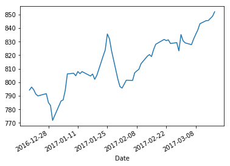


```python
ny = pd.read_csv('nyc_311_data_subset-2.csv')
```

    C:\ProgramData\Anaconda3\lib\site-packages\IPython\core\interactiveshell.py:2698: DtypeWarning: Columns (4) have mixed types. Specify dtype option on import or set low_memory=False.
      interactivity=interactivity, compiler=compiler, result=result)
    

**Basic Validation**


```python
ny.info()
```

    <class 'pandas.core.frame.DataFrame'>
    RangeIndex: 971063 entries, 0 to 971062
    Data columns (total 8 columns):
    Unique Key      971063 non-null int64
    Created Date    971063 non-null object
    Closed Date     882944 non-null object
    Agency          971063 non-null object
    Incident Zip    911140 non-null object
    Borough         971063 non-null object
    Latitude        887284 non-null float64
    Longitude       887284 non-null float64
    dtypes: float64(2), int64(1), object(5)
    memory usage: 59.3+ MB
    


```python
ny[:3]
```


       Unique Key      Created Date       Closed Date  \
    0           1  10/11/2016 11:53  10/11/2016 12:00   
    1           2  10/11/2016 11:36  10/11/2016 12:00   
    2           3  10/11/2016 11:36  10/11/2016 12:00   
    
         ...    Borough Latitude Longitude  
    0    ...     QUEENS      NaN       NaN  
    1    ...     QUEENS      NaN       NaN  
    2    ...     QUEENS      NaN       NaN  
    
    [3 rows x 8 columns]


**Import and Specify Index Column**


```python
ny = pd.read_csv('nyc_311_data_subset-2.csv',index_col='Unique Key')
```

    C:\ProgramData\Anaconda3\lib\site-packages\IPython\core\interactiveshell.py:2698: DtypeWarning: Columns (4) have mixed types. Specify dtype option on import or set low_memory=False.
      interactivity=interactivity, compiler=compiler, result=result)
    


```python
ny.info()
```

    <class 'pandas.core.frame.DataFrame'>
    Int64Index: 971063 entries, 1 to 971063
    Data columns (total 7 columns):
    Created Date    971063 non-null object
    Closed Date     882944 non-null object
    Agency          971063 non-null object
    Incident Zip    911140 non-null object
    Borough         971063 non-null object
    Latitude        887284 non-null float64
    Longitude       887284 non-null float64
    dtypes: float64(2), object(5)
    memory usage: 59.3+ MB
    


```python
ny[:3]
```


                    Created Date       Closed Date Agency  \
    Unique Key                                              
    1           10/11/2016 11:53  10/11/2016 12:00   DSNY   
    2           10/11/2016 11:36  10/11/2016 12:00   DSNY   
    3           10/11/2016 11:36  10/11/2016 12:00   DSNY   
    
               Incident Zip Borough  Latitude  Longitude  
    Unique Key                                            
    1                   NaN  QUEENS       NaN        NaN  
    2                   NaN  QUEENS       NaN        NaN  
    3                   NaN  QUEENS       NaN        NaN  


## Frequency Table (crosstab)

crosstab returns **Dataframe Object**
```
crosstab( index = <SeriesObj>, columns = <colName> )                    # one dimension table
crosstab( index = <SeriesObj>, columns = <SeriesObj> )                  # two dimension table
crosstab( index = <SeriesObj>, columns = [<SeriesObj1>, <SeriesObj2>] ) # multi dimension table   
crosstab( index = <SeriesObj>, columns = <SeriesObj>, margines=True )   # add column and row margins
```

### Sample Data


```python
n = 200
comp = ['C' + i for i in np.random.randint( 1,4, size  = n).astype(str)] # 3x Company
dept = ['D' + i for i in np.random.randint( 1,6, size  = n).astype(str)] # 5x Department
grp =  ['G' + i for i in np.random.randint( 1,3, size  = n).astype(str)] # 2x Groups
value1 = np.random.normal( loc=50 , scale=5 , size = n)
value2 = np.random.normal( loc=20 , scale=3 , size = n)
value3 = np.random.normal( loc=5 , scale=30 , size = n)

mydf = pd.DataFrame({
    'comp':comp, 
    'dept':dept, 
    'grp': grp,
    'value1':value1, 
    'value2':value2,
    'value3':value3 })
mydf.head()
```

### One DimensionTable


```python
pd.crosstab(index=mydf.comp, columns='counter')
```


    col_0  counter
    comp          
    C1          64
    C2          69
    C3          67


```python
type(pd.crosstab(index=mydf.comp, columns='counter'))
```


    pandas.core.frame.DataFrame


### Two Dimension Table


```python
pd.crosstab(index=mydf.comp, columns=mydf.dept)
```


    dept  D1  D2  D3  D4  D5
    comp                    
    C1    15   7  16  12  14
    C2    16  13  16  17   7
    C3    10  11  15  16  15


### Higher Dimension Table


```python
tb = pd.crosstab(index=mydf.comp, columns=[mydf.dept, mydf.grp])
tb
```


    dept  D1    D2 ... D4 D5   
    grp   G1 G2 G1 ... G2 G1 G2
    comp           ...         
    C1     7  8  4 ...  5  6  8
    C2    10  6  7 ...  9  5  2
    C3     5  5  5 ...  7  9  6
    
    [3 rows x 10 columns]


Get the **subtable** under D2


```python
tb['D2']
```


    grp   G1  G2
    comp        
    C1     4   3
    C2     7   6
    C3     5   6
    All   16  15


### Getting Margin
New column and row labeled 'All' will be created


```python
tb = pd.crosstab(index=mydf.dept, columns=mydf.grp, margins=True)
tb
```


    grp    G1  G2  All
    dept              
    D1     22  19   41
    D2     16  15   31
    D3     27  20   47
    D4     24  21   45
    D5     20  16   36
    All   109  91  200


```python
tb['All']   # row total, return a Series
```


    dept
    D1      41
    D2      31
    D3      47
    D4      45
    D5      36
    All    200
    Name: All, dtype: int64


```python
tb.loc['All'] # column total, return a Series
```


    grp
    G1     109
    G2      91
    All    200
    Name: All, dtype: int64


### Getting Proportion
Use matrix operation divide for each cells over the margin


```python
tb/tb.loc['All']
```


    grp         G1        G2    All
    dept                           
    D1    0.201835  0.208791  0.205
    D2    0.146789  0.164835  0.155
    D3    0.247706  0.219780  0.235
    D4    0.220183  0.230769  0.225
    D5    0.183486  0.175824  0.180
    All   1.000000  1.000000  1.000


### Reseting Index
- When creating a crosstab, **column specified by index** will become index  
- To convert it to normal column, use **reset_index()**
```
DataFrameObj.reset_index( inpalce=False )
```


```python
tb.reset_index()
```


    grp dept   G1  G2  All
    0     D1   22  19   41
    1     D2   16  15   31
    2     D3   27  20   47
    3     D4   24  21   45
    4     D5   20  16   36
    5    All  109  91  200


## Group and Aggregation
- Aggretation and summarization require creating **DataFrameGroupBy** object from existing DataFrame  
- The **GroupBy** object is a **very flexible abstraction**. In many ways, you can simply treat it as if it's a **collection of DataFrames**, and it does the difficult things under the hood  


```python
company = pd.read_csv('data/company.csv')
company.head()
```


      Company Department      Name  Age  Salary  Birthdate
    0      C1         D1      Yong   45   15000   1/1/1970
    1      C1         D1      Chew   35   12000   2/1/1980
    2      C1         D2       Lim   34    8000  2/19/1977
    3      C1         D3     Jessy   23    2500  3/15/1990
    4      C1         D3  Hoi Ming   55   25000  4/15/1987


### Creating Groups


```python
com_grp = company.groupby(['Company','Department'])
```


```python
com_grp
```


    <pandas.core.groupby.DataFrameGroupBy object at 0x000002C3255294A8>


### Properties

#### Number of Groups Created


```python
com_grp.ngroups
```


    9


#### Row Numbers Associated For Each Group


```python
com_grp.groups  # return Dictionary
```


    {('C1', 'D1'): Int64Index([0, 1], dtype='int64'),
     ('C1', 'D2'): Int64Index([2], dtype='int64'),
     ('C1', 'D3'): Int64Index([3, 4, 5], dtype='int64'),
     ('C2', 'D1'): Int64Index([6], dtype='int64'),
     ('C2', 'D2'): Int64Index([7, 8, 9], dtype='int64'),
     ('C2', 'D3'): Int64Index([10, 11, 12], dtype='int64'),
     ('C3', 'D1'): Int64Index([14], dtype='int64'),
     ('C3', 'D2'): Int64Index([15], dtype='int64'),
     ('C3', 'D3'): Int64Index([13, 16, 17], dtype='int64')}


### Methods

#### Number of Rows In Each Group


```python
com_grp.size()  # return panda Series object
```


    Company  Department
    C1       D1            2
             D2            1
             D3            3
    C2       D1            1
             D2            3
             D3            3
    C3       D1            1
             D2            1
             D3            3
    dtype: int64


#### Valid (not Null) Data Count For Each Fields In The Group


```python
com_grp.count()  # return panda DataFrame object
```


                        Name  Age  Salary  Birthdate
    Company Department                              
    C1      D1             2    2       2          2
            D2             1    1       1          1
            D3             3    3       3          3
    C2      D1             1    1       1          1
            D2             3    3       3          3
            D3             3    3       3          3
    C3      D1             1    1       1          1
            D2             1    1       1          1
            D3             3    3       3          3


### Retrieve Rows
All row retrieval operations **return a dataframe**

#### Retrieve N Rows For Each Groups
Example below retrieve 2 rows from each group


```python
com_grp.head(2)
```


       Company Department      Name  Age  Salary   Birthdate
    0       C1         D1      Yong   45   15000    1/1/1970
    1       C1         D1      Chew   35   12000    2/1/1980
    2       C1         D2       Lim   34    8000   2/19/1977
    3       C1         D3     Jessy   23    2500   3/15/1990
    4       C1         D3  Hoi Ming   55   25000   4/15/1987
    ..     ...        ...       ...  ...     ...         ...
    11      C2         D3   Jeannie   30   12500  12/31/1980
    13      C3         D3     Chang   32    7900   7/26/1973
    14      C3         D1       Ong   44   17500   8/21/1980
    15      C3         D2      Lily   41   15300   7/17/1990
    16      C3         D3     Sally   54   21000   7/19/1968
    
    [14 rows x 6 columns]


#### Retrieve Rows In One Specific Group


```python
com_grp.get_group(('C1','D3'))
```


      Company Department      Name  Age  Salary  Birthdate
    3      C1         D3     Jessy   23    2500  3/15/1990
    4      C1         D3  Hoi Ming   55   25000  4/15/1987
    5      C1         D3   Sui Wei   56    3000  6/15/1990


#### Retrieve n-th Row From Each Group
Row number is 0-based


```python
com_grp.nth(-1)    # retireve last row from each group
```


                        Age   Birthdate     Name  Salary
    Company Department                                  
    C1      D1           35    2/1/1980     Chew   12000
            D2           34   2/19/1977      Lim    8000
            D3           56   6/15/1990  Sui Wei    3000
    C2      D1           18   7/15/1997     Anne     400
            D2           46  10/31/1988    Jimmy   14000
            D3           29   12/1/1963  Bernard    9800
    C3      D1           44   8/21/1980      Ong   17500
            D2           41   7/17/1990     Lily   15300
            D3           37   3/16/1969   Esther   13500


### Iteration
**DataFrameGroupBy** object can be thought as a collection of named groups


```python
def print_groups (g):
    for name,group in g:
        print (name)
        print (group[:2])
        
print_groups (com_grp)
```

    ('C1', 'D1')
      Company Department  Name  Age  Salary Birthdate
    0      C1         D1  Yong   45   15000  1/1/1970
    1      C1         D1  Chew   35   12000  2/1/1980
    ('C1', 'D2')
      Company Department Name  Age  Salary  Birthdate
    2      C1         D2  Lim   34    8000  2/19/1977
    ('C1', 'D3')
      Company Department      Name  Age  Salary  Birthdate
    3      C1         D3     Jessy   23    2500  3/15/1990
    4      C1         D3  Hoi Ming   55   25000  4/15/1987
    ('C2', 'D1')
      Company Department  Name  Age  Salary  Birthdate
    6      C2         D1  Anne   18     400  7/15/1997
    ('C2', 'D2')
      Company Department     Name  Age  Salary  Birthdate
    7      C2         D2  Deborah   30    8600  8/15/1984
    8      C2         D2  Nikalus   51   12000  9/18/2000
    ('C2', 'D3')
       Company Department     Name  Age  Salary   Birthdate
    10      C2         D3  Michael   38   17000  11/30/1997
    11      C2         D3  Jeannie   30   12500  12/31/1980
    ('C3', 'D1')
       Company Department Name  Age  Salary  Birthdate
    14      C3         D1  Ong   44   17500  8/21/1980
    ('C3', 'D2')
       Company Department  Name  Age  Salary  Birthdate
    15      C3         D2  Lily   41   15300  7/17/1990
    ('C3', 'D3')
       Company Department   Name  Age  Salary  Birthdate
    13      C3         D3  Chang   32    7900  7/26/1973
    16      C3         D3  Sally   54   21000  7/19/1968
    


```python
com_grp
```


    <pandas.core.groupby.DataFrameGroupBy object at 0x000002C3255294A8>


### Apply Aggregate Functions to Groups
Aggregate apply functions to columns in every groups, and return a summary data for each group

#### Apply One Function to One or More Columns


```python
com_grp['Age'].sum()
```


    Company  Department
    C1       D1             80
             D2             34
             D3            134
    C2       D1             18
             D2            127
             D3             97
    C3       D1             44
             D2             41
             D3            123
    Name: Age, dtype: int64


```python
com_grp[['Age','Salary']].sum()
```


                        Age  Salary
    Company Department             
    C1      D1           80   27000
            D2           34    8000
            D3          134   30500
    C2      D1           18     400
            D2          127   34600
            D3           97   39300
    C3      D1           44   17500
            D2           41   15300
            D3          123   42400


#### Apply One or More Functions To All Columns


```python
com_grp.agg(np.mean)
```


                              Age        Salary
    Company Department                         
    C1      D1          40.000000  13500.000000
            D2          34.000000   8000.000000
            D3          44.666667  10166.666667
    C2      D1          18.000000    400.000000
            D2          42.333333  11533.333333
            D3          32.333333  13100.000000
    C3      D1          44.000000  17500.000000
            D2          41.000000  15300.000000
            D3          41.000000  14133.333333


```python
com_grp.agg([np.mean,np.sum])
```


                              Age             Salary       
                             mean  sum          mean    sum
    Company Department                                     
    C1      D1          40.000000   80  13500.000000  27000
            D2          34.000000   34   8000.000000   8000
            D3          44.666667  134  10166.666667  30500
    C2      D1          18.000000   18    400.000000    400
            D2          42.333333  127  11533.333333  34600
            D3          32.333333   97  13100.000000  39300
    C3      D1          44.000000   44  17500.000000  17500
            D2          41.000000   41  15300.000000  15300
            D3          41.000000  123  14133.333333  42400


#### Apply Different Functions To Different Columns


```python
com_grp.agg({'Age':np.mean, 'Salary': [np.min,np.max]})
```


                              Age Salary       
                             mean   amin   amax
    Company Department                         
    C1      D1          40.000000  12000  15000
            D2          34.000000   8000   8000
            D3          44.666667   2500  25000
    C2      D1          18.000000    400    400
            D2          42.333333   8600  14000
            D3          32.333333   9800  17000
    C3      D1          44.000000  17500  17500
            D2          41.000000  15300  15300
            D3          41.000000   7900  21000


### Transform

- Transform is an operation used combined with **DataFrameGroupBy** object  
- **transform()** return a **new DataFrame object**  


```python
grp = company.groupby('Company')
grp.size()
```


    Company
    C1    6
    C2    7
    C3    5
    dtype: int64


**transform()** perform a function to a group, and **expands and replicate** it to multiple rows according to original DataFrame


```python
grp[['Age','Salary']].transform('sum')
```


        Age  Salary
    0   248   65500
    1   248   65500
    2   248   65500
    3   248   65500
    4   248   65500
    ..  ...     ...
    13  208   75200
    14  208   75200
    15  208   75200
    16  208   75200
    17  208   75200
    
    [18 rows x 2 columns]


```python
grp.transform( lambda x:x+10 )
```


        Age  Salary
    0    55   15010
    1    45   12010
    2    44    8010
    3    33    2510
    4    65   25010
    ..  ...     ...
    13   42    7910
    14   54   17510
    15   51   15310
    16   64   21010
    17   47   13510
    
    [18 rows x 2 columns]


## Fundamental Analysis

### Structure of the Dataframe (.info())
**info()** is a function that print information to screen. It doesn't return any object
```
dataframe.info()  # display columns and number of rows (that has no missing data)
```


```python
ny.info()
```

    <class 'pandas.core.frame.DataFrame'>
    Int64Index: 971063 entries, 1 to 971063
    Data columns (total 7 columns):
    Created Date    971063 non-null object
    Closed Date     882944 non-null object
    Agency          971063 non-null object
    Incident Zip    911140 non-null object
    Borough         971063 non-null object
    Latitude        887284 non-null float64
    Longitude       887284 non-null float64
    dtypes: float64(2), object(5)
    memory usage: 59.3+ MB
    

### First Few Rows (.head())
```
dataframe.head (n) # return dataframe of first n rows, default n = 5
```


```python
ny.head()
```


                    Created Date       Closed Date Agency  \
    Unique Key                                              
    1           10/11/2016 11:53  10/11/2016 12:00   DSNY   
    2           10/11/2016 11:36  10/11/2016 12:00   DSNY   
    3           10/11/2016 11:36  10/11/2016 12:00   DSNY   
    4           10/11/2016 12:39  10/11/2016 12:39   DSNY   
    5           10/11/2016 12:18  10/11/2016 12:18   DSNY   
    
               Incident Zip Borough  Latitude  Longitude  
    Unique Key                                            
    1                   NaN  QUEENS       NaN        NaN  
    2                   NaN  QUEENS       NaN        NaN  
    3                   NaN  QUEENS       NaN        NaN  
    4                   NaN  QUEENS       NaN        NaN  
    5                   NaN  QUEENS       NaN        NaN  


### Missing Data

**How Missing Data For Each Column ?**


```python
ny.count()
```


    Created Date    971063
    Closed Date     882944
    Agency          971063
    Incident Zip    911140
    Borough         971063
    Latitude        887284
    Longitude       887284
    dtype: int64


```python
len(ny.index) - ny.count()
```


    Created Date        0
    Closed Date     88119
    Agency              0
    Incident Zip    59923
    Borough             0
    Latitude        83779
    Longitude       83779
    dtype: int64


```python
ny.isnull()
```


                Created Date  Closed Date  Agency  \
    Unique Key                                      
    1                  False        False   False   
    2                  False        False   False   
    3                  False        False   False   
    4                  False        False   False   
    5                  False        False   False   
    ...                  ...          ...     ...   
    971059             False        False   False   
    971060             False        False   False   
    971061             False        False   False   
    971062             False        False   False   
    971063             False        False   False   
    
                Incident Zip  Borough  Latitude  Longitude  
    Unique Key                                              
    1                   True    False      True       True  
    2                   True    False      True       True  
    3                   True    False      True       True  
    4                   True    False      True       True  
    5                   True    False      True       True  
    ...                  ...      ...       ...        ...  
    971059             False    False     False      False  
    971060             False    False     False      False  
    971061             False    False     False      False  
    971062             False    False     False      False  
    971063             False    False     False      False  
    
    [971063 rows x 7 columns]


```python
ny.describe()
```


                Latitude      Longitude
    count  887284.000000  887284.000000
    mean       40.732962     -73.925957
    std         0.086321       0.078325
    min        40.498807     -74.255211
    25%        40.668923     -73.970263
    50%        40.726060     -73.928597
    75%        40.814237     -73.881897
    max        40.912828     -73.700597


# Plydata (dplyr for Python)

## Sample Data


```python
n = 200
comp = ['C' + i for i in np.random.randint( 1,4, size  = n).astype(str)] # 3x Company
dept = ['D' + i for i in np.random.randint( 1,6, size  = n).astype(str)] # 5x Department
grp =  ['G' + i for i in np.random.randint( 1,3, size  = n).astype(str)] # 2x Groups
value1 = np.random.normal( loc=50 , scale=5 , size = n)
value2 = np.random.normal( loc=20 , scale=3 , size = n)
#value3 = np.random.normal( loc=5 , scale=30 , size = n)

mydf = pd.DataFrame({
    'comp':comp, 
    'dept':dept, 
    'grp': grp,
    'value1':value1, 
    'value2':value2
    #'value3':value3 
})
mydf.head()
```


      comp dept grp     value1     value2
    0   C2   D4  G1  50.265891  24.075876
    1   C2   D3  G2  44.306847  19.393717
    2   C2   D1  G2  56.247403  17.939938
    3   C3   D1  G2  41.746750  18.240598
    4   C1   D4  G2  50.915616  20.373281


## Column Manipulation

### Copy Column


```python
mydf >> define(newcol = 'value1')                 # simple method for one column
```


        comp dept grp     value1     value2     newcol
    0     C2   D4  G1  50.265891  24.075876  50.265891
    1     C2   D3  G2  44.306847  19.393717  44.306847
    2     C2   D1  G2  56.247403  17.939938  56.247403
    3     C3   D1  G2  41.746750  18.240598  41.746750
    4     C1   D4  G2  50.915616  20.373281  50.915616
    ..   ...  ...  ..        ...        ...        ...
    195   C3   D3  G1  50.185141  15.609130  50.185141
    196   C2   D2  G1  54.906576  22.447863  54.906576
    197   C1   D2  G1  53.081448  19.785567  53.081448
    198   C3   D4  G2  44.667053  21.552565  44.667053
    199   C3   D3  G1  59.081494  15.113429  59.081494
    
    [200 rows x 6 columns]


```python
mydf >> define (('newcol1', 'value1'), newcol2='value2')  # method for muiltiple new columns
```


        comp dept grp     value1     value2    newcol1  \
    0     C2   D4  G1  50.265891  24.075876  50.265891   
    1     C2   D3  G2  44.306847  19.393717  44.306847   
    2     C2   D1  G2  56.247403  17.939938  56.247403   
    3     C3   D1  G2  41.746750  18.240598  41.746750   
    4     C1   D4  G2  50.915616  20.373281  50.915616   
    ..   ...  ...  ..        ...        ...        ...   
    195   C3   D3  G1  50.185141  15.609130  50.185141   
    196   C2   D2  G1  54.906576  22.447863  54.906576   
    197   C1   D2  G1  53.081448  19.785567  53.081448   
    198   C3   D4  G2  44.667053  21.552565  44.667053   
    199   C3   D3  G1  59.081494  15.113429  59.081494   
    
           newcol2  
    0    24.075876  
    1    19.393717  
    2    17.939938  
    3    18.240598  
    4    20.373281  
    ..         ...  
    195  15.609130  
    196  22.447863  
    197  19.785567  
    198  21.552565  
    199  15.113429  
    
    [200 rows x 7 columns]


### New Column from existing Column

**Without specify the new column name**, it will be derived from expression


```python
mydf >> define ('value1*2')
```


        comp dept grp     value1     value2    value1*2
    0     C2   D4  G1  50.265891  24.075876  100.531782
    1     C2   D3  G2  44.306847  19.393717   88.613694
    2     C2   D1  G2  56.247403  17.939938  112.494805
    3     C3   D1  G2  41.746750  18.240598   83.493501
    4     C1   D4  G2  50.915616  20.373281  101.831232
    ..   ...  ...  ..        ...        ...         ...
    195   C3   D3  G1  50.185141  15.609130  100.370282
    196   C2   D2  G1  54.906576  22.447863  109.813152
    197   C1   D2  G1  53.081448  19.785567  106.162897
    198   C3   D4  G2  44.667053  21.552565   89.334105
    199   C3   D3  G1  59.081494  15.113429  118.162988
    
    [200 rows x 6 columns]


**Specify the new column name**


```python
mydf >> define(value3 = 'value1*2')
```


        comp dept grp     value1     value2      value3
    0     C2   D4  G1  50.265891  24.075876  100.531782
    1     C2   D3  G2  44.306847  19.393717   88.613694
    2     C2   D1  G2  56.247403  17.939938  112.494805
    3     C3   D1  G2  41.746750  18.240598   83.493501
    4     C1   D4  G2  50.915616  20.373281  101.831232
    ..   ...  ...  ..        ...        ...         ...
    195   C3   D3  G1  50.185141  15.609130  100.370282
    196   C2   D2  G1  54.906576  22.447863  109.813152
    197   C1   D2  G1  53.081448  19.785567  106.162897
    198   C3   D4  G2  44.667053  21.552565   89.334105
    199   C3   D3  G1  59.081494  15.113429  118.162988
    
    [200 rows x 6 columns]


Define **multiple** new columns in one go. Observe there are three ways to specify the new columns


```python
mydf >> define('value1*2',('newcol2','value2*2'),newcol3='value2*3')
```


        comp dept grp    ...        value1*2    newcol2  \
    0     C2   D4  G1    ...      100.531782  48.151753   
    1     C2   D3  G2    ...       88.613694  38.787435   
    2     C2   D1  G2    ...      112.494805  35.879876   
    3     C3   D1  G2    ...       83.493501  36.481197   
    4     C1   D4  G2    ...      101.831232  40.746562   
    ..   ...  ...  ..    ...             ...        ...   
    195   C3   D3  G1    ...      100.370282  31.218259   
    196   C2   D2  G1    ...      109.813152  44.895727   
    197   C1   D2  G1    ...      106.162897  39.571135   
    198   C3   D4  G2    ...       89.334105  43.105131   
    199   C3   D3  G1    ...      118.162988  30.226857   
    
           newcol3  
    0    72.227629  
    1    58.181152  
    2    53.819815  
    3    54.721795  
    4    61.119844  
    ..         ...  
    195  46.827389  
    196  67.343590  
    197  59.356702  
    198  64.657696  
    199  45.340286  
    
    [200 rows x 8 columns]


### Select Column(s)


```python
mydf2 = mydf >> define(newcol1='value1',newcol2='value2')
mydf2.info()
```

    <class 'pandas.core.frame.DataFrame'>
    RangeIndex: 200 entries, 0 to 199
    Data columns (total 7 columns):
    comp       200 non-null object
    dept       200 non-null object
    grp        200 non-null object
    value1     200 non-null float64
    value2     200 non-null float64
    newcol1    200 non-null float64
    newcol2    200 non-null float64
    dtypes: float64(4), object(3)
    memory usage: 11.0+ KB
    

#### By Column Names
**Exact Coumn Name**


```python
mydf2 >> select ('comp','dept','value1')
```


        comp dept     value1
    0     C2   D4  50.265891
    1     C2   D3  44.306847
    2     C2   D1  56.247403
    3     C3   D1  41.746750
    4     C1   D4  50.915616
    ..   ...  ...        ...
    195   C3   D3  50.185141
    196   C2   D2  54.906576
    197   C1   D2  53.081448
    198   C3   D4  44.667053
    199   C3   D3  59.081494
    
    [200 rows x 3 columns]


**Column Name Starts With** ...


```python
mydf2 >> select ('comp', startswith='val')
```


        comp     value1     value2
    0     C2  50.265891  24.075876
    1     C2  44.306847  19.393717
    2     C2  56.247403  17.939938
    3     C3  41.746750  18.240598
    4     C1  50.915616  20.373281
    ..   ...        ...        ...
    195   C3  50.185141  15.609130
    196   C2  54.906576  22.447863
    197   C1  53.081448  19.785567
    198   C3  44.667053  21.552565
    199   C3  59.081494  15.113429
    
    [200 rows x 3 columns]


**Column Name Ends With ...**


```python
mydf2 >> select ('comp',endswith=('1','2','3'))
```


        comp     value1     value2    newcol1    newcol2
    0     C2  50.265891  24.075876  50.265891  24.075876
    1     C2  44.306847  19.393717  44.306847  19.393717
    2     C2  56.247403  17.939938  56.247403  17.939938
    3     C3  41.746750  18.240598  41.746750  18.240598
    4     C1  50.915616  20.373281  50.915616  20.373281
    ..   ...        ...        ...        ...        ...
    195   C3  50.185141  15.609130  50.185141  15.609130
    196   C2  54.906576  22.447863  54.906576  22.447863
    197   C1  53.081448  19.785567  53.081448  19.785567
    198   C3  44.667053  21.552565  44.667053  21.552565
    199   C3  59.081494  15.113429  59.081494  15.113429
    
    [200 rows x 5 columns]


**Column Name Contains ...**


```python
mydf2 >> select('comp', contains=('col','val'))
```


        comp     value1     value2    newcol1    newcol2
    0     C2  50.265891  24.075876  50.265891  24.075876
    1     C2  44.306847  19.393717  44.306847  19.393717
    2     C2  56.247403  17.939938  56.247403  17.939938
    3     C3  41.746750  18.240598  41.746750  18.240598
    4     C1  50.915616  20.373281  50.915616  20.373281
    ..   ...        ...        ...        ...        ...
    195   C3  50.185141  15.609130  50.185141  15.609130
    196   C2  54.906576  22.447863  54.906576  22.447863
    197   C1  53.081448  19.785567  53.081448  19.785567
    198   C3  44.667053  21.552565  44.667053  21.552565
    199   C3  59.081494  15.113429  59.081494  15.113429
    
    [200 rows x 5 columns]


#### Specify Column Range


```python
mydf2 >> select ('comp', slice('value1','newcol2'))
```


        comp     value1     value2    newcol1    newcol2
    0     C2  50.265891  24.075876  50.265891  24.075876
    1     C2  44.306847  19.393717  44.306847  19.393717
    2     C2  56.247403  17.939938  56.247403  17.939938
    3     C3  41.746750  18.240598  41.746750  18.240598
    4     C1  50.915616  20.373281  50.915616  20.373281
    ..   ...        ...        ...        ...        ...
    195   C3  50.185141  15.609130  50.185141  15.609130
    196   C2  54.906576  22.447863  54.906576  22.447863
    197   C1  53.081448  19.785567  53.081448  19.785567
    198   C3  44.667053  21.552565  44.667053  21.552565
    199   C3  59.081494  15.113429  59.081494  15.113429
    
    [200 rows x 5 columns]


### Drop Column(s)


```python
mydf2 >> select('newcol1','newcol2',drop=True)
```


        comp dept grp     value1     value2
    0     C2   D4  G1  50.265891  24.075876
    1     C2   D3  G2  44.306847  19.393717
    2     C2   D1  G2  56.247403  17.939938
    3     C3   D1  G2  41.746750  18.240598
    4     C1   D4  G2  50.915616  20.373281
    ..   ...  ...  ..        ...        ...
    195   C3   D3  G1  50.185141  15.609130
    196   C2   D2  G1  54.906576  22.447863
    197   C1   D2  G1  53.081448  19.785567
    198   C3   D4  G2  44.667053  21.552565
    199   C3   D3  G1  59.081494  15.113429
    
    [200 rows x 5 columns]


## Rename Column


```python
mydf.head(80)
```


       comp dept grp     value1     value2
    0    C2   D4  G1  50.265891  24.075876
    1    C2   D3  G2  44.306847  19.393717
    2    C2   D1  G2  56.247403  17.939938
    3    C3   D1  G2  41.746750  18.240598
    4    C1   D4  G2  50.915616  20.373281
    ..  ...  ...  ..        ...        ...
    75   C3   D4  G2  56.144175  26.897399
    76   C3   D2  G2  51.136115  14.648458
    77   C2   D5  G2  49.063538  21.575246
    78   C3   D2  G2  50.070189  19.389308
    79   C1   D4  G1  53.550231  21.774371
    
    [80 rows x 5 columns]


**Assignment Method**  
Use when column name does not contain special character


```python
mydf >> rename( val1='value1', val2='value2' )
```


        comp dept grp       val1       val2
    0     C2   D4  G1  50.265891  24.075876
    1     C2   D3  G2  44.306847  19.393717
    2     C2   D1  G2  56.247403  17.939938
    3     C3   D1  G2  41.746750  18.240598
    4     C1   D4  G2  50.915616  20.373281
    ..   ...  ...  ..        ...        ...
    195   C3   D3  G1  50.185141  15.609130
    196   C2   D2  G1  54.906576  22.447863
    197   C1   D2  G1  53.081448  19.785567
    198   C3   D4  G2  44.667053  21.552565
    199   C3   D3  G1  59.081494  15.113429
    
    [200 rows x 5 columns]


**Dictionary Method**  
Use when column name contain special character


```python
mydf >> rename( {'val.1' : 'value1',
                 'val.2' : 'value2' })
```


        comp dept grp      val.1      val.2
    0     C2   D4  G1  50.265891  24.075876
    1     C2   D3  G2  44.306847  19.393717
    2     C2   D1  G2  56.247403  17.939938
    3     C3   D1  G2  41.746750  18.240598
    4     C1   D4  G2  50.915616  20.373281
    ..   ...  ...  ..        ...        ...
    195   C3   D3  G1  50.185141  15.609130
    196   C2   D2  G1  54.906576  22.447863
    197   C1   D2  G1  53.081448  19.785567
    198   C3   D4  G2  44.667053  21.552565
    199   C3   D3  G1  59.081494  15.113429
    
    [200 rows x 5 columns]


**Combined Method**  
Combine both assignment and dictionary method


```python
mydf >> rename( {'val.1' : 'value1',
                 'val.2' : 'value2'
              }, group = 'grp' )
```


        comp dept group      val.1      val.2
    0     C2   D4    G1  50.265891  24.075876
    1     C2   D3    G2  44.306847  19.393717
    2     C2   D1    G2  56.247403  17.939938
    3     C3   D1    G2  41.746750  18.240598
    4     C1   D4    G2  50.915616  20.373281
    ..   ...  ...   ...        ...        ...
    195   C3   D3    G1  50.185141  15.609130
    196   C2   D2    G1  54.906576  22.447863
    197   C1   D2    G1  53.081448  19.785567
    198   C3   D4    G2  44.667053  21.552565
    199   C3   D3    G1  59.081494  15.113429
    
    [200 rows x 5 columns]


## Sorting (arrange)
Use **'-colName'** for decending


```python
mydf >> arrange('comp', '-value1')
```


        comp dept grp     value1     value2
    51    C1   D2  G2  62.177538  20.763343
    172   C1   D5  G2  59.412722  22.017166
    24    C1   D5  G1  58.869493  11.392635
    148   C1   D5  G2  58.772324  23.797196
    184   C1   D3  G1  58.054524  20.913879
    ..   ...  ...  ..        ...        ...
    3     C3   D1  G2  41.746750  18.240598
    154   C3   D2  G2  41.313614  19.817442
    161   C3   D3  G1  41.184456  19.540453
    130   C3   D1  G1  41.111019  16.303377
    163   C3   D3  G2  39.312079  15.677250
    
    [200 rows x 5 columns]


## Grouping


```python
mydf.info()
```

    <class 'pandas.core.frame.DataFrame'>
    RangeIndex: 200 entries, 0 to 199
    Data columns (total 5 columns):
    comp      200 non-null object
    dept      200 non-null object
    grp       200 non-null object
    value1    200 non-null float64
    value2    200 non-null float64
    dtypes: float64(2), object(3)
    memory usage: 7.9+ KB
    


```python
gdf = mydf >> group_by('comp','dept')
type(gdf)
```


    plydata.types.GroupedDataFrame


## Summarization

### Simple Method
**Passing Multiple Expressions**


```python
gdf >> summarize('n()','sum(value1)','mean(value2)')
```


       comp dept  n()  sum(value1)  mean(value2)
    0    C2   D4   17   822.616781     21.727354
    1    C2   D3    8   382.508590     19.204159
    2    C2   D1   15   792.951922     19.384431
    3    C3   D1   16   781.894494     19.218751
    4    C1   D4   14   692.099862     21.086066
    ..  ...  ...  ...          ...           ...
    10   C1   D2    8   427.151466     19.759528
    11   C1   D5   13   649.086524     19.445141
    12   C3   D3   16   799.665401     19.711510
    13   C3   D2    9   447.793311     18.818598
    14   C2   D2   11   573.303485     19.999535
    
    [15 rows x 5 columns]


### Specify Summarized Column Name

**Assignment Method**  
- Passing colName='expression'**  
- Column name cannot contain special character


```python
gdf >> summarize(count='n()',v1sum='sum(value1)',v2_mean='mean(value2)')
```


       comp dept  count       v1sum    v2_mean
    0    C2   D4     17  822.616781  21.727354
    1    C2   D3      8  382.508590  19.204159
    2    C2   D1     15  792.951922  19.384431
    3    C3   D1     16  781.894494  19.218751
    4    C1   D4     14  692.099862  21.086066
    ..  ...  ...    ...         ...        ...
    10   C1   D2      8  427.151466  19.759528
    11   C1   D5     13  649.086524  19.445141
    12   C3   D3     16  799.665401  19.711510
    13   C3   D2      9  447.793311  18.818598
    14   C2   D2     11  573.303485  19.999535
    
    [15 rows x 5 columns]


**Tuple Method ('colName','expression')**  
Use when the column name contain special character


```python
gdf >> summarize(('count','n()'),('v1.sum','sum(value1)'),('s2.sum','sum(value2)'),v2mean=np.mean(value2))
```


       comp dept  count      v1.sum      s2.sum     v2mean
    0    C2   D4     17  822.616781  369.365011  20.102874
    1    C2   D3      8  382.508590  153.633271  20.102874
    2    C2   D1     15  792.951922  290.766469  20.102874
    3    C3   D1     16  781.894494  307.500019  20.102874
    4    C1   D4     14  692.099862  295.204927  20.102874
    ..  ...  ...    ...         ...         ...        ...
    10   C1   D2      8  427.151466  158.076226  20.102874
    11   C1   D5     13  649.086524  252.786832  20.102874
    12   C3   D3     16  799.665401  315.384162  20.102874
    13   C3   D2      9  447.793311  169.367385  20.102874
    14   C2   D2     11  573.303485  219.994881  20.102874
    
    [15 rows x 6 columns]


### Number of Rows in Group
- n()        : total rows in group  
- n_unique() : total of rows with unique value


```python
gdf >> summarize(count='n()', va11_unique='n_unique(value1)')
```


       comp dept  count  va11_unique
    0    C2   D4     17           17
    1    C2   D3      8            8
    2    C2   D1     15           15
    3    C3   D1     16           16
    4    C1   D4     14           14
    ..  ...  ...    ...          ...
    10   C1   D2      8            8
    11   C1   D5     13           13
    12   C3   D3     16           16
    13   C3   D2      9            9
    14   C2   D2     11           11
    
    [15 rows x 4 columns]


# Visualization

## Library
plotnine's ggplot

## Sample Data
This chapter uses the sample data generate with below code. The idea is to simulate two categorical-alike feature, and two numeric value feature:

- com is random character between ‘C1’, ‘C2’ and ‘C3’    
- dept is random character between ‘D1’, ‘D2’, ‘D3’, ‘D4’ and ‘D5’  
- grp is random character with randomly generated ‘G1’, ‘G2’  
- value1 represents numeric value, normally distributed at mean 50  
- value2 is numeric value, normally distributed at mean 25  


```python
n = 200
comp = ['C' + i for i in np.random.randint( 1,4, size  = n).astype(str)] # 3x Company
dept = ['D' + i for i in np.random.randint( 1,6, size  = n).astype(str)] # 5x Department
grp =  ['G' + i for i in np.random.randint( 1,3, size  = n).astype(str)] # 2x Groups
value1 = np.random.normal( loc=50 , scale=5 , size = n)
value2 = np.random.normal( loc=20 , scale=3 , size = n)
value3 = np.random.normal( loc=5 , scale=30 , size = n)

mydf = pd.DataFrame({
    'comp':comp, 
    'dept':dept, 
    'grp': grp,
    'value1':value1, 
    'value2':value2,
    'value3':value3 })
mydf.head()
```


      comp dept grp     value1     value2     value3
    0   C1   D1  G2  41.181974  15.934041  25.011228
    1   C2   D1  G1  56.548970  16.844828 -19.331209
    2   C3   D1  G2  53.182407  16.409449 -35.694501
    3   C3   D1  G2  54.670283  26.950989  31.877434
    4   C3   D4  G1  45.583613  15.426992 -33.236864


```python
mydf.info()
```

    <class 'pandas.core.frame.DataFrame'>
    RangeIndex: 200 entries, 0 to 199
    Data columns (total 6 columns):
    comp      200 non-null object
    dept      200 non-null object
    grp       200 non-null object
    value1    200 non-null float64
    value2    200 non-null float64
    value3    200 non-null float64
    dtypes: float64(3), object(3)
    memory usage: 9.5+ KB
    

## Grid Manager

### matplotlib.pyplot.subplot

#### Manual Plotting


```python
fig = plt.figure()
fig.add_axes([0,0,1,1])
ax1 = fig.add_axes([0.1, 0.5, 0.8, 0.4],
                   xticklabels=[], ylim=(-1.2, 1.2))
ax2 = fig.add_axes([0.1, 0.1, 0.8, 0.4],
                   ylim=(-1.2, 1.2))

```


```python
fig = plt.figure()
ax1 = fig.add_axes([0.1, 0.5, 0.8, 0.4],
                   xticklabels=[], ylim=(-1.2, 1.2))
ax2 = fig.add_axes([0.1, 0.1, 0.8, 0.4],
                   ylim=(-1.2, 1.2))

x = np.linspace(0, 10)
ax1.plot(np.sin(x))
ax2.plot(np.cos(x));
```


```python
ax1 = plt.axes()  # standard axes
ax2 = plt.axes([0.65, 0.65, 0.2, 0.2])
```


#### Create Subplot Individually
Each call lto **subplot()** will create a new container for subsequent plot command 


```python
plt.subplot(2,4,1)
plt.text(0.5, 0.5, 'one',fontsize=18, ha='center')

plt.subplot(2,4,8)
plt.text(0.5, 0.5, 'eight',fontsize=18, ha='center')
```


    Text(0.5,0.5,'eight')


```python
for i in range(1, 7):
    plt.subplot(2, 3, i)
    plt.text(0.5, 0.5, str((2, 3, i)),
             fontsize=18, ha='center')
```


#### Create Subplots Upfront
**subplots()** returns two variables:  
- fig : reference to the entire container  
- ax  : reference to individual plot. It is an array


```python
fig, ax = plt.subplots(2, 3) # individual axes
```


```python
fig, ax = plt.subplots(2, 3, sharex='col', sharey='row') # removed inner label
```


**Iterate through subplots (ax) to populate them**


```python
fig, ax = plt.subplots(2, 3, sharex='col', sharey='row')
for i in range(2):
    for j in range(3):
        ax[i, j].text(0.5, 0.5, str((i, j)),
                      fontsize=18, ha='center')
```


#### Complicated Arrangement


```python
plt.figure(figsize=(5,5))
grid = plt.GridSpec(2, 3, hspace=0.4, wspace=0.4)
plt.subplot(grid[0, 0])  #row 0, col 0
plt.subplot(grid[0, 1:]) #row 0, col 1 to :
plt.subplot(grid[1, :2]) #row 1, col 0:2 
plt.subplot(grid[1, 2])  #ro2 1, col 2
```


    <matplotlib.axes._subplots.AxesSubplot at 0x2c31a70f5f8>


```python
plt.figure(figsize=(5,5))
grid = plt.GridSpec(4, 4, hspace=0.4, wspace=0.4)
plt.subplot(grid[:3, 0])    # row 0:3, col 0
plt.subplot(grid[:3, 1: ])  # row 0:3, col 1:
plt.subplot(grid[3, 1: ]);   # row 3,   col 1:
```


**-1 means last row or column**


```python
plt.figure(figsize=(6,6))
grid = plt.GridSpec(4, 4, hspace=0.4, wspace=1.2)
plt.subplot(grid[:-1, 0 ])  # row 0 till last row (not including last row), col 0
plt.subplot(grid[:-1, 1:])  # row 0 till last row (not including last row), col 1 till end
plt.subplot(grid[-1, 1: ]); # row last row, col 1 till end
```


## Histogram

### 1xNumeric

#### Using matplotlib


```python
plt.figure(figsize=(10,3))

plt.subplot(1,2,1)
plt.hist(mydf.value1);  # default 10 bins

plt.subplot(1,2,2)
plt.hist(mydf.value1, bins=15);
```


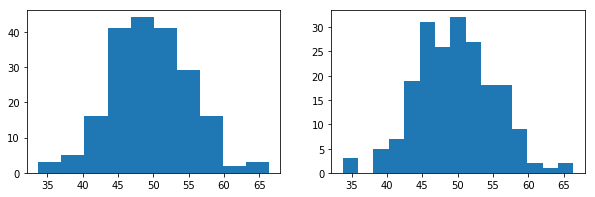


#### Using Plotnine
```
plotnine.ggplot( dataframe, aex(x='colName')) + geom_histogram( bins=10 )
plotnine.ggplot( dataframe, aex(x='colName')) + geom_histogram( binwidth=? )
```


```python
from plotnine import *
plotnine.options.figure_size = (3, 3)
ggplot(mydf, aes(x='value1')) + geom_histogram()  # default bins = 10
```


    ---------------------------------------------------------------------------

    NameError                                 Traceback (most recent call last)

    <ipython-input-283-ef47ff619ba9> in <module>()
          1 from plotnine import *
    ----> 2 plotnine.options.figure_size = (3, 3)
          3 ggplot(mydf, aes(x='value1')) + geom_histogram()  # default bins = 10
    

    NameError: name 'plotnine' is not defined


```python
ggplot(mydf, aes(x='value1')) + geom_histogram(bins = 15)
```


```python
ggplot(mydf, aes(x='value1')) + geom_histogram(binwidth = 3)
```

### 1xNumeric + 1xCategorical

```
plotnine.ggplot( dataframe, 
                    aes(x='colName'), 
                    fill='categorical-alike-colName') 
+ geom_histogram()
```


```python
ggplot(mydf, aes(x='value1', fill='grp')) + geom_histogram(bins=15)
```


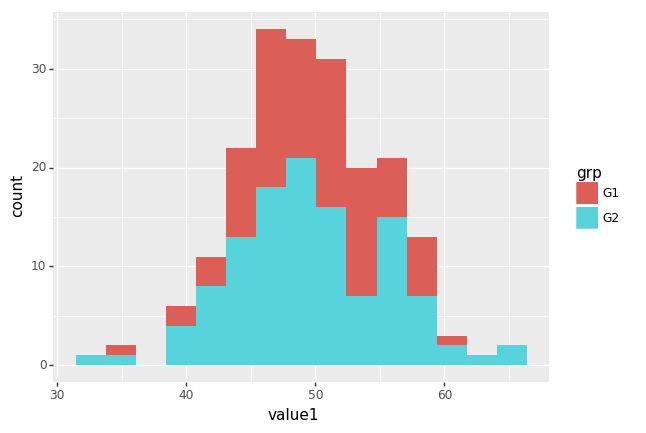


    <ggplot: (189811487983)>


## Scatter Plot

### 2x Numeric


```python
ggplot(mydf, aes(x='value1',y='value2')) + geom_point()
```


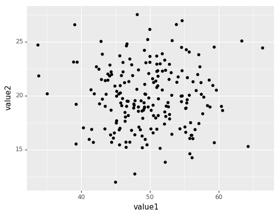


    <ggplot: (189811414455)>


### 2x Numeric + 1x Categorical
```
ggplot( DataFrame, aes(x='colName1',y='colName2')) 
    + geom_point( aes(
        color='categorical-alike-colName',
        size='numberColName'
    ))
```


```python
ggplot(mydf, aes(x='value1',y='value2')) + geom_point(aes(color='grp'))
```


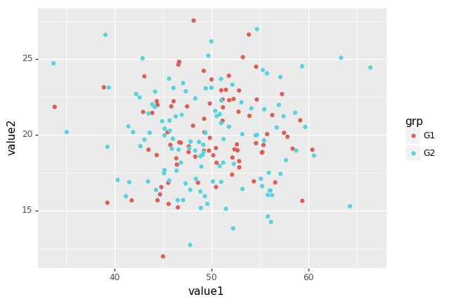


    <ggplot: (189811399870)>


```python
ggplot(mydf, aes(x='value1',y='value2',color='grp')) + geom_point()
```


    <ggplot: (-9223371847043154972)>


```python
ggplot(mydf, aes(x='value1',y='value2')) + \
    geom_point(aes(
        color='grp'
    ))
```


    <ggplot: (189812147576)>


### 2x Numeric + 1x Numeric + 1x Categorical


```python
ggplot(mydf, aes(x='value1',y='value2')) + \
    geom_point(aes( 
        color='grp', size='value3'
    ))
```


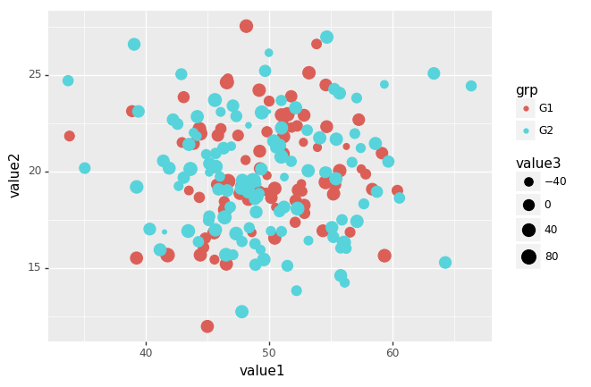


    <ggplot: (189811508130)>


### Overlay Smooth Line


```python
ggplot(mydf, aes(x='value1', y='value2')) + \
    geom_point() + \
    geom_smooth()          # default method='loess'
```

    C:\ProgramData\Anaconda3\lib\site-packages\plotnine\stats\smoothers.py:150: UserWarning: Confidence intervals are not yet implementedfor lowess smoothings.
      warnings.warn("Confidence intervals are not yet implemented"
    


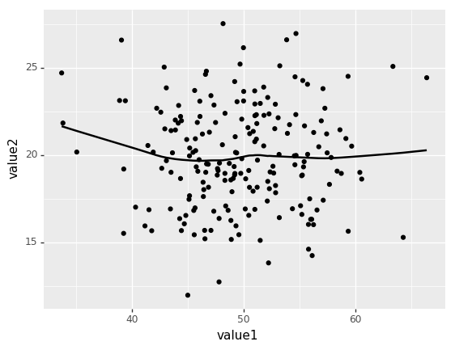


    <ggplot: (189811517139)>


```python
ggplot(mydf, aes(x='value1', y='value2',fill='grp')) + \
    geom_point() + \
    geom_smooth(
        se=True,
        color='red',
        method='lm', 
        level=0.75)
```


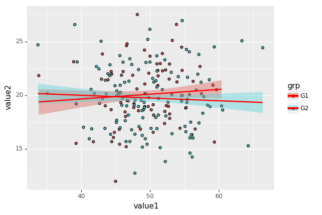


    <ggplot: (-9223371847042438221)>


## Line Chart

### 2x Numeric Data


```python
ggplot (mydf.head(15), aes(x='value1', y='value2')) + geom_line()
```


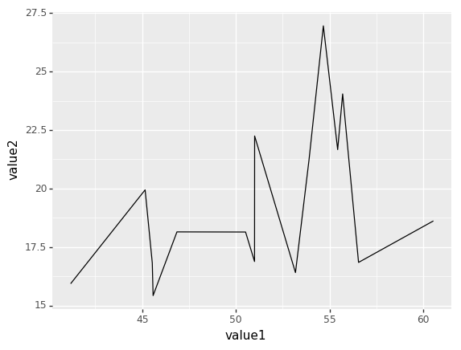


    <ggplot: (189812907030)>


### 1x Numeric, 1x Categorical


```python
ggplot (mydf.head(15), aes(x='dept', y='value1')) + geom_line()
```


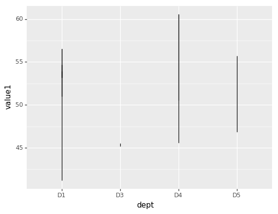


    <ggplot: (189812880904)>


```python
ggplot (mydf.head(30), aes(x='dept', y='value1')) + geom_line( aes(group=1))
```


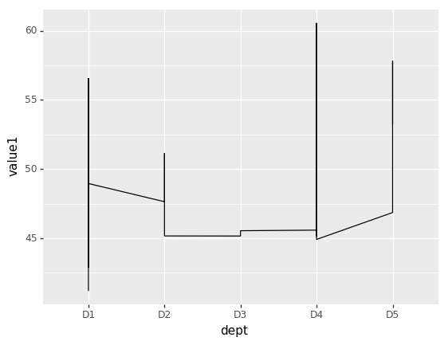


    <ggplot: (-9223371847041911790)>


### 2x Numeric, 1x Categorical


```python
ggplot (mydf.head(15), aes(x='value1', y='value2')) + geom_line( aes(color='grp'),size=2)
```


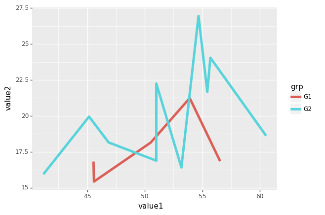


    <ggplot: (189812419027)>


## Bar Chart

#### 1x Categorical
Single categorical variable produces frequency chart.


```python
tmpdf = mydf.groupby(['comp'],as_index=False).count()
tmpdf
```


      comp  dept  grp  value1  value2  value3
    0   C1    76   76      76      76      76
    1   C2    62   62      62      62      62
    2   C3    62   62      62      62      62


```python
tmpdf.info()
```

    <class 'pandas.core.frame.DataFrame'>
    Index: 3 entries, C1 to C3
    Data columns (total 5 columns):
    dept      3 non-null int64
    grp       3 non-null int64
    value1    3 non-null int64
    value2    3 non-null int64
    value3    3 non-null int64
    dtypes: int64(5)
    memory usage: 144.0+ bytes
    


```python
ggplot (tmpdf, aes(x='comp', y='grp')) +geom_col()
```


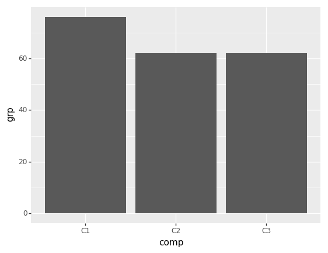


    <ggplot: (-9223371847041880039)>


